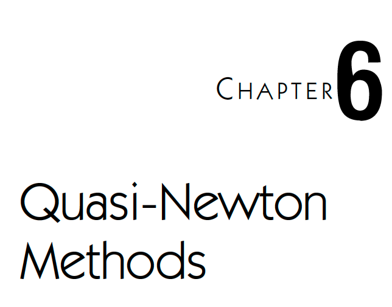
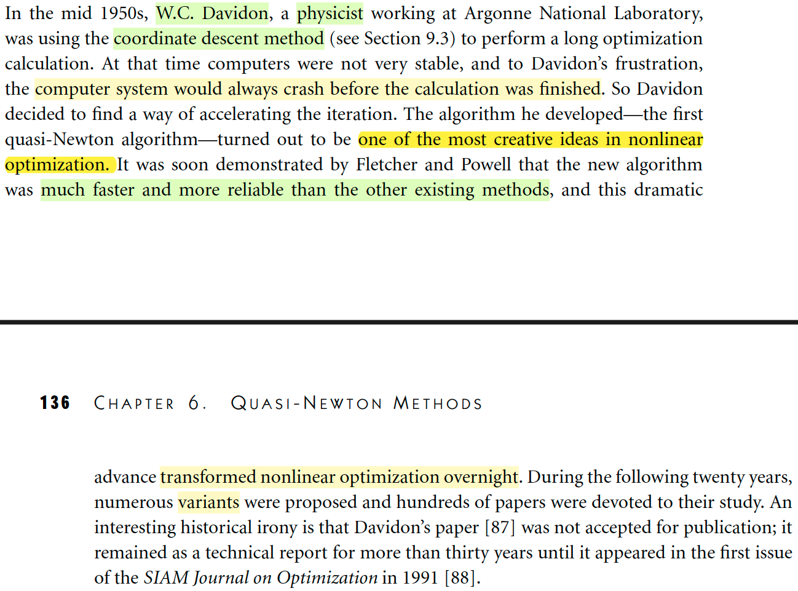
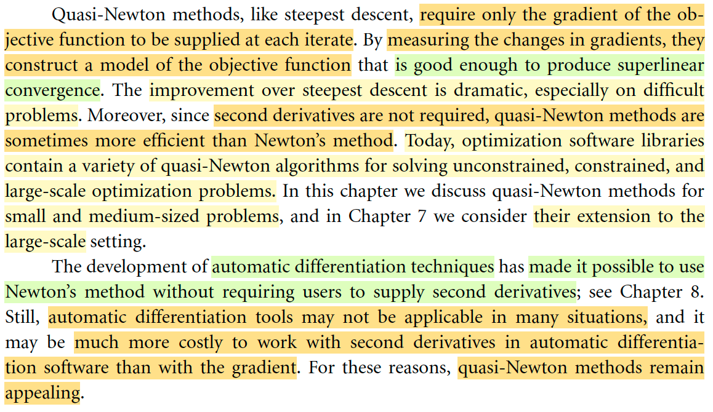
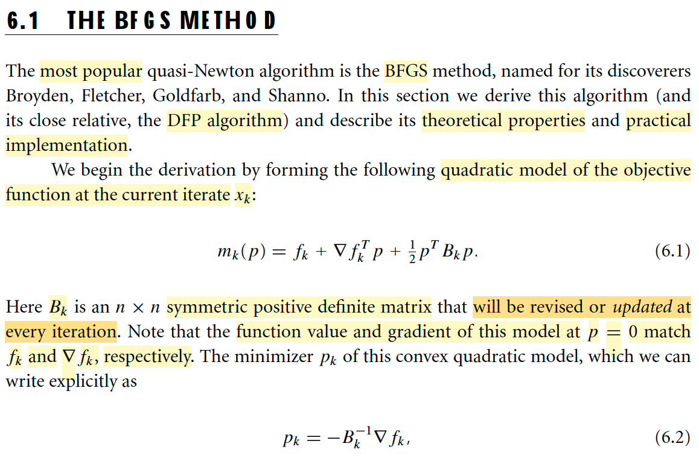
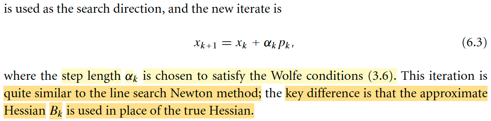

# 6.1 The BFGS Method

📊 **Progress:** `2` Notes | `5` Screenshots | `1` AI Reviews

---

## 6.1: Quasi-Newton Method

<kbd></kbd>

 

### Vài lời nhận xét về quasi-Newton

<kbd></kbd>

<kbd></kbd>

> [!NOTE]
> Mở đầu bằng vài lời ca ngợi phương pháp này, gs cho rằng nó là một trong những thuật toán tối ưu phi tuyến tốt nhất, phát triển lần đầu tiên bởi ông W.C. Davidon.
>
> Tiếp theo tác giả nói đại ý là quasi-Newton tốt hơn nhiều so với steepest descent method, đặc biệt là bài toán khó. Nó thậm chí một số trường hợp còn tốt hơn cả Newton method vì nó không đòi hỏi đạo hàm bậc hai. Và nó xuất hiện trong hầu hết các thư viện tối ưu hiện nay. Mình sẽ học về phương pháp này trong cả hai chương 6 cho bài toán nhỏ và vừa và chap 7 cho bài toán lớn.
>
> Đoạn cuối đại ý hiểu sơ ràng kĩ thuật automatic differentiation ra đời khiến cho ta có thể dùng Newton's method mà không cần tính đạo hàm cấp hai, nhưng nó vẫn không dùng được ở một số bài toán khác, do đó quasi-Newton vẫn là một phương pháp hay.

 

#### Ôn lại chút về khái quát các phương pháp

<kbd></kbd>

<kbd></kbd>

> [!NOTE]
> Đầu tiên mình sẽ học về thuật toán quasi-Newton đầu tiên BFGS. 
>
> Nói chung là trong chương 2, mình cũng đã có sự hình dung về idea của phương pháp này.
>
> Đại khái là, cho đến nay, sau khi đã học về các phương pháp như Line Search, Trust Region, thì mình hiểu cái mô tuýp chung nó đều là như vầy: Nó đều là giải bài toán tối ưu theo kiểu iterative: đi từ từ, từ điểm này sang điểm kế tiếp với mong muốn sẽ đi dần đến đích, minimizer của objective function. Và ở mỗi bước / vòng lặp, ta sẽ đều xét một hàm xấp xỉ bậc hai của f(x), hàm mk(p) = fk + gkTp + (1/2) pT Bk p
>
> Và dựa vào việc minimize hàm này để tìm điểm kế tiếp. Tới đây thì tùy vào cách làm mà ta sẽ sinh ra các phương pháp khác nhau nói trên.
>
> Còn với trust region, thì đại ý là ta sẽ thêm một ràng buộc vào bài toán tối ưu hàm mk: p phải có norm bị giới hạn bởi một bán kính thể hiện phạm vi mà trong đó ta tin tưởng hàm m sẽ xấp xỉ tốt hàm f, sau đó mới đi tìm p. Nói chung hiểu sơ sơ là như vậy. Còn với line search thì ta chọn hướng p trước rồi mới đi tìm step size. Trong cả hai cách tiếp cận này thì có thể dùng nhiều cách để chọn p.
>
> Quay lại line search. Nếu ta chọn Bk là I, thì từ điều kiện optimal bậc nhất sẽ cho ta p = - gk để có steepest descent line search. Nếu chọn Bk là Hessian Hk, thì nó sẽ cho p = -Hk gk thì ta có Newton line search
>
> Sau đó đi theo hướng đó tìm step size đưa ta xuống thấp nhất thì ta có thể giải bài toán tìm step size tối ưu (exact) hoặc dùng Wolfe condition để chọn step size đủ tốt. Ưu điểm của việc dùng Newton line search là nó hội tụ nhanh, nhưng nhược điểm là chi phí tính Hessian. Do đó, quasi-Newton ra đời, chính là bằng cách chọn Bk không phải I, không phải Hk, mà là một xấp xỉ củ Hk sao cho việc tính toán không quá tốn kém giúp vẫn hưởng lợi được từ sự hội tụ nhanh của Newton. 
>
> Do đó pk = -(Bk)inv gk (trong sách dùng ∇fk)
>
> Sau khi có pk thì dùng nó để nhảy tới xk+1: xk+1 = xk + αk pk
>
> Nhưng một điểm quan trọng là, Bkinv sẽ là matrix được cập nhật lại sau mỗi iteration chứ không phải là được tính toán ở mỗi iteration

> [!TIP]
> **🤖 AI Feedback** — ✅ Score: **98/100**
>
> Bài ghi rất chi tiết, chính xác và thể hiện sự hiểu biết sâu sắc về thuật toán BFGS, bao gồm cả mối liên hệ với các phương pháp tối ưu khác và lý do ra đời của quasi-Newton. Em đã nắm vững các khái niệm trọng tâm như mô hình bậc hai, vai trò của ma trận xấp xỉ Bk và cách nó được cập nhật sau mỗi vòng lặp.

 

