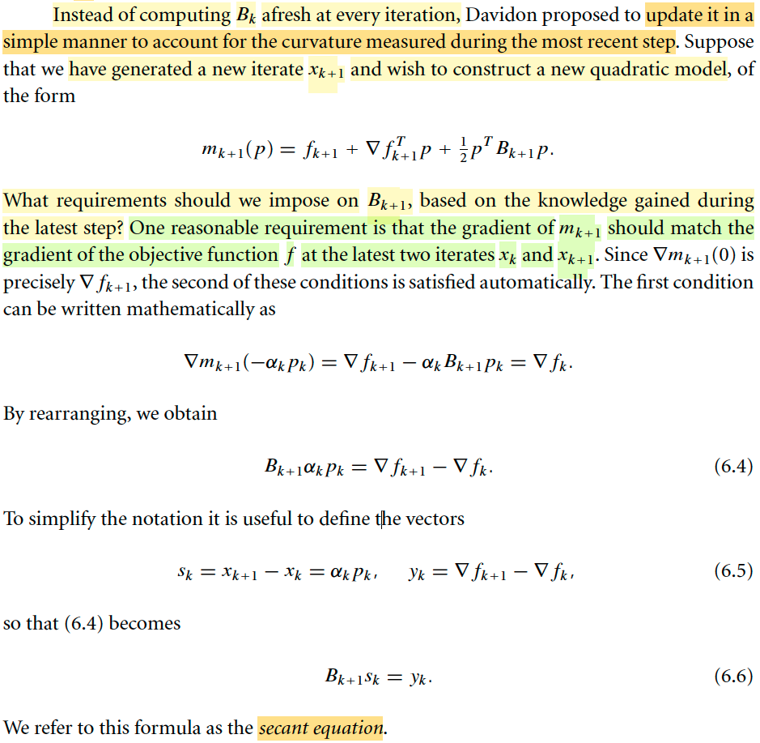
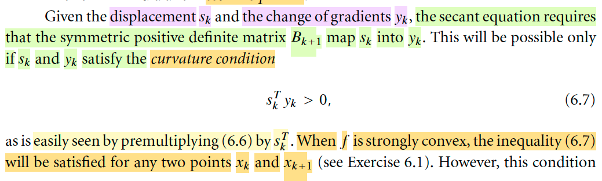
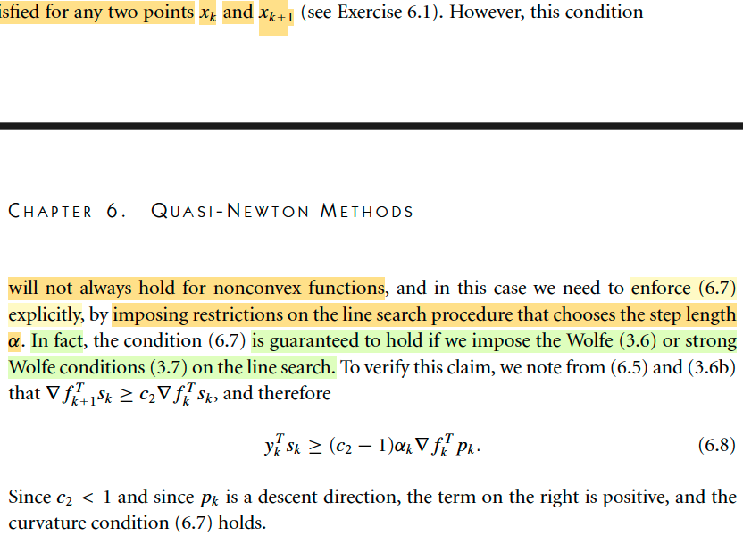

# 6.1 The BFGS Method

📊 **Progress:** `5` Notes | `8` Screenshots | `4` AI Reviews

---

## 6.1: Quasi-Newton Method

<kbd></kbd>

 

### Vài lời nhận xét về quasi-Newton

<kbd></kbd>

<kbd></kbd>

> [!NOTE]
> Mở đầu bằng vài lời ca ngợi phương pháp này, gs cho rằng nó là một trong những thuật toán tối ưu phi tuyến tốt nhất, phát triển lần đầu tiên bởi ông W.C. Davidon.
>
> Tiếp theo tác giả nói đại ý là quasi-Newton tốt hơn nhiều so với steepest descent method, đặc biệt là bài toán khó. Nó thậm chí một số trường hợp còn tốt hơn cả Newton method vì nó không đòi hỏi đạo hàm bậc hai. Và nó xuất hiện trong hầu hết các thư viện tối ưu hiện nay. Mình sẽ học về phương pháp này trong cả hai chương 6 cho bài toán nhỏ và vừa và chap 7 cho bài toán lớn.
>
> Đoạn cuối đại ý hiểu sơ ràng kĩ thuật automatic differentiation ra đời khiến cho ta có thể dùng Newton's method mà không cần tính đạo hàm cấp hai, nhưng nó vẫn không dùng được ở một số bài toán khác, do đó quasi-Newton vẫn là một phương pháp hay.

 

#### Ôn lại chút về khái quát các phương pháp

<kbd></kbd>

<kbd></kbd>

> [!NOTE]
> Đầu tiên mình sẽ học về thuật toán quasi-Newton đầu tiên BFGS. 
>
> Nói chung là trong chương 2, mình cũng đã có sự hình dung về idea của phương pháp này.
>
> Đại khái là, cho đến nay, sau khi đã học về các phương pháp như Line Search, Trust Region, thì mình hiểu cái mô tuýp chung nó đều là như vầy: Nó đều là giải bài toán tối ưu theo kiểu iterative: đi từ từ, từ điểm này sang điểm kế tiếp với mong muốn sẽ đi dần đến đích, minimizer của objective function. Và ở mỗi bước / vòng lặp, ta sẽ đều xét một hàm xấp xỉ bậc hai của f(x), hàm mk(p) = fk + gkTp + (1/2) pT Bk p
>
> Và dựa vào việc minimize hàm này để tìm điểm kế tiếp. Tới đây thì tùy vào cách làm mà ta sẽ sinh ra các phương pháp khác nhau nói trên.
>
> Còn với trust region, thì đại ý là ta sẽ thêm một ràng buộc vào bài toán tối ưu hàm mk: p phải có norm bị giới hạn bởi một bán kính thể hiện phạm vi mà trong đó ta tin tưởng hàm m sẽ xấp xỉ tốt hàm f, sau đó mới đi tìm p. Nói chung hiểu sơ sơ là như vậy. Còn với line search thì ta chọn hướng p trước rồi mới đi tìm step size. Trong cả hai cách tiếp cận này thì có thể dùng nhiều cách để chọn p.
>
> Quay lại line search. Nếu ta chọn Bk là I, thì từ điều kiện optimal bậc nhất sẽ cho ta p = - gk để có steepest descent line search. Nếu chọn Bk là Hessian Hk, thì nó sẽ cho p = -Hk gk thì ta có Newton line search
>
> Sau đó đi theo hướng đó tìm step size đưa ta xuống thấp nhất thì ta có thể giải bài toán tìm step size tối ưu (exact) hoặc dùng Wolfe condition để chọn step size đủ tốt. Ưu điểm của việc dùng Newton line search là nó hội tụ nhanh, nhưng nhược điểm là chi phí tính Hessian. Do đó, quasi-Newton ra đời, chính là bằng cách chọn Bk không phải I, không phải Hk, mà là một xấp xỉ củ Hk sao cho việc tính toán không quá tốn kém giúp vẫn hưởng lợi được từ sự hội tụ nhanh của Newton. 
>
> Do đó pk = -(Bk)inv gk (trong sách dùng ∇fk)
>
> Sau khi có pk thì dùng nó để nhảy tới xk+1: xk+1 = xk + αk pk
>
> Nhưng một điểm quan trọng là, Bkinv sẽ là matrix được cập nhật lại sau mỗi iteration chứ không phải là được tính toán ở mỗi iteration

> [!TIP]
> **🤖 AI Feedback** — ✅ Score: **98/100**
>
> Bài ghi rất chi tiết, chính xác và thể hiện sự hiểu biết sâu sắc về thuật toán BFGS, bao gồm cả mối liên hệ với các phương pháp tối ưu khác và lý do ra đời của quasi-Newton. Em đã nắm vững các khái niệm trọng tâm như mô hình bậc hai, vai trò của ma trận xấp xỉ Bk và cách nó được cập nhật sau mỗi vòng lặp.

 

##### Secant equation

<kbd></kbd>

> [!NOTE]
> Đại khái là như đã nói ở note trước, ý tưởng của quasi Newton method là ta sẽ dùng Bk để thay cho Hessian Hk, mục đích là xấp xỉ Hk, tránh sự tốn kém của Hessian nhưng vẫn hưởng lợi từ sự hội tụ tốt của Newton method.
>
> Vậy thì cách làm thế nào, xây dựng Bk là gì đây.
>
> VẬY THÌ Ý TƯỞNG LỚN LÀ, TA KHÔNG DÙNG Bk FIX, MÀ CẬP NHẬT NÓ LIÊN TỤC TRONG QUÁ TRÌNH TỐI ƯU.
>
> Mình nghĩ, điều này là hợp lí thôi, vì khi di chuyển tại các điểm khác nhau thì Hessian sẽ thay đổi, nên đương nhiên ta phải cập nhật lại Bk liên tục tại mỗi iteration.
>
> Vậy thì câu hỏi đầu tiên cho quá trình lập luận để xây dựng Bk: Là Bk nên được xây dựng / tính thế nào tại mỗi iteration.
>
> CÂU TRẢ LỜI CỦA TÁC GIẢ LÀ: TA SẼ THẤY MỘT CÁCH HỢP LÝ RẰNG, Bk NÊN LÀM SAO ĐÓ ĐỂ MÀ MÔ HÌNH BẬC HAI TẠI MỖI STEP, NÓ KHỚP ĐƯỢC GÍA TRỊ GRADIENT TẠI HAI STEP GẦN NHẤT: HIỆN TẠI VÀ TRƯỚC ĐÓ.
>
> Là sao nhỉ?
>
> Là vầy, như đã biết, về cơ bản việc ta làm tại mỗi step Ở BẤT CỨ PHƯƠNG PHÁP NÀO giải bài toán tối ưu theo iterative approach đó là: MÔ PHỎNG HÀM MỤC TIÊU BẰNG MỘT HÀM CẤP 2 và DỰA VÀO VIỆC MINIMIZE HÀM NÀY ĐỂ ĐI ĐẾN ĐIỂM TIẾP THEO. Và DỰA TRÊN SỰ THẬT TA BIẾT RẰNG VIỆC DÙNG HÀM BẬC HAI ĐỂ MÔ PHỎNG HÀM MỤC TIÊU CHỈ ĐÚNG TRONG MỘT PHẠM VI NHẤT ĐỊNH NÊN TỪ ĐÓ MỚI ĐẺ RA CÁC CÁCH THỨC KHÁC NHAU ĐỂ ĐẢM BẢO VIỆC TÌM RA ĐIỂM TIẾP THEO KHÔNG DẪN TỚI SAI LẦM.
>
> Rồi, thế thì, tại xk, ta xây dựng hàm bậc hai xấp xỉ của f(x):
>
> mk(p) = fk + gkTp + (1/2)pTHkp 
>
> và như vừa nói, ta dùng Bk thay cho Hk
>
> mk(p) = fk + gkTp + (1/2)pTBkp 
>
> Từ đó bằng cách nào đó tính ra được pk, rồi αk, để có xk+1 = xk + αkpk
>
> Thì tại xk+1, ta lại lặp lại, xây dựng hàm mk+1(p) xấp xỉ f(x):
>
> mk+1(p) = fk+1 + gk+1Tp + (1/2)pTBk+1p
>
> Và để xây dựng Bk (tức là cập nhật lại B mới cho một iteration mới) thì ý tưởng vừa mới nói
>
> đó là Bk+1 phải làm sao để ĐẠO HÀM CỦA hàm mk+1(p) KHỚP ĐƯỢC GRADIENT CỦA f tại xk và xk+1. THÌ MÌNH THỬ NGHĨ XEM VÌ SAO LẠI MUỐN CÓ ĐIỀU NÀY, HAY, VÌ SAO GIÁO SƯ NÓI ĐIỀU NÀY LÀ MỘT REASONABLE REQUIREMENT?
>
> Mình nghĩ: Là vì nếu trong một phạm vi đủ gần quanh xk+1. thì hàm mk+1(p) phiên bản chuẩn (dùng Hk+1 thay Bk+1) phải approx tốt hàm f, và điều này có nghĩa là giá trị cũng như đạo hàm bậc nhất của mk+1 phải "giống" giá trị và đạo hàm bậc nhất của f tại mấy điểm quanh xk+1. mà cụ thể thì một điểm trong số đó là xk
>
> Dĩ nhiên với việc xây dựng hàm mk+1 thì đạo hàm tại xk+1 , tương ứng với p = 0 đã đảm bảo đạo hàm của chúng giống nhau tại xk+1 rồi. Thật vậy ∇mk+1(0) = Bk+1Tp + gk+1 | p=-= gk+1.
>
> ∇mk+1(-αkpk) = Bk+1Tp + gk+1 | p = -αkpk = -αk Bk+1Tpk + gk+1
>
> ∇mk+1(-αkpk) (chính là gradient của mk+1 tại xk, vì xk+1 = xk + αkpk ⇨ xk - xk+1 = -αkpk)
>
> Cho ∇mk+1(-αkpk) = gk, ta có:
>
> -αk Bk+1Tpk + gk+1 = gk
>
> ⇔ αk Bk+1Tpk = gk+1 - gk (trong sách dùng ∇k+1 - ∇k, mình cứ dùng g cho dễ gõ)
>
> Đặt sk = xk+1 - xk = αkpk, yk = gk+1 - gk, ta có:
>
> Bk+1 sk = yk. Đây chính là** SECANT EQUATION**.
>
> Nghĩ thêm, thế còn việc ép cho mk+1 tại xk khớp với fk?
>
> (tạm hiểu đại khái là nếu dùng thêm điều kiện / yêu cầu này này thì nó sẽ chỉ đúng nếu hàm f cũng là bậc hai y chang mk, nên trong phần lớn trường hợp, Bk+1 sẽ không thể tồn tại để thỏa mãn cả hai yêu cầu này, bởi bản chất hàm f là hàm phi tuyến nào đó không phải giống y như mk+1).

> [!TIP]
> **🤖 AI Feedback** — ✅ Score: **98/100**
>
> Ghi chú của bạn rất chính xác và thể hiện sự hiểu biết vượt trội về tài liệu. Lý luận độc lập của bạn, đặc biệt là về lý do điều kiện gradient là hợp lý và tại sao không áp đặt điều kiện khớp giá trị, đã bổ sung thêm chiều sâu và cái nhìn phân tích đáng kể.

 

- **Curvature condition**

<kbd></kbd>

> [!NOTE]
> Rồi, thế thì với sk, = xk+1 - xk. gọi là displacement (tạm dịch là khoảng thay đổi vị trí) và yk = gk+1 - gk là sự thay đổi của gradient (độ dốc) thì dễ hiểu secant equation Bk+1sk = yk chính là đặt ra yêu cầu là Bk, một matrix xác định dương phải map được giữa yk và sk. 
>
> Dừng lại một tí, matrix Bk phải xác định dương là vì sao? → Đơn giản là ta chỉ định, ta muốn như vậy. Tức là ta muốn Bk phải xác định dương. Nhưng vì sao ta muốn vậy? → Là vì nếu Bk không xác định dương thì tức là mọi trị riêng không phải luôn dương, khi đó có thể xảy ra là 
>
> 1) Có trị riêng bằng 0 → B singular → Bkinv không tồn tại, để mà tính pk = -(Bk)inv gk, hoặc 
>
> 2) Trị riêng khác 0 hết nhưng có cái âm, khi đó pk không chắc là descent direction: Xét hướng pk = -(Bk)inv gk, đạo hàm hàm mk(p) theo hướng pk tại 0: ∇mkTpk = gkT[-(Bk)inv gk] = - gkT(Bk)inv gk. Mà với việc Bk có trị riêng khác không cả âm lẫn dương thì Bkinv cũng vậy, gọi và dạng này gọi là indefinite matrix. Khi đó quadratic form này gkT(Bk)inv gk chưa chắc luôn dương ⇨ nhân thêm dấu trừ thì cái đạo hàm theo hướng pk của mk chưa chắc luôn âm → đi theo hướng đó chưa chắc luôn giảm m.
>
> -----
>
> Tiếp, vì Bk+1 xác định dương nên từ Bk+1sk = yk, nhân hai vế cho skT:
>
> skTBk+1sk = skTyk
>
> mà vế trái luôn dương với mọi sk (Bk+1 xác định dương) nên vế phải cũng vậy: skTyk > 0 
>
> Và đây gọi là **CURVATURE CONDITION**
>
> -----
>
> Tiếp gs nói nếu f strictly convex thì điều kiện này tự nhiên thỏa. Là sao?
>
> Mình đã học trong Convex Optimization EE364A về (strongly) convex function: **First order convexity condition**:
>
> Với x, y là các điểm bất kì:
>
> f(y) ≥ f(x) + ∇f(x)T(y-x)
>
> Với strictly convex:
>
> f(y) > f(x) + ∇f(x)T(y-x)
>
> Nên nếu f stritcly convex ta có: 
>
> f(xk+1) > f(xk) + ∇f(xk)(xk+1 - xk)
>
> f(xk) > f(xk+1) + ∇f(xk+1)(xk - xk+1)
>
> Cộng vế theo vế:
>
> fk+1 + fk > fk+1 + fk + gk(xk+1 - xk) - gk+1(xk+1 - xk)
>
> ⇔ 0 > (gk - gk+1) (xk+1 - xk)
>
> ⇔ 0 < (gk+1 - gk) (xk+1 - xk)
>
> Chính là skTyk > 0
>
> Tranh thủ ôn lại luôn cái **first order convexity condition** là ở đâu mà ra:
>
> Về trực giác thì là do độ con không âm - non-negative curvature. Nên đạo hàm cấp hai không âm, hay với hàm đa biến thì Hessian xác định bán dương. Từ đó dùng Taylor expansion ta có thể kiểu như lập luận ra kết quả này. Nhưng dĩ nhiên đó không phải là cách chứng minh, vì định nghĩa của hàm convex không phải là nói vậy, mà nó chỉ là hệ quả của định nghĩa chính thức là hàm thỏa:
>
>  f(αx + (1-α)y) ≤ αf(x) + (1-α)f(y)

> [!TIP]
> **🤖 AI Feedback** — ✅ Score: **95/100**
>
> Bài làm rất xuất sắc, thể hiện sự hiểu biết sâu sắc và toàn diện về các khái niệm. Phần giải thích tại sao ma trận Bk cần xác định dương và chứng minh điều kiện độ cong từ tính lồi chặt của hàm số là vô cùng chi tiết và chính xác. Đây là một phân tích mẫu mực.

 

- **Liên hệ với Wolfe conditions**

<kbd></kbd>

> [!NOTE]
> Tiếp nối, như vừa nói, ta ta xây điều kiện cho Bk+1, để dẫn tới secant equation, và nếu Bk thỏa cái này, thì nó sẽ dẫn ta tới curvature condition skTyk > 0 cũng phải thỏa. Rồi nói tiếp, nếu f lồi ngặt, thì cái này tự nhiên thỏa. 
>
> Nhưng không phải lúc nào hàm f cũng lồi ngặt, nên giáo sư nói thành ra ta phải CHỦ ĐỘNG ÁP CÁI ĐIỀU KIỆN NÀY, VÀ CỤ THỂ LÀ ĐÈ VÀO THẰNG STEP SIZE αk:
>
> skTyk > 0 ⇔ αkpkT(gk+1 - gk) > 0.
>
> Và tác giả nói rằng nếu mà αk được chọn theo tiêu chí Wolfe hay strong Wolfe condition thì nó tự động thỏa cái này. 
>
> Không khó hiểu lắm:
>
> Ta còn nhớ điều kiện Wolfe có hai ý:
>
> i) Giảm đủ (sufficient decrease) 
>
> ii) Điều kiện độ cong (curvature condition): Hiểu một cách trực giác là độ dốc tại điểm đến phải giảm bớt thể hiện bởi ∇fk+1Tsk (độ dốc theo hướng sk tại xk+1) phải nhỏ hơn (nhỏ hơn ở đây tức là dương hơn) độ dốc tại điểm trước khi "đi" ∇fkTsk điều chỉnh bởi một hằng số c2 < 1 nào đó:
>
>  ∇fk+1Tsk > c2∇fkTsk 
>
> (Nếu là strong Wolfe thì sẽ có thêm điều kiện độ dốc tại điểm đến không dương nữa để ngăn việc đi quá lố khiến hàm bắt đầu dốc lên.)
>
> Cộng hai vế cho -∇fkTsk:
>
> ⇔ ∇fk+1Tsk -∇fkTsk > c2∇fkTsk - ∇fkTsk
>
> ⇔ (∇fk+1-∇fk)Tsk > (c2-1)∇fkTsk
>
> ⇔ (∇fk+1-∇fk)Tsk > (c2-1)∇fkT αk pk
>
> ⇔ ykTsk > (c2-1)∇fkT αk pk
>
> Rồi, vì c2 < 1 ⇨ c2 - 1 < 0.
>
> pk là descent direction (vì đây là yêu cầu tiên quyết của thuật toán, mà lúc này ta nói về vụ Bk xác định dương là cũng vì vậy) → đạo hàm theo hướng pk của f tại xk sẽ âm: chính là ∇fkTpk < 0
>
> Từ hai điều trên thì vế phải > 0 ⇨ vế trái cũng > 0.
>
> Vậy thì nãy giờ mình hiểu thế này: Ta đặt ra secant equation để áp đặt ra một điều kiện để xây dựng Bk (hay Bk+1, không quan trọng cái index). Nhưng sau đó giáo sư lại nói về một hệ quả của cái này: curvature condition, để rồi nếu như secant equation thỏa thì cũng phải thỏa cái curvature condition. Và mục đích là, ĐỂ XÁC LẬP **ĐIỀU KIỆN CẦN** CỦA VIỆC CÓ NGHIỆM XÁC ĐỊNH DƯƠNG CỦA SECANT EQUATION . Này nhé:
>
> Bk+1sk = yk (1) ⇨ skTBk+1sk = skTyk
>
> Nên nếu (1) CÓ NGHIỆM XÁC ĐỊNH DƯƠNG (tức Bk+1 ≻ 0) THÌ ⇨ skTBk+1sk > 0 ∀sk, cũng chính là skTyk > 0 ∀sk → DO ĐÓ skTyk > 0 LÀ ĐIỀU KIỆN CẦN CỦA VIỆC S.E CÓ NGHIỆM XÁC ĐỊNH DƯƠNG

> [!TIP]
> **🤖 AI Feedback** — ✅ Score: **95/100**
>
> Phân tích rất sâu sắc, chính xác, và đi thẳng vào cốt lõi vấn đề về điều kiện cần cho phương trình secant có nghiệm xác định dương. Lý giải logic chặt chẽ, từ lý thuyết đến chứng minh đều hoàn hảo.

 

