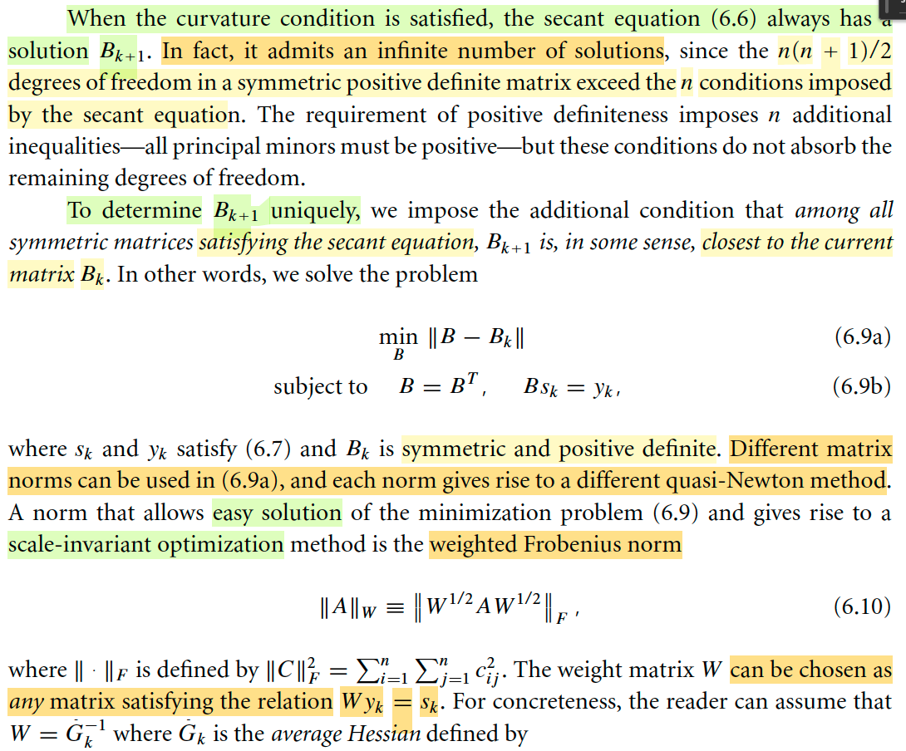
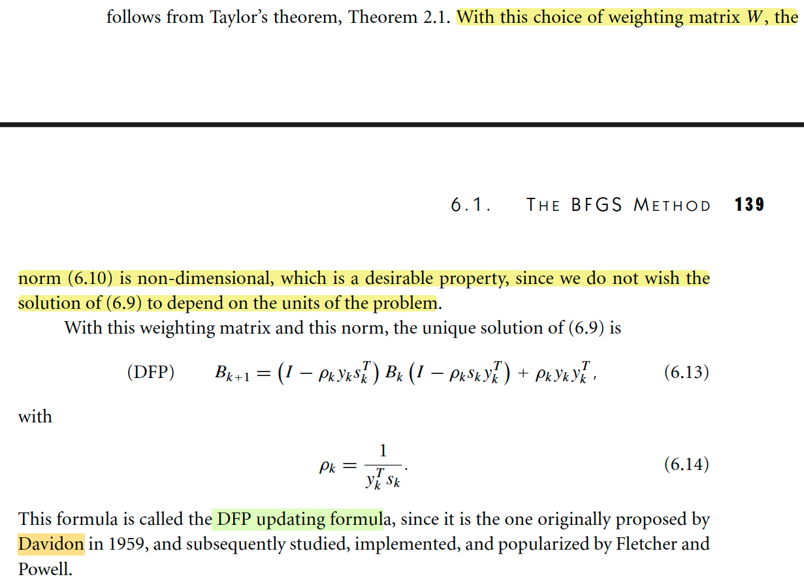
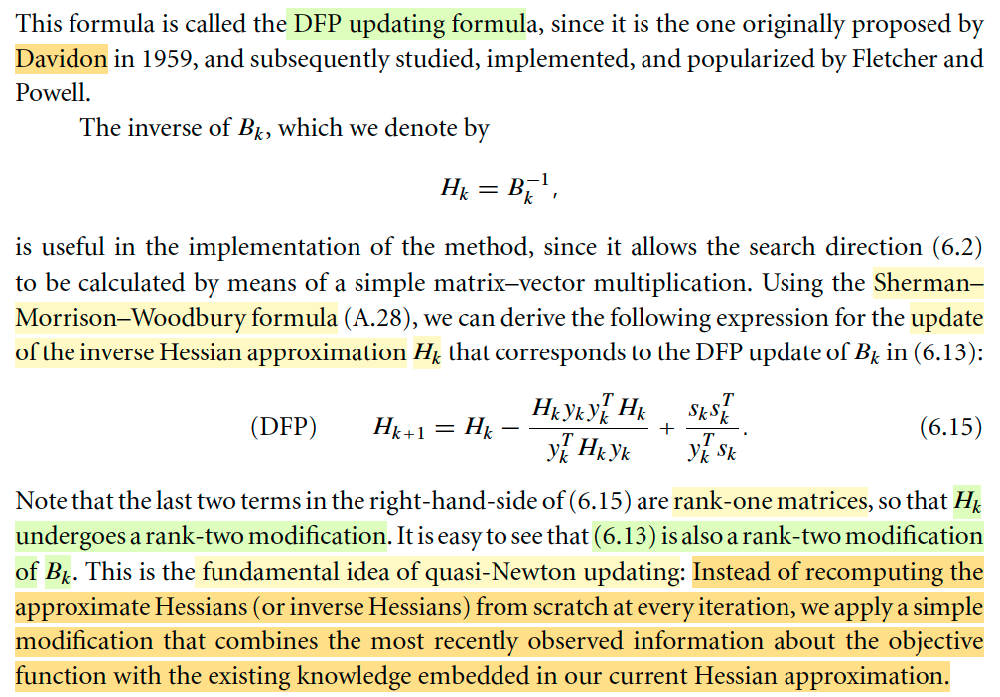
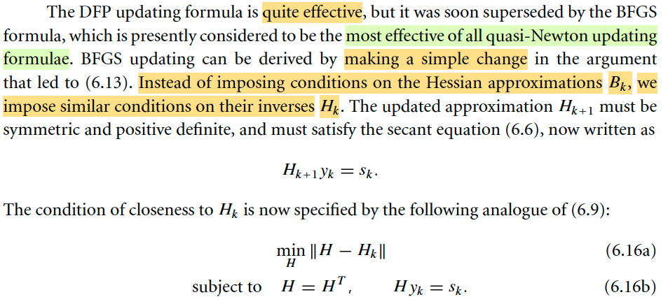
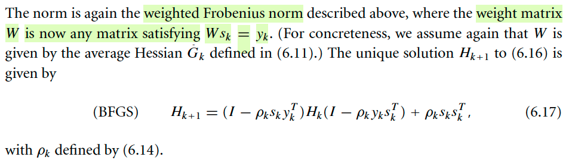
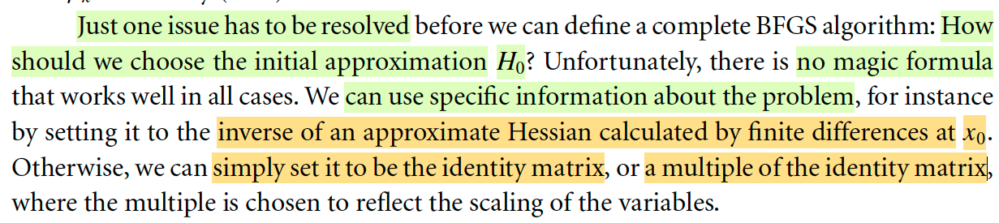
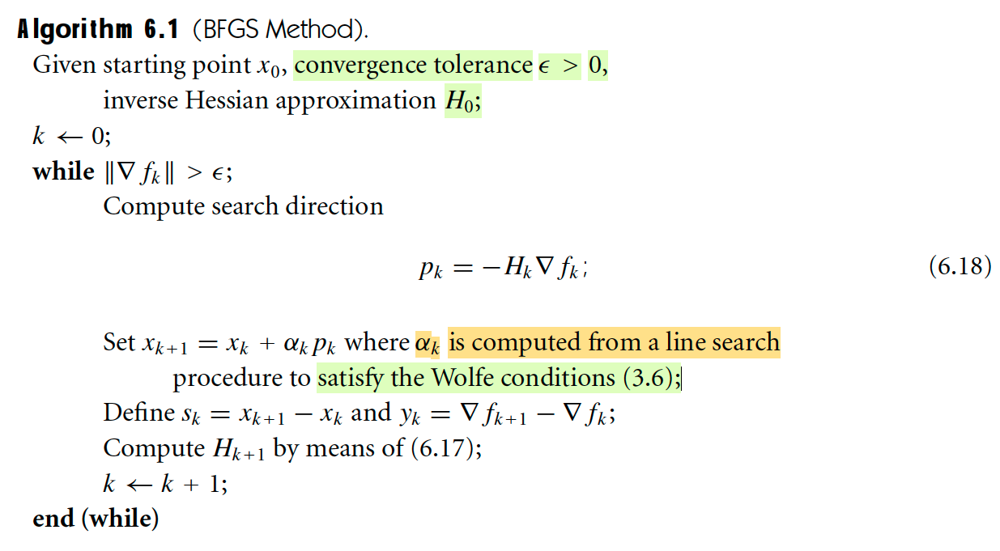
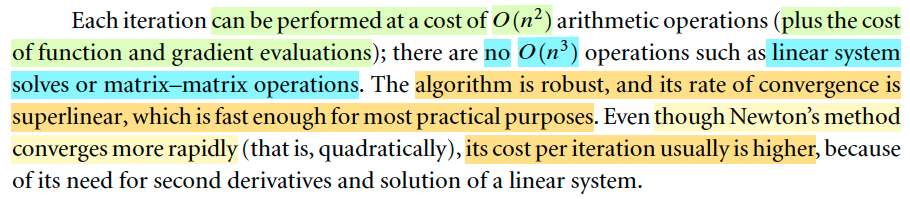
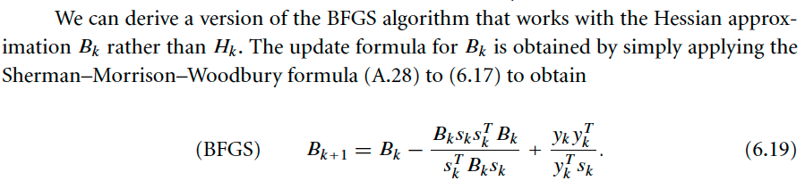
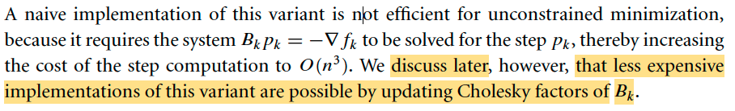

# 6.1 The BFGS Method

📊 **Progress:** `13` Notes | `18` Screenshots | `11` AI Reviews

---

## 6.1: Quasi-Newton Method

<kbd></kbd>

 

### Vài lời nhận xét về quasi-Newton

<kbd></kbd>

<kbd></kbd>

> [!NOTE]
> Mở đầu bằng vài lời ca ngợi phương pháp này, gs cho rằng nó là một trong những thuật toán tối ưu phi tuyến tốt nhất, phát triển lần đầu tiên bởi ông W.C. Davidon.
>
> Tiếp theo tác giả nói đại ý là quasi-Newton tốt hơn nhiều so với steepest descent method, đặc biệt là bài toán khó. Nó thậm chí một số trường hợp còn tốt hơn cả Newton method vì nó không đòi hỏi đạo hàm bậc hai. Và nó xuất hiện trong hầu hết các thư viện tối ưu hiện nay. Mình sẽ học về phương pháp này trong cả hai chương 6 cho bài toán nhỏ và vừa và chap 7 cho bài toán lớn.
>
> Đoạn cuối đại ý hiểu sơ ràng kĩ thuật automatic differentiation ra đời khiến cho ta có thể dùng Newton's method mà không cần tính đạo hàm cấp hai, nhưng nó vẫn không dùng được ở một số bài toán khác, do đó quasi-Newton vẫn là một phương pháp hay.

 

#### Ôn lại chút về khái quát các phương pháp

<kbd></kbd>

<kbd></kbd>

> [!NOTE]
> Đầu tiên mình sẽ học về thuật toán quasi-Newton đầu tiên BFGS. 
>
> Nói chung là trong chương 2, mình cũng đã có sự hình dung về idea của phương pháp này.
>
> Đại khái là, cho đến nay, sau khi đã học về các phương pháp như Line Search, Trust Region, thì mình hiểu cái mô tuýp chung nó đều là như vầy: Nó đều là giải bài toán tối ưu theo kiểu iterative: đi từ từ, từ điểm này sang điểm kế tiếp với mong muốn sẽ đi dần đến đích, minimizer của objective function. Và ở mỗi bước / vòng lặp, ta sẽ đều xét một hàm xấp xỉ bậc hai của f(x), hàm mk(p) = fk + gkTp + (1/2) pT Bk p
>
> Và dựa vào việc minimize hàm này để tìm điểm kế tiếp. Tới đây thì tùy vào cách làm mà ta sẽ sinh ra các phương pháp khác nhau nói trên.
>
> Còn với trust region, thì đại ý là ta sẽ thêm một ràng buộc vào bài toán tối ưu hàm mk: p phải có norm bị giới hạn bởi một bán kính thể hiện phạm vi mà trong đó ta tin tưởng hàm m sẽ xấp xỉ tốt hàm f, sau đó mới đi tìm p. Nói chung hiểu sơ sơ là như vậy. Còn với line search thì ta chọn hướng p trước rồi mới đi tìm step size. Trong cả hai cách tiếp cận này thì có thể dùng nhiều cách để chọn p.
>
> Quay lại line search. Nếu ta chọn Bk là I, thì từ điều kiện optimal bậc nhất sẽ cho ta p = - gk để có steepest descent line search. Nếu chọn Bk là Hessian Hk, thì nó sẽ cho p = -Hk gk thì ta có Newton line search
>
> Sau đó đi theo hướng đó tìm step size đưa ta xuống thấp nhất thì ta có thể giải bài toán tìm step size tối ưu (exact) hoặc dùng Wolfe condition để chọn step size đủ tốt. Ưu điểm của việc dùng Newton line search là nó hội tụ nhanh, nhưng nhược điểm là chi phí tính Hessian. Do đó, quasi-Newton ra đời, chính là bằng cách chọn Bk không phải I, không phải Hk, mà là một xấp xỉ củ Hk sao cho việc tính toán không quá tốn kém giúp vẫn hưởng lợi được từ sự hội tụ nhanh của Newton. 
>
> Do đó pk = -(Bk)inv gk (trong sách dùng ∇fk)
>
> Sau khi có pk thì dùng nó để nhảy tới xk+1: xk+1 = xk + αk pk
>
> Nhưng một điểm quan trọng là, Bkinv sẽ là matrix được cập nhật lại sau mỗi iteration chứ không phải là được tính toán ở mỗi iteration

> [!TIP]
> **🤖 AI Feedback** — ✅ Score: **98/100**
>
> Bài ghi rất chi tiết, chính xác và thể hiện sự hiểu biết sâu sắc về thuật toán BFGS, bao gồm cả mối liên hệ với các phương pháp tối ưu khác và lý do ra đời của quasi-Newton. Em đã nắm vững các khái niệm trọng tâm như mô hình bậc hai, vai trò của ma trận xấp xỉ Bk và cách nó được cập nhật sau mỗi vòng lặp.

 

##### Secant equation

<kbd></kbd>

> [!NOTE]
> Đại khái là như đã nói ở note trước, ý tưởng của quasi Newton method là ta sẽ dùng Bk để thay cho Hessian Hk, mục đích là xấp xỉ Hk, tránh sự tốn kém của Hessian nhưng vẫn hưởng lợi từ sự hội tụ tốt của Newton method.
>
> Vậy thì cách làm thế nào, xây dựng Bk là gì đây.
>
> VẬY THÌ Ý TƯỞNG LỚN LÀ, TA KHÔNG DÙNG Bk FIX, MÀ CẬP NHẬT NÓ LIÊN TỤC TRONG QUÁ TRÌNH TỐI ƯU.
>
> Mình nghĩ, điều này là hợp lí thôi, vì khi di chuyển tại các điểm khác nhau thì Hessian sẽ thay đổi, nên đương nhiên ta phải cập nhật lại Bk liên tục tại mỗi iteration.
>
> Vậy thì câu hỏi đầu tiên cho quá trình lập luận để xây dựng Bk: Là Bk nên được xây dựng / tính thế nào tại mỗi iteration.
>
> CÂU TRẢ LỜI CỦA TÁC GIẢ LÀ: TA SẼ THẤY MỘT CÁCH HỢP LÝ RẰNG, Bk NÊN LÀM SAO ĐÓ ĐỂ MÀ MÔ HÌNH BẬC HAI TẠI MỖI STEP, NÓ KHỚP ĐƯỢC GÍA TRỊ GRADIENT TẠI HAI STEP GẦN NHẤT: HIỆN TẠI VÀ TRƯỚC ĐÓ.
>
> Là sao nhỉ?
>
> Là vầy, như đã biết, về cơ bản việc ta làm tại mỗi step Ở BẤT CỨ PHƯƠNG PHÁP NÀO giải bài toán tối ưu theo iterative approach đó là: MÔ PHỎNG HÀM MỤC TIÊU BẰNG MỘT HÀM CẤP 2 và DỰA VÀO VIỆC MINIMIZE HÀM NÀY ĐỂ ĐI ĐẾN ĐIỂM TIẾP THEO. Và DỰA TRÊN SỰ THẬT TA BIẾT RẰNG VIỆC DÙNG HÀM BẬC HAI ĐỂ MÔ PHỎNG HÀM MỤC TIÊU CHỈ ĐÚNG TRONG MỘT PHẠM VI NHẤT ĐỊNH NÊN TỪ ĐÓ MỚI ĐẺ RA CÁC CÁCH THỨC KHÁC NHAU ĐỂ ĐẢM BẢO VIỆC TÌM RA ĐIỂM TIẾP THEO KHÔNG DẪN TỚI SAI LẦM.
>
> Rồi, thế thì, tại xk, ta xây dựng hàm bậc hai xấp xỉ của f(x):
>
> mk(p) = fk + gkTp + (1/2)pTHkp 
>
> và như vừa nói, ta dùng Bk thay cho Hk
>
> mk(p) = fk + gkTp + (1/2)pTBkp 
>
> Từ đó bằng cách nào đó tính ra được pk, rồi αk, để có xk+1 = xk + αkpk
>
> Thì tại xk+1, ta lại lặp lại, xây dựng hàm mk+1(p) xấp xỉ f(x):
>
> mk+1(p) = fk+1 + gk+1Tp + (1/2)pTBk+1p
>
> Và để xây dựng Bk (tức là cập nhật lại B mới cho một iteration mới) thì ý tưởng vừa mới nói
>
> đó là Bk+1 phải làm sao để ĐẠO HÀM CỦA hàm mk+1(p) KHỚP ĐƯỢC GRADIENT CỦA f tại xk và xk+1. THÌ MÌNH THỬ NGHĨ XEM VÌ SAO LẠI MUỐN CÓ ĐIỀU NÀY, HAY, VÌ SAO GIÁO SƯ NÓI ĐIỀU NÀY LÀ MỘT REASONABLE REQUIREMENT?
>
> Mình nghĩ: Là vì nếu trong một phạm vi đủ gần quanh xk+1. thì hàm mk+1(p) phiên bản chuẩn (dùng Hk+1 thay Bk+1) phải approx tốt hàm f, và điều này có nghĩa là giá trị cũng như đạo hàm bậc nhất của mk+1 phải "giống" giá trị và đạo hàm bậc nhất của f tại mấy điểm quanh xk+1. mà cụ thể thì một điểm trong số đó là xk
>
> Dĩ nhiên với việc xây dựng hàm mk+1 thì đạo hàm tại xk+1 , tương ứng với p = 0 đã đảm bảo đạo hàm của chúng giống nhau tại xk+1 rồi. Thật vậy ∇mk+1(0) = Bk+1Tp + gk+1 | p=-= gk+1.
>
> ∇mk+1(-αkpk) = Bk+1Tp + gk+1 | p = -αkpk = -αk Bk+1Tpk + gk+1
>
> ∇mk+1(-αkpk) (chính là gradient của mk+1 tại xk, vì xk+1 = xk + αkpk ⇨ xk - xk+1 = -αkpk)
>
> Cho ∇mk+1(-αkpk) = gk, ta có:
>
> -αk Bk+1Tpk + gk+1 = gk
>
> ⇔ αk Bk+1Tpk = gk+1 - gk (trong sách dùng ∇k+1 - ∇k, mình cứ dùng g cho dễ gõ)
>
> Đặt sk = xk+1 - xk = αkpk, yk = gk+1 - gk, ta có:
>
> Bk+1 sk = yk. Đây chính là** SECANT EQUATION**.
>
> Nghĩ thêm, thế còn việc ép cho mk+1 tại xk khớp với fk?
>
> (tạm hiểu đại khái là nếu dùng thêm điều kiện / yêu cầu này này thì nó sẽ chỉ đúng nếu hàm f cũng là bậc hai y chang mk, nên trong phần lớn trường hợp, Bk+1 sẽ không thể tồn tại để thỏa mãn cả hai yêu cầu này, bởi bản chất hàm f là hàm phi tuyến nào đó không phải giống y như mk+1).

> [!TIP]
> **🤖 AI Feedback** — ✅ Score: **98/100**
>
> Ghi chú của bạn rất chính xác và thể hiện sự hiểu biết vượt trội về tài liệu. Lý luận độc lập của bạn, đặc biệt là về lý do điều kiện gradient là hợp lý và tại sao không áp đặt điều kiện khớp giá trị, đã bổ sung thêm chiều sâu và cái nhìn phân tích đáng kể.

 

- **Curvature condition**

<kbd></kbd>

> [!NOTE]
> Rồi, thế thì với sk, = xk+1 - xk. gọi là displacement (tạm dịch là khoảng thay đổi vị trí) và yk = gk+1 - gk là sự thay đổi của gradient (độ dốc) thì dễ hiểu secant equation Bk+1sk = yk chính là đặt ra yêu cầu là Bk, một matrix xác định dương phải map được giữa yk và sk. 
>
> Dừng lại một tí, matrix Bk phải xác định dương là vì sao? → Đơn giản là ta chỉ định, ta muốn như vậy. Tức là ta muốn Bk phải xác định dương. Nhưng vì sao ta muốn vậy? → Là vì nếu Bk không xác định dương thì tức là mọi trị riêng không phải luôn dương, khi đó có thể xảy ra là 
>
> 1) Có trị riêng bằng 0 → B singular → Bkinv không tồn tại, để mà tính pk = -(Bk)inv gk, hoặc 
>
> 2) Trị riêng khác 0 hết nhưng có cái âm, khi đó pk không chắc là descent direction: Xét hướng pk = -(Bk)inv gk, đạo hàm hàm mk(p) theo hướng pk tại 0: ∇mkTpk = gkT[-(Bk)inv gk] = - gkT(Bk)inv gk. Mà với việc Bk có trị riêng khác không cả âm lẫn dương thì Bkinv cũng vậy, gọi và dạng này gọi là indefinite matrix. Khi đó quadratic form này gkT(Bk)inv gk chưa chắc luôn dương ⇨ nhân thêm dấu trừ thì cái đạo hàm theo hướng pk của mk chưa chắc luôn âm → đi theo hướng đó chưa chắc luôn giảm m.
>
> -----
>
> Tiếp, vì Bk+1 xác định dương nên từ Bk+1sk = yk, nhân hai vế cho skT:
>
> skTBk+1sk = skTyk
>
> mà vế trái luôn dương với mọi sk (Bk+1 xác định dương) nên vế phải cũng vậy: skTyk > 0 
>
> Và đây gọi là **CURVATURE CONDITION**
>
> -----
>
> Tiếp gs nói nếu f strictly convex thì điều kiện này tự nhiên thỏa. Là sao?
>
> Mình đã học trong Convex Optimization EE364A về (strongly) convex function: **First order convexity condition**:
>
> Với x, y là các điểm bất kì:
>
> f(y) ≥ f(x) + ∇f(x)T(y-x)
>
> Với strictly convex:
>
> f(y) > f(x) + ∇f(x)T(y-x)
>
> Nên nếu f stritcly convex ta có: 
>
> f(xk+1) > f(xk) + ∇f(xk)(xk+1 - xk)
>
> f(xk) > f(xk+1) + ∇f(xk+1)(xk - xk+1)
>
> Cộng vế theo vế:
>
> fk+1 + fk > fk+1 + fk + gk(xk+1 - xk) - gk+1(xk+1 - xk)
>
> ⇔ 0 > (gk - gk+1) (xk+1 - xk)
>
> ⇔ 0 < (gk+1 - gk) (xk+1 - xk)
>
> Chính là skTyk > 0
>
> Tranh thủ ôn lại luôn cái **first order convexity condition** là ở đâu mà ra:
>
> Về trực giác thì là do độ con không âm - non-negative curvature. Nên đạo hàm cấp hai không âm, hay với hàm đa biến thì Hessian xác định bán dương. Từ đó dùng Taylor expansion ta có thể kiểu như lập luận ra kết quả này. Nhưng dĩ nhiên đó không phải là cách chứng minh, vì định nghĩa của hàm convex không phải là nói vậy, mà nó chỉ là hệ quả của định nghĩa chính thức là hàm thỏa:
>
>  f(αx + (1-α)y) ≤ αf(x) + (1-α)f(y)

> [!TIP]
> **🤖 AI Feedback** — ✅ Score: **95/100**
>
> Bài làm rất xuất sắc, thể hiện sự hiểu biết sâu sắc và toàn diện về các khái niệm. Phần giải thích tại sao ma trận Bk cần xác định dương và chứng minh điều kiện độ cong từ tính lồi chặt của hàm số là vô cùng chi tiết và chính xác. Đây là một phân tích mẫu mực.

 

- **Liên hệ với Wolfe conditions**

<kbd></kbd>

> [!NOTE]
> Tiếp nối, như vừa nói, ta xây điều kiện cho Bk+1, để dẫn tới secant equation, và nếu Bk thỏa cái này, thì nó sẽ dẫn ta tới curvature condition skTyk > 0 cũng phải thỏa. Rồi nói tiếp, nếu f lồi ngặt, thì cái này tự nhiên thỏa. 
>
> Nhưng không phải lúc nào hàm f cũng lồi ngặt, nên giáo sư nói thành ra ta phải CHỦ ĐỘNG ÁP CÁI ĐIỀU KIỆN NÀY, VÀ CỤ THỂ LÀ ĐÈ VÀO THẰNG STEP SIZE αk:
>
> skTyk > 0 ⇔ αkpkT(gk+1 - gk) > 0.
>
> Và tác giả nói rằng nếu mà αk được chọn theo tiêu chí Wolfe hay strong Wolfe condition thì nó tự động thỏa cái này. 
>
> Không khó hiểu lắm:
>
> Ta còn nhớ điều kiện Wolfe có hai ý:
>
> i) Giảm đủ (sufficient decrease) 
>
> ii) Điều kiện độ cong (curvature condition): Hiểu một cách trực giác là độ dốc tại điểm đến phải giảm bớt thể hiện bởi ∇fk+1Tsk (độ dốc theo hướng sk tại xk+1) phải nhỏ hơn (nhỏ hơn ở đây tức là dương hơn) độ dốc tại điểm trước khi "đi" ∇fkTsk điều chỉnh bởi một hằng số c2 < 1 nào đó:
>
>  ∇fk+1Tsk > c2∇fkTsk 
>
> (Nếu là strong Wolfe thì sẽ có thêm điều kiện độ dốc tại điểm đến không dương nữa để ngăn việc đi quá lố khiến hàm bắt đầu dốc lên.)
>
> Cộng hai vế cho -∇fkTsk:
>
> ⇔ ∇fk+1Tsk -∇fkTsk > c2∇fkTsk - ∇fkTsk
>
> ⇔ (∇fk+1-∇fk)Tsk > (c2-1)∇fkTsk
>
> ⇔ (∇fk+1-∇fk)Tsk > (c2-1)∇fkT αk pk
>
> ⇔ ykTsk > (c2-1)∇fkT αk pk
>
> Rồi, vì c2 < 1 ⇨ c2 - 1 < 0.
>
> pk là descent direction (vì đây là yêu cầu tiên quyết của thuật toán, mà lúc này ta nói về vụ Bk xác định dương là cũng vì vậy) → đạo hàm theo hướng pk của f tại xk sẽ âm: chính là ∇fkTpk < 0
>
> Từ hai điều trên thì vế phải > 0 ⇨ vế trái cũng > 0.
>
> Vậy thì nãy giờ mình hiểu thế này: Ta đặt ra secant equation để áp đặt ra một điều kiện để xây dựng Bk (hay Bk+1, không quan trọng cái index). Nhưng sau đó giáo sư lại nói về một hệ quả của cái này: curvature condition, để rồi nếu như secant equation thỏa thì cũng phải thỏa cái curvature condition. Và mục đích là, ĐỂ XÁC LẬP **ĐIỀU KIỆN CẦN** CỦA VIỆC CÓ NGHIỆM XÁC ĐỊNH DƯƠNG CỦA SECANT EQUATION . Này nhé:
>
> Bk+1sk = yk (1) ⇨ skTBk+1sk = skTyk
>
> Nên nếu (1) CÓ NGHIỆM XÁC ĐỊNH DƯƠNG (tức Bk+1 ≻ 0) THÌ ⇨ skTBk+1sk > 0 ∀sk, cũng chính là skTyk > 0 ∀sk → DO ĐÓ skTyk > 0 LÀ ĐIỀU KIỆN CẦN CỦA VIỆC S.E CÓ NGHIỆM XÁC ĐỊNH DƯƠNG

> [!TIP]
> **🤖 AI Feedback** — ✅ Score: **95/100**
>
> Phân tích rất sâu sắc, chính xác, và đi thẳng vào cốt lõi vấn đề về điều kiện cần cho phương trình secant có nghiệm xác định dương. Lý giải logic chặt chẽ, từ lý thuyết đến chứng minh đều hoàn hảo.

 

- **Quasi-Newton bất biến tỉ lệ**

<kbd></kbd>

> [!NOTE]
> Đã mấy ngày qua, review nhanh chút xíu: 
>
> Đại ý là chiến lược sẽ là tại mỗi iteration, ví dụ k+1 ta sẽ đi xây một cái Bk+1 mới. Vậy thì nó sẽ nên thế nào?
>
> Vài ý chính: Nó nên khiến mk+1(p) khớp được đạo hàm của f tại xk trước đó và xk+1 với biện minh là hàm mk+1 xấp xỉ tốt hàm f thì trong phạm vi gần xk+1 thì nó phải hành xử giống f → độ dốc của nó tại xk và xk+1 phải giống của f. Và trong đó thì dĩ nhiên sẽ khớp tại xk+1, chỉ còn yêu cầu phải khớp tại xk, và điều kiện này dẫn tới secant equation: Bk+1(xk+1-xk) = gk+1 - gk ⇔ Bk+1sk = yk (Dù vậy ta sẽ không bắt nó phải khớp cả về giá trị tại hai điểm này vì như thế sẽ dẫn tới không thể có Bk+1 thỏa được)
>
> Mình hiểu ra thêm, điều kiện nằm nhằm đảm bảo ta có mk+1 xấp xỉ tốt f thôi chứ không có gì đặc biệt khó hiểu cả, vì nếu ta dùng Hessian Hk+1 thì ta đã có mk+1 xấp xỉ tốt rồi, nhưng vì ko thể hay không muốn dùng Hessian nên ta mới dùng điều kiện này để chế ra Bk+1 để cũng đạt mục đích này.
>
> Tiếp, từ cái điều kiện secant equation, cộng với việc vốn đã có một điều kiện khác là B phải xác định dương (để thỏa tiêu chí descent direction) thì hai cái này sẽ dẫn tới skTyk > 0 và cái này gọi là curvature condition, là điều kiện cần để secant equation có nghiệm. Vậy là ta có thêm một điều kiện nữa để đưa vào quá trình tìm Bk.
>
> Rồi, thế thì đại ý đoạn này là vầy: Nếu ta đã thỏa curvature condition, điều kiện cần để secant equation có nghiệm, thì thật ra nó sẽ giúp phương trình đó có vô số nghiệm chứ không chỉ có một. Thành ra, ta sẽ thêm điều kiện nữa để giúp phương trình có nghiệm duy nhất: đó là tìm ra cái Bk+1 thỏa secant equation nhưng có gần với Bk nhất. Và tiêu chí này có thể dùng **norm của hiệu hai matrix** với **các loại norm khác nhau**, và dùng cái nào thì sẽ **dẫn ta đến một phương pháp quasi-Newton khác nhau**. Để rồi nếu dùng một cái gọi là **WEIGHTED FROBENIUS NORM ||.||_W** có thêm một chút đặc biệt như W là matrix được chọn thỏa Wyk = sk, mà để giáo sư đề nghị cứ cho nó là (Gk)inv với Gk = ∫0:1 ∇^f(xk + ταkpk)dτ, thì ta sẽ có được tính chất là DỄ GIẢI NGHIỆM có được phương pháp tối ưu có tính **SCALE-INVARIANT**.
>
> Tuy tác giả không giải thích, mà chỉ nói với cách chọn này, thì cái norm sẽ có tính chất non-dimensional, dẫn đến scale invariant, qua thảo luận với Gemini ta hiểu sơ vì sao có được tính scale invariant:
>
> A ở đây sẽ là hiệu hai Bk+1 và Bk, với việc B được thiết kế để xấp xỉ / thay thế Hessian, thì ta cứ coi nó như Hessian, matrix đạo hàm cấp hai. Thì đơn vị của các entries sẽ là [f]/[x]^2
> (gọi [f] là đơn vị của f, [x] là đơn vị của x)
>
> W, mà tác giả nói ta có thể assume nó là Gk_inv, với Gk coi như Hessian trung bình, thì như vậy coi như W là inv của Hessian, có đơn vị của các entries là [x]^2/[f]
>
> Nên W^(1/2) sẽ có đơn vị là [x]/[f]^(1/2)
>
> ⇨ W^(1/2)AW^(1/2) sẽ có đơn vị là ([x]/[f]^(1/2)) ([f]/[x]^2) ([x]/[f]^(1/2)) = 1. 
>
> Điều này có nghĩa là, scale invariant. vì cái cục trước khi lấy norm là không có đơn vị. Nên việc thay đổi đơn vị sẽ không ảnh hưởng tới nó. Nói chung hiểu đại khái là vậy.
>
> Để làm rõ hơn ta xét một cái không có scale invariant: steepest descent và một thuật toán khác có scale invariant: Newton
>
> steepest descent: αkpk. với pk = -gk, mà gk là vector đạo hàm bậc một → đơn vị của (element) của nó sẽ là [f]/[x]. và như vậy xk có đơn vị [x], pk lại là có đơn vị [f]/[x], dẫn đến αk sẽ phải gánh cái việc dung hòa đơn vị.
>
> Newton method pk = -Hk_inv gk. gk có đơn vị [f]/[x], Hk có đơn vị [f]/[x]^2 → Hk_inv có đơn vị [x]^2/[f] → pk = [x]^2/[f] [f]/[x] = [x] → là cùng đơn vị với x, hoàn toàn đúng
>
> Nên ở đây, cái việc đơn vị của cái cục trước khi tính norm không có đơn vị chính là giúp tạo tính scale invariant vì dù x có đổi thành đơn vị gì, thì kết quả ko bị ảnh hưởng.
>
> -----
>
> Rồi, thử làm rõ xem **vì sao Gk = ∫0:1 ∇^2 f(xk + ταkpk)dτ lại là average Hessian?**
>
> Là vì nếu xét **hàm số Hessian H(x) = ∇^2f(x)** và xét hàm h(τ) = H(xk + τ αkpk) là Hessian H "restricted to afffine pk"
>
> Hessian trung bình = 1/(xk+1 - xk) ∫xk:xk+1 H(x)dx
>
> Đặt x = xk + τ(xk+1 - xk)
>
> Đạo hàm hai vế:
>
> dx = (xk+1 - xk)dτ
>
> x = xk → τ = 0
>
> x = xk+1 → τ = 1
>
> ⇨ 1/(xk+1 - xk) ∫xk:xk+1 H(x)dx = 1/(xk+1 - xk) ∫0:1 H(xk + τ(xk+1 - xk))(xk+1 - xk)dτ
>
> = [1/(xk+1 - xk)] (xk+1 - xk) ∫0:1 H(xk + τ(xk+1 - xk))dτ
>
> = ∫0:1 H(xk + τ(xk+1 - xk))dτ
>
> = ∫0:1 H(xk + ταkpk)dτ
>
> hay ∫0:1 ∇^2f(xk + ταkpk)dτ
>
> Như vậy đúng là cái này **chính là Hessian trung bình** 
>
> -----
>
> Tiếp vì sao gs nói **Gk sẽ thỏa: yk = Gk αkpk = Gksk là do Taylor's theorem**?
>
> Theorem 2.1 (xem link) mình đã học về Taylor's theorem, note sau sẽ thử chứng minh lại cho nhớ, còn ở đây ta dùng công thức 2.5: **∇f(x+p) = ∇f(x) + ∫0:1 ∇^2f(x + tp)pdt**
>
> áp dụng vào đây ta có: 
>
> ∇f(xk + αkpk) = ∇f(xk) + ∫0:1 ∇^f(xk + ταkpk) αkpk dτ 
>
> ⇔ ∇f(xk + αkpk) - ∇f(xk) = ∫0:1 ∇^f(xk + ταkpk) αkpk dτ 
>
> ⇔ yk = [∫0:1 ∇^f(xk + ταkpk) dτ] αkpk  | đưa αkpk ra ngoài tích phân
>
> ⇔ yk = [∫0:1 ∇^f(xk + ταkpk) dτ] αkpk 
>
> ⇔ yk = Gk αkpk 
>
> ⇔ yk = Gk sk | thay sk = αkpk (6.12)

> [!TIP]
> **🤖 AI Feedback** — ✅ Score: **98/100**
>
> Bạn đã nắm bắt rất chính xác và sâu sắc các khái niệm từ văn bản, đặc biệt là việc mở rộng giải thích về điều kiện secant, điều kiện độ cong, và minh chứng toán học chi tiết cho Gk là Hessian trung bình cũng như mối quan hệ yk = Gksk. Phân tích về tính bất biến theo tỷ lệ (scale-invariant) thông qua phân tích thứ nguyên cũng rất ấn tượng, cho thấy sự hiểu biết vượt trội.

 

- **Ôn lại Taylor's theorem**
> [!NOTE]
> Chỗ này ta sẽ cần ôn lại chút về Taylor's theorem đã học trong chap 2:
>
> Thử xem nhớ được tới đâu:
>
> Gốc rễ là từ **mean value theorem** f'(c) = [f(b)-f(a)]/(b-a) với c đâu đó ở giữa a, b. ta đã biết cách chứng minh theorem này ở MIT 1801
>
> → MVT: f(b) = f(a) + f'(c)(b - a) với c đâu đó trong [a,b]
>
> đặt a = x, b = x + p:
>
> f(x + p) = f(x) + f'(x + tp)p với t nào đó trong [0,1]
>
> Đây chính là Taylor theorem 2.4 phiên bản hàm đơn biến
>
> nếu xét hàm đa biến f(x), x là vector, thì chỉ việc xét hàm g(t) = f(x + tp), và áp dụng MVT cho hàm g với a = 0, b = 1
>
> g(1) = g(0) + g'(t) với t đâu đó trong [0,1]
>
> ⇔ f(x + p) = f(x) + d/dt f(x + tp)
>
> ⇔ f(x + p) = f(x) + d/d(x + tp) f(x + tp) . d/dt (x + tp)
>
> ⇔ f(x + p) = f(x) + ∇f(x + tp)Tp 
>
> ⇔ f(x + p) = f(x) + ∇f(x + tp)Tp với t ở đâu đó trong [0,1]
>
> Đây chính là Taylor's theorem 2.4 phiên bản đa biến trong sách.
>
> -----
>
> Tiếp, để chứng minh 2.5: ∇f(x+p) = ∇f(x) + ∫0:1 ∇^2f(x+tp)pdt. Mình có thể liên hệ đến FTC:
>
> FTC2 nói rằng nếu G là nguyên hàm của f thì ∫a:bf(t)dt = F(b) - F(a)
>
> Xét hàm G(t) = ∇f(x+tp), thì G'(t) = d/dt G(t) = d/dt ∇f(x+tp) = d/d(x+tp) ∇f(x+tp) . d/dt (x+tp) = ∇^2f(x+tp) . p = ∇^2f(x+tp) p
>
> Vậy G(t) là nguyên hàm của g(t) = ∇^2f(x+tp)p
>
> Áp dụng FTC2: ∫0:1 g(t)dt = G(1) - G(0)
>
> ⇔ ∫0:1 ∇^2f(x+tp)p dt = ∇f(x+tp)|t=1 - ∇f(x+tp)|t=0
>
> ⇔ ∫0:1 ∇^2f(x+tp)p dt = ∇f(x+p) - ∇f(x)
>
> ⇔ ∇f(x+p) = ∇f(x) + ∫0:1 ∇^2f(x+tp)p dt 
>
> Đây chính là 2.5
>
> -----
>
> Còn 2.6: f(x + p) = f(x) + ∇f(x)Tp + (1/2) pT ∇^2f(x + tp)p for some t in (0,1)
>
> Đơn giản là dùng MVT lần nữa: Với chính cái hàm G(t) = ∇f(x+tp)
>
> MVT: G'(c) = [G(1)-G(0)] / (1-0) for some c ∈ (0,1)
>
> ⇔ G'(c) = G(1) - G(0)
>
> ⇔ d/dt G(t)|t=c = ∇f(x+p) - ∇f(x)
>
> ⇔ ∇^2f(x+tp)p|t=c = ∇f(x+p) - ∇f(x)
>
> ⇔ ∇^2f(x+cp)p = ∇f(x+p) - ∇f(x) for some c in (0,1)
>
> ⇨ kết hợp với cái trên ∫0:1 ∇^2f(x+tp)p dt  = ∇^2f(x+cp)p for some c in (0,1)
>
> thì cái này cũng đúng, vì vế trái đơn giản chính trung bình của hàm ∇f trên đoạn x → x+p còn vế phải cũng là giá trị trung bình xảy ra tại điểm nào đó trong đoạn (x, x+p), vì CŨNG CHÍNH LÀ MVP CHO PHÉP nói rằng khi đi từ x → x+p thì tại điểm nào đó ∇f sẽ đạt giá trị bằng giá trị trung bình của của nó trên đoạn đó.
>
> Hóa ra cái này chính là Mean Value Theorem for Integrals
>
> Nhưng cái chính là chứng minh 2.6 cơ:
>
> Cách dễ: Chấp nhận dùng lập luận tương tự của MVT, (nói rằng khi đi từ a → b thì tại c đâu đó giữa a và b thì hàm số sẽ có độ dốc trung bình) thì Taylor's theorem cũng nói:
>
> khi đi từ a → b thì tại c đâu đó ta sẽ có:
>
> f(b) = f(a) + f'(a)(b-a) + (1/2)f''(c)(b-a)^2
>
> Và áp dụng nó cho hàm g(t) = f(x + tp), với a = 0, b = 1:
>
> Chuẩn bị: 
>
> g'(t) = ∇f(x+tp)Tp → g'(0) = ∇f(x)Tp
>
> g''(t) = d/dt ∇f(x+tp)Tp
>
> Đặt u = x + tp
>
> = d/dt ∇f(u)Tp
>
> Xét hàm k(u) = ∇f(u)Tp
>
> dk = d[∇f(u)Tp] = ∇f(u + du)Tp - ∇f(u)Tp = [∇f(u + du) - ∇f(u)]Tp
>
> áp dụng f(x + p) = f(x) + ∇f(x + tp)Tp for some t in (0,1)
>
> → ∇f(u+du) - ∇f(u) = ∇^2f(u + tdu)du for some t in (0,1)
>
> vì du rất nhỏ → tdu ≈ 0
>
> ⇨ ∇f(u+du) - ∇f(u) = ∇^2f(u)du 
>
> ⇨ d[∇f(u)Tp] = [∇f(u+du) - ∇f(u)]Tp = [∇^2f(u)du]Tp = duT∇^2f(u)Tp
>
> Thay du = p dt
>
> ⇔ d[∇f(u)Tp] = dt pT∇^2f(u)Tp
>
> ⇨ d[∇f(u)Tp] / dt = pT∇^2f(u)Tp
>
> Vậy g''(t) = d/dt ∇f(x+tp)Tp = pT∇f(x+tp)Tp 
>
> Rồi, áp dụng cho hàm g ta có:
>
> g(1) = g(0) + g'(0)(1-0) + (1/2)g''(c)(1-0)^2 for some c in (0,1)
>
> ⇔ f(x+p) = f(x) + ∇f(x)Tp + (1/2)∇^2f(x+cp) p for some c in (0,1)
>
> Chính là (2.6)

> [!TIP]
> **🤖 AI Feedback** — ✅ Score: **90/100**
>
> Bài phân tích của bạn rất sâu sắc và mạch lạc, thể hiện sự nắm vững các định lý cơ bản như MVT và FTC, cũng như cách mở rộng chúng cho hàm đa biến một cách hiệu quả. Tuy nhiên, phần chứng minh đạo hàm cấp hai g''(t) cho định lý 2.6 có thể được trình bày trực tiếp hơn bằng quy tắc chuỗi, tránh các bước xấp xỉ nhỏ để đảm bảo tính chặt chẽ hoàn toàn.

 

- **Nghiệm duy nhất Bk+1**

<kbd></kbd>

> [!NOTE]
> Tiếp, tác giả nói với cách chọn weighted norm này thì bài toán sẽ là minimize ||B - Bk||_W s.t B = BT, Bsk = yk sẽ có solution là:
>
> Bk+1 = (I - ρkykskT)Bk(I - ρkskykT) + ρkykykT với ρk = 1/(ykTsk)
>
> Ông thầy Gemini giải thích cái này như sau:
>
> Đầu tiên với ||A||_W = ||W^(1/2)AW^(1/2)|| → ||A||_W = ||W^(1/2)(B-Bk)W^(1/2)|| = ||W^(1/2)BW^(1/2) - W^(1/2)BkW^(1/2)||
>
> Ta sẽ đặt B^ = W^(1/2)BW^(1/2), Bk^ = W^(1/2)BkW^(1/2)
>
> Dĩ nhiên ngược lại, B = W^(-1/2)B^W^(-1/2) và B = W^(-1/2)Bk^W^(-1/2) 
>
> Thế B vào secant equation Bsk = yk: 
>
> W^(-1/2)B^W^(-1/2)sk = yk
>
> ⇔ W^(1/2)W^(-1/2)B^W^(-1/2)sk = W^(1/2)yk | Nhân hai vế với W^(1/2): 
>
> ⇔ B^W^(-1/2)sk = W^(1/2)yk
>
> Tới đây dùng sự thật W được chọn để thỏa: Wyk = sk
>
> ⇔ W^(-1/2)Wyk = W^(-1/2)sk
>
> ⇔ W^(1/2)yk = W^(-1/2)sk
>
> Đặt sk^ = W^(-1/2)sk = W^(1/2)yk
>
> Thay vào B^W^(-1/2)sk = W^(1/2)yk ta có B^sk^ = sk^
>
> Như vậy bài toán tối ưu đã trở thành: 
>
> minimize ||B^-Bk^||_F s.t B^sk^ = sk^ và B^T=B^ 
>
> Rồi, ta sẽ giải nó hoàn toàn bằng đại số tuyến tính chứ không dùng Lagrangian (đây là bài toán equality constraint optimization):
>
> Lập luận là vầy nè:
>
> Nhìn vào cái constraint B^sk^ = sk^, cho thấy B^ phải là matrix nhận sk^ làm vector riêng với trị riêng bằng 1, và lại có distance với Bk^ đo bởi Frobenius norm nhỏ nhất.
>
> Thì mr Gemini mới lập luận thế này: Việc nhân một matrix với một vector mà cho ra chính vector đó, làm ta nghĩ đến matrix chiếu. Cụ thể, nếu ta có vector a, và P là matrix giúp chiếu lên vector a, thì Pa = a.Ta đã học cái này trong MIT 1806: chiếu b lên subspace tạo bởi vector a: p = ax^, phần dư sẽ vuông góc với span{a}: aT(b-ax^) = 0 ⇔ aTb = aTax^ ⇔ x^ = aTb / aTa ⇨ p = ax^ = aaTb/aTa = Pb → P = aaT/aTa. Và rõ ràng Pa = aaTa/aTa = a. 
>
> Như vậy điều kiện B^sk^ = sk^ là ta nghĩ đến việc tác B thành hai phần: B' + P trong đó B'sk^ = 0 và Psk^ = sk^. Với P là matrix chiếu lên span{sk^}, như trên, ta biết nó phải là sk^sk^T/sk^Tsk^
>
> Vậy còn B' sao cho B'sk^ = 0? Thì có vẻ như B' phải chứ sk^ trong nullspace.
>
> Vậy thì B' sẽ là gì? Rất đơn giản Isk^ = sk^, ⇨ Isk^ = Bsk^ = (B' + P)sk^ ⇨ I = B' + P ⇔ B' = I - P = và đây gọi là P⊥, là matrix chiếu lên không gian trực giao với span{sk^}
>
> (Dễ hiểu thôi: Chiếu bất kì vector nào lên R^n ta cũng ra chính nó, matrix chiếu là matrix I: Ix = x. x luôn có thể tách thành x' là hình chiếu của x lên span{sk^}: x' = Px, và x'' sẽ là phần dư, phần dư này sẽ vuông góc với span {sk^} → nó nằm trong orthogonal complement của span {sk^} (gọi là không gian con trực giao bù với span {sk^}. x'' = x - Px = (I - P)x nên matrix chiếu vector x bất kì lên không gian này chính là I - P)
>
> Tiếp vì một cái trick gì đó mà ta sẽ làm như sau: Cơ bản là ta dùng identity I = P⊥ + P để tách B^ thành 4 phần.
>
> B^ = IB^I = (P⊥ + P)B^(P⊥ + P) = (P⊥B^ + PB^)(P⊥ + P) = P⊥B^P⊥ + PB^P⊥ + P⊥B^P + PB^P
>
> Xong, tiếp tục sử dụng constraint: B^sk^ = sk^, và Psk^ = sk^ ⇨ B^sk^ = B^Psk^ = Psk^ ⇨  B^P = P
>
> giúp .. = P⊥B^P⊥ + PB^P⊥ + P⊥P + PP
>
> = P⊥B^P⊥ + PB^P⊥ + 0 + P (vì P⊥ và P orthogonal) và P là projection matrix nên ta nhớ tính chất PP = P (đã chiếu rồi thì chiếu lại vẫn y thinh đã học ở MIT 18.06)
>
> Tiếp, xét PB^P⊥ = (B^TP)TP⊥ 
>
> = (B^P)TP⊥ (vì B^ đối xứng: B^T = B^)
>
> = (P)TP⊥ (vì B^P = P ở trên)
>
> = PTP⊥ = 0 (P⊥ và P orthogonal)
>
> Vậy rốt cục: B^ = P⊥B^P⊥ + P
>
> Có nghĩa là sao, những gì ta làm nãy giờ đều xoay quanh việc thỏa constraint B^sk^ = sk^, nên dẫn đến đây nói rằng **để B^ thỏa constraint thì nó phải có dạng B^ = P⊥B^P⊥ + P**
>
> Như vậy, bài toán đặt ra là, ta cần đi tìm B^ sao cho có dạng B^ = P⊥B^P⊥ + P, khiến minimize distance tới Bk^.
>
> Xét cái distance:
>
> ||B^ - Bk^||_F, dĩ nhiên để cho dễ ta cũng sẽ chuyển sang equivalent problem với objective = square của norm (||B^ - Bk^||_F)^2
>
> thay dạng phân rã của B^ vào:
>
> (||B^ - Bk^||_F)^2 = (||P⊥B^P⊥ + P(B^)P⊥ + P⊥B^P + PB^P - Bk^||_F)^2
>
> Ta cũng phân rã Bk^, là constant matrix thành 4 matrix y hệt theo cách trên:
>
> Bk^ = I Blk^ I = (P⊥ + P)Bk^(P⊥ + P) = (P⊥Bk^ + PBk^)(P⊥ + P) = P⊥Bk^P⊥ + PBk^P⊥ + P⊥Bk^P + PBk^P
>
> ⇨ (||P⊥B^P⊥ + PB^P⊥ + P⊥B^P + PB^P - (P⊥Bk^P⊥ + PBk^P⊥ + P⊥Bk^P + PBk^P)||_F)^2 
>
> = (||(P⊥B^P⊥ - P⊥Bk^P⊥) + (PB^P⊥ - PBk^P⊥) + (P⊥B^P - P⊥Bk^P) + (P - PBk^P)||_F)^2
>
> Tới đây tạm hiểu là ta sẽ dùng định lý Pythagore với Fnorm
>
> = ||P⊥B^P⊥ - P⊥Bk^P⊥||^2 + ||PB^P⊥ - PBk^P⊥||^2 + ||(P⊥B^P  - P⊥Bk^P||^2 + ||P - PBk^P)||^2
>
> Và dùng các kết qủa ở trên PB^P⊥ = 0, P⊥B^P = P, thì 4 hạng tử này chỉ còn hạng tử đầu tiên là còn phụ thuộc B^ ⇨ tổng đạt min khi nó đạt min, và vì nó không âm nên dĩ nhiên đạt min khi nó bằng 0: 
>
> P⊥B^P⊥ - P⊥Bk^P⊥ = 0 ⇔ P⊥B^P⊥ = P⊥Bk^P⊥
>
> Như vậy, kết hợp với điều kiện B^ phải có dạng P⊥B^P⊥ + P để thỏa constraint và P⊥B^P⊥ = P⊥Bk^P⊥ để thỏa B^ là cái minimize distance với Bk^, ta có:  B^, tức **B^k+1 = P⊥Bk^P⊥ + P**
>
> -----
>
> Tiếp, thay lại các định nghĩa lúc đầu vào:
>
> B^ = W^(1/2)BW^(1/2),
>
> sk^ = W^(-1/2)sk = W^(1/2)yk
>
> P = sk^sk^T/sk^Tsk^ 
>
> P⊥ = I - P 
>
> Nói chung là chỉ còn qua bước thế vào và triệt tiêu rườm rà nhưng không có gì phức tạp, ta sẽ có B^k+1 = P⊥Bk^P⊥ + P,
>
> = (I - ρkykskT)Bk(I - ρkskykT) + ρkykykT với ρk = 1/(ykTsk)

> [!TIP]
> **🤖 AI Feedback** — ✅ Score: **98/100**
>
> Điểm mạnh của ghi chú là cung cấp một bản giải thích rất sâu sắc và chi tiết về cách dẫn ra công thức cập nhật DFP, vượt xa nội dung trình bày trong ảnh gốc và thể hiện sự hiểu biết chuyên sâu. Tuy nhiên, ghi chú có thể bổ sung thêm thông tin về tác giả (Davidon) và năm phát minh được đề cập trong hình ảnh gốc.

 

- **Công thức DFP**

<kbd></kbd>

> [!NOTE]
> Giải thích cái đoạn highlight màu cam: Vì sao gs lại nói vậy.
>
> Hãy nhớ lại bức tranh toàn cảnh:
>
> Ta muốn tại mỗi iteration, ta xây dựng Bk+1 sao cho nó có thể xấp xỉ Hessian, mục đích là để dùng nó giúp tính ra pk+1 = -(Bk+1)inv gk+1 (nếu Bk+1 xấp xỉ tốt Hessian ∇^2fk+1, thì pk+1 sẽ xấp xỉ tốt Newton's step, giúp converge nhanh, quadratically)
>
> Vậy để Bk+1 xấp xỉ được Hessian ∇^2fk+1, thì nó phải làm được cái việc mà Hessian làm được: Chứa thông tin curvature. Cụ thể như vầy:
>
> Hàm mk+1(p), xấp xỉ bậc hai của f tại xk+1: = fk+1 + ∇fk+1Tp + (1/2)pT ∇^2fk+1 p, nó sẽ có thể dự đoán chính xác hành vi của f tại xk+1: mk+1(0) = fk+1 và ∇mk+1 = ∇fk+1. Và sẽ dự đoán tốt hành vi của hàm f trong khoảng lân cận xk+1. Ta cho xk và xk+2 là những điểm trong khoảng lân cận này, (xk+2 thì chưa có nên khỏi bàn) thì ta cho là mk+1(p) có thể approx độ dốc của hàm f tại xk: ∇mk+1(-αkpk) ≈ ∇fk
>
> Điều này tương đương ∇^2fk+1 (-αkpk) + ∇fk+1 ≈ ∇fk
>
> ⇔ ∇fk+1 - ∇fk ≈ ∇^2fk+1 αkpk
>
> ⇔ ∇fk+1 - ∇fk ≈ ∇^2fk+1 (xk+1 - xk), đây chính là secant equation.
>
> Và ý nghĩa của cái này chính là NHỜ HESSIAN ∇^2fk+1 CHỨA THÔNG TIN CURVATURE CỦA HÀM SỐ TẠI xk+1 NÊN TRONG PHẠM VI LÂN CẬN xk+1, NÓ MỚI GIÚP HÀM mk+1 DỰ ĐOÁN GẦN ĐÚNG HÀNH VI CỦA HÀM f. NÊN CÁI PHƯƠNG TRÌNH XẤP XỈ NÀY, PHẢN ẢNH MỘT SỰ THẬT: HESSIAN ∇^2fk+1 **CHỨA THÔNG TIN CURVATURE CỦA HÀM SỐ TẠI xk+1**, HOẶC, CỤ THỂ HƠN: **NÓ CHỨA THÔNG TIN ĐỘ CONG CỦA HÀM SỐ TỪ xk → xk+1**
>
> Và ta việc ta ép Bk+1, cũng phải thỏa điều này (secant equation) chính là muốn NÓ CŨNG CHỨA THÔNG TIN ĐỘ CONG CỦA HÀM f từ xk → xk+1.
>
> Và trong note trước, mình đã lập luận rằng, để làm được điều này. Sẽ tương đương B^k+1 thỏa: B^k+1s^k = s^k. Chính là, B^k+1 nhận s^k là vector riêng, với trị riêng = 1. Và dẫn tới việc, nó phải thoả B^ = P⊥B^P⊥ + P với P là matrix chiếu lên span {s^k} = s^ks^kT/s^kTs^k. Và P⊥ là matrix chiếu lên orthogonal complement của span {s^k}. 
>
> Thế rồi, nếu chỉ yêu cầu thỏa secant equation, thì chỉ cần thỏa điều kiện cần curvature skTyk > 0 thì sẽ có vô sô matrix B^ thỏa. Do đó, để tìm ra một cái tốt nhất, người ta dùng cái (Bk+1) giống với Bk nhất. Và điều kiện này được chọn dùng Weighted Norm ||.||_W  với W được chọn đặc biệt giúp việc giải phương trình dễ và mang lại tính chất scale-invariant.
> Thành ra có thêm yêu cầu: Bk+1 phải thỏa minimizer của ||Bk+1-Bk||_W và constraint là secant equation, và đối xứng. Và cái điều kiện thêm này cũng tương đương minimize ||B^-B^k||_W với B^ = P⊥B^P⊥ + P.
>
> Và kết quả là B^* (tức B^k+1) = P⊥B^kP⊥ + P.
>
> Và ý nghĩa của cái này là:
>
> B^k+1 thỏa B^k+1s^k = s^k , cũng chính là Bk+1yk = sk → Bk+1 mang trong mình thông tin độ cong curvature từ xk → xk+1.
>
> Nhưng s^k vuông góc s^k-1 (!) giúp
>
> B^k+1s^k-1 = P⊥B^kP⊥s^k-1 + Ps^k-1: 
>
> Sự việc sẽ là: 
>
> i) P là matrix chiếu lên span{s^k}, mà s^k-1 vuông góc s^k nên nó ∈ orthogonal complement của span{s^k} → chiếu lên span{s^k} sẽ ra 0: Ps^k-1 = 0
>
> ii) P⊥ là matrix chiếu lên orthogonal complement của span{s^k}, nên s^k-1 đã nằm sẵn trong đó, chiếu ra chính nó: P⊥s^k-1 = s^k-1 → B^kP⊥s^k-1 = B^ks^k-1. Tới đây, vì cách thiết kế cũng theo quy trình này, nên B^ks^k-1 cũng sẽ = s^k-1. → P⊥B^kP⊥s^k-1 = P⊥s^k-1 và again = s^k-1
>
> Như vậy B^k+1s^k-1 = s^k-1, cũng chính là Bk+1 sk-1 = yk-1 ĐIỀU NÀY CHO THẤY GÌ: **CHÍNH LÀ Bk+1 CŨNG MANG THÔNG TIN CURVATURE** từ xk-1 → xk! 
>
> Và hoàn toàn tương tự, ta có thể thấy Bk+1 s1 = y1, Bk+1 s2 = y2, ...ĐỂ CHO THẤY Bk+1 CŨNG MANG THÔNG TIN CURVATURE từ x1 → x2, x2 → x3,....xk → xk+1!!!
>
> Và tương tự Bk CŨNG MANG THÔNG TIN CURVATURE từ x1 → x2, x2 → x3,....xk-1 → xk!!!
>
> ĐIỀU NÀY CHO THẤY GÌ: ĐÓ LÀ VIỆC DÙNG CÔNG THỨC Bk+1 như vầy ĐÃ LÀM HAI VIỆC:
>
> i) BẢO TỒN THÔNG TIN CURVATURE TỪ x1 → x2, x2 → x3,..xk-1 → xk CÓ ĐƯỢC TRƯỚC ĐÓ!
>
> ii) CẬP NHẬT THÊM THÔNG TIN CURVATURE TỪ xk → xk+1!
>
> Và dù cho thuật toán có thay đổi chút xíu: Thay vì cập nhật / tính Bk+1, thì nó cập nhật / tính (Bk+1)inv, tức Hk+1 (không phải Hessian nhé), nhằm mục đích là khỏi phải đi inverse Bk+1 lần nữa khi tính pk+1 = -(Bk+1)inv ∇fk (vì đây là mục đích cuối cùng). Nhưng TINH THẦN LÀ VẪN VẬY: CẬP NHẬT THÊM THÔNG TIN CURVATURE TỪ xk → xk+1!: "combines the most recently observed information about the objective function" VÀ BẢO TỒN THÔNG TIN CURVATURE: "with the existing knowledge embedded in our current Hessian approximation"
>
> Về cái vụ (!): s^k vuông góc với s^k-1: Thì đại khái là ông thầy Gemini có nói, điều này chỉ đúng nếu ta dùng exact line search khi tìm optimal step size αk và hàm f là hàm bậc hai.(Cái này tạm chấp nhận ở đây)
>
> Nhưng dĩ nhiên thực tế thì không phải vậy, nên s^k không hoàn toàn vuông góc s^k-1. Nên Ps^k-1 hơi khác 0 một chút. Và điều đó dẫn tới
>
> B^k+1s^k-1 = P⊥B^kP⊥s^k-1 + Ps^k-1 = s^k-1 + u với u = Ps^k-1 hơi khác 0 
>
> → B^k+1s^k-1 hơi khác s^k-1, mang ý nghĩa: B^k+1 MẤT ĐI CHÚT XÍU THÔNG TIN CURVATURE từ xk-1 → xk. Và TƯƠNG TỰ, B^k CŨNG MẤT ĐI CHÚT XÍU THÔNG TIN TỪ xk-2 → xk-1,... THÀNH RA HIỆU ỨNG LÀ k CÀNG LỚN, B^k+1 sẽ mất đi thông tin curvature ở các hướng x1→x2, x2→x3,...ở xa. Và hóa ra điều này lại hay.

> [!TIP]
> **🤖 AI Feedback** — ✅ Score: **90/100**
>
> Bài giải thích rất sâu sắc, liên hệ hiệu quả phương trình secant với việc cập nhật và bảo toàn thông tin độ cong của hàm số trong thuật toán quasi-Newton. Tuy nhiên, một số chỗ về dạng chính xác của phương trình secant khi áp dụng cho ma trận B so với H cần được làm rõ hơn để tránh nhầm lẫn.

 

- **Công thức BFGS**

<kbd></kbd>

<kbd></kbd>

> [!NOTE]
> Tiếp, thầy Nocedal cũng chỉ nói qua rằng, tuy DFP đã khá là hiệu quả, nhưng sau đó BFGS ra đời, tỏ ra còn hiệu quả hơn nữa.
>
> Cách làm thì chỉ khác ở chỗ: Thay vì xây dựng công thức update Bk+1, và dùng công thức Sherman-Morrison-Woodburry để chuyển thành công thức update (Bk+1)inv, tức Hk+1, thì BFGS tiếp cận bằng cách trực tiếp xây dựng Hk+1 cũng từ điều kiện Hk+1 thỏa secant equation (mình nên hiểu là secant equation ĐỐI VỚI INVERSE: Hk+1yk = sk (vì Bksk = yk ⇔ Bkyk = sk) , và minimize weight norm của Hk+1-Hk, và Hk đối xứng. Kết quả là ta có công thức 6.17

> [!TIP]
> **🤖 AI Feedback** — ✅ Score: **90/100**
>
> Bạn đã nắm bắt rất tốt sự khác biệt cốt lõi giữa DFP và BFGS, cũng như các điều kiện chính (phương trình cát tuyến và chuẩn có trọng số) dẫn đến công thức BFGS. Để hoàn thiện hơn, bạn có thể bổ sung thêm điều kiện "xác định dương" cho Hk+1 và chi tiết hơn về cách "trọng số" được xác định trong chuẩn Frobenius.

 

- **Lựa chọn H0 trong BFGS**

<kbd></kbd>

> [!NOTE]
> Đại ý là H0 thì ta chọn thế nào? gs cho rằng không có cái nào là tốt nhất cả, mà tùy bài toán Có khi thì ta có thể dùng inverse của Hessian (nhưng tính bằng finite difference, cái này thì biết rồi, giống như tính gradiet bằng finite difference, ∂f/∂xi ≈ f(x1..,xi+ε,..xn)-f(x) / ε đó.
>
> Cũng có khi ta dùng I, hoặc α × I

> [!TIP]
> **🤖 AI Feedback** — ✅ Score: **95/100**
>
> Ghi chú của bạn đã tóm tắt chính xác các phương pháp lựa chọn H0 và thể hiện rõ rằng không có công thức cố định nào. Để nâng cao hơn, bạn có thể bổ sung thêm vị trí 'x0' khi tính Hessian và lý do lựa chọn bội số của ma trận đơn vị.

 

- **Thuật toán BFGS**

<kbd></kbd>

> [!NOTE]
> Thuật toán BFGS, cũng đã hiểu hết rồi.

 

- **BFGS: Hiệu quả tính toán**

<kbd></kbd>

<kbd></kbd>

<kbd></kbd>

> [!NOTE]
> Rồi đoạn này đại khái là vầy: BFGS giúp cost chỉ là O(n^2) nhỏ hơn rất nhiều O(n^3) nếu dùng Newton method (pk = -∇^2 fk inv ∇fk: Vừa phải tính Hessian, vừa phải giải hệ tuyến tính để tìm Hessian inverse)
>
> Nói chung là ngon. Tuy Newton method hội tụ nhanh quaratic (đã học trong Convex Optim) nhưng nó tốn kém quá. Còn BFGS thì rẻ hơn nhưng vẫn hội tụ siêu tuyến tính.
>
> Thế thì, tương tự như DFP, ta dùng secent equation và điều kiện minimize weight norm để có công thức cập nhật Bk+1 thì dùng một cái công thức trong phụ lục ta có thể có công thức cập nhật inverse của nó, tức Hk+1.
>
> Thì ở đây, BFGS xây dựng trực tiếp công thức cập nhật Hk từ "inverse secant equation" và điều kiện minimize weight norm, thì gs nói ta có thể dùng cái công thức trên để có công thức cập nhật Bk+1.
>
> Thì chỗ này phải hiểu là vầy, sở dĩ ta cập nhật Hk thay vì ta cập nhật Bk là như đã biết để khỏi phải tính inverse của nó, vì cuối cùng cũng cần inverse, vì tính inverse sẽ là giải hệ tuyến tính, tốn O(n^3).
>
> Có điều, BFGS (cập nhật Hk) ở trên KHÔNG WORK TỐT VỚI BÀI TOÁN CONSTRAINED PROBLEM. Nên thành ra ta sẽ lại quay lại cập nhật Bk, nhưng với việc giải hệ ta sẽ dùng một cái trick, dùng phân tách Cholesky, giúp ta vẫn giữ cost ở O(n^2), và sẽ dẫn đến một thuật toán BFGS xịn hơn, khắc phục được vấn đề trên.

> [!TIP]
> **🤖 AI Feedback** — ⚠️ Score: **75/100**
>
> Bạn đã nắm vững một số điểm cốt lõi về hiệu suất và tốc độ hội tụ của BFGS so với phương pháp Newton. Tuy nhiên, cần làm rõ hơn về cách thuật toán cập nhật các ma trận xấp xỉ và bối cảnh áp dụng.

 

