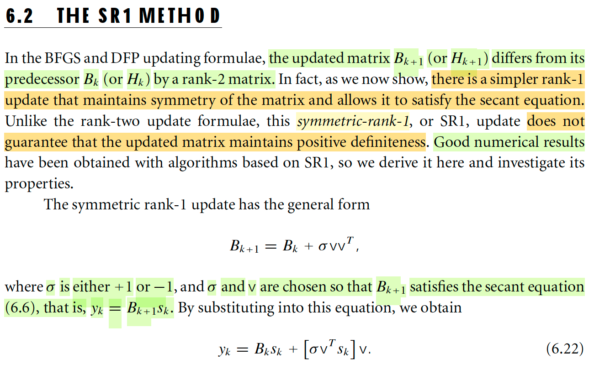

# 6.2 The SR1 Method

📊 **Progress:** `1` Notes | `1` Screenshots | `0` AI Reviews

---

## 6.2 The SR1 Method

<kbd></kbd>

> [!NOTE]
> Phương pháp SR1: Đại ý câu chuyện của nó là thế này. Trong phần trước, ta đã nói về câu chuyện giúp sinh ra DFP, và sau đó là BFGS. Đó là: Ta muốn Bk+1 chứa thông tin curvature từ xk → xk+1, bằng cách ép nó thỏa secant equation Bk+1sk=yk. 
>
> Việc này được inspired bởi: ∇fk+1 - ∇fk ≈ ∇^2fk+1 (xk+1 - xk) 
>
> ⇔ yk ≈ ∇^2fk+1 sk
>
> ∇f1 - ∇f0 ≈ ∇^2f1 (x1 - x0) → ∇^2f1 mang thông tin curvature từ x0 → x1, nên nếu B1 cũng thỏa equation thì nó cũng mang thông tin curvature từ x0 → x1.
>
> Và bằng cách biến đổi qua một không gian khác, ta thấy nó (điều kiện này) sẽ tương đương B^k+1s^k = s^k, tức là nó nhận s^k là vector riêng với trị riêng = 1. Để rồi, dẫn tới ta có thể có một dạng (trong số nhiều dạng khác) của nó: B^k+1 = P⊥ + P, với P là matrix chiếu lên span{s^k}. Và dùng điều kiện "gần nhất với Bk" ta dẫn tới kết luận B^k+1 có dạng P⊥B^kP⊥ + P. Và chuyển về lại ta sẽ có công thức update Bk như trong sách (ý tưởng chính là vậy)
>
> Vậy thì công thức này ta dễ thấy nó có

 

