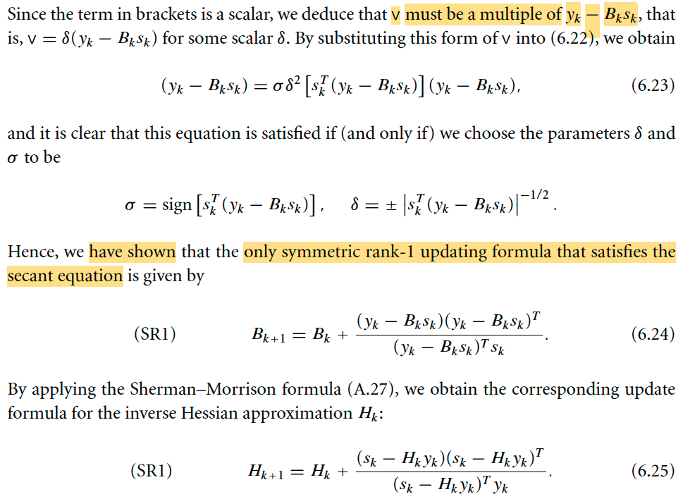
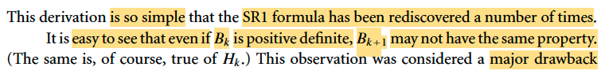
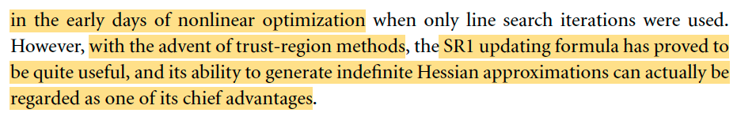
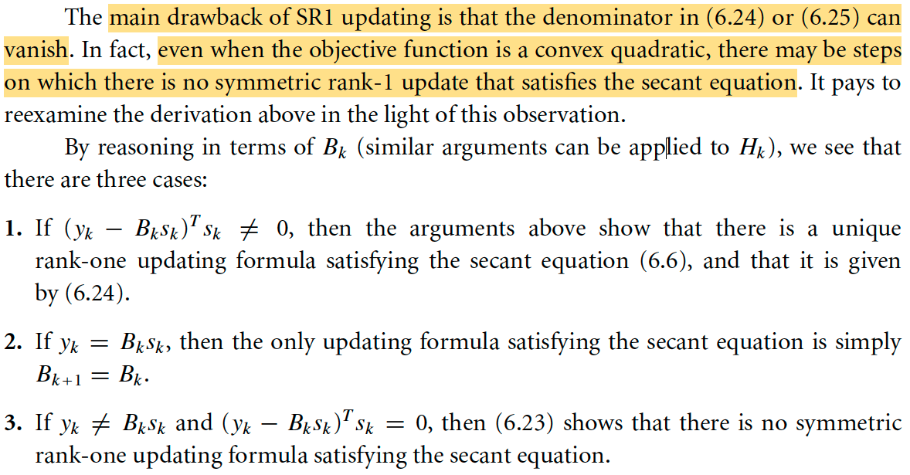
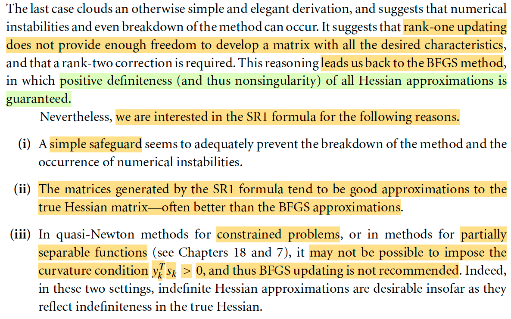
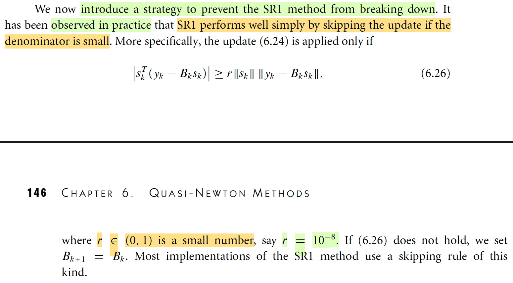
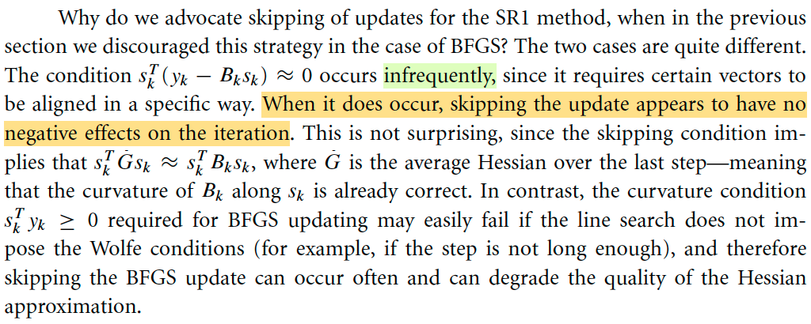
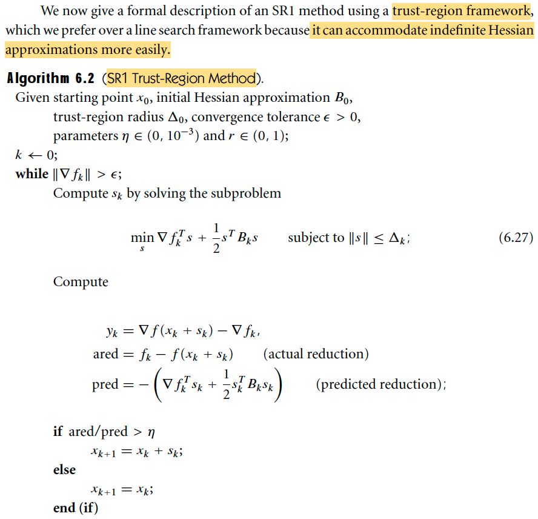
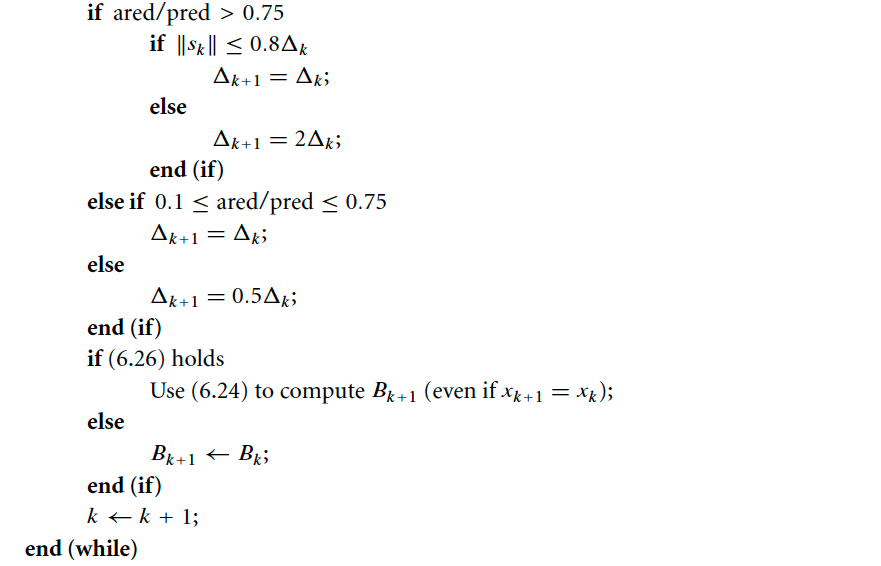
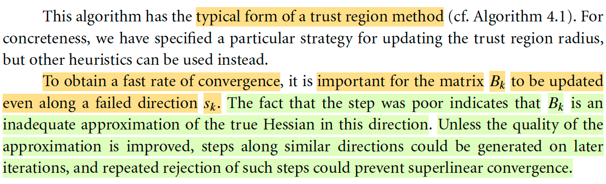

# 6.2 The SR1 Method

📊 **Progress:** `5` Notes | `11` Screenshots | `4` AI Reviews

---

## 6.2 The SR1 Method

<kbd></kbd>

<kbd></kbd>

> [!NOTE]
> Phương pháp SR1: Đại ý câu chuyện của nó là thế này. Trong phần trước, ta đã nói về câu chuyện giúp sinh ra DFP, và sau đó là BFGS. Đó là: Ta muốn Bk+1 chứa thông tin curvature từ xk → xk+1, bằng cách ép nó thỏa secant equation Bk+1sk=yk. 
>
> Việc này được inspired bởi: ∇fk+1 - ∇fk ≈ ∇^2fk+1 (xk+1 - xk) 
>
> ⇔ yk ≈ ∇^2fk+1 sk
>
> ∇f1 - ∇f0 ≈ ∇^2f1 (x1 - x0) → ∇^2f1 mang thông tin curvature từ x0 → x1, nên nếu B1 cũng thỏa equation thì nó cũng mang thông tin curvature từ x0 → x1.
>
> Và bằng cách biến đổi qua một không gian khác, ta thấy nó (điều kiện này) sẽ tương đương B^k+1s^k = s^k, tức là nó nhận s^k là vector riêng với trị riêng = 1. Để rồi, dẫn tới ta có thể có một dạng (trong số nhiều dạng khác) của nó: B^k+1 = P⊥ + P, với P là matrix chiếu lên span{s^k}. Và dùng điều kiện "gần nhất với Bk" ta dẫn tới kết luận B^k+1 có dạng P⊥B^kP⊥ + P. Và chuyển về lại ta sẽ có công thức update Bk như trong sách (ý tưởng chính là vậy)
>
> Vậy thì công thức này ta dễ thấy nó là một rank 2 update...
>
> DFP: Hk+1 = Hk - HkykykTHk/ykTHkyk + skskT/ykTsk
>
> BFGS: Hk+1 = (I - ρkskykT)Hk(I - ρkykskT) + ρkskskT
>
> ..Vì sao → vì bản chất là hai cái term cộng thêm (ví dụ của DFP, và trong BFGS nếu triển khai ra cũng sẽ tương tự) là rank 1 matrix. Tổng của hai cái rank 1 matrix sẽ là rank 2, vì sao? ví dụ A là [2a, 3a], B là [3b, 4b] thì A + B là [2a + 3b, 3a + 4b] sẽ có column space có basis là a và b (dĩ nhiên assumption a với b độc lập)
>
> Vậy thì phần này ý tưởng là, dùng một rank 1 update, bằng cách cộng vào Bk một matrix rank 1 có dạng σvvT với σ = 1 hoặc -1, còn v thì chọn sao cho cái Bk+1 nó thỏa secant equation.
>
> (cái này làm mình liên hệ đến LORA: Lowrank finetuning trong LLM)
>
> với dạng yêu cầu Bk+1 = Bk + σvvT, thế vào secant equation để tìm v:
>
> Bk+1sk = yk
>
> ⇔ (Bk + σvvT)sk = yk
>
> ⇔ Bksk + σvvTsk = yk 
>
> ⇔ Bksk + σ(vTsk)v = yk (6.22)
>
> ⇔ σ(vTsk)v = yk - Bksk
>
> ⇔ v = (yk - Bksk)/σ(vTsk)
>
> thế thì, tới đây, equation này cho thấy, v phải là một là một scaled version của vector yk - Bksk. Đặt scalar là là δ: v = δ(yk - Bksk)
>
> Lặp vào lại 6.22:
>
> Bksk + σ(δ(yk - Bksk)Tsk)δ(yk - Bksk) = yk
>
> ⇔ σ(δ(yk - Bksk)Tsk)δ(yk - Bksk) = yk - Bksk
>
> ⇔ σδ^2(yk - Bksk)Tsk = 1
>
> Rồi, lập luận như sau: vì đã nói σ sẽ là số +1 hoặc -1, mà ở đây, vế phải dương, còn δ^2 ở vế trái không âm, nên σ × (yk - Bksk)Tsk phải dương. do đó σ phải có dấu cùng dấu với (yk - Bksk)Tsk ⇨ σ = sign((yk - Bksk)Tsk)
>
> Tiếp theo, để phương trình cân bằng ta cần δ^2|(yk - Bksk)Tsk| = 1
>
> ⇨ δ^2 = 1/|(yk - Bksk)Tsk|
>
> ⇨ δ = (+/-) 1/√|(yk - Bksk)Tsk|
>
> Thế là ta đã có công thức rank 1 update cho Bk+1
>
> Bk+1 = Bk + σvvT = Bk + sign((yk - Bksk)Tsk) × δ^2(yk - Bksk)(yk - Bksk)T
>
> = Bk + sign((yk - Bksk)Tsk) × δ^2(yk - Bksk)(yk - Bksk)T
>
> = Bk + sign((yk - Bksk)Tsk) × [(+/-)1/√|(yk - Bksk)Tsk|]^2 × (yk - Bksk)(yk - Bksk)T 
>
> = Bk + sign((yk - Bksk)Tsk) × [1/|(yk - Bksk)Tsk|] × (yk - Bksk)(yk - Bksk)T 
>
> = Bk + [sign((yk - Bksk)Tsk) / |(yk - Bksk)Tsk|] × (yk - Bksk)(yk - Bksk)T 
>
> = Bk + 1 / [(yk - Bksk)Tsk] × (yk - Bksk)(yk - Bksk)T 
>
> = Bk + (yk - Bksk)(yk - Bksk)T / (yk - Bksk)Tsk
>
> và lại dùng cái công thức Sherman-Morrison, chỉ đơn giản là giúp chuyển cái công thức update Bk+1 sang công thức update (Bk+1)inverse, mà mục đích là để ta khỏi phải làm hai bước (i) update Bk+1 → (ii) tín (Bk+1)inv, thì ta sẽ có công thức rank 1 update cho matrix Hk+1

> [!TIP]
> **🤖 AI Feedback** — ✅ Score: **90/100**
>
> Điểm mạnh của bạn là khả năng suy luận toán học rất chính xác và chi tiết trong việc chứng minh công thức cập nhật SR1 (6.24), cùng với giải thích rõ ràng về phương trình cát tuyến và sự khác biệt rank. Để cải thiện, hãy tập trung vào các khái niệm trực tiếp liên quan đến SR1 được trình bày trong tài liệu, tránh đưa vào các ý tưởng (như điều kiện B^k+1s^k = s^k hay ma trận chiếu) không thuộc về quá trình dẫn xuất này để đảm bảo tính mạch lạc.

 

### Tính xác định dương của SR1

<kbd></kbd>

<kbd></kbd>

> [!NOTE]
> Đại khái nói là cái này có một nhược điểm dễ thấy, đó là nếu Bk xác định dương thì cũng không có gì đảm bảo Bk+1 cũng vậy (tương tự với Hk, Hk+1). Thử xem vì sao.
>
> Bk+1 = Bk + (yk - Bksk)(yk - Bksk)T / (yk - Bksk)Tsk
>
> Xét quadratic form của Bk+1: zTBk+1z với z khác 0 bất kì.
>
> = zT[Bk + (yk - Bksk)(yk - Bksk)T / (yk - Bksk)Tsk]z
>
> = zT[Bkz + (yk - Bksk)(yk - Bksk)Tz / (yk - Bksk)Tsk]
>
> = zTBkz + zT(yk - Bksk)(yk - Bksk)Tz / (yk - Bksk)Tsk
>
> nếu Bk ≻ 0 ⇨ zTBkz > 0 ∀z
>
> xét term thứ 2: zT(yk - Bksk)(yk - Bksk)Tz / (yk - Bksk)Tsk
>
> = [zT(yk - Bksk)]^2 / (yk - Bksk)Tsk
>
> cái này chưa chắc đã không âm vì dù tử số không âm nhưng (yk - Bksk)Tsk thì có thể âm
>
> Do đó cả cái cụm này chưa chắc sẽ dương ⇨ Bk+1 chưa chắc ≻ 0 dù Bk ≻ 0
>
> -----
>
> Thế thì do đó người ta nói đây là cái nhược điểm lớn nhất của cái SR1, và là lí do lúc đầu người ta không xài. Tuy nhiên sau khi có thuật toán Trust Region ra đời thì cái này lại tỏ ra hữu ích trở lại. Và nó có một tính chất đặc biệt hữu ích là khả năng tao xấp xỉ Hessian indefinite (tức là sao, tức là khi Hessian indefinite, cái này có thể giúp xấp xỉ tốt)

> [!TIP]
> **🤖 AI Feedback** — ✅ Score: **97/100**
>
> Bạn đã tóm tắt và phân tích rất chính xác các điểm chính của đoạn văn, bao gồm cả nhược điểm ban đầu và lợi thế sau này của công thức SR1. Việc bạn chủ động giải thích toán học về lý do B_k+1 có thể không xác định dương là một điểm cộng lớn, thể hiện sự hiểu biết sâu sắc.

 

#### Nhược điểm cập nhật SR1

<kbd></kbd>

<kbd></kbd>

> [!NOTE]
> Đoạn này đại khái là: SR1 có nhược điểm quan trọng. đó là: có thể xảy ra vấn đề là: KHÔNG PHẢI LÚC NÀO CŨNG CÓ THỂ CÓ RANK 1 UPDATE. Hay nói ngắn gọn là không phải cái công thức update Bk+1 lúc nào cũng work.
>
> Lí do, ta hãy nhớ lại trong lập luận dẫn đến công thức
>
> Bk+1 = Bk + (yk - Bksk)(yk - Bksk)T / (yk - Bksk)Tsk (1)
>
> Thì cách lập luận chính là: cho rằng Bk+1 = Bk + σvvT, với σ = +/-1. Thay Bk+1 có dạng này vào secant equation, để dẫn ta đến phương trình. 
>
> σ(δ(yk - Bksk)Tsk)δ(yk - Bksk) = yk - Bksk
>
> Vậy thì dĩ nhiên, nếu phương trình này có nghiệm thì công thức update Bk+1 mới work, mà không có gì đảm bảo điều này.
>
> Cụ thể, nếu yk - Bksk khác 0, nhưng (yk - Bksk)Tsk lại bằng 0, thì phương trình vô nghiệm ⇨ không tồn tại cách update Bk+1 nào cả (cũng có thể thấy công thức (1) chỉ valid nếu (yk - Bksk)Tsk khác 0.
>
> (Khi yk - Bksk = 0 thì vẫn công thức (1) trở thành Bk+1 = Bk vẫn tạm chấp nhận được)
>
> Như vậy mình hiểu rằng, cái method này có vấn đề chí mạng, vì nếu rơi vào case vô nghiệm thì thụật toán sẽ tạch.
>
> Bởi vậy, gs mới nói, ban đầu người ta không dùng, và quay về BFGS.
>
> Nhưng vấn đề là, CÓ VÀI LÍ DO ĐỂ VẪN SẼ XÀI CÁI NÀY:
>
> 1) Thật ra vẫn có cách khắc phục cái nguy cơ tạch nói trên
>
> 2) Thuật toán này có ưu điểm phát huy được trong những case mà BFGS không work
>
> 3) Vì cách xấp xỉ Hessian của nó không có cái tính chất "nếu Bk xác định dương thì Bk+1 luôn xác định dương" nên nó xấp xỉ tốt hơn Hessian so với BFGS. Mình hiểu ý này như vầy: KHÔNG PHẢI LÚC NÀO CỨ Bk XÁC ĐỊNH DƯƠNG THÌ Bk+1 NÊN LUÔN LUÔN  XÁC ĐỊNH DƯƠNG. Vì mình hiểu điều này chỉ đúng là cần thiết nếu như ta đi đến gần optimal, còn đôi khi trên đường đi, việc Bk xác định dương, mà ngay lập tức ép buộc Bk+i sau đó trở đi đều xác định dương sẽ khiến xấp xỉ kém cái Hessian thực tế.

> [!TIP]
> **🤖 AI Feedback** — ✅ Score: **98/100**
>
> Ghi chú của bạn rất toàn diện và chính xác, thể hiện sự hiểu biết sâu sắc về những thách thức và lợi thế của SR1. Phần giải thích chi tiết của bạn về lý do SR1 có thể cung cấp các xấp xỉ Hessian tốt hơn, đặc biệt khi tính xác định dương không phải lúc nào cũng cần thiết, là đặc biệt sâu sắc.

 

##### SR1: Bỏ qua cập nhật

<kbd></kbd>

<kbd></kbd>

> [!NOTE]
> Đoạn này đại khái là nói về cách giải quyết cái yếu điểm của SR1, đơn giản là đặt ra một cái điều kiện để thực hiện update, và cho phép skip nếu không đạt. 
>
> Cụ thể như note vừa rồi mình đã hiểu, vấn đề sẽ xảy ra khi (yk - Bksk)Tsk = 0, đồng nghĩa yk - Bksk vuông góc sk. Nên cách giải quyết là đặt ra điều kiện là chỉ update khi góc giữa chúng không quá gần 90 độ:
>
> cos(yk - Bksk,sk) ≥ r với r là số trong (0,1) nhỏ, ví dụ 10^-8.
>
> ⇔ (yk - Bksk)Tsk / ||yk - Bksk|| × ||sk|| ≥ r
>
> ⇔ (yk - Bksk)Tsk ≥ r × ||yk - Bksk|| × ||sk|| (6.26)
>
> Và sau đó là vài biện minh cho cách làm này so với làm tương tự trong BFGS
>
> (Phần này quay lại sau)

 

- **Thuật toán SR1 Vùng tin cậy**

<kbd></kbd>

<kbd></kbd>

<kbd></kbd>

> [!NOTE]
> Thử tìm hiểu thuật toán SR1 Trust Region Method:
>
> Nhưng đầu tiên nhớ lại những ý chính của Trust Region Method:
>
> Về cơ bản, tại mỗi iteration ta sẽ làm cái việc sau: 
>
> i) Giải bài toán tối ưu hàm quadratic xấp xỉ bậc hai của objective function f, với inequality constraint ||pk|| ≤ Δk với Δ là bán kính tin cậy có được set từ iteration trước.
>
> ii) Giải ra pk, ta sẽ đo mức độ uy tín của mk (trong việc đại diện f): = độ giảm thực tế của f / độ giảm bởi mk.
>
> Nếu nó cao, gần 1, tức mk (mà chủ yếu là nói đến Bk) xấp xỉ tốt f. Ta sẽ dùng pk (tức có thực hiện bước update vị trí) và đồng thời mở rộng bán kính tin cậy: cho Δk tăng lên.
>
> Nếu nó thấp, tức mk approx f tệ, thì ta sẽ không làm gì, và thu nhỏ bán kính tin cậy lại.
>
> Nếu nó tàm tạm, thì vẫn dùng pk (update vị trí) nhưng giữ nguyên bán kính chứ không tăng thêm.
>
> Quay lại đây, ỡ mỗi iteration:
>
> Giải bài toán 6.27, gọi là subproblem, minimize hàm quadratic approx hàm f tại xk (nhưng dĩ nhiên là dùng Bk thay cho Hessian ∇^2fk, vì đây là quasi-Newton, nếu dùng Hessian thì thành ra Trust Region Newton rồi)
>
> minimize mk(s) = fk + ∇fkTs + (1/2)sTBks s.t ||s|| ≤ Δk
>
> Dĩ nhiên bài toán này equivalent minimize mk(s) = ∇fkTs + (1/2)sTBks vì fk là constant, nên ta thấy công thức 6.27 là vậy.
>
> Giải ra sk, theo lí thuyết vừa ôn lại, ta sẽ tính độ uy tín, là tỉ lệ giữa:
>
> độ giảm thực tế: ared= fk - fk+1 = f(xk) - f(xk+sk) 
>
> và độ giảm bởi mk: pred = mk(0) - mk(sk) = fk - (fk + ∇fkTsk + (1/2)skTBksk) = -(∇fkTsk + (1/2)skTBksk)
>
> Xét các case độ uy tín:
>
> i) Để nhảy hay không đứng yên
>
> + Uy tín cao (ared/pred lớn, > η): Update vị trí
>
> + Uy tín không cao: Đứng yên
>
> ii) Để tăng / giảm / giữ bán kính tin cậy:
>
> + Uy tín cao (> 0.75) và ||sk|| ≥ 0.8 Δk: Ý nghĩa là, đụng hàng rào → Chứng tỏ còn có thể xuống thấp hơn nếu hàng rào rộng hơn → Tăng bán kính
>
> + Uy tín cao nhưng ||sk|| < 0.8 Δk → Ý nghĩa là unconstrained mk đã đạt minimum tại điểm trong phạm vi hàng rào → không cần tăng bán kính
>
> + Uy tín vừa vừa và thấp: Giữ nguyên hoặc thu hẹp bán kính. 
>
> Cuối cùng là update Bk:
>
> Nếu thỏa điều kiện 6.26: (yk - Bksk)Tsk ≥ r × ||yk - Bksk|| × ||sk||, tính Bk+1 và update, còn không thì giữ nguyên.
>
> Như vậy ta thấy một chi tiết thế này: Dù là uy tín có thấp hay cao, thì ta không dùng nó để có / không updaye Bk, mà ta chỉ dựa vào điều kiện 6.26 mà thôi.
>
> Và gs nói, ý này quan trọng là vì: Nếu uy tín thấp. và ta ko thực hiện update vị trí, thì ta **VẪN UPDATE Bk VÌ ĐIỀU ĐÓ SẼ GIÚP CẢI THIỆN MÔ HÌNH mk. VÌ RÕ RÀNG VIỆC MÔ HÌNH mk UY TÍN THẤP CHỨNG TỎ BK KHÔNG APPROX TỐT HESSIAN**, vậy thì phải update nó để nó có thể tốt hơn lên thêm thì ở vòng sau (vẫn đứng vị trí cũ, nhưng với Bk tốt hơn, bán kính có thể đã nhỏ hơn) thì có thể lần này mô hình sẽ uy tín cao hơn → giúp sk được chấp nhận, vị trí được update.
>
> Ngược lại, **NẾU TA CHỈ UPDATE BK KHI MK UY TÍN, THÌ KHI NÓ KHÔNG UY TÍN, BK VỐN DĨ TỆ LẠI VẪN ĐƯỢC GIỮ NGUYÊN** → điều này sẽ **KHIẾN THUẬT TOÁN MẮC KỆT TẠI ĐÂY HOÀI VÌ KHÔNG THÓAT ĐƯỢC VÒNG LUẨN QUẨN**: **Bk tệ → mk ko uy tín → không update Bk → Bk tệ → mk ko uy tín** Đây là cái gs Nocedal gọi là REPEATED REJECTION

> [!TIP]
> **🤖 AI Feedback** — ✅ Score: **95/100**
>
> Bài phân tích thể hiện sự hiểu biết sâu sắc và chính xác về thuật toán SR1 Trust-Region, đặc biệt là ý nghĩa quan trọng của việc cập nhật ma trận xấp xỉ Hessian (Bk) độc lập với độ tin cậy của mô hình (tỷ lệ ared/pred). Tuy nhiên, có một chi tiết nhỏ cần điều chỉnh: bán kính tin cậy (Δk) chỉ được tăng gấp đôi khi độ dài bước `||sk||` lớn hơn `0.8 Δk`, không phải khi `||sk|| >= 0.8 Δk` như đã nêu, vì khi `||sk|| <= 0.8 Δk` thì bán kính được giữ nguyên.

 

