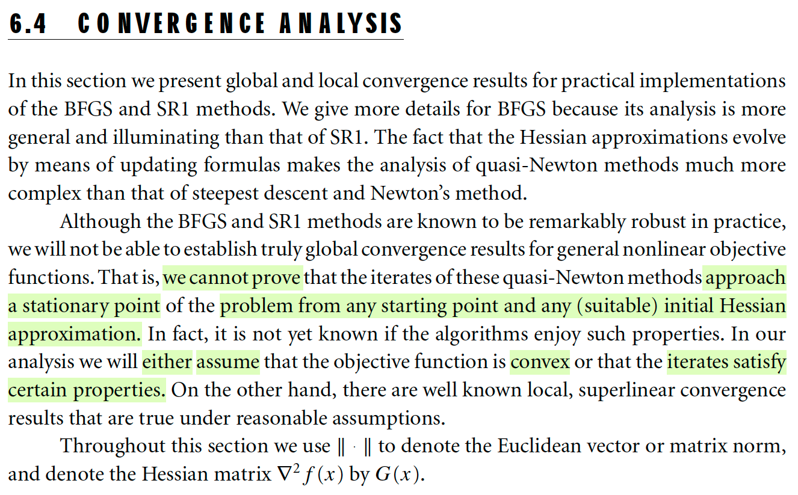
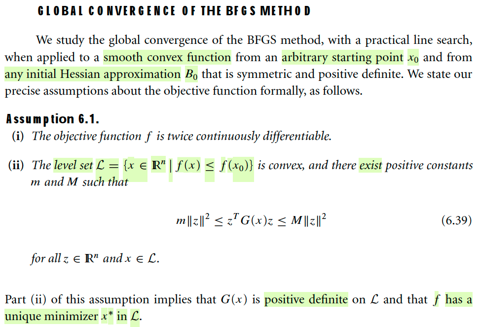
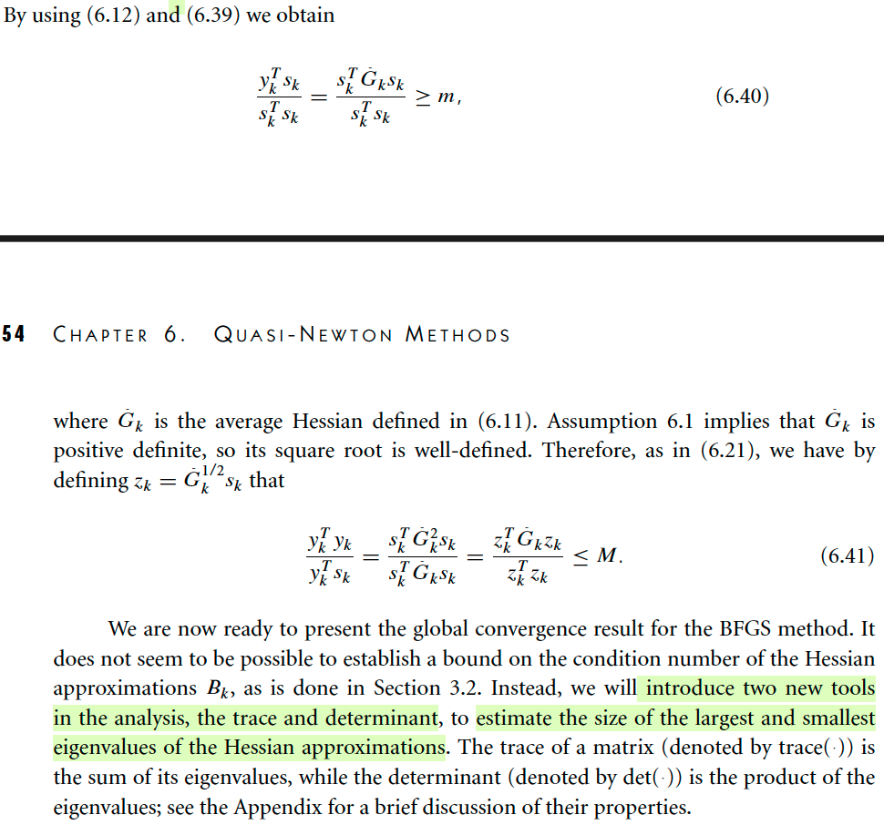
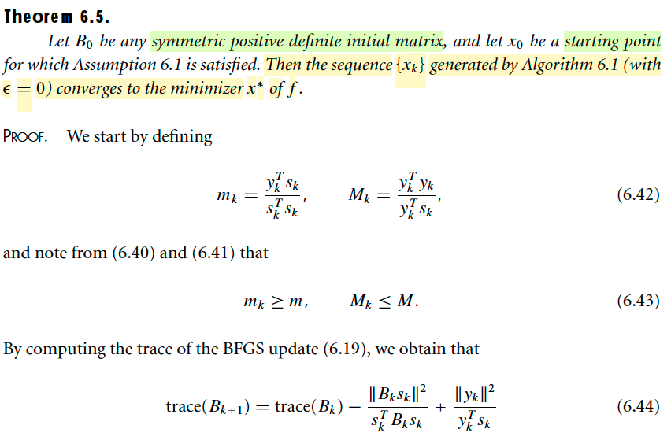

# 6.4 Convergence Analysis

📊 **Progress:** `4` Notes | `4` Screenshots | `2` AI Reviews

---

## 6.4 Convergence Analysis

<kbd></kbd>

> [!NOTE]
> Đại khái là mở đầu gs nói trước rằng, ta chưa thể chứng minh được là quasi-Newton (như BFGS hay SR1) sẽ hội tụ được đến stationary point với initial point bất kì cũng như cách xấp xỉ Hessian bất kì.
>
> Do đó trong phần này, gs sẽ dựa trên một số điều kiện như hàm objective convex hoặc các iterate thỏa mãn một vài tính chất nhất định nào đó.

 

### Giả định Hội tụ Toàn cục BFGS

<kbd></kbd>

> [!NOTE]
> Đại khái là phần này gs sẽ chứng minh tính hội tụ toàn cục của BFGS với practical line search, và hàm số mục tiêu có tính smooth và convex, điểm ban đầu x0 tùy ý, matrix Hessian approx H0 cũng được khởi tạo tùy ý sao cho đối xứng và xác định dương.
>
> Về mặt toán học thì những giả định này được thể hiện bởi 
>
> i) hàm f twice continuously differentiable  → đây là ý cho hàm trơn 
>
> Convex: trong level set L = {x: f(x) ≤ f(x0)}, là convex set, và tồn tại hai hằng số dương sao cho m||z||^2 ≤ zTG(x)z ≤ M||z||^2 ∀z và x ∈ L
>
> → Cái này đại khái nghĩa là quadratic form của Hessian tại mọi điểm trong L đều bị chặn dưới và trên, tức là nó không thể quá nhỏ → độ cong (Hessian man thông tin độ cong) quá nhỏ, hàm gần như phẳng, nhưng không thể quá to → khiến hàm thay đổi quá nhanh.
>
> Và gs nói ý ii) hàm chứa Hessian G(x) xác định dương và bài toán có một minimizer x* độc nhất thuộc L
>
> → Ý này dễ thấy, vì với mọi z thì 0 < m||z||^2 ≤ zTG(x)z → G(x) ≻ 0
>
> Còn vụ unique minimizer là vì trong tập L, G(x) luôn xác định dương → hàm số f gọi là strictly convex. Và điều kiện m||z||^2 ≤ zTG(x)z ≤ M||z||^2 cũng sẽ hàm ý là tập L là tập đóng. Như vậy có nghĩa là khi → ra khỏi tập này từ bất kì hướng nào, hàm f sẽ vọt lên. Do đó nhất định tồn tại cực tiểu nằm trong L, và cùng với tính lồi chặt sẽ cho thấy nó là unique.

 

#### Công cụ hội tụ Quasi-Newton

<kbd></kbd>

> [!NOTE]
> 6.12: yk = Gbark αkpk = Gbark sk với vì Gbar là trung bình Hessian từ xk → xk+1:∫0:1 G(xk + ταkpk)dτ
>
> ykTsk = (Gbark sk)Tsk = skT Gbark sk và: 
>
> 1) vì Gbar là hessian trung bình như định nghĩa trên, mà pk phải là descent direction cùng với cái ý gọi là practical line search (khiến tính ra αk hợp lí) nên nó không thể dẫn ta đi ra khỏi level set L, 
>
> 2) và đặc biệt là L là tập lồi, nên nếu xk, xk+1 thuộc L thì mọi điểm trên line segment nói chúng đều thuộc L, như vậy đủ cơ sở để nói mọi matrix G(xk + ταkpk) đều thỏa assumption (6.1)
>
> Vậy ykTsk / skTsk = skTGbarksk / skTsk ≥ m (6.40)
>
> -----
>
> Tiếp, tiếp tục với ý mọi matrix G(xk + ταkpk) đều thỏa assumption (6.1), tức xác định dương, thì như vậy Gbark cũng xác định dương (tổng của các xác định dương thì cũng xdd). Do đó, mọi trị riêng đều dương, nên có thể tách Gbark = (Gbark)^(1/2)(Gbark)^(1/2)
>
> ⇨ ykTyk = (skTGbark)(GbarkTsk) = skT (Gbark)^2 sk 
>
> = skT (Gbark)^1/2 Gbark (Gbark)^1/2 sk 
>
> = zkT Gbark zk (Đặt zk = (Gbark)^(1/2)sk)
>
> ⇨ ykTyk / ykTsk = zkT Gbark zk / zkTzk ≤ M (6.41)
>
> Tạm hiểu là tí nữa ta sẽ xài hai cái kết quả này
>
> -----
>
> Cuối cùng, gs nói để phân tích hội tụ của quasi Newton, sẽ khó hơn là các pp khác, vì trong pp này, matrix approx Hessian thay đổi liên tục trong quá trình thuật toán chạy. Nên ta khó mà nắm bắt được trị riêng của nó. Nên ta sẽ sử dụng hai công cụ quan trọng là trace và det, như đã biết từ 1806: là tổng và tích của trị riêng, ý nghĩa là nếu ko nắm bắt được cụ thể giá trị của trị riêng, nhưng nếu nắm bắt được cái tổng và tích thì ta cũng có thể chỉ ra giới hạn của trị riêng (nắm bắt ở đây ý nói, nắm bắt hành vi, khoảng giá trị của nó)

> [!TIP]
> **🤖 AI Feedback** — ✅ Score: **96/100**
>
> Ghi chú rất chính xác trong việc tái hiện các công thức và cung cấp cái nhìn sâu sắc về lý do tại sao các công cụ như trace và determinant lại hữu ích trong phân tích. Tuy nhiên, một vài điểm giải thích chi tiết hơn về các giả định không được trình bày trực tiếp trong đoạn văn bản gốc.

 

##### Tính trace cập nhật BFGS

<kbd></kbd>

> [!NOTE]
> Công thức update Bk 6.19 bữa trước: 
>
> Bk+1 = Bk - BkskskTBk / skTBksk + ykykT / ykTsk
>
> Tính trace Bk+1:
>
> tr(Bk+1) = tr[Bk - BkskskTBk / skTBksk + ykykT / ykTsk]
>
> ⇔ tr(Bk+1) = tr(Bk) - tr(BkskskTBk / skTBksk) + tr(ykykT / ykTsk) | trace có tính linearity
>
> =  tr(Bk) - tr(BkskskTBk) / skTBksk + tr(ykykT) / ykTsk) | vẫn là tính linearity (αA) = α tr(A)
>
> =  tr(Bk) - tr((skTBk)TskTBk) / skTBksk + tr(ykykT) / ykTsk) 
>
> Tới đây nhớ lại bản chất của trace: tổng entries đường chéo:
>
> tr(ATA) = Σii (ATA)_ii = Σi (aiTai) = Σij(Aij)^2 = ||A||^2 , chính là Frobenius norm (hay còn gọi là Eucledian norm)
>
> ⇨ ..= tr(Bk) - ||Bksk||^2 / skTBksk + ||yk||^2 / ykTsk  (6.44)
>
> (với tr(ykykT) thì coi như tr((ykTI)T(ykTI)) = ||ITyk|| = ||yk|| thôi)
>
> Nhưng cũng có cách khác cũng dễ: tr(AB) = tr(BA) ⇨ tr(ykykT) = tr(ykTyk) = ykTyk (trace của scalar = scalar) = ||yk||^2. và tr(BkskskTBk) = tr(BkTskskTBk) = tr(vvT) với v = BkTsk, = tr(vTv) = vTv = ||v||^2 = ||BkTsk||^2

> [!TIP]
> **🤖 AI Feedback** — ✅ Score: **93/100**
>
> Bạn đã trình bày một cách xuất sắc việc chứng minh công thức (6.44), với các bước rất chi tiết và sử dụng đúng các tính chất của trace. Đặc biệt, việc sử dụng tính chất tr(AB) = tr(BA) là một cách rất thanh lịch để đơn giản hóa các số hạng, giúp bài giải rõ ràng và chính xác hơn.

 

