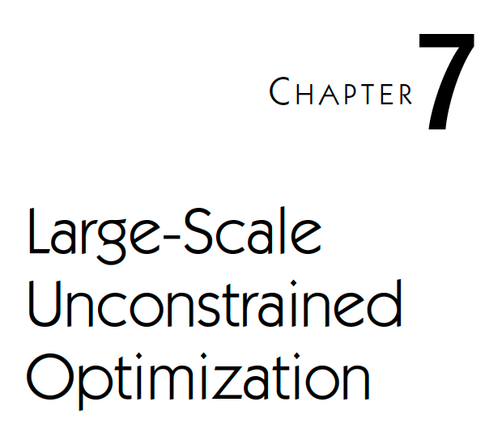
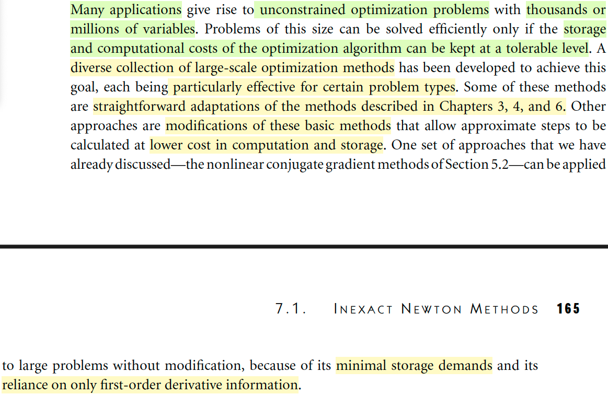
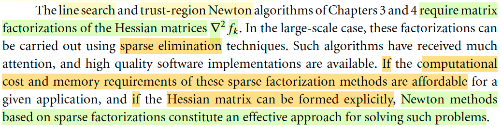
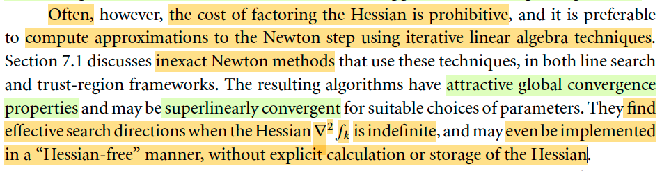
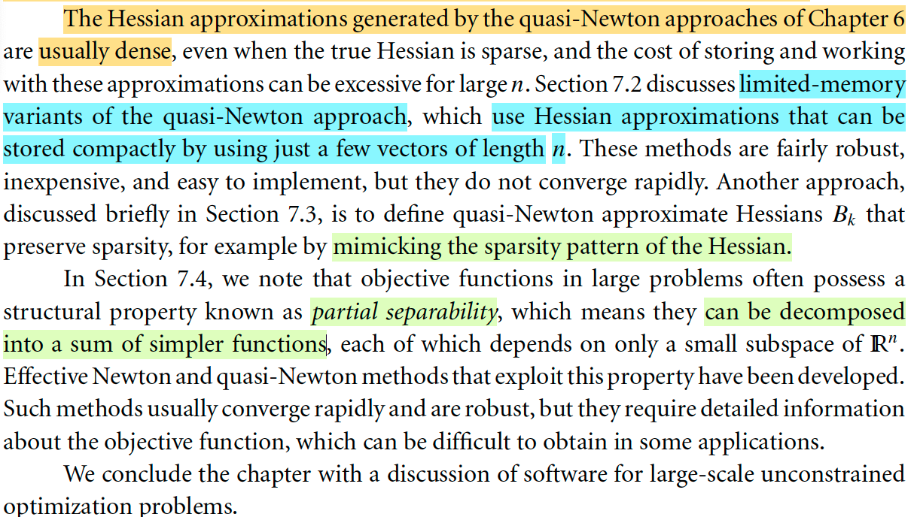
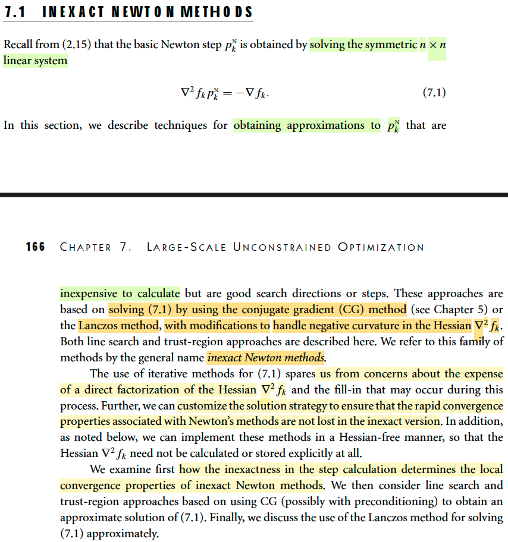
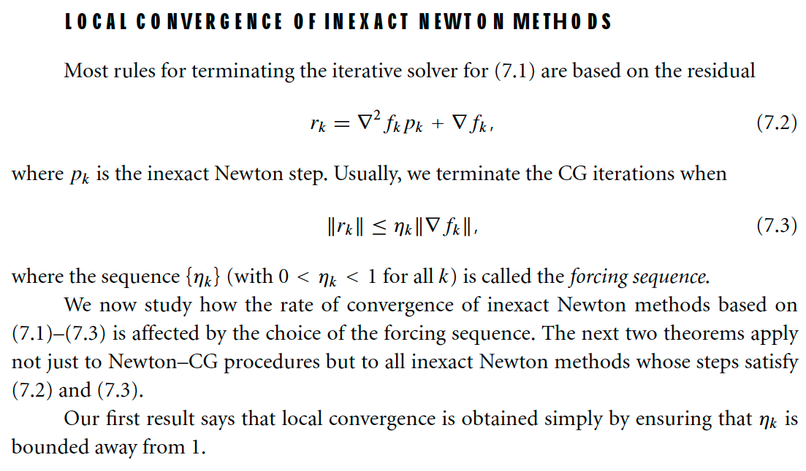

# 7.1 Inexact Newton Methods

📊 **Progress:** `6` Notes | `7` Screenshots | `5` AI Reviews

---

## Tối ưu không ràng buộc quy mô lớn

<kbd></kbd>

 

<kbd></kbd>

> [!NOTE]
> Đại khái là gs nói trong thực tế có nhiều bài toán tối ưu rất lớn (hàng triệu  variable, mà ở thời kì AI ngày nay là hàng trăm tỉ variables) Do đó, yêu cầu đặt ra là cần các thuật toán tối ưu có thể giữ chi phí lưu trữ cũng như tính toán các biến số ở mức chấp nhận được. Từ đó ra đời các thuật toán tối ưu quy mô lớn này.
>
> Cách tiếp cận thì một số dùng trực tiếp các thuật toán cơ bản, một số thì chỉnh sửa sao cho giảm chi phí tính toán. Mà trong số đó non-linear conjugate method là một ví dụ (nhưng ta  bỏ qua method này trong 5.2 vì nhiều nhược điểm khiến ngày nay không ai xài nữa)

> [!TIP]
> **🤖 AI Feedback** — ⚠️ Score: **70/100**
>
> Bạn đã tóm tắt tốt về nhu cầu đối với các thuật toán tối ưu quy mô lớn và cách tiếp cận đa dạng. Tuy nhiên, thông tin về việc phương pháp gradient liên hợp phi tuyến (nonlinear conjugate gradient method) không còn được sử dụng do nhiều nhược điểm chưa hoàn toàn chính xác theo nội dung văn bản gốc, vì đoạn văn chỉ ra ưu điểm của nó cho các bài toán lớn.

 

#### Phân rã thưa trong Newton

<kbd></kbd>

> [!NOTE]
> Chỗ này đại khái là với line search Newton và trust region Newton thì mình cần factor Hessian bởi vì mình cần tính pk: = (∇^2fk)inv ∇fk
>
> Vì sao lại factor, là vì đang ám chỉ dùng factor-solve method để tìm inverse của Hessian, hoặc là nói cách khác, là để giải hệ [Hessian tại k] pk = - ∇fk
>
> Vì thực tế khi tìm pk, tuy là công thức nói ta sẽ pk = - (∇^2fk)inv ∇fk nhưng ta sẽ không tính inverse của Hessian, mà dùng factor-solve method để giải tìm pk.
>
> Ví dụ bước 1 ta factor ∇^2fk = LLT, thì giải ∇^2fk pk = - ∇fk tương đương giải LLT pk = - ∇fk. 
>
> bước 2: giải L y = - ∇fk. và sau đó là LT pk = y, đều là hệ tuyến tính với matrix hê số tam giác (L hay LT) ⇨ giải bằng back hay forward substitution chỉ tốn o(n^2)
>
> Do đó, ở đây gs Nocedal nói, nếu việc phân rã này không quá tốn kém và Hessian matrix có thể được hình thành một cách tường minh. Thì ta có thể xài phép phân rã spase (ví dụ = LLT chính là sparse factorization, vì nó tạo ra các matrix spare) để làm.

> [!TIP]
> **🤖 AI Feedback** — ✅ Score: **96/100**
>
> Bài giải thích rất chính xác về lý do cần phân rã ma trận Hessian và phương pháp giải hệ tuyến tính bằng factor-solve thay vì tính nghịch đảo. Độ sâu của phân tích, đặc biệt là việc giải thích các bước giải và độ phức tạp O(n^2), cho thấy sự hiểu biết sâu sắc về các phương pháp số.

 

##### In-exact Newton

<kbd></kbd>

> [!NOTE]
> Đại khái là, gs nói rằng trong thực tế thì thường là việc phân rã Hessian rất tốt kém, nên không thể dùng sparse factorization như note trước vừa nói được.  Khi đó một cách tiếp cận là GIẢI TÌM NEWTON STEP THEO LỐI ITERATIVELY, gọi là inexact Newton method. Cái này cũng có nhiều tính chất tốt, thậm chí có thể đạt hội tụ siêu tuyến tính. Và nó còn có thể tìm ra hướng đi hiệu quả ngay cả khi Hessian bị indefinite và thậm chí còn có thể có một tính chất tốt hơn nữa, đó là có thể được thực hiện theo lối "Hessian free" - tức hoàn toàn không cần tính hay lưu trữ Hessian.
>
> Nói thêm chút, cái này mình đã học bên Convex với gs Boyd. Ý tưởng giải Newton step theo lối iteratively đơn giản là: Bản chất giải tìm Newton step, chỉ là giải hệ ∇^2f p = - ∇f. Và ta đã biết có cách giải hệ này theo lối iteratively, đây chính là cách tiếp cận đang được nói đến.
>
> Vậy thì nên hiểu thế này: chương 7 ta sẽ học một cách tìm Hessian, nhằm tính Newton step pkNtrong thuật toán line search Newton hay trust region Newton, tuy nhiên không phải là ta sẽ dùng phân rã sparse để giải tìm pkN mà sẽ dùng các tiếp cận iterative, để rồi ngoài cái vòng lặp lớn (outer iteration), tại mỗi step, khi tìm pkN, ta cũng sẽ chạy một cái vòng lặp. Và đây chính là in-exac Newton method

> [!TIP]
> **🤖 AI Feedback** — ✅ Score: **98/100**
>
> Bạn đã thể hiện sự hiểu biết xuất sắc về tài liệu tham khảo, tóm tắt chính xác các điểm chính và làm phong phú thêm bài ghi chú của mình bằng kiến thức bên ngoài có liên quan.

 

- **L-BFGS và Hessian thưa**

<kbd></kbd>

> [!NOTE]
> Đoạn này đại khái nói rằng các matrix xấp xỉ Hessian có được nhờ quasi-Newton method trong chap 6 mình học thường là dense, kể cả khi Hessian thật sparse, do đó nó rất tốn kém. Thành ra 7.2 ta sẽ học về L-BFGS là thuật toán BFGS khắc phục được vấn đề này. Rất quan trọng trong machine learning.
>
> → Mình nên hiểu, đây là bước nâng cấp phương pháp quasi-Newton cho bài toán quy mô lớn. Cũng nên hiểu, quasi-Newton hoàn toàn khác inexact-Newton: quasi-Newton, ta dùng dùng một cách thức để có matrix Bk XẤP XỈ của Hessian thông qua việc cập nhật matrix Bk trong suốt outer iteration của thuật toán. 
>
> Và thật ra là ta sẽ cập nhật cái inverse của Bk, và dùng nó để tính pk.
>
> Còn inexact Newton là ta dùng cách chạy một iteration để giải phương trình [Hessian thật ] pk = - gradient thật theo lối iteratively (điều này cũng giống như ta dùng pk = -[Hessian thật] gradient thật, nhưng tìm pk này theo lối iteratively.
>
> Còn 7.3 thì ta thảo luận một dạng xấp xỉ Hessian khác nhưng giữ được tính sparse của Hessian nếu nó sparse.

> [!TIP]
> **🤖 AI Feedback** — ⚠️ Score: **85/100**
>
> Bạn đã nắm bắt rất tốt các điểm chính về xấp xỉ Hessian dày đặc, các biến thể bộ nhớ hạn chế và duy trì tính thưa thớt từ văn bản. Để tăng cường độ sâu theo văn bản gốc, bạn nên tập trung phân tích và chỉ rút ra thông tin có trong đoạn văn bản đã cho.

 

- **Phương pháp Newton không chính xác**

<kbd></kbd>

> [!NOTE]
> Phần này đại khái là ta sẽ học những cách để tính gần đúng Newton step (như đã biết, là nghiệm của hệ tuyến tính ∇^2 fk pkN = - ∇fk) với các phương pháp như dùng Conjugate Gradient hoặc Lanczos method và có chỉnh sửa chút.
>
> Như lúc đầu đã nói sơ, tuy rằng ta có thể giải hệ này bằng phép phân rã matrix nhưng vấn đề là có khi matrix phân rã không sparse, ngay cả khi Hessian thực tế vẫn sparse. (gọi là Fill-in)
>
> Thêm nữa, tác giả nói ta cũng có thể tùy chỉnh thuật toán thêm để đảm bảo tốc độ hội tụ nhanh của Newton's method không bị mất đi khi ta dùng inexact Newton. Bên cạnh đó, ta cũng sẽ nói về cái vụ Hessian - free, tức là hoàn toàn không cần tính toán hay lưu trữ Hessian chút nào.
>
> Phần tiếp theo đại khái là gs Nocedal sẽ đưa ra tính toán để chứng minh rằng dù là inexact Newton nhưng thuật toán sẽ đảm bảo vẫn hội tụ.

> [!TIP]
> **🤖 AI Feedback** — ✅ Score: **97/100**
>
> Bản tóm tắt rất chính xác và bao quát đầy đủ các ý chính, đặc biệt là việc giải thích rõ ràng về "fill-in" và phương pháp "Hessian-free". Để hoàn thiện hơn, có thể điều chỉnh cách diễn đạt ở phần cuối về việc Nocedal "chứng minh" thành "phân tích" tính hội tụ để sát với ngữ cảnh gốc.

 

- **Local Convergence of Inexact Newtons**

<kbd></kbd>

> [!NOTE]
> Theo tư vấn thì nên skip, quay lại sau phần này, vì nó chỉ là phân tích tính hội tụ, nhưng mình có thể hiểu sơ sơ ý chính là vầy:
>
> Đầu tiên nên nhớ khác nhau giữa quasi-Newton và inexact Newton: 
>
> Inexact Newton, là nói về việc ta muốn tìm Newton-step, trong bối cảnh thuật toán line search Newton hoặc trust region Newton (tức muốn pk là Newton step), nhưng thay vì giải hệ ∇^2 fk pkN = - ∇fk theo những cách thông thường: ví dụ phân rã sparse Hessian, mà trong bối cảnh bài toán quy mô lớn sẽ tốn kém, thì ta sẽ dùng cách thức iteratively để giải hệ này để tìm pkN. Đây gọi là inexact Newton.
>
> Còn quasi-Newton hoàn toàn khác: cũng là ta muốn tính pk = -(∇^2 fk)inv ∇fk, thì ta tránh chi phí cao của việc này bằng cách: giả lập Hessian, thay nó bởi Bk, và xây dựng một phương pháp mà trong đó suốt quá trình của thuật toán ta sẽ liên tục cập nhật lại Bk (hay Bkinv dùng các thông tin mới), thì đây là quasi-Newton.
>
> Vậy thì quay lại đây, với inexact Newton, ta sẽ có một vòng lặp khác giúp giải ∇^2fk pkN = -∇fk TRONG MỖI vòng lặp của thuật toán. DO ĐÓ, DĨ NHIÊN PHẢI CÓ CÁCH ĐỂ BIẾT KHI NÀO THÌ DỪNG vòng lặp con này để có pkN mà xài, vậy thì ở đây chính là nói tới điều này: Ta sẽ dùng residual rk = ∇^2fk pk + ∇fk. Là sao, vì sao?
>
> → Thì bởi vì mục đích là giải hệ ∇^2fk pkN = -∇fk chính là tìm pkN sao cho ∇^2fk pkN = .. -∇fk, mà pkN trong quá trình giải theo lối iteratively sẽ là chuỗi pkN_i sao cho ∇^2fk pkN_i ngày càng gần với -∇fk, đồng nghĩa cái khoảng cách giữa ∇^2fk pkN_i với -∇fk sẽ ngày càng tiến đến 0, đó cũng chính là nói chuỗi residual rk_i = ∇^2fk pkN_i + ∇fk → 0.
>
> Và ta sẽ dừng khi rk_i đủ nhỏ (để pkN_i khi đó là xấp xỉ bằng Newton step thật: -(∇^2 fk)inv ∇fk. 
>
> Thế thì ta sẽ giải cái hệ này ∇^2fk pkN = -∇fk bằng cách nào: Đó chính là dùng Conjugate Gradient đã học ở chapter 5:
>
> Theo đó còn nhớ đại khái story hay idea của CG là vầy: Đối mặt với hệ phương trình tuyến tính Ax = b, CG có thể giúp ta đi từ initial x0 ở đâu đó, và chọn p0 là steepest direction tại x0, để đi đến nghiệm x* của Ax = b trong NHIỀU NHẤT là n bước, và nếu A có các tính chất nào đó thì thậm chỉ số bước còn ít hơn. Do đó, ở đây, chính là ta sẽ áp dụng CG để giải hệ ∇^2fk pkN = -∇fk (với một số chỉnh sửa nhất định vì trong CG gốc, matrix A được yêu cầu phải là xác định dương nhưng Hessian thực tế thì ko phải lúc nào cũng xác định dương)

 

