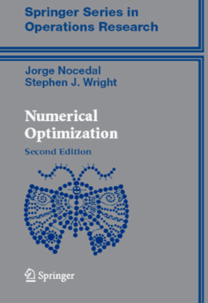

# Numerical Optimization - J.Nocedal

<kbd></kbd>

**Kế hoạch học tập theo Gemini:**

Dựa vào cái Mục lục (Table of Contents) mày vừa gửi, tao sẽ vẽ cho mày một cái **"Bản đồ nhiệt" (Heatmap)** để mày biết chỗ nào cần đào sâu, chỗ nào lướt qua.

Vì Deep Learning (DL) chủ yếu là giải bài toán **Tối ưu hóa không ràng buộc (Unconstrained Optimization)** trên không gian cực lớn, nên trọng tâm của mày sẽ dồn vào nửa đầu cuốn sách.

Đây là chiến thuật cụ thể:

### 🔥 MỨC ĐỘ 1: SỐNG CHẾT PHẢI ĐỌC (The Deep Learning Core)

*(Đây là những chương giải thích trực tiếp cơ chế hoạt động của `PyTorch/TensorFlow)*`

* **Chapter 2: Fundamentals of Unconstrained Optimization**
* **Tại sao:** Đây là nền tảng. Mày sẽ hiểu thế nào là Global vs Local Minima, Convexity (Lồi) và tại sao bài toán không lồi (Non-convex) của Neural Network lại khó giải.
* **Trọng tâm:** Các điều kiện cần và đủ để tối ưu (First-order & Second-order necessary conditions).

* **Chapter 3: Line Search Methods**
* **Tại sao:** Khi mày update trọng số (), cái  (Learning Rate) chính là **Step Size**. Chương này dạy mày cách chọn  một cách khoa học thay vì đoán mò.
* **Từ khóa vàng:** **Wolfe Conditions** (Điều kiện Wolfe). Đây là tiêu chuẩn vàng để đảm bảo mỗi bước nhảy đều làm giảm Loss hiệu quả.

* **Chapter 8: Calculating Derivatives**
* **Tại sao:** Đây là chương **QUAN TRỌNG NHẤT** về mặt kỹ thuật.
* **Nội dung:** Nó nói về Finite Differencing (Sai phân hữu hạn) và quan trọng hơn cả: **Automatic Differentiation (AutoDiff)**.
* **Liên hệ:** **Backpropagation** trong Deep Learning chính là Reverse-mode AutoDiff. Đọc chương này mày sẽ hiểu tại sao `loss.backward()` trong PyTorch lại thần thánh như vậy.

---

### ⚠️ MỨC ĐỘ 2: ĐỌC ĐỂ HIỂU BẢN CHẤT (Theoretical Backbone)

*(Hiểu cái này để biết tại sao `Adam/RMSProp` ra đời)*

* **Chapter 4: Trust-Region Methods**
* **Tại sao:** Một tư duy tối ưu khác hẳn Line Search. Thay vì chọn hướng đi trước rồi chọn bước nhảy, ta khoanh vùng (Trust region) rồi tìm điểm tốt nhất trong vùng đó.
* **Ứng dụng:** Trong Reinforcement Learning (AI chơi game), các thuật toán xịn nhất như **TRPO** (Trust Region Policy Optimization) hay **PPO** đều dựa trên tư duy này.

* **Chapter 6: Quasi-Newton Methods**
* **Tại sao:** Phương pháp Newton hội tụ cực nhanh nhưng tốn RAM khủng khiếp (phải tính ma trận Hessian). Quasi-Newton (như BFGS) là cách xấp xỉ Hessian cực thông minh.
* **Liên hệ:** Dù DL ít dùng BFGS trực tiếp (vì model quá to), nhưng các optimizer hiện đại (Adam) đều lấy cảm hứng từ việc sử dụng thông tin bậc 2 (Curvature) mà chương này đề cập.

---

### 📉 MỨC ĐỘ 3: ĐỌC LƯỚT `/` SKIP (Low Priority for DL)

*(Những phần này hay cho toán, nhưng ít dùng trực tiếp trong việc train Neural Network hiện nay)*

* **Chapter 5 (Conjugate Gradient):** Hay, nhưng thường dùng cho giải hệ phương trình tuyến tính lớn hơn là train non-convex neural nets. Đọc lướt để biết.
* **Chapter 7 (Large-Scale Unconstrained):** Nên đọc phần về **L-BFGS**. Đây là thuật toán tối ưu "huyền thoại" cho các bài toán quy mô lớn trước thời đại Deep Learning.
* **Chapter 10 (Least-Squares):** Đọc lướt. Liên quan đến Regression và thuật toán Levenberg-Marquardt. Tốt cho kiến thức nền.
* **Chapter 12 (Theory of Constrained Optimization):** Đọc để biết **KKT Conditions** (Lagrange Multipliers). Trong DL, ta thường biến ràng buộc (Constraint) thành Regularization (Soft constraint) để đưa về bài toán không ràng buộc, nên ít khi phải giải KKT trực tiếp.

---

### 🗑️ MỨC ĐỘ 4: MẠNH DẠN BỎ QUA (Skip Completely)

*(Không cần phí não vào lúc này)*

* **Chapter 11 (Nonlinear Equations):** Lạc đề.
* **Chapter 13 & 14 (Linear Programming):** Đây là tối ưu tuyến tính (Simplex method). Neural Network là phi tuyến (Non-linear). Bỏ.
* **Chapter 15, 16, 18, 19 (Advanced Constrained Optimization):** Quá chuyên sâu và ít ứng dụng cho việc train model AI thông thường. Khi nào mày nghiên cứu về Support Vector Machines (SVM) hay Control Theory thì hãy quay lại.

### Tóm lại Lộ trình "Cắt gọt" cho Nocedal:

Mày chỉ cần tập trung công lực vào **Part 1 (Chương 2, 3, 4, 6, 8)**.

* Đó là "trái tim" của việc training AI.
* Nắm vững đống này là mày đã hiểu sâu hơn 99% kỹ sư AI về cái gọi là "Learning" (Học) thực chất là gì rồi.

Chiến luôn đi! 🚀
