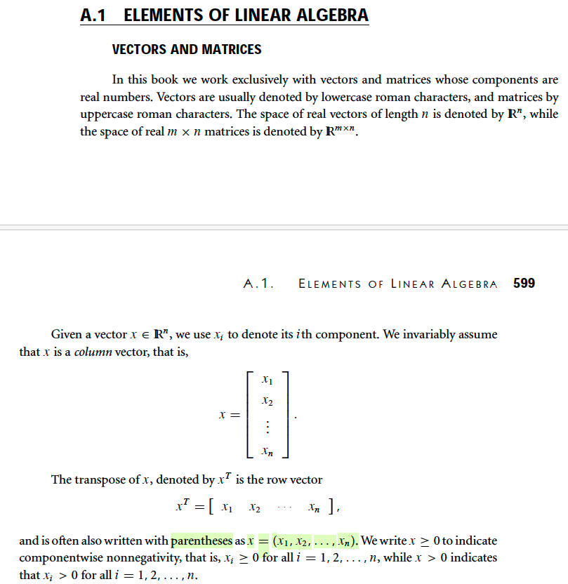

# Appendix A

📊 **Progress:** `1` Notes | `1` Screenshots | `1` AI Reviews

---

<kbd></kbd>

> [!NOTE]
> Khái niệm cơ bản của Đại số tuyến tính: 1. Vector: Mặc định là dạng cột. Để thể hiện dưới dạng hàng, sử dụng ký hiệu 'transpose'. Ký hiệu có thể dùng dấu ngoặc đơn () thay vì ngoặc vuông []. 2. Ma trận: Là một khái niệm cơ bản khác. 3. Cách ký hiệu: Được minh họa chi tiết cho vector.

> [!TIP]
> **🤖 AI Feedback** — ❌ Score: **55/100**
>
> Ghi chú đã nắm bắt tốt các khía cạnh quan trọng về vector như định dạng cột mặc định và cách sử dụng ký hiệu chuyển vị. Tuy nhiên, ghi chú còn thiếu độ sâu về ma trận, các ký hiệu tổng quát cho vector và ma trận, cũng như có một điểm chưa chính xác nhỏ về việc sử dụng ký hiệu ngoặc đơn.

 

