# Chap 3 Line Search Methods

📊 **Progress:** `73` Notes | `100` Screenshots | `55` AI Reviews

---

<a id="node-1lvaz9p"></a>
## Thuật toán chọn độ dài bước

<p align="center"><kbd>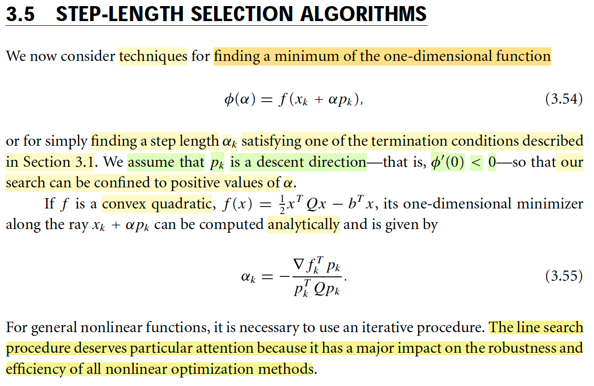</kbd></p>

> [!NOTE]
> Qua phần này ta sẽ nói về các techniques trong cái bước quyết định chiều dài sải bước. (Nhớ lại nhé, chương 3 đang bàn về Line-search, thì ta phải cần tìm pk, hướng đi, mà phần lớn trường hợp là ta cần tìm hướng khiến giảm hàm mục tiêu, dĩ nhiên phải có thêm sải bước phù hợp nữa) Thì ở đây chính là nói về các phương pháp để chọn step length
>
> Thế thì vì đã có direction pk, nên để có step length thì ta sẽ giải bài toán exact line search: minimize hàm đơn biến `φ(α)` `=` f(xk + `αpk)` hoặc đơn giản là tìm step length cho nó thỏa các điều kiện dừng nhờ thuật toán backtracking thôi.
>
> Thêm nữa, nếu giả sử pk đã là descent direction thì việc tất nhiên đạo hàm theo hướng pk tại xk, cũng chính là đạo hàm của `Φ(α)` tại 0 sẽ mang dấu âm, nên khi tác giả nói giá trị tìm kiếm của `α` sẽ được confined bởi giá trị dương của `α` thì ý là ta sẽ yên tâm đi tới mà thôi.
>
> ```text
> Ôn lại chỗ này: d/dα Φ(α) = d/dα f(xk + α pk) = d/d(xk + α pk) f(xk + α pk) ⋅ d/dα (xk + α pk) = ∇f(xk + αpk) ⋅ pk
> ```
>
> hay ghi vầy cho dễ hiểu: `[∇f(x)|x=xk` + `αpk]` ⋅ pk
>
> Cũng chính là directional derivative của f wrt pk evaluate tại xk + `αk.` 
>
> ⇨ directional derivative của f wrt pk tại xk sẽ là
>
> ```text
> [∇f(x)|x=xk] ⋅ pk = ∇f(xk) ⋅ pk, chính là Φ'(α)|α=0
> ```
>
> `====`
>
> Thế thì nếu f là hàm quadratic, có dạng f(x) `=` `(1/2)xTQx` - bTx thì có thể tính ra minimizer
> của nó dọc theo tia xk + `αpk` một cách analytically. Là vầy:
>
> Nhờ MIT 18s096: Không khó để derive ∇f(x) `=` Qx - b
>
> ⇨ Directional derivative của f wrt pk tại xk, cũng là `Φ'(α)` sẽ là:
>
> ∇f(xk + `αpk)Tpk` `=` [Q(xk + `αpk)` - b]Tpk
>
> Để tìm `α` khiến `Φ(α)` nhỏ nhất. Ta cho đạo hàm bằng 0:
>
> [Q(xk + `αpk)` - b]Tpk `=` 0
>
> ⇔ Q(xk + `αpk)Tpk` - bTpk `=` 0
>
> ⇔ Q(xk + `αpk)Tpk` `=` bTpk 
>
> ⇔ Q(xkTpk + `αpkTpk)` `=` bTpk 
>
> ⇔ QxkTpk + `QαpkTpk` `=` bTpk 
>
> ⇔ `QαpkTpk` `=` - QxkTpk + bTpk 
>
> ⇔ `αQpkTpk` `=` - [QxkTpk - bTpk]
>
> ⇔ `αQpkTpk` `=` - [Qxk - b]Tpk
>
> ⇔ `αQpkTpk` `=` - [∇fk]Tpk  (Thay ∇f(xk) `=` Qxk - b)
>
> ⇔ `α` `=` - [∇fk]Tpk `/` QpkTpk
>
> Đây chính là 3.55 trong sách

> [!TIP]
> **🤖 AI Feedback** — ✅ Score: **95/100**
>
> Bài viết thể hiện sự hiểu biết sâu sắc về các thuật toán lựa chọn bước nhảy, đặc biệt là phần giải thích và chứng minh công thức (3.55) một cách chi tiết. Cách trình bày mạch lạc và bổ sung kiến thức nền tảng giúp người đọc dễ dàng nắm bắt.

<br>

<p align="center"><kbd>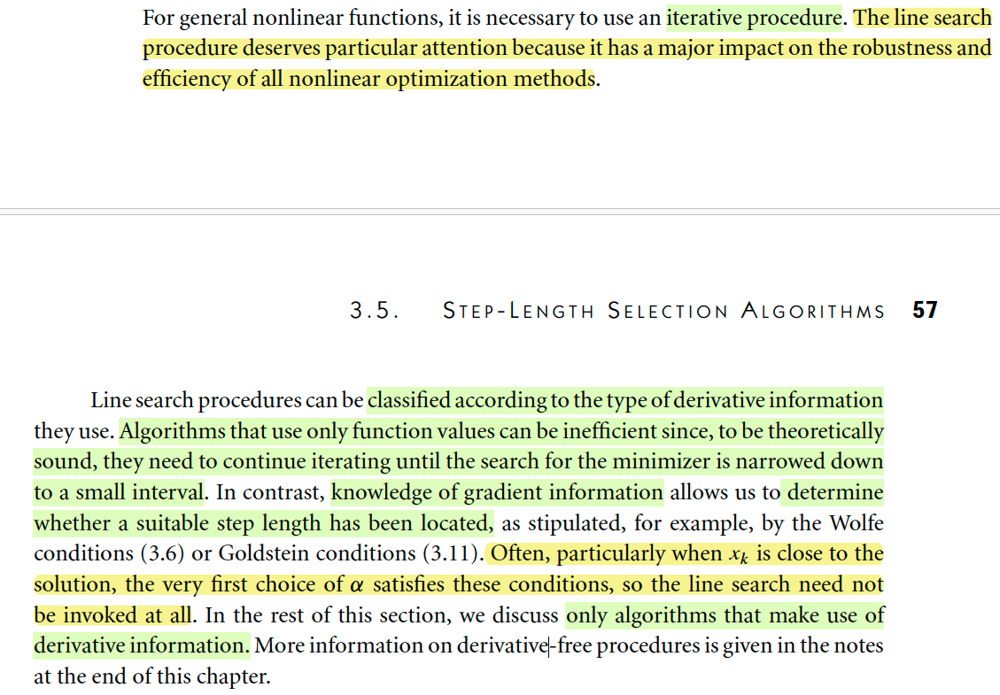</kbd></p>

> [!NOTE]
> Đại ý của đoạn này là muốn nói rằng trong phần lớn những trường hợp đó thì mình phải sử dụng một cách tiếp cận mang tính chất lặp đi lặp lại (iterative approach) khác với ví dụ trên khi mình có thể giải ra nghiệm của bài toán một cách toán học, dùng công thức (analytic). 
>
> Phần này sẽ bàn về những thuật toán giúp làm điều đó, mà thuật toán đó như đã nói sẽ thực hiện cách tiếp cận lặp đi lặp lại dần dần từ từ mình có thể tạm hiểu là dần dần từ từ để tìm ra nghiệm của bài toán, thay vì tìm ra ngay một phát bằng công thức. 
>
> Hiệu quả của những thuật toán như vậy sẽ ảnh hưởng và quyết định đến hiệu quả của thuật toán nói chung. Những quy trình hoặc thuật toán được nói đến hoặc làm việc này có thể phân chia theo loại thông tin đạo hàm mà chúng dùng. Nếu một thuật toán chỉ dùng đạo hàm cấp không (tức là chỉ dùng giá trị của hàm số) thì có thể nó sẽ không hiệu quả, bởi vì về lý thuyết nó sẽ phải lặp lại việc tìm kiếm cho đến khi việc tìm kiếm thu hẹp lại trong một khoảng rất nhỏ. 
>
> Loại thứ hai là nó sử dụng thông tin đạo hàm cấp 1 của hàm số, sẽ cho phép mình xác định được khi nào chiều dài bước phù hợp đã được tính toán để mình có thể dừng hoặc khi điểm mình đang đứng đã rất gần với điểm tối ưu. Thông tin đạo hàm cấp 1 có thể giúp mình quyết định rằng không cần tìm kiếm thêm nữa mà chỉ việc lấy luôn giá trị bước đó. 
>
> Do đó, phần này tác giả nói là mình chỉ bàn đến loại thuật toán sử dụng thông tin đạo hàm cấp 1 mà thôi, không dùng thuật toán không dùng thông tin đạo hàm (tức là thuật toán như loại 1 vừa nói, chỉ dùng giá trị hàm số) bởi vì nó không hiệu quả lắm.

> [!TIP]
> **🤖 AI Feedback** — ⚠️ Score: **75/100**
>
> Bài phân tích đã nắm bắt được các ý chính và có độ sâu tương đối. Tuy nhiên, bạn chưa làm nổi bật đủ tầm quan trọng cụ thể của "line search procedure" ở đoạn mở đầu. Thêm vào đó, việc đưa ra so sánh với "cách giải analytic" không có trong văn bản gốc và cần tránh khi tóm tắt. Lời văn cần chính xác hơn khi diễn giải chi tiết "line search need not be invoked at all" để phản ánh đúng mức độ hoàn toàn tránh khỏi việc thực hiện quy trình tìm kiếm đường thẳng.

<br>

<p align="center"><kbd>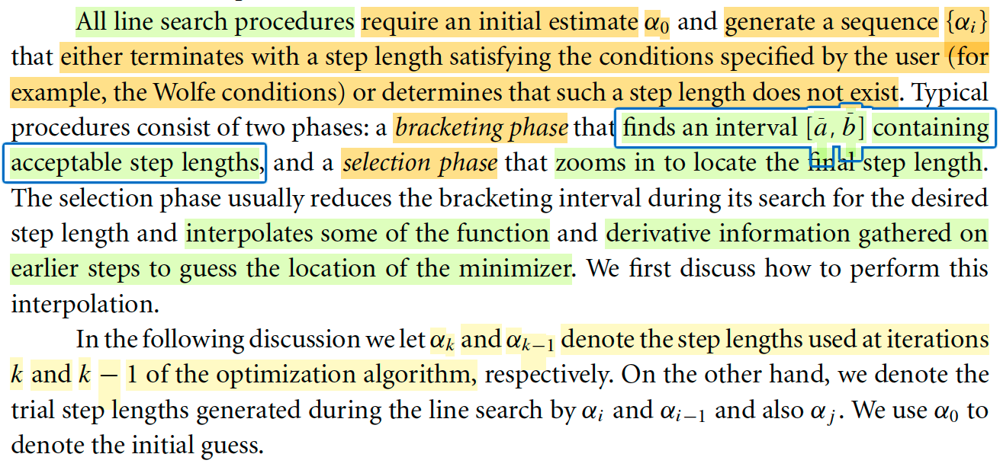</kbd></p>

> [!NOTE]
> Rồi, cái phần này đại khái nói rằng là mọi cái thuật toán line search á, cái từ tiếng Anh là line search procedure đó. Nó đều yêu cầu phải có một cái điểm bắt đầu. Một cái estimate, một cái initial estimate tức là một cái giá trị ước đoán, một cái giá trị ước đoán ban đầu nào đó `α0.` Và từ đó như đã nói đây là cái iterative approach, cho nên nó sẽ cái thuật toán nó sẽ lập đi lặp lại cái việc tính toán để nó tìm ra một chuỗi những cái giá trị `αj.` Sao cho là nó sẽ đạt yêu cầu khi mà nó thỏa một cái condition nào đó, một cái điều kiện nào đó. Thì cái điều kiện này có thể được chỉ định bởi bởi người người dùng. Ví dụ như là Wolf condition hoặc là nó cũng sẽ có thể dừng khi mà nó xác định được là cái step plan không có tồn tại. Thì một cái thuật toán điển hình nó sẽ bao gồm có hai giai đoạn. Giai đoạn thứ nhất nó có tên tiếng Anh gọi là bracketing phase. Mình tạm dịch tiếng Việt gọi là một cái giai đoạn mang tính chất là đóng khung. Nhiệm vụ là mình sẽ tìm ra một cái khoảng AB mà mình tin rằng ở trong đó nó sẽ chứa cái giá trị alpha mà mà có thể chấp nhận được. Nó giống như mình khoanh vùng vậy đó. Và cái giai đoạn thứ hai là giai đoạn tên tiếng Anh là selection phase là giai đoạn lúc đó mình mới bắt đầu mới mới mới zoom vào ở trong cái cái cái cái vùng mà mình đã khoanh đó để tìm ra cái giá trị cuối cùng. 
>
> Và cái cách làm của cái giai đoạn selection phase thường sẽ là nó giảm, nó sẽ liên tục nó giảm cái bracketing interval tức là giảm cái khoanh vùng lại. Và bằng cách đó nó sẽ tìm kiếm ra cái step length, cái chiều dài sải bước phù hợp. Nói chung còn nhắc đến một số bước ví dụ như interpolate một số cái function và thông tin về đạo hàm của có được nhờ các cái bước trước đó để mà dự đoán cái vị trí của minimizer thì mình tạm hiểu là cái bước selection phase này nó sẽ làm cái chuyện đó. Thông thường một cách điển hình thì nó sẽ thu hẹp cái interval bracket lại và nó sử dụng cái thông tin đạo hàm ở những cái bước trước đó để nó dự đoán ra cái vị trí của minimizer. Cụ thể thế nào thì phần sau người ta sẽ nói, rồi cái đoạn cuối cùng thì người ta nói về một số cách ký hiệu, ví dụ alpha K và alpha K-1 là nó chỉ cái sải bước ở cái bước iteration thứ K và thứ K-1.

> [!TIP]
> **🤖 AI Feedback** — ⚠️ Score: **75/100**
>
> Phần giải thích các khái niệm cốt lõi về quy trình tìm kiếm đường và hai giai đoạn của nó rất rõ ràng và chính xác. Tuy nhiên, phần trình bày về các ký hiệu ở cuối bài còn chưa đầy đủ, bỏ sót việc mô tả các bước thử nghiệm và tầm quan trọng của ước đoán ban đầu trong ngữ cảnh ký hiệu. Ngoài ra, việc dùng "step plan" thay cho "step length" và đồng nhất chuỗi $\alpha_i$ với các giá trị $\alpha_j$ là chưa chuẩn xác.

<br>

<a id="node-0wgi08b"></a>
- **Interpolation**
<p align="center"><kbd>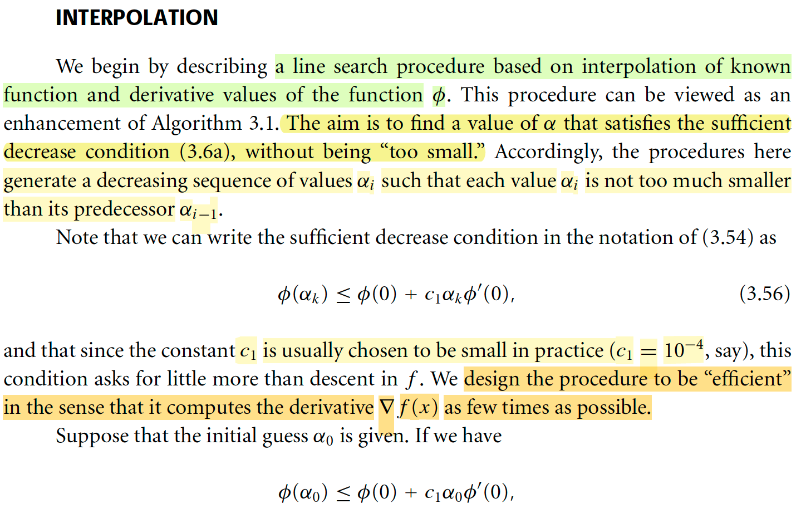</kbd></p>

<p align="center"><kbd>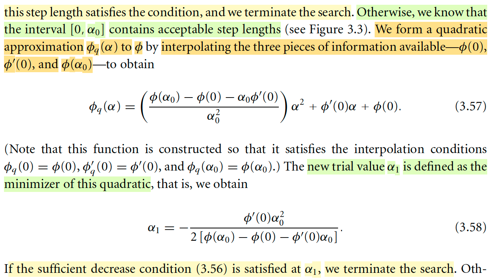</kbd></p>

> [!NOTE]
> Đầu tiên sẽ nói về một thuật toán line search (nhắc lại nhé, phần này là nói về cái "khúc" chọn step-length, sau khi đã có direction pk) mà dựa vào nội suy (interpolation) từ giá trị function đã biết cũng như giá trị của đạo hàm.
>
> Mục tiêu của nó là tìm ra `α` thỏa sufficient decrease condition (điều kiện giảm đủ, còn gọi là Armijo) và đồng thời không được quá nhỏ. Do đó, quy trình này sẽ tạo ra các step size `αi` nhỏ dần sao cho cái sau không quá nhỏ so với cái trước.
>
> ```text
> Thế thì, ôn lại về điều kiện Armijo: Story của nó là: Từ xk, nơi mà ta đang có độ dốc (dĩ nhiên theo hướng pk) là ∇fkTpk, cũng là Φ'(0). Ta sẽ giảm bớt độ dốc bằng constant c1, để rồi có hàm tuyến tính g(α) = g(0) + αc1∇fkTpk, hay độ giảm theo α của hàm tuyến tính này sẽ là Δg = g(0) - g(α) = αc1∇fkTpk.
> ```
>
> Và ta muốn độ giảm của hàm f khi đi theo hướng pk ít nhất cũng phải được như vậy:
>
> Độ hàm f khi bị giới hạn theo hướng pk: `Φ(α)` `=` f(xk + `α` pk)
>
> ⇨ độ giảm hàm f theo hướng pk, tính theo `α:` f(xk) - f(xk + `α` pk)
>
> Từ đó ta có: f(xk) - f(xk + `α` pk) ≥ - `αc1∇fkTpk.` Đây chính là Sufficient decrease condition.
>
> Thế thì quay lại đây, như tác giả nói rằng ta có thể thể hiện theo Φ:
>
> ```text
> f(xk) = Φ(0), f(xk + α pk) = Φ(α),
> ```
>
> và ∇fkTpk thì chính là Φ'(0) như trên đã nói, nên ta có:
>
> Φ(0) - `Φ(α)` ≥ - `αc1` Φ'(0)
>
> ⇔ Φ(0) + `αc1` Φ'(0) ≥ `Φ(α)`
>
> ```text
> Hay với α là αk: Φ(0) + αkc1 Φ'(0) ≥ Φ(αk)
> ```
>
> `====`
>
> Rồi, thế thì thuật toán (hay quy trình, procedure) sẽ làm như sau: Đầu tiên, nếu mà ngay tại giá trị khởi đầu `α0` mà nó đã thỏa sufficient decrease condition, tức là:
>
> Φ(0) + `α0c1` Φ'(0) ≥ `Φ(α0)` 
>
> thì đương nhiên ta sẽ dừng ngay, chọn `α0` làm step size.
>
> Nhưng nếu như không thỏa, thì sao, thì có thể dễ thấy rằng, cái đoạn [0, `α0]` nhất định chứa một `α` thỏa điều kiện dừng. Lí do là vì: Trong phần nói về cái này, thì ta có một hình minh họa mà trong đó mình đã phân tích và hiểu được điều này: Xét theo phương pk, thì  hàm f là một đường cong và độ dốc tại xk nó dốc xuống lớn hơn độ dốc của hàm tuyến tính do hàm tuyến tính đã được điều chỉnh độ dốc bởi c1. Mà hàm tuyến tính thì sẽ kéo dài mãi mãi xuống -inf, còn hàm f thì có điều kiện bị chặn dưới nên nó không thể kéo mãi xuống -inf. Nôm na là phải có điểm nào đó mà hàm f đi lên, và dẫn đến phải cắt hàm tuyến tính và đó chính là điểm mà độ giảm của hàm f bằng độ giảm của hàm tuyến tính. Gọi là `α'`
>
> ```text
> Thế thì, cái điểm đó sẽ tạo ra một khoảng từ điểm bắt đầu đến đó, mà trong đó hàm f đi xuống nhiều hơn hàm tuyến tính. Thế thì, nếu như α0 mà không thỏa, chứng tỏ nó không nằm trong khoảng này, mà nó xa hơn điểm giao đó. Do đó α' nhất định phải nằm trước đó, và đồng nghĩa những giá trị α thỏa điều kiện dừng phải nằm trước α0 hay nằm cũng chính là trong [0, α0].
> ```
>
> ```text
> Rồi, vậy thì tiếp theo ý tưởng sẽ là: Dùng các thông tin đã biết: Φ(0), tức giá trị f tại xk, Φ(α0) (vì đã tính thì mới check được ở bước trên) và Φ'(0). Để làm như sau, dựa trên ý tưởng là vầy: Ta dựng một parabol, một hàm bậc hai sao cho nó đi qua A: tại α = 0, mang giá trị Φ(0), và B: là tại α0, mang giá trị Φ(α0) và độ dốc tại A tức α = 0 là Φ'(0), thì ta sẽ tìm xem cái minimum của nó ở đâu, và lấy α đó.
> ```
>
> ```text
> Thế thì phương trình hàm quadratic có dạng khái quát là Φq(α) = aα^2 + bα + c
> ```
>
> ```text
> Để nó thỏa Φq(0) = Φ(0). Φq(α) = Φ(α0), và Φ'q(α)|α=0 = Φ'(0) ta có:
> ```
>
> ```text
> Φq(0) =  a × 0^2 + b × 0 + c = c = Φ(0) ⇔ c = Φ(0)
> ```
>
> ```text
> Φq(α) = Φ(α0) ⇔ a × α^2 + b × α + Φ(0) = Φ(α0)
> ```
>
> ```text
> Φ'q(α)|α=0 = Φ'(0) ⇔ 2aα + b = Φ'(0)
> ```
>
> ```text
> Nói chung là giải ra ta sẽ có a = [Φ(α0) - Φ(0) - α0 Φ'(0)] / (α0)^2
> ```
>
> b `=` Φ'(0), c `=` c `=` Φ(0)
>
> ⇨ `Φq(α)` như công thức 3.57
>
> ```text
> Và từ đó, giải tìm α khiến minimize Φq(α) (không khó khăn gì, cho Φ'q(α) = 0 là ra)
> ```
>
> → ta sẽ gán nó cho `α1.`
>
> Có nghĩa là: Cách làm này nôm na là: Ta đứng ở vạch (xk, `α` `=` 0). Chọn sải bước `α0.` Thấy chưa đạt, cụ thể là chưa xuống đủ nhiều. Thì ta biết hàm f trong quãng trước đó nó đã cong xuống và cong lên. Nên ta phải dự đoán một điểm nào đó ở trước đó. Thế thì cách làm đang bàn ở đây là ta coi như là nó là hàm bậc hai, để tìm cái điểm mà hàm bậc hai nó xuống thấp nhất làm dự đoán. 
>
> Rồi, nếu tại `α1` mà nó thỏa điều kiện giảm đủ thì dừng.

> [!TIP]
> **🤖 AI Feedback** — ✅ Score: **95/100**
>
> Bài viết của bạn thể hiện sự hiểu biết vượt trội, với các giải thích sâu sắc và đạo hàm chi tiết, thể hiện rõ ràng sự nắm vững kiến thức. Tuy nhiên, bạn đã bỏ sót một điểm quan trọng mà tác giả nhấn mạnh là mục tiêu "hiệu quả" của thuật toán trong việc giảm thiểu tính toán đạo hàm.

<br>

<p align="center"><kbd>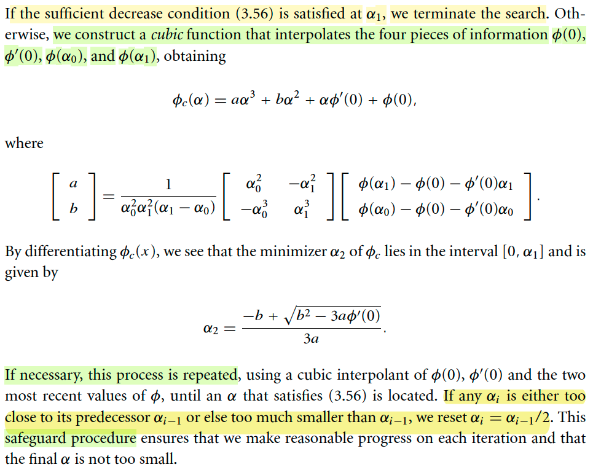</kbd></p>

> [!NOTE]
> Rồi thì đại khái cái đoạn này nói rằng nếu như mà tại `α1` mà nó vẫn không thỏa điều kiện giảm đủ thì lập luận lại tương tự. Ta kết luận rằng là cái giá trị `α` khiến thỏa điều kiện dừng nó nằm ở phía trước đó. 
>
> Như vậy là mình phải đoán một cái điểm hoặc là một cái giá trị `α` nhỏ hơn ở trước đó, ở trước `α1.` Và cách đoán bây giờ tương tự như hồi nãy. Khi mà mình có giá trị hàm số tại điểm bắt đầu Φ(0) nè, mình có giá trị đạo hàm hàm số tại điểm `Φ(α0)` nè và độ dốc của cái hàm số tại tại điểm bắt đầu Φ'(0) thì mình mới dựng một cái parabol, dựng một cái hàm bậc hai. 
>
> Thì bây giờ mình có giá trị hàm số tại thêm một tại một điểm nữa đó là giá trị hàm số tại `α1.` Do đó là mình sẽ dựng một cái hàm bậc 3. 
>
> Giống như mình có ba điểm mình dựng một cái hàm parabol, một cái hàm bậc hai thì nó sẽ ít chính xác hơn là mình có bốn điểm để mình dựng một cái hàm bậc 3. 
>
> Do đó là mình sẽ dựng một hàm bậc ba và mình** cũng sẽ giải tìm cái cái cái cái minimize tìm cái điểm cực tiểu** và mình sẽ** lại kiểm tra cái giá trị cái cái điều kiện dừng tại cái điểm alpha đó**. Tức là mình có được cái alpha 2. 
>
> Và có một điểm chú ý là nếu như mà mình có thể nếu mà nó không thỏa thì mình lại lặp lại chuyện đó tiếp. Nhưng không phải là dựng hàm bậc 4, mà vẫn là hàm bậc 3, chỉ là lấy hai điểm gần nhất ví dụ như để tìm `α5` thì ta sẽ dùng thông tin Φ(0), `Φ(α3),` `Φ(α4),` Φ'(0) để dựng cubic function
>
> Một cái điểm chú ý đó là nếu như mà cái **giá trị alpha tính toán ra đó nó quá nhỏ**, hoặc là nó **quá sát với cái giá trị alpha trước đó** thì mình sẽ **gán cứng nó bằng alpha trước đó chia 2**. Mục đích là mình mình mình có một cái cơ chế bảo vệ là khiến cho cái alpha cuối cùng nó không quá nhỏ.

> [!TIP]
> **🤖 AI Feedback** — ⚠️ Score: **70/100**
>
> Bài làm cho thấy sự hiểu biết tốt về quy trình lặp lại và cơ chế bảo vệ, nhưng mắc lỗi cơ bản trong việc xác định loại hàm nội suy và các thông tin đầu vào ban đầu.

<br>

    <a id="node-qjezt4u"></a>
    - **Cubic interpolation**
<p align="center"><kbd>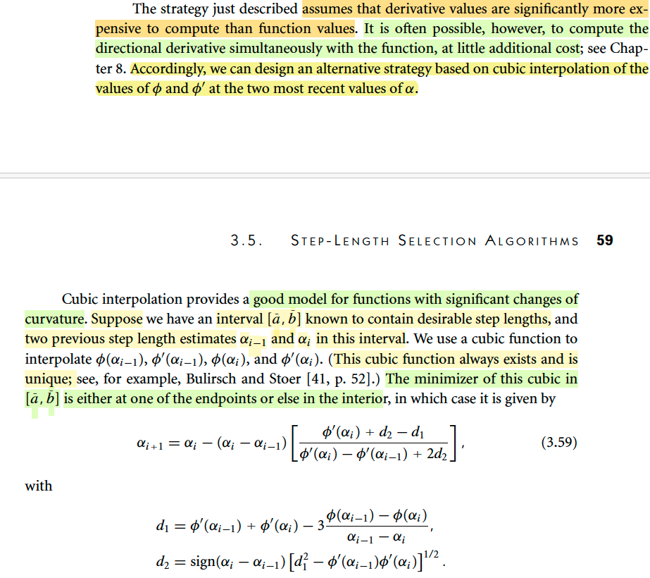</kbd></p>

<p align="center"><kbd>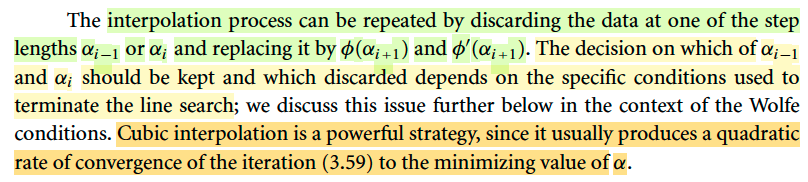</kbd></p>

> [!NOTE]
> Rồi, đại ý đoạn này là thế này: Đó là nói cái phương pháp trên, nơi mà ta chỉ interpolate bằng quadratic hay cubic function với thông tin đạo hàm tại 0, tức Φ'(0), giá trị hàm f tại 0, `αk-1,` và (có thể là k-2). Thì thật ra ta đang giả sử là việct tính đạo hàm hàm Φ tại các điểm như `αk-1,` `αk` nó tốn kém quá so với tính giá trị hàm số. 
>
> Nhưng một số trường hợp thì không như vậy, trong đó tính đạo hàm theo hướng tại của f không quá tốn kém (tức là tính `Φ'(αk)` ko quá tốn kém). Thì khi đó ta có thể dùng thêm thông tin độ dốc hàm Φ tại `αk-1,` `αk` để mà dựng (interpolate) hàm cubic có độ chính xác tốt hơn là cách hồi nãy.
>
> Và cũng y như cách trước, ta cũng tìm minimizer. Và với hàm cubic thì nó có thể là nằm ở trong (interior) hoặc nằm ở biên.
>
> Nói chung cách làm vẫn là dựng hàm cubic, tìm minimizer, check điều kiện dừng.
>
> Cách làm này mô phỏng tốt hơn các hàm số mà có sự thay đổi đáng kể về độ cong.
>
> Có nói sơ về cách làm chi tiết nhưng ta có thể nghiên cứu kĩ hơn sau.
>
> Một ý đáng chú ý là, cubic interpolation là một chiến thuật khá mạnh mẽ, có thể tạo ra tốc độ hội tụ bậc hai.

> [!TIP]
> **🤖 AI Feedback** — ❌ Score: **68/100**
>
> Phần mở đầu đã nhầm lẫn về bối cảnh của "phương pháp vừa mô tả", gán nhầm đặc điểm của một chiến lược trước đó cho phương pháp nội suy cubic này. Sinh viên cũng bỏ sót chi tiết cốt lõi về việc nội suy cubic cần thông tin giá trị hàm và đạo hàm tại hai điểm để xác định duy nhất.

<br>

      <a id="node-u0gi9ob"></a>
      - **Initial Step Length**
<p align="center"><kbd>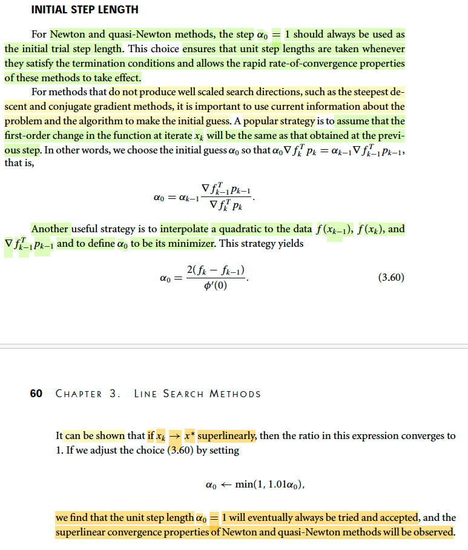</kbd></p>

> [!NOTE]
> Qua phần này, ta bàn về cách chọn giá trị khởi đầu của step length: `α0`
>
> Cần nhớ lại một chút, câu chuyện sẽ là: Thuật toán sẽ lặp lại nhiều iteration. Để đi từ x0 → x1 → x2 ...→ xk-1 → xk. Thì trong mỗi iteration, ta phải làm hai việc: Xác định direction, và step-length. Xét iteration k (từ xk, đang tìm cách đến xk+1), giả sử ta đã có direction pk, và ta bắt đầu giải bài toán tìm step-length phù hợp (theo tiêu chí nào đó ví dụ như sufficient decrease condition)
>
> ```text
> Trong bước này, ta lại giải một bài toán tối ưu nhỏ, tức là cũng từ α0 (nếu thích thì có thể ghi αk_0, ý nói đây là đang tìm step-length của iteration thứ k, và αk_0 là initial value. Và ở đây đang bàn đến việc chọn αk_0 thế nào cho hợp lý.
> ```
>
> ```text
> Thế thì, đầu tiên, tác giả cho rằng nếu mà ta đang dùng Newton hoặc quasi-Newton method thì cứ chọn αk_0 bằng 1. Vì sao? Vì để phòng ngừa trường hợp quá trình tối ưu đã rơi vào giai đoạn Newton phase (trong tối ưu lồi mình đã học, khi tiến tới đủ gần optimal thì Newton method sẽ converge rất nhanh với tốc độ bậc hai - quadratic convergence) khi đó thuật toán sẽ lấy / chấp nhận full Newton step, tức vector Newton step tính ra bao nhiêu là lấy bấy nhiêu. Nếu mà ta không chọn bắt đầu với 1 thì có thể làm lãng phí ưu điểm này của Newton / quasi Newton method.
> ```
>
> Rồi, nếu phương pháp là steepest gradient descent hay conjugate method thì tác giả cho rằng cần phải sử dụng current information: HIểu đại ý là ví dụ như mình đang đứng tại B (xk) và tìm cách đi đến C (xk+1), thì tại A mình đang có thông tin tại đó, có thể là giá trị đạo hàm hoặc hàm số tại đó, và ta sẽ tận dụng thông tin này để tính toán.
>
> Và một cách làm phổ biến là người ta giả định rằng mức thay đổi bậc một của hàm số tại xk cũng sẽ bằng với tại xk-1: Ý này hiểu nôm na là: 
>
> Ta đã biết 1st order approximation (linear approximation) của f: Đi từ x0 → x nếu x ≈ x0 ta sẽ có:
>
> f(x) ≈ f(x0) + ∇f(x0)T(x-x0)
>
> (sẵn ôn lại, cái này chỉ là từ Taylor theorem nói rằng:
>
> f(x) `=` f(x0) + ∇f(ξ)T(x-x0) for some ξ in [x0, x]
>
> cũng là f(x) `=` f(x0) + ∇f(x0 + t(x - x0))(x - x0) for some t in [0,1]
>
> Với x gần x0 thì ta có thể xấp xỉ ∇f(x0 + t(x - x0)) ≈ ∇f(x0) để có linear approximation: f(x) ≈ f(x0) + ∇f(x0)T(x-x0))
>
> Áp dụng vào 
>
> f(xk) ≈ f(xk-1) + ∇f(xk-1)T(xk-xk-1)
>
> ```text
> Độ giảm tại step k: Δf_k =  ∇f(xk-1)T(xk - xk-1) = ∇f(xk-1)Tpk-1αk-1
> ```
>
> f(xk+1) ≈ f(xk) + ∇f(xk)T(xk+1 - xk)
>
> Độ giảm tại step k+1: `Δf_k+1` ≈ `∇f(xk)Tpkαk`
>
> Assum độ giảm bậc 1 bằng nhau: 
>
> `∇f(xk-1)Tpk-1αk-1` `=` `∇f(xk)Tpkαk`
>
> ```text
> ⇨∇f(xk-1)Tpk-1αk-1 / ∇f(xk)Tpk = αk
> ```
>
> Và với assumption này thì người ta cho giá trị ban đầu của `αk,` tức `αk_0` là bằng như vậy. Do đó ta có công thức 
>
> ```text
> α0 (hiểu là αk_0) = ∇f(xk-1)Tpk-1αk-1 / ∇f(xk)Tpk
> ```
>
> `====`
>
> ```text
> Một chiến thuật khác là là dùng interpolation to quadratic: Với việc đã biết f(xk-1), f(xk) và ∇f(xk-1)T(pk-1) (tức là directional derivative wrt pk-1 tại xk-1). Nếu như gọi xk-1 là B, xk là A, pk-1 là xk - xk-1 là vector từ A → B, thì ∇f(xk-1)T(pk-1) chính là độ dốc theo hướng A→B của hàm f. Hình dung ta có hàm f bị giới hạn theo hướng AB sẽ như hàm đơn biến, nó đi điểm A, B và biết độ dốc tại A. Ta sẽ xấp xỉ / coi nó là hàm bậc hai. Và đi tìm điểm cực tiểu. (Xem hình minh họa) và đó chính là αk_0, giá trị khởi điểm cho αk
> ```
>
> ```text
> Cách dựng hàm bậc hai thì cũng như đã biết ở phần trước, là ta đặt hàm g(α) = aα^2 + bα + c
> ```
>
> Cho nó đi qua xk-1, xk:
>
> ```text
> Đi qua xk-1: tức là ứng với α = 0 ta có g(0) = f(xk-1) ⇔ c = f(xk-1)
> ```
>
> ```text
> Đi qua xk: tức là ứng với α = αk-1, pk-1, g(αk-1) = f(xk) ⇔ aαk-1^2 + bαk-1 + c = f(xk)
> ```
>
> ```text
> Độ dốc tại xk-1: g'(0) = ∇f(xk-1)Tpk-1 = 2a × 0 + b = b ⇨ b = ∇f(xk-1)Tpk-1. viết là Φ'(0) cho gọn
> ```
>
> Thay 1, 3 vào 2:
>
> `aαk-1^2` + `bαk-1` + c `=` f(xk)
>
> ⇔ `aαk-1^2` + `Φ'(0)αk-1` + f(xk-1) `=` f(xk)
>
> ⇔ `aαk-1^2` `=` f(xk) - f(xk-1) - `Φ'(0)αk-1`
>
> ```text
> ⇔ a = [f(xk) - f(xk-1) - Φ'(0)αk-1] / αk-1^2
> ```
>
> ```text
> minimizer của hàm g là solution của g'(α) = 0: 2aα + b = 0 ⇔ α = -b/2a
> ```
>
> Thế a, b vào:
>
> ⇔ `α` `=` `-b/2a` 
>
> ```text
> = - Φ'(0) / 2 {[f(xk) - f(xk-1) - Φ'(0)αk-1] / αk-1^2}
> ```
>
> ```text
> = [- Φ'(0) αk-1^2] / 2 [f(xk) - f(xk-1) - Φ'(0)αk-1]
> ```
>
> Đây là công thức đúng, nhưng trong sách đang nói về một công thức khác một chú:
>
> Đại khái là ta sẽ dựng parabol đi qua A (xk-1, f(xk-1)), có độ dốc Φ'(0) nhưng có đáy cùng với độ cao của f(xk). Và giải tìm `α` minimizer đó để dùng cho `αk_0.` Nhìn hình là hiểu ngay thôi.
>
> Có nghĩa là cách 1 ở trên là ta dựng parabol Đi qua (xk-1, f(xk-1)), (xk, f(xk), và có độ dốc Φ'(0) và tìm minimize. Còn cách 2 là dựng parabol đi qua (xk-1, f(xk-1)), có giá trị cực tiểu `=` f(xk), có độ dốc Φ'(0), và đi tìm minimizer. Việc cho ra công thức như sách cũng đơn giản. Ta sẽ quay lại sau.
>
> Đại khái khúc cuối nói rằng: 
>
> ```text
> Nếu như sự hội tụ về x* diễn ra với tốc độ siêu tuyến tính. Thì cái tỉ số trên, tức 2(fk - fk-1)/Φ'(0) hội tụ về 1. Thì sau khi tham khảo thằng Gemini, mình hiểu rằng cái này sẽ kiểu như là điều này có thể khiến α dần dần rất gần 1 nhưng chưa phải là 1. Trong khi đó, nếu mà là 1 thì mới tốt. Thì một mẹo đó là gán α0 = min(1, 1.01 × α0). Hiệu quả tạo ra là nếu α chưa gần 1 thì nó vẫn dùng giá trị như đã tính. Nhưng nếu nó đã gần 1 thì nó sẽ thành 1 luôn (thay vì cứ tiến dần tới 1)
> ```
>
> ```text
> Gemini nó nói là, như vậy thì ta có thể dùng cả cách làm này cho Newton method: Tức là nếu thích thì cứ cho α0 = 1, thì ưu điểm là nếu đã vào giải đoạn Newton phase thì ta có full Newton step, nhưng cái dở là nếu chưa thì α0 = 1 sẽ luôn bị điều kiện dừng reject và ta phải thử lại. Cách hai là ta dùng công thức này, nó dùng thông tin current position nên khả năng tìm ra α tốt sẽ nhanh hơn. Và với cái mẹo vừa nói thì khi qua Newton phase thì ta vẫn có full step.
> ```

> [!TIP]
> **🤖 AI Feedback** — ⚠️ Score: **85/100**
>
> Phần dẫn xuất công thức α₀ từ giả định thay đổi bậc một có sự nhầm lẫn khái niệm giữa α₀ (giá trị khởi tạo) và αk (chiều dài bước thực tế), cần làm rõ hơn. Tuy nhiên, khả năng phân tích sâu sắc, nhận diện sự khác biệt giữa các công thức và đề xuất giải thích hợp lý cho công thức sách ở phần nội suy bậc hai là cực kỳ xuất sắc và đáng khen ngợi.

<br>

        <a id="node-umkxucl"></a>
        - **A line search algorithm for Wolfe condition**
<p align="center"><kbd>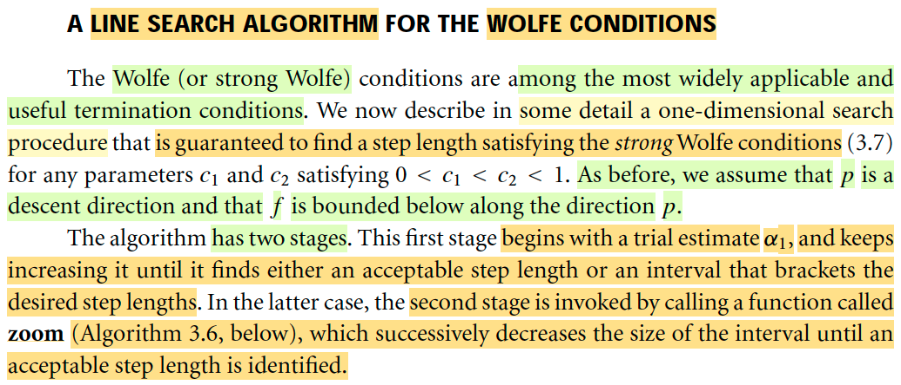</kbd></p>

> [!NOTE]
> ```text
> Phần này sẽ nói về thuật toán tìm αk đây (phần vừa rồi là nói về cách chọn giá trị khởi điểm của αk, tức αk_0, và nếu đều hiểu là đây là bước tìm step size của iteration k'th thì ta chỉ cần gọi α0 được rồi, vì ta cũng sẽ iterate để tìm ra α thỏa)
> ```
>
> Từ phần trước (xem link) ta đã biết Wolfe condion và strong Wolfe condition, ôn lại một xíu:
> Wolfe condition bao gồm điều kiện giảm đủ (sufficient decrease, còn gọi là Amijo condition) mà ý tưởng là yêu cầu hàm f khi đi theo hướng pk với sải bước `αpk` phải giúp có một độ giảm ít nhất là bằng độ giảm của một hàm tuyến tính với độ dốc bằng độ dốc của hàm f tại điểm đầu nhưng điều chỉnh bớt bởi hằng số c1
>
> f(xk + `αkpk)` ≤ f(xk) + c1 `αk` ∇fkTpk (**Armijo**)
>
> Còn điều kiện thứ hai của Wolfe condition là "curvature condition": Ý tưởng là muốn khi bước tới điểm mới với step size đó (step size đang muốn check) thì hàm số phải có bớt dốc hơn so với độ dốc tại ban đầu đã điều chỉnh. Nói rõ hơn chút: Giả sử độ dốc ban đầu (Φ'(0) là -10, thể hiện trạng thái "rất dốc", ta sẽ điều chỉnh bằng hệ số 0.5 thành -5 (ví dụ thôi nhé) thì khi đó, giả sử dùng step size `α` để đến được điểm mới, mà tại đó độ dốc là -7. Thì con số này nó chưa lớn hơn -5. Và điều này mang ý nghĩa báo hiệu rằng hàm số vẫn còn đang rất dốc, và có thể còn giảm hơn nữa, do đó ta có thể chọn `α` lớn hơn, để đi xa hơn. 
>
> Thế rồi gỉa sử với một giá trị `α` khác, giúp đến được điểm mà tại đó độ dốc là -4, lúc này đã lớn  hơn -5, **báo hiệu tại đây hàm số đã bớt dốc rồi, nếu đi xa hơn nữa có thể không giảm được thêm bao nhiêu mà còn có nguy cơ vượt lố qua cực tiểu α***, nên dừng được rồi.
>
> ∇f(xk + `αkpk)Tpk` ≥ c2 ∇fkTpk
>
> Và để phòng tránh trường hợp `α` thỏa điều kiện trên nhưng có thể bao gồm cả giá trị dương thể hiện hàm số đã bắt đầu dốc lên, đồng nghĩa đã đi quá lố `α*,` thì người ta** đưa thêm điều kiện để không chế không độ dốc trở nên lớn**. Đây là **strong curvature condition**.
>
> |∇f(xk + `αkpk)Tpk|` ≤ c2|∇fkTpk| 
>
> Thì Armijo + Curvature condition `=` Wolfe
>
> Armijo + strong Curvature condition `=` strong Wolfe.
>
> Vậy thì ở đây, ta sẽ bàn về một thuật toán nhằm đảm bảo là ta sẽ có được `α` thỏa strong Wolfe condition.
>
> Nó có hai bước: 
>
> Bước 1 là bắt đầu với việc **estimate `α1,` và tăng dần lên cho đến khi nó có được step length chấp nhận được** hoặc là **có được một khoảng `/` khoanh vùng** (bracket)
>
> Bước hai sẽ là **giai đoạn "zoom", tức là dựa trên vùng tìm kiếm ở bước 1, ta sẽ đi tìm giá trị α**

> [!TIP]
> **🤖 AI Feedback** — ⚠️ Score: **85/100**
>
> Ghi chú của bạn giải thích rất chi tiết và chính xác về các điều kiện Wolfe, cung cấp nền tảng vững chắc cho thuật toán. Tuy nhiên, mô tả về giai đoạn "zoom" thứ hai còn thiếu một chi tiết quan trọng: thuật toán giảm dần kích thước của khoảng tìm kiếm để xác định độ dài bước chấp nhận được.

<br>

          <a id="node-tvwgggg"></a>
          - **Thuật toán tìm alpha giúp thỏa strong Wolfe conditions**
<p align="center"><kbd>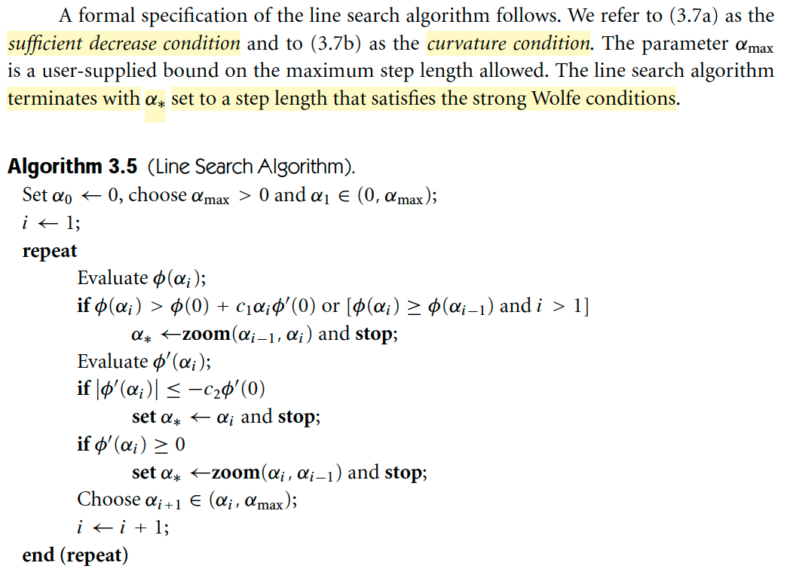</kbd></p>

<p align="center"><kbd>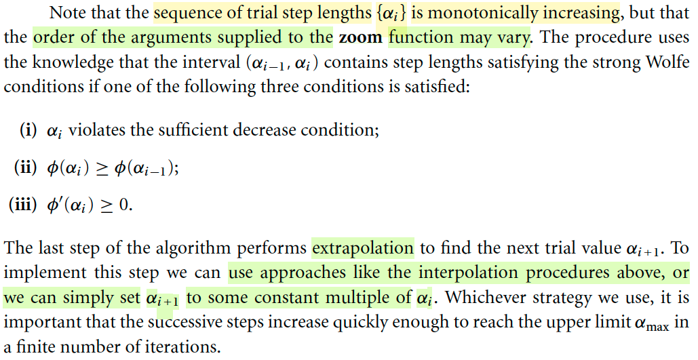</kbd></p>

> [!NOTE]
> Cùng phân tích để hiểu thuật toán này:
>
> ```text
> Đầu tiên có thể thấy ta sẽ gán α0 = 0. Và chọn αmax, cũng như là α1. Bước chọn này có thể là do kinh nghiệm hoặc một thủ thuật nào đó.
> ```
>
> Gán i `=` 1
>
> Chạy vòng lặp, trong đó ta sẽ:
>
> Tính `Φ(αi)`
>
> ```text
> Check điều kiện để chạy giai đoạn zoom và thoát. Có nghĩa là, nếu điều kiện này thỏa, ta sẽ đem hai giá trị αi-1 và αi đem qua thuật toán zoom để nó tính ra / tìm ra α*. Còn không thỏa thì tiếp tục. Vậy thì điều kiện là gì:
> ```
>
> Ta thấy nó check một trong hai case sau có thỏa không:
>
> ```text
> 1) Φ(αi) > Φ(0) + c1 αi Φ'(0): À, đây là điều kiện giảm đủ, nếu cái này đúng thì tức là tại αi thì hàm số đã cao hơn hàm tuyến tính, nên nó đã vi phạm điều kiện giảm đủ, do đó, nhất định giá trị α phù hợp phải nằm đâu đó trước đó, ta sẽ đem hai cái điểm αi-1 và αi đi soi kĩ (zoom). Ví dụ điều này xảy ra ngay tại α1 thì ta sẽ đem α0 = 0 và α1 đi soi, tức là tìm trong [0, α1].
> ```
>
> 2) `Φ(αi)` ≥ `Φ(αi-1)` và i > 1: Đây chính là hiện tượng hàm f đang tăng lên, thay vì giảm xuống, rõ ràng cũng cho thấy ta đã đi lố qua `α*.` Phải dừng, và đem đi soi.
>
> ```text
> Và bước soi (zoom) sẽ nói sau, giúp tìm ra α tốt nhất. Mình hiểu α* ở đây chỉ là α thỏa điều kiện strong Wolfe, như mục đích của thuật toán này chứ không phải là α khiến minimize hàm Φ(α).
> ```
>
> Rồi, thế thì nếu bước check trên không thỏa, ta sẽ tính giá trị đạo hàm tại `αi.`
>
> ```text
> Và check |Φ'(αi)| ≤ -c2 Φ'(0), nếu thỏa thì chọn ngay α* là αi và dừng: Bước này là sao? Có thể thấy nếu thỏa ở đây chính là thỏa strong curvature condition. Cùng với việc nó thoát được cái cửa trên, tức thỏa Amijo. Có nghĩa là αi này đã thỏa strong Wolfe → Đúng yêu cầu, chốt và thoát.
> ```
>
> Nếu cái trên chưa thóat, tức là chưa thỏa strong Wolfe, ta sẽ check xem `Φ'(αi)` có ≥ 0 không.
> Nếu thỏa, cái này rõ ràng chứng tỏ cũng đã đi lố vì hàm số đã đang đi lên, ta sẽ cầm `αi` và `αi-1` đi soi.
>
> Nếu vòng trên vẫn pass, ta sẽ chọn `αi` mới nằm trong khoảng từ `αi` tới `αmax` và lặp lại.
>
> ```text
> Và cách chọn thì tác giả nói ta sẽ dùng phương pháp interpolation như phần trước đã học (ví dụ như dựa vào các thông tin Φ(0), Φ'(0), Φ'(αi),Φ(αi-1) để dựng cubic function và tìm minimizer) hoặc cũng có thể đơn giản hơn là nhân αi bởi một constant nào đó. Và tác giả lưu ý là dùng cách nào thì cũng phải đảm bảo là αi tiến tới αmax đủ nhanh (ý "in a finite number of iteration")
> ```
>
> Ngoài ra, tác giả còn cho biết, thuật toán này sẽ có 3 case mà ta đem cặp `αi.` `αi-1` đi soi (zoom) để tìm `α*.` Nhưng chú ý là thứ tự argument có thể khác nhau (và ta sẽ hiểu khi qua xem chi tiết thuật toán zoom)
>
> ```text
> Nói chung trong thuật toán trên, trừ một case là ta pass vòng đầu và thỏa cái if thứ hai, tức là khi đó ta đã có αi thỏa strong Wolfe condition thì chốt hạ và stop luôn. Thì còn lại ta sẽ cầm αi-1, αi đi soi khi: 1) Hàm số bắt đàu tăng, thể hiện việc giá trị Φ sau lớn hơn Φ trước hoặc đạo hàm không âm 2) αi đã quá điều kiện giảm đủ.
> ```

> [!TIP]
> **🤖 AI Feedback** — ✅ Score: **90/100**
>
> Bài phân tích rất chi tiết và chính xác, thể hiện sự hiểu biết sâu sắc về thuật toán tìm kiếm đường và các điều kiện Wolfe. Bạn đã giải thích rõ ràng ý nghĩa của từng bước và các điều kiện thoát. Để đạt điểm tuyệt đối, hãy chú ý nêu bật sự thay đổi thứ tự đối số của hàm zoom ngay tại bước mà nó xảy ra trong thuật toán.

<br>

            <a id="node-mfis7p5"></a>
            - **Zoom algorithm**
<p align="center"><kbd>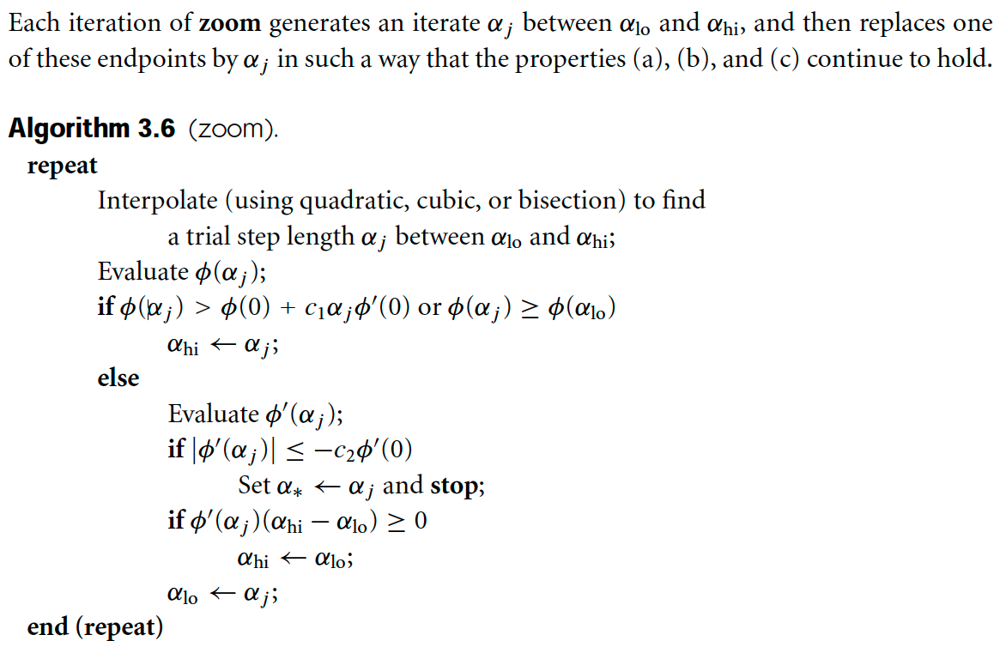</kbd></p>

> [!NOTE]
> ```text
> Đầu tiên của các bước trong vòng lặp j là từ αlow và αhight, dùng iterpolation để tính ra αj. Chắc chắn nó phải ở giữa αlow, αhigh, để ta có các mốc như sau: (0, αlow, αj, αhigh)
> ```
>
> ```text
> Nếu Φ(αj) > Φ(0) + c1 αj(Φ'(0) hoặc Φ(αj) ≥ Φ(αlow) thì αhigh := αj
> ```
>
> Nếu cái đầu thỏa, tức là tại `αj` đã vi phạm điều kiện giảm đủ Armijo, nên có nghĩa là `αj` quá lớn. 
>
> ```text
> Nếu cái sau thỏa, thì tức là hàm Φ tại đó đã đi cao hơn hàm Φ tại αlow, cũng có nghĩa là step size quá lớn, giá trị phù hợp phải ở trước đó. Các mốc sẽ phải là (0, αlow, α*, αj, αhigh)
> ```
>
> Do đó ta sẽ gán lại nó cho `αhigh,` để đem cặp `αlow,` `αhigh` qua vòng sau tìm giá trị khác trước đó (nhỏ hơn). 
>
> ```text
> Nếu hai cái trên không thỏa tức là tại αj đã thỏa điều kiện giảm đủ và không vi phạm Φ(αlow) < Φ(αj) Thì kiểm tra tiếp giá trị đạo hàm tại αj:
> ```
>
> ```text
> Nếu |Φ'(αj)| ≤ -c2Φ'(0), thì đây rõ ràng là thỏa điều kiện strong curvature: độc dốc cái αj đã bớt dốc xuống. Ví dụ như độ dốc tại 0 (điểm ban đầu) là -10, với c2 = 0.2 thì độ dốc giờ đây đã chỉ còn cỡ -2, hoặc -1.9,.. thôi, biểu hiện ta sắp đạt tối ưu rồi, và nếu nó là dương, thì ví dụ 1.9, hay 2.0, thì nó cũng không đi quá xa so với điểm thấp nhất) Do đó, dừng được rồi: ta cho α* := αj và stop.
> ```
>
> Nếu `Φ'(αj)(αhi` - `αlo)` ≥ 0, thì có nghĩa là:
>
> Đầu tiên nhắc lại, nếu đến được đây thì tức là nó thỏa cái if thứ nhất, và như vậy nó đã thỏa điều kiện giảm đủ, và có `Φ(αj)` < `Φ(αlow).` 
>
> Nhưng vì nó không thỏa điều kiện strong curvature nên mới chưa stop được. Vậy thì:
>
> Đầu tiên nhớ `α` low, hay high là đặt dựa trên giá trị hàm số chứ ko phải do độ lớn `α`
>
> ```text
> Case 1: αlow < αhigh: hình ảnh sẽ là: hàm đang đi xuống tại αlow (nằm thấp hơn αhigh), tới α*, và đi lên, tới αj (vẫn thấp hơn tại αlow), tới αhigh (và tại đây nó cao hơn αlow) → Cho thấy điểm α* nằm trước đó. (0, αlow, α*, αj, αhigh)
> ```
>
> ```text
> Ta sẽ cần tìm trong đoạn [αlow, αj], nhưng vì Φαj < φ(αlow) nên ta gán lại αlow thành αhigh, và αj thành αlow và tìm tiếp ở vòng sau.
> ```
>
> ```text
> Case 2: alow > αhigh (nên αhi - αlo < 0): hình ảnh sẽ là, từ αhigh, nằm cao hơn αlow), hàm đang đi xuống, xuống tới α, xuống tiếp α*, bắt đầu đi lên, lên tới alo (nằm thấp hơn αhigh): Như vậy các mốc sẽ là (0, αhigh, αj, α*, αlow). Ta sẽ cần tìm trong đoạn αj, αlow, nhưng tương tự, vì Φαj < Φ(αlow) nên ta gán lại αlow thành αj, và αhigh thành αlow.
> ```
>
> Nếu điều trên không xảy ra tức không rơi vào cái if cuối, thì có nghĩa là rơi vào 2 case sau:
>
> ```text
> Case 1: αlow < αhigh, tức αhi - αlo > 0, thì Φαj < 0 → bức tranh tại đây sẽ là: từ αlow → đi xuống αj → đi xuống α*, đi lên αhigh. Nên các mốc sẽ là (αlow, αj, α*, αhigh)
> ```
>
> ```text
> Case 2: αhigh < αlow ⇔ αhi - αlo < 0, thì Φαj > 0 và bức tranh sẽ là từ αhigh → đi xuống tới α*, đi lên αj, đi lên tới αlow (ko cao bằng αhigh). Nên các mốc là (0, αhigh, α*, αj, αlow)
> ```
>
> ```text
> Trong cả hai case có thể thấy ta sẽ cần tìm trong ở giữa αj, αhigh. Nên ta sẽ gán αj cho αlow và tìm ở vòng sau.
> ```

> [!TIP]
> **🤖 AI Feedback** — ⚠️ Score: **75/100**
>
> Bài phân tích của bạn khá chi tiết và thể hiện sự hiểu biết tốt về các điều kiện Armijo và Strong Curvature, đặc biệt là phần giải thích về độ dốc. Tuy nhiên, việc mô tả vị trí của α* (điểm tối ưu) trong các "mốc" khi nó chưa được biết là không chính xác, và cần rõ ràng hơn về cách các cận αlo, αhi được cập nhật để duy trì tính chất của khoảng tìm kiếm, đặc biệt khi chúng bị đảo ngược về mặt giá trị.

<br>

              <a id="node-ssfpcl4"></a>
              - **Một Số Ghi Chú Về Line Search, Quay Lại Sau**
<p align="center"><kbd>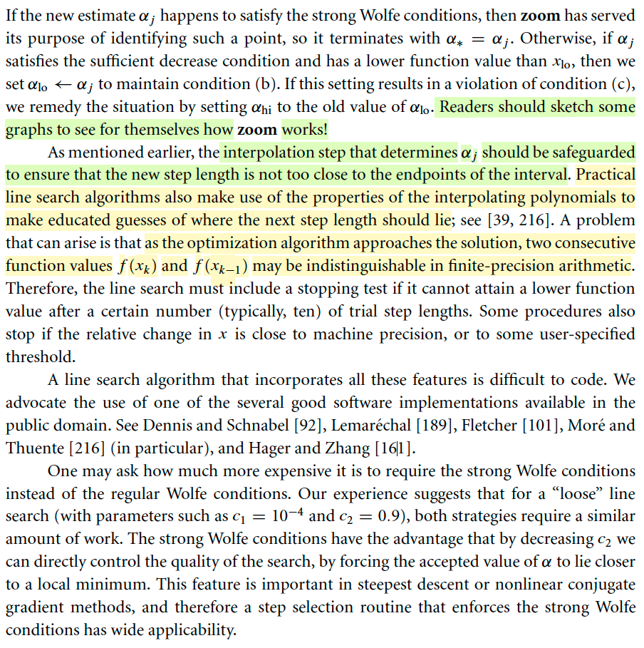</kbd></p>

> [!NOTE]
> MỘT SỐ GHI CHÚ VỀ LINE SEARCH, QUAY LẠI SAU

<br>

<p align="center"><kbd>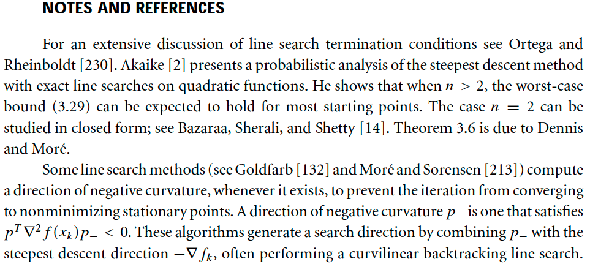</kbd></p>

<br>


<a id="node-1sc73f3"></a>
## 3.3 Rate of convergence

<p align="center"><kbd>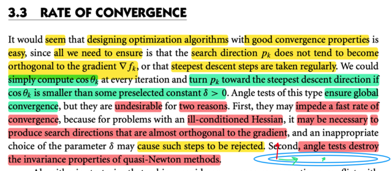</kbd></p>

> [!NOTE]
> Đại khái là mở đầu tác gỉa cho rằng ta có thể nghĩ rằng việc thiết kế thuật toán tối ưu để có tính hội tụ tốt cũng dễ mà: Chỉ việc** đảm bảo sao cho search direction đừng có vuông góc với gradient** là được hay là cứ việc **thường xuyên chọn pk là steepest descent**.
>
> Ví dụ như ta sẽ **tính cosine `θk` tại mỗi iteration,** và **nếu thấy góc này nhỏ hơn một `δ` nào đó, tức là pk bắt đầu gần gần hợp với gradient ∇fk một góc vuông) thì ta sẽ CHỈNH LẠI**, bằng cách cho pk là steepest descent (-∇f)
>
> Tuy nhiên tác giả cho biết, việc dùng **"angle test"** (tức check cosine `θk` và làm như trên) tuy là **có thể đảm bảo global convergence nhưng nó có hai nhược điểm**:
>
> 1) Nó **làm chậm quá trình hội tụ**. Lí do là khi ta có bài toán mà có tính chất **ILL-CONDITIONED** HESSIAN, đại khái là từ ee364a mình hiểu nó là kiểu mà sub-optimal set có dạng ellipse dẹt thì khi đó thật ra **có khi đi theo hướng vuông góc với gradient lại là hướng tốt nhất, hội tụ nhanh nhất.**
>
> Thế thì việc **chọn `δ` không hợp lí trong cách làm trên sẽ reject cái hướng như vậy**, (mình có vẽ hình minh họa, ví dụ như tại điểm này thì hướng xanh lá là hướng tốt, dù nó gần như vuông góc với gradient)
>
> 2) Cách làm này phá hủy tính invariance của quasi Newton method

> [!TIP]
> **🤖 AI Feedback** — ✅ Score: **95/100**
>
> Bài phân tích của bạn rất chi tiết và chính xác, thể hiện sự nắm vững các khái niệm chính và khả năng kết nối với kiến thức nền tảng vững chắc.

<br>


<a id="node-w6dpmr1"></a>
### Xung đột Hội tụ nhanh và Toàn cục

<p align="center"><kbd>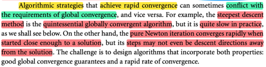</kbd></p>

> [!NOTE]
> Đại ý là, những thuật toán có khả năng hội tụ nhanh đôi khi
> lại conflict với yêu cầu global convergence.
>
> Ví dụ như steepest descent tuy là điển hình, tinh tuý của phương
> pháp đảm bảo global convergence nhưng lại rất chậm trong thực
> tế.
>
> Còn ngược lại ví dụ như Newton method, (pure) có thể hội tụ 
> rất nhanh, khi bắt đầu gần solution, ngay cả khi Newton step ko
> hề là descent direction.
>
> Mình nghĩ: Có thể hiểu cái này nhờ đã học Convex Optimization
> của S.Boyd: Là vì, ý trên, với steepest descent, có khi đi theo
> hướng steepest sẽ khiến con đường đi rất zig zac → rất dài
> (cái này đã thấy phân tích lại trong mấy bài đầu của AlgForOpt
>
> Trong khi đó, sở dĩ nói Newton method giúp hội tụ rất nhanh
> khi ở gần optimal, là vì khi ở gần optimal, thì đại khái là hàm số
> objective có thể được approx tốt bởi quadratic function, nên nó
> solution của nó sẽ cũng xấp xỉ rất sát solution thực tế.
>
> QUay lại đây, cho nên thách thức là phải xây dựng thuật toán
> vừa hội tụ nhanh vừa đảm bảo hội tụ global

> [!TIP]
> **🤖 AI Feedback** — ✅ Score: **98/100**
>
> Phân tích của bạn rất chính xác và đầy đủ, nắm bắt được tất cả các ý chính từ tài liệu tham khảo và còn bổ sung thêm kiến thức chuyên sâu để giải thích.

<br>


<a id="node-4ki3ex7"></a>
#### Tốc độ hội tụ Steepest Descent

<p align="center"><kbd>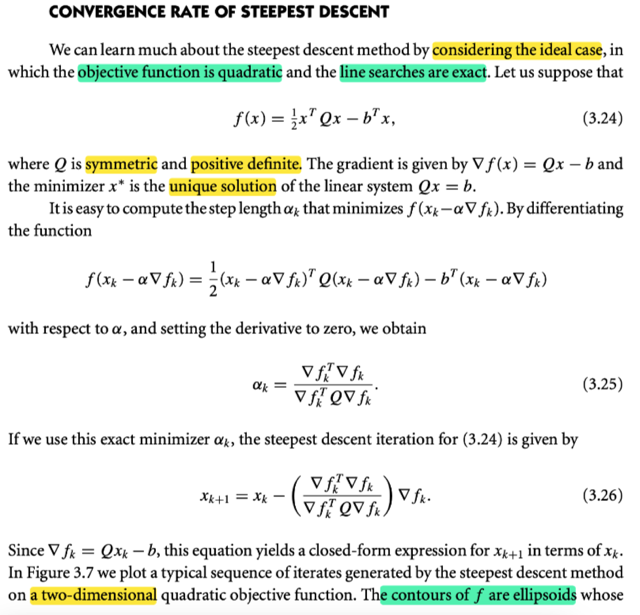</kbd></p>

<p align="center"><kbd>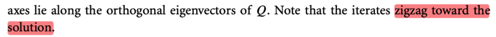</kbd></p>

> [!NOTE]
> Đại khái là để phân tính tốc độ hội tụ của  steepest descent thì tác giả đề nghị
> ta dùng case lí tưởng: objective là quadratic function và ta sẽ dùng exact line
> search.
>
> Hàm f có dạng `(1/2)xTQx` - bTx với Q symmetric positive definite
>
> Gradient lúc này ∇f(x) `=` Qx - b thì đối với mình giờ dễ hiểu rồi (nếu cần dùng
> cách làm holistically của mit 18s096 là ra ngay).
>
> Khi đó, dĩ nhiên là solution của bài toán này là nghiệm của hệ ∇f(x) `=` 0 ⇔ Qx
> `=` b.  (Và vì đây hàm hàm convex nên nó là global minimizer) Và vì Q ≻ 0 nên
> Q invertible ⇨ hệ có nghiệm duy nhất x `=` Qinv b
>
> Đại khái đó là solution theo closed form.
>
> Còn dùng steepest gradient descent, ta sẽ lặp đi lặp lại việc: tính pk và giải
> bài toán exact line search tìm `αk.`
>
> Vậy thì ở đây là steepest g.d nên dĩ nhiên pk là -∇fk.
>
> Bài toán exact line search là minimize f(xk + `αkpk)` `=` f(xk - `αk∇fk)`
>
> ta sẽ tìm derivative (đây là hàm đơn biến theo `αk)` và cho nó bằng 0:
>
> `g(αk)` `=` f(xk - `αk∇fk).`
>
> ```text
> g'(αk) = d/dαk f(xk - αk∇fk)
> ```
>
> ```text
> = d/d(xk - αk∇fk) f(xk - αk∇fk) . d/dαk (xk - αk∇fk)
> ```
>
> `=` ∇f(xk - `αk∇fk)T(-∇fk)`
>
> ```text
> Vì sao d/d(xk - αk∇fk) f(xk - αk∇fk) = ∇f(xk - αk∇fk)
> ```
>
> Là vì f là vector → scalar function, nhận input là xk - `αk∇fk` tính ra scalar f(xk -
> `αk∇fk).` Nên tính đạo hàm của f wrt vector (xk - `αk∇fk)` vì nó sẽ là gradient
> vector tại (xk - `αk∇fk)`
>
> ```text
> Còn vì sao d/dαk (xk - αk∇fk) = -∇fk
> ```
>
> Để ý `h(αk)` `=` xk - `αk∇fk` là scalar → vector function.
>
> Nhận vào scalar `αk,` tính ra vector xk - `αk∇fk`
>
> ```text
> Ta thử tìm d/d αk h(αk): dh = xk - (αk + dαk)∇fk - [xk - αk∇fk]
> ```
>
> ```text
> = - dαk ∇fk = - ∇fkdαk
> ```
>
> ```text
> ⇨ dh = - ∇fkdαk ⇨ d/dαk h(αk) = - ∇fk
> ```
>
> `=` - ∇f(xk - `αk∇fk)T(∇fk)`
>
> Mà ∇f(xk) `=` Qx - b
>
> ⇨ - ∇f(xk - `αk∇fk)T(∇fk)` `=` - ∇f(xk - `αk∇fk)T(∇fk)`
>
> `=` - [Q(xk - `αk∇fk)` - b]T∇fk
>
> `=` - [Qxk - `Qαk∇fk` - b]T∇fk
>
> `=` - [Qxk - b - `Qαk∇fk]T∇fk`
>
> `=` - [∇fk - `Qαk∇fk]T∇fk`
>
> `=` - ∇fkT∇fk + `[Qαk∇fk]T∇fk`
>
> ⇨ g' `=` 0 ⇔ - ∇fkT∇fk + `[Qαk∇fk]T∇fk` `=` 0
>
> ⇔ `[Qαk∇fk]T∇fk` `=` ∇fkT∇fk
>
> ⇔ `αk∇fkTQ∇fk` `=` ∇fkT∇fk
>
> ⇔ `αk` `=` ∇fkT∇fk `/` ∇fkTQ∇fk
>
> `====`
>
> Và như vậy xk+1 `=` xk - (∇fkT∇fk `/` ∇fkTQ∇fk) ∇fk
>
> Và vì ∇fk `=` Qxk - b ⇨ Nên ta có công thức xk+1 theo xk

> [!TIP]
> **🤖 AI Feedback** — ✅ Score: **95/100**
>
> Phân tích rất chi tiết và chính xác, không chỉ tóm tắt mà còn tự mình tái chứng minh các công thức quan trọng một cách tỉ mỉ. Cách giải thích từng bước logic và sâu sắc, thể hiện sự nắm vững kiến thức. Có một dòng lặp lại trong quá trình chứng minh không cần thiết, nhưng không ảnh hưởng đến độ chính xác.

<br>

<a id="node-haconpq"></a>
- **Đường đi ziz zac giảm dốc**
<p align="center"><kbd>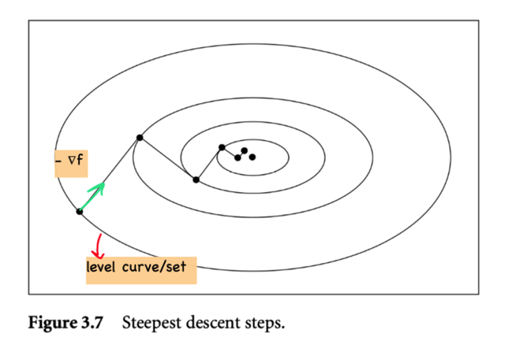</kbd></p>

> [!NOTE]
> Và đường đi nó sẽ ziz zac như này. 
>
> Thế thì tại sao tác giả nói "the contour of f là các ellipsoids có trục trùng (lie along) các orthogonal eigenvectors của Q?
>
> Giải thích đại khái như sau: f, như đã nói, là quadratic function f(x) `=` `(1/2)xTQx` - bTx
>
> Và contour plot thì như đã biết, là level set, là tập các điểm mà hàm số đồng giá trị:
>
> ```text
> c-level set = {x: f(x) = c}  = {x: (1/2)xTQx - bTx = c}
> ```
>
> Thế thì nếu ta đặt y `=` x - x* ⇨ x `=` y + x*:
>
> Khi đó, `(1/2)xTQx` + bTx `=` c 
>
> ⇔ `(1/2)` (y + x*)TQ(y + x*) - bT(y + x*) `=` c
>
> ⇔ `(1/2)(yTQ` + x*TQ)(y + x*) - bTy + bTx* `=` c
>
> ⇔ `(1/2)(yTQy` + x*TQy + yTQx* + x*TQx*) - bTy - bTx* `=` c
>
> ```text
> ⇔ (1/2)yTQy + (1/2)x*TQy + (1/2)yTQx* + (1/2)x*TQx* - bTy - bTx* = c
> ```
>
> ⇔ `(1/2)yTQy` + x*TQy - bTy + `(1/2)x*TQx*` - bTx* `=` c
>
> Tới đây, QTx* - b `=` 0 do đây là gradient tại minimum và `(1/2)x*TQx*` - bTx* chỉ là constant, ta chuyển luôn sang vế phải, chuyển luôn `1/2` sang luôn, để rồi phương trình này trở thành:
>
> **yTQy `=` c**
>
> Động tác đặt y `=` x - x* chỉ là dời trục tọa độ tịnh tiến mà thôi, để rồi level set bây giờ có dạng của một paraboloid tâm tại gốc tọa độ.
>
> Thế thì: xem xét yTQy `=` c, vì Q p.d nên phân tách nó thành VΛVT với S là orthogonal matrix các eigenvectors của Q, Λ là diagonal matrix các eigenvalues của Q
>
> Nên ta có yT V Λ VT y `=` c
>
> Xét VTy, nhớ lại kiến thức của phần nói về change of basis trong MIT 18.06:
>
> ```text
> Khi xây dựng một matrix đại diện cho một phép biến đổi tuyến tính T(v), thì ta sẽ làm như sau, nói một cách ngắn gọn là: Thực hiện phép biến đổi đối với các basis v's của input T(v) và thể hiện nó dưới dạng linear combination của các output basis w's. Khi đó các hệ số sẽ là các cột của matrix biến đổi. Ví dụ biến đổi v1, để có T(v1), thể hiện nó bởi w's: α1w1 + α2w2 + .. Thì cột 1 của A sẽ là (α1, α2,...).
> ```
>
> Thế thì, để bàn về change of basis matrix, ta sẽ nói về phép biến đổi identity. Dĩ nhiên với phép biến đổi này thì T(v1) vẫn là v1, và ta sẽ chỉ việc thể hiện nó bởi basis w's là có cột 1 của A.
> Vậy v1 `=` W(A1's column 1), v2 `=` W(A's column 2)... 
>
> hay V `=` WA 
>
> ⇔ A `=` VWinv Đây chính là change of basis matrix giúp đổi tạo độ đang theo basis v's thành tọa độ theo basis w's.
>
> Và như vậy nếu như v's là standard basis, thì matrix A `=` VWinv `=` IWinv `=` Winv chính là matrix đổi tọa độ từ standard basis e's sang basis w's
>
> Thế thì, quay lại đây, xét VTy, cũng là Vinv y (V là orthogonal matrix nên VT `=` Vinv)
>
> thì VTy, thì nó chính chuyển tọa độ của y từ standard basis sang basis v's, tức các eigen basis của Q. Và về khía cạnh hình học, nó chỉ là việc ta xoay trục tọa độ thẳng góc lại với các eigenvector của Q mà thôi. Và gọi z `=` VTy, thì z chỉ là tọa độ của cùng vector y nhưng mà là khi trục tọa độ thẳng góc với eigenvectors của Q.
>
> ```text
> Thế thì khi đó yTQy = c là phương trình của level set trong hệ trục standard thì zTΛz = c là phương trình của level set trong hệ trục eigenbasis của Q, và ta sẽ thấy zTΛz = c ⇔ z1^2 λ1 + z2^2 λ2 + .. = c. Đây chính là phương trình của một ellipsoids.
> ```
>
> Như vậy, từ đó ta hiểu vì sao nói level set (contour plot) lại là các ellipsoid có trục thẳng trục với các eigenvector của Q.

> [!TIP]
> **🤖 AI Feedback** — ✅ Score: **95/100**
>
> Bài giải thích rất chi tiết và sâu sắc về bản chất hình học của các level set trong hàm bậc hai, và mối liên hệ với phương pháp Steepest Descent.

<br>

  <a id="node-ms2did5"></a>
  - **Định lượng tốc độ hội tụ**
<p align="center"><kbd>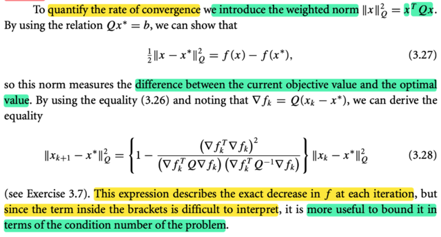</kbd></p>

> [!NOTE]
> Tiếp theo đại khái là, tác giả cho rằng ta sẽ dùng một công cụ: weighted norm, có công thức là: ||x||_Q `=` xTQx. Khi đó, dùng thêm quan hệ Qx* `=` b (đây là ∇f(x*) `=` 0) ta sẽ có:
>
> `(1/2)||x-x*||_Q` `=` f(x) - f(x*).
>
> Là sao ta? 
>
> → Theo định nghĩa của weighted norm ở trên: ||x - x*||^2_Q `=` (x - x*)TQ(x - x*)
>
> `=` (xT - x*T)Q(x - x*) `=` (xTQ - x*QT)(x - x*) `=` xTQx - x*QTx - xTQx* - x*QTx*
>
> `=` xTQx - xTQx* - x*QTx  - x*QTx*
>
> `=` xTQx - xTb - x*QTx  - bTx*  (dùng Qx* `=` QTx* `=` b)
>
> `=` xTQx - bTx - x*QTx  - bTx*
>
> `=` f(x) - f(x*) (vì f(x) `=` xTQx - bTx)
>
> Rồi, ở trên ta đã kết quả (công thức 3.26):
>
> xk+1 `=` xk - (∇fkT∇fk `/` ∇fkTQ∇fk) ∇fk
>
> ```text
> Và ∇fk = Q(xk - x*) (là do ∇fk = Qxk - b, mà b = Qx* ⇨ ∇fk = Qxk - Qx* = Q(xk - x*))
> ```
>
> Thì từ đó ta có thể derive công thức:
>
> ||xk+1 - x*||^2_Q `=` {1 - (∇fkT∇fk)^2 `/` (∇fkTQ∇fk)(∇fkTQinv∇fk)}||xk - x*||^2_Q
>
> Đây là bài tập 3.7. QUAY LẠI SAU
>
> Đại ý là tuy công thức này co thể cho ta biết chính xác mức giảm của f tại mỗi iteration, nhưng vì cái term ở trong {} rất khó hiểu nên sẽ hữu ích hơn nếu ta sử dụng công cụ chặn (bound)

<br>

    <a id="node-lut7jz5"></a>
    - **Theorem 3.3 Tốc độ hội tụ của Steepest Descent**
<p align="center"><kbd>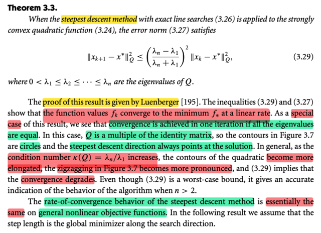</kbd></p>

> [!NOTE]
> Theorem này đại khái nói là, với **steepest descent** method, dùng** exact line search** và áp dụng vào **hàm objective có tính strongly convex**. 
>
> Khi đó **error norm** (độ lớn của sai số) sẽ thỏa inequality này:
>
> ||xk+1 - x*||^2_Q ≤ ((λn - `λ1)/(λn` + λ1)]^2 ||xk - x*||^2_Q
>
> với 0 < λ1 < ...λn là eigenvalues của Q
>
> Ở đây không chứng minh theorem này. Nhưng đại khái nó chính là:
>
> ```text
> [error tại step k+1] ≤ [error tại step k] * α với α = ((λn - λ1)/(λn + λ1)]^2 và error đo bằng weighted norm.
> ```
>
> Và đại khái nó nói rằng **sự hội tụ sẽ diễn ra tuyến tính**, cũng là error sẽ giảm dần một cách tuyến tính.
>
> Và khi rơi vào một trường hợp đặc biệt, là **Q là có dạng một scalar nhân với Identity matrix**, thì khi đó **sự hội tụ sẽ diễn ra trong vòng chỉ một iteration.**
>
> Để thấy cái này chỉ cần cho λn `=` λ1 ta có:
>
> ||xk+1 - x*||^2_Q ≤ ((λn - `λ1)/(λn` + λ1)]^2 ||xk - x*||^2_Q
>
> ⇒ ||xk+1 - x*||^2_Q ≤ 0, tức là [error tại step k+1] ≤ 0 với ý nghĩa: đang ở step 1, thì qua step 2 thì error đã về 0, tức đã tới được x* rồi.
>
> Khi đó, contour plot sẽ là hình tròn và steepest descent (-∇f) luôn chỉ về solution x*
>
> Và nói chung là, khi condition number của matrix Q (được tính bằng tỉ lệ giữa max eigenvalue và min eigenvalue k(Q) `=` `λmax(Q)/λmin(Q),` cũng chính là **tỉ số giữa stretch factor theo phương lớn nhất và nhỏ nhất bởi matrix**) càng lớn, thì các đường contour hình ellipse càng trở nên dẹp, xu hướng ziz zag sẽ càng rõ, và sự hội tụ sẽ chậm dần.
>
> Trong note trước mình đã hiểu vì sao contour plot của f lại là các ellipsoids có trục thẳng hướng với các eigenvector của Q, mà ví dụ như trong 2D, tỉ lệ giữa bề rộng lớn nhất và bề rộng nhỏ nhất của cái hình ellipse này chính là tỉ lệ giữa eigenvalue lớn nhất và nhỏ nhất. Đây cũng chính là định nghĩa condition number của matrix Q: k(Q). Nên nếu tỉ lệ này lớn, thì cái ellipse sẽ rất dẹt, hay trong case n-chiều thì ellipsoid rất dẹt và càng dẹt thì tốc độ hội tụ càng chậm. 
>
> ```text
> Điều này thể hiện bởi công thức 3.29 là vì nếu λn >> λ1 thì  α = ((λn - λ1)/(λn + λ1)]^2 sẽ là một tỉ lệ rất gần 1 (giống như [(1000-1)/(1000+1)]^2 = (999/1001)^2 ≈ 1. Có nghĩa là:
> ```
>
> [error tại step k+1] ≈ [error tại step k], tức error chả giảm đi bao nhiêu sau một step cả. 
>
> Cuối cùng, **tốc độ hội tụ của steepest descent method** về cơ bản là **cũng giống với các non-linear objective function** khác

> [!TIP]
> **🤖 AI Feedback** — ✅ Score: **99/100**
>
> Học sinh thể hiện sự hiểu biết xuất sắc và toàn diện về tính chất hội tụ của phương pháp steepest descent, bao gồm các giải thích chi tiết và kết nối sâu sắc với các khái niệm toán học nền tảng.

<br>

      <a id="node-tziaxo8"></a>
      - **Theorem 3.4 Tốc độ hội tụ Steepest Descent**
<p align="center"><kbd>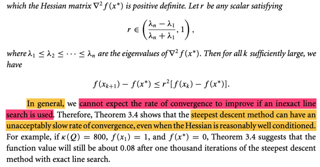</kbd></p>

<p align="center"><kbd>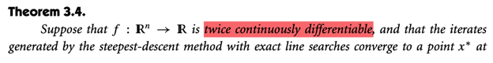</kbd></p>

<p align="center"><kbd>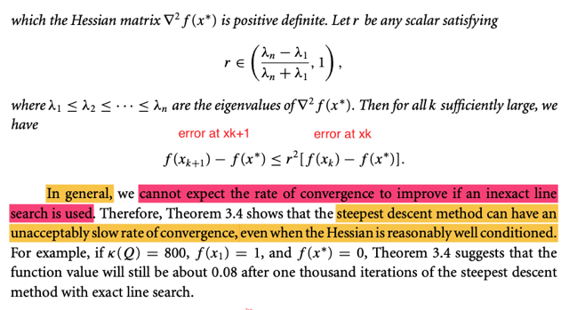</kbd></p>

> [!NOTE]
> Đại khái là cái  theorem này nói rằng 
>
> **[error tại xk+1] `/` [error tại xk] sẽ không thể lớn hơn r^2.**
>
> Với r là con số nằm trong khoảng ((λn - λ1) `/` (λn + λ1), 1). 
>
> Như vậy đại khái là, **nếu con số này nhỏ**
>
> thì tỉ lệ giữa hai error là nhỏ, thì có nghĩa là, sau một iteration, thì cái **sai số tại xk+1 chỉ còn bằng một phần nhỏ của sai số tại xk**, chính là **mang ý nghĩa là sai số giảm rất nhanh**.
>
> Ngược lại **nếu con số này lớn** (gần 1) 
>
> tức là **sau một iteration mà sai số vẫn còn như y nguyên** → sai số giảm rất chậm
>
> Thế thì. Con số này nhỏ tức là λmax (λn) gần bằng λmin, thì như vậy cái **condition number `=` λmax `/` λmin sẽ ≈ 1**
>
> Và tương ứng case này thì các **contour sẽ gần với hình tròn**
>
> Ngược lại nếu **con số này lớn**, cũng chính là **λmax chênh lệch nhiều so với λmin** → **contour có dạng ellips rất dẹt**
>
> Vậy thì ý của theorem này nói rằng, **ngay cả khi ta xét case lí tưởng**, với hàm mục tiêu là **quadratic**, và **dùng exact line search** rồi mà cái** độ giảm của error vẫn bị ràng buộc bởi r^2**. 
>
> Để rồi với bài toán mà có well-conditioned thì sai số sẽ vẫn giảm rất chậm. Vậy thì chứng tỏ steepest descent method ko ổn.
>
> Ông lấy ví dụ là k(Q) `=` 800. Thật ra nó là con số nhỏ, tức là, Q cơ bản là well-condition, sự chênh lệch giữa eigenvalue lớn nhất và nhỏ nhất là không quá lớn.
>
> Nhưng vì như đã nói theorem này, cho thấy **[error tại xk+1] `/` [error tại xk] sẽ không thể lớn hơn r^2.** 
>
> dẫn tới với 800, khi bình phương nó vẫn là con số rất lớn ⇨ Ngay cả matrix Q well-condition mà phương pháp steepest descent vẫn rất chậm.
>
> ```text
> Làm kĩ ra cho hiểu: κ(Q) = 800 tức λmax(Q) / λmin(Q) = 800 ⇔ λmax(Q) = 800 λmin(Q)
> ```
>
> ⇨ r ∈ ((800 λmin(Q) - λmin(Q)) `/` (800 λmin(Q) + λmin(Q)), 1)
>
> `=` `(799/801,` 1). Tức là một con số rất ≈ 1. Ví dụ như 0.99.
>
> Khi đó theo theorem này [error tại `k+1]/[error` tại] ≤ 0.99^2 cũng là con số rất gần 1
>
> ⇨ error sau một step giảm cực kì ít

<br>

        <a id="node-wwnb5t0"></a>
        - **Qua phân tích Hội tụ phương pháp Newton**
<p align="center"><kbd>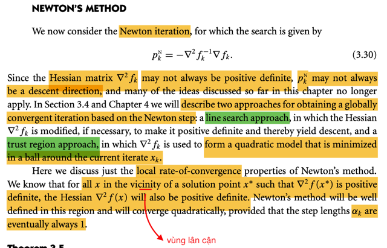</kbd></p>

> [!NOTE]
> Ta sẽ phân tích qua convergence rate của Newton method 
>
> ```text
> Như đã biết, Newton direction sẽ có công thức là pk_N = - (∇^2f_k)inv ∇f_k
> ```
>
> ```text
> (Tại sao lại có công thức này thì đến nay mình đã dễ hiểu rồi, không cần nói lại, có thể ôn nhanh: đó là vì với pp này ta sẽ (đứng tại xk), approx hàm f bởi quadratic approximation (khai triển Taylor bậc hai của f). Khi đó, có thể tìm minimum của hàm approx này bằng cách cho gradient  = 0, và nó sẽ cho ta hệ tuyến tính ∇^2 f_k pk_N = - ∇f_k
> ```
>
> Khi đó nếu Hessian tại k positive definite 0, thì ta có thể nhân hai vế cho inverse của
> Hessian để có kết quả trên.)
>
> Vậy thì ở đây họ nói** nếu Hessian không positive definite**, (vẫn invertible) thì **pk_N không phải là descent direction**. 
>
> Đơn giản thôi:
>
> Directional derivative theo hướng `pk_N:`
>
> ```text
> = ∇f_k T pk_N = ∇f_k T (- (∇^2f_k)inv ∇f_k) = - ∇f_k T (∇^2f_k)inv ∇f_k
> ```
>
> Khi Hessian không positive definite ⇨ mọi eigenvalue chưa chắc đã dương thì ⇨ mọi eigenvalue của Hessian inverse cũng vậy ⇨ Hessian inverse cũng sẽ không positive defite
>
> ⇨ quadratic form `∇f_k` T `(∇^2f_k)inv` `∇f_k` sẽ không chắc luôn dương
>
> ⇨ - `∇f_k` T `(∇^2f_k)inv` `∇f_k` sẽ không chắc luôn âm
>
> ⇨ chưa chắc đi theo hướng `pk_N` đã giảm f 
>
> `====`
>
> Thế thì ta sẽ còn bàn thêm **hai cách tiếp cận giúp đạt được globally convergence** dựa trên Newton step trong các phần sau. 
>
> Còn ở đây, ta sẽ thảo luận về  **local rate of convergence** (tạm hiểu là **tính chất của Newton method** mà trong đó, **khi ta tới gần optimal thì việc converge sẽ diễn ra rất
> nhanh** - quadratic convergence) và** step size luôn bằng 1** (cái này đã học trong Convex Optimimzation)

> [!TIP]
> **🤖 AI Feedback** — ✅ Score: **95/100**
>
> Học sinh thể hiện sự hiểu biết sâu sắc về phương pháp Newton, bao gồm cả việc dẫn xuất công thức và phân tích chi tiết về điều kiện hướng đi xuống. Có một điểm cần làm rõ thêm về vai trò của kích thước bước (step size) trong hội tụ bậc hai.

<br>

          <a id="node-k782xxo"></a>
          - **Theorem 3.5 Hội tụ Newton**
<p align="center"><kbd>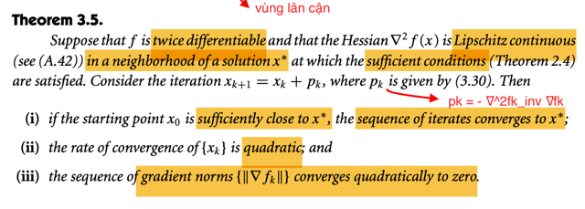</kbd></p>

> [!NOTE]
> Theorem này nói rằng, cho hàm f khả vi kép (tức tồn tại Hessian tại mọi điểm) và Hessian có tính **Lipschitz continuous** trong vùng lân cận của x*.
>
> Khi đó với chuỗi xk+1 `=` xk + pk với **pk là Newton direction** thì:
>
> i) **Nếu x0 đủ gần x* thì chuỗi xk sẽ hội tụ về x***
>
> ii) Tốc độ hội tụ là **quadratic**
>
> iii) Chuỗi gradient norm `||∇f_k||` sẽ hội tụ quadratically về 0
>
>
> Ôn lại nhanh theo định nghĩa, ||A||_p `=` max x ||Ax||_p `/` ||x||_p
>
> Nên ||A|| `=` max x ||Ax|| `/` ||x|| (tức là dùng l2 norm)
>
> Từ đó bài toán đặt ra là maximize ||Ax|| `/` ||x|| mà cái này ko âm,
> nên nó tương đương bài toán maximize ||Ax||^2 `/` ||x||^2, tức 
>
> (Ax)T(Ax) `/` xTx `=` xTATAx `/` xTx 
>
> ```text
> = xTQ Λ QTx / xTx = Σi (QTx)i^2 λ(ATA)i
> ```
>
> Và cái này ≤ `Σi` (QTx)i^2 λ(ATA)max `=` λ(ATA)max `Σi` (QTx)i^2 
>
> `=` λ(ATA)max ||QTx||^2 `=` λ(ATA)max ||x||^2 `=` λ(ATA)max xTx
>
> Vậy (Ax)T(Ax) `/` xTx ≤ λ(ATA)max xTx `/` xTx `=` λ(ATA)max
>
> ⇔ ||Ax||^2 `/` ||x||^2 ≤ λ(ATA)max
>
> ⇨ ||A|| `/` ||x|| ≤ √λ(ATA)max
>
> Và vì định nghĩa ||A|| `=` max x ||Ax|| `/` ||x|| nên ||A||  ≥ ||Ax|| `/` ||x|| ∀x
>
> ⇔ ||A||||x|| ≥ ||Ax||. Chính là một inequality quan trọng.
>
> Vậy áp dụng ở đây ||Au|| ≤ ||A|| ||u|| `=` λ(ATA)max ||u||

<br>

            <a id="node-xl5sz2p"></a>
            - **Chứng minh Theorem 3.5**
<p align="center"><kbd>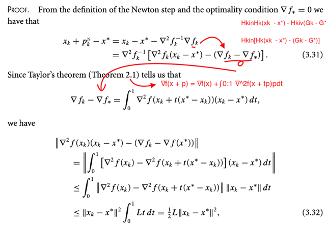</kbd></p>

> [!NOTE]
> Chứng minh:
>
> Đầu tiên: xk + pkN - x* `=` xk - x* + pkN
>
> Với pkN `=` - (∇^2fk)inv ∇fk
>
> ∴ `=` xk - x* - (∇^2fk)inv ∇fk
>
> ∴ `=` I (xk - x*) - `(∇^2f_k)inv` ∇fk
>
> `=` ∇^2fk (∇^2fk)inv (xk - x*) - (∇^2fk)inv ∇fk 
>
> `=` ∇^2fk (∇^2fk)inv (xk - x*) - (∇^2fk)inv ∇fk + (∇^2fk)inv 0
>
> `=` ∇^2fk (∇^2fk)inv (xk - x*) - (∇^2fk)inv ∇fk + (∇^2fk)inv ∇f(x*)
>
> (Do gradient tại x* `=` 0, ∇f(x*) `=` 0)
>
> `=` ∇^2fk (∇^2fk)inv (xk - x*) - (∇^2fk)inv (∇fk - ∇f*)
>
> `=`  (∇^2fk)inv ∇^2fk (xk - x*) - (∇^2fk)inv (∇fk - ∇f*)
>
> `=` (∇^2fk)inv [∇^2fk (xk - x*) - (∇fk - ∇f*)] → đây là 3.31
>
> ----
>
> Tiếp, dùng Taylor theorem, nói rằng:
>
> ∇f(x + p) `=` ∇f(x) + `∫0:1` ∇^2f(x + tp)pdt
>
> Áp dụng vào đây ta có ∇f(xk) `=` ∇f(x*) + `∫0:1` ∇^2f(xk + t(x* - xk))(x* - xk)dt
>
> ⇔ ∇f(xk) - ∇f(x*) `=` `∫0:1` ∇^2f(xk + t(x* - xk))(x* - xk)dt (1)
>
> Tiếp, xét ||∇^2fk(xk - x*) - (∇fk - ∇f(x*))|| (tức là norm của cái term thứ 2 trong 3.31)
>
> Thay ∇f(xk) - ∇f(x*) `=` `∫0:1` ∇^2f(xk + t(x* - xk)) có ở trên vào:
>
> `=` || ∇^2f(xk)(xk - x*) - `∫0:1` ∇^2f(xk + t(x* - xk)) . (xk - x*) dt ||
>
> ```text
> Tới đây. ∇^2f(xk)(xk - x*) = ∇^2f(xk)(xk - x*) ∫0:1 dt (vì ∫0:1 dt = 1) = ∫0:1 ∇^2f(xk)(xk - x*) dt
> ```
>
> ∴ `=` || `∫0:1` ∇^2f(xk)(xk - x*)dt  - `∫0:1` ∇^2f(xk + t(x* - xk)) . (xk - x*) dt ||
>
> Gộp hai tích phân lại
>
> `∴=` || `∫0:1` [ ∇^2f(xk)(xk - x*) - ∇^2f(xk + t(x* - xk)) . (xk - x*) ] dt ||
>
> Đặt thừa số chung (xk - x*) ra ngoài, và đưa ra ngoài tích phân luôn.
>
> ∴ `=` || `∫0:1` [∇^2f(xk) - ∇^2f(xk + t(x* - xk))] . (xk - x*) dt ||
>
> `=` || `∫0:1` [∇^2f(xk) - ∇^2f(xk + t(x* - xk))] dt (xk - x*)||
>
> Tới đây, cái ta đang có là ||Au||, với 
>
> A `=` `∫0:1` [∇^2f(xk) - ∇^2f(xk + t(x* - xk))] dt
>
> u `=` xk - x*
>
> ⇨ Áp dụng bất đẳng thức ||Au|| ≤ ||A|| ||u|| (vì định nghĩa của norm ||A|| là `max_u` ||Au|| `/` ||u|| ⇨ ||Au|| `/` ||u|| ≤ ||A|| và cái này ⇔ ||Au|| ≤ ||A|| ||u||)
>
> Ta có  || `∫0:1` [∇^2f(xk) - ∇^2f(xk + t(x* - xk))] dt (xk - x*)||
>
> ≤ `||∫0:1` [∇^2f(xk) - ∇^2f(xk + t(x* - xk))] dt|| ||xk -  x*||
>
> Tới đây, dùng một bất đẳng thức khác: norm của tổng (tích phân) luôn ≤ tổng của norm:
> ||A + B|| ≤ ||A|| + ||B||, cái này đại khái là khái quát lên từ bất đẳng thức tam giác đối với vector. 
>
> Mà ở đây chính là ta đưa norm vào trong tích phân.
>
> ∴ ≤ `∫0:1` ||∇^2f(xk) - ∇^2f(xk + t(x* - xk))|| dt ||xk -  x*||
>
> đưa constant ||xk -  x*|| vô lại
>
> ∴ `=` `∫0:1` ||∇^2f(xk) - ∇^2f(xk + t(x* - xk))|| ||xk -  x*|| dt
>
> Áp dụng giả định gradient ∇f là Lipschitz continuous trên N, tức là tồn tại hằng số L > 0 sao cho: 
> ||∇f(x) - ∇f(x~)|| ≤ L||x - x~||. Với mọi x, x~ ∈ N
>
> ⇨ ||∇^2f(xk) - ∇^2f(xk + t(x* - xk))|| ≤ L||xk - [xk + t(x* - xk)]||
>
> `=` L||-t(x* - xk)|| `=` L||t(xk - x*)|| `=` Lt||(xk - x*)]||
>
> Từ đó ta có:
>
> `∫0:1` ||∇^2f(xk) - ∇^2f(xk + t(x* - xk))|| ||xk - x*|| dt
>
> ≤ `∫0:1` Lt ||(xk - x*)]|| ||xk -  x*|| dt `=` `∫0:1` Lt ||xk - x*||^2 dt
>
> `=` ||xk - x*||^2 `∫0:1` Lt dt
>
> `=` ||xk - x*||^2 `(L/2)`
>
> Vậy là cuối cùng ta có 
>
> ||∇^2f(xk)(xk - x*) - (∇fk - ∇f(x*))|| ≤ `(L/2)` ||xk -  x*||^2
>
> → Đây chính là kết quả 3.32

<br>

              <a id="node-9fdbaka"></a>
              - **Giải thích hội tụ bậc hai**
<p align="center"><kbd>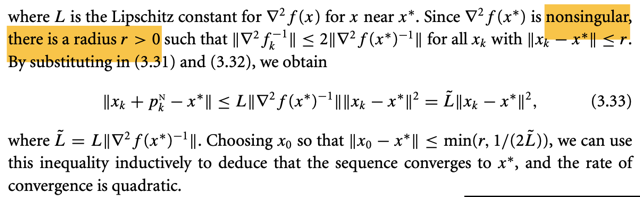</kbd></p>

> [!NOTE]
> Tiếp, ta có ∇^2f(x*) nonsingular là vì theorem này có giả thiết là **solution x* thỏa sufficient condition** và cái này thì nói rằng Hessian tại x* sẽ PD.
>
> Vậy thì đại khái là vì Hessian tại x* PD nên dĩ nhiên cũng khả nghịch.
>
> Thế thì vì tính liên tục của Hessian nên Hessian inverse cũng liên tục.
>
> Và có nghĩa là khi x tới gần x* thì Hinv tại x cũng → Hinv tại x*.
>
> Dẫn tới norm của Hinv tại x cũng → norm của Hinv tại x*
>
> Do đó **phải tồn tại một khoảng cách giữa x và x* sao cho chênh lệch giữa Hinv(x) và Hinv(x*) ko quá lớn**. Và độ lớn của chênh lệch ở đây đo bằng norm tức ||Hinv(x) - Hinv(x*)||
>
> Vậy phát biểu lại, đó là:
>
> "Phải tồn tại một bán kính r để khi x đủ gần x* (trong bán kính này thì) ||Hinv(x) - Hinv(x*)|| không quá lớn"
>
> Và để cụ thể hóa cái chữ "không quá lớn", ta chọn nó như sau:
>
> Không quá lớn `=` ||Hinv(x) - Hinv(x*)|| ≤ ||Hinv(x)|| (2)
>
> Thế thì ta xét
>
> Hinv(x) `=` Hinv(x) - Hinv(x*) + Hinv(x*)
>
> ⇨ ||Hinv(x)|| `=` ||Hinv(x) - Hinv(x*) + Hinv(x*)||
>
> ≤ ||Hinv(x) - Hinv(x*)||  + ||Hinv(x*)|| (áp dụng inequality tam giác)
>
> và áp dụng tiếp cái (2):  ||Hinv(x) - Hinv(x*)|| ≤ ||Hinv(x)||
>
> ta có Hinv(x) ≤ ||Hinv(x*)|| + ||Hinv(x*)|| `=` 2||Hinv(x*)||
>
> Như vậy ta hiểu chỗ này tại sao sách nói rằng **vì Hessian tại x* khả nghịch, nên tồn tại bán kính r dương sao cho khi xk đủ gần x* trong bán kính đó (tức là ||xk - x*|| ≤ r) thì ta sẽ có Hinv(x) ≤ 2||Hinv(x*)||**
>
> `====`
>
> Vậy xét ||xk + pkN - x*|| `=` ||xk - x* - `∇^2fk_inv` ∇fk||
>
> Nhờ 3.31 ta đã có xk + pkN - x* `=` (∇^2fk)inv[∇^2fk (xk - x*) - (∇fk - ∇f*)
>
> ⇨ ||xk + pkN - x*|| `=` || (∇^2fk)inv[∇^2fk (xk - x*) - (∇fk - ∇f*)] ||
>
> và áp dùng ||Au|| ≤ ||A|| ||u||
>
> Thì vế phải ≤  || (∇^2fk)inv|| ||[∇^2fk (xk - x*) - (∇fk - ∇f*)] || (
>
> Nhờ tiếp 3.32: ||[∇^2fk (xk - x*) - (∇fk - ∇f*)] || ≤ `(1/2)L` ||xk - x*||^2
>
> Nên vế phải ở trên tiếp tục ≤ ||(∇^2fk)inv|| `(1/2)L` ||xk - x*||^2
>
> Nhờ tiếp kết quả trên Hinv(x) ≤ 2||Hinv(x*)||, cũng là ||(∇^2fk)inv|| ≤ 2 ||(∇^2f(x*))inv||
>
> ⇨ vế phải tiếp tục ≤ 2 ||(∇^2f(x*))inv|| `(1/2)L` ||xk - x*||^2
>
> `=` L ||(∇^2f(x*))inv|| ||xk - x*||^2
>
> Đặt L~ `=` L ||(∇^2f(x*))inv||
>
> ∴ `=` L~ ||xk - x*||^2
>
> Vậy cuối cùng ta có: 
>
> ||xk - x* - (∇^2fk)inv ∇fk|| ≤ L~ ||xk - x*||^2
>
> cũng chính là: ||xk + pkN - x*|| ≤ L~ ||xk - x*||^2
>
> Hay: **||xk+1 - x*|| ≤ L~ ||xk - x*||^2**
>
> Gọi ||xk - x*|| là giá trị scalar error tại step k: ek thì kết quả trên chính là:
>
> ek+1 ≤ L~ ek^2
>
> CUỐI CÙNG:
>
> Chọn x0 sao cho ||x0 - x*|| ≤ min(r, `1/(2L~))` ta có có thể  quy nạp rằng chuỗi hội tụ về x* là quadratic rate:
>
> ek+1 ≤ L~ ek ek `=` (L~ ek) ek
>
> ⇔ **ek+1 ≤ (L~ ek) ek**
>
> Có nghĩa là chỉ cần chọn x0 sao cho L' e0 < 1, thì:
>
> e1 sẽ ≤ L~ e0 e0 < e0 
>
> e2 sẽ ≤ L~ e1 e1  < e1
>
> ..
>
> để rồi **chuỗi error e0 (tức ||x0 - x*||), e1, e2 .. sẽ dần về 0** 
>
> **cũng chính là x0 ,x1... sẽ dần về x***
>
> Không như vậy, nếu chọn x0 sao cho Le0 < `1/2` thì e1 sẽ < e0 `/` 2, e2 < e1 `/` 2...tức là error sẽ giảm 1 nửa mỗi iteration.
>
> Tất nhiên ta phải đảm bảo là x0 đủ gần x* như lập luận trên, nên e0 cũng phải < r
>
> Do đó mới nói nếu ta cho x0, hay e0 `=` ||x0 - x*|| sao cho e0 ≤ min (r, `1/2L')` thì ta sẽ có **sự hội tụ về x* với tốc độ quadratic**

<br>

                <a id="node-137du95"></a>
                - **Chứng minh Hội tụ gradient bậc hai**
<p align="center"><kbd>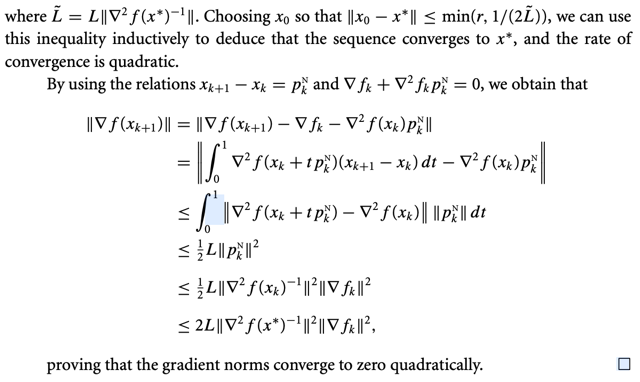</kbd></p>

> [!NOTE]
> Phần này thì chứng minh ý còn lại của theorem rằng **norm của gradient cũng sẽ dần về 0 với tốc độ quadratically**
>
> Norm of gradient tại xk+1: ||∇f(xk+1)||
>
> Vì xk+1 `=` xk + pkN và theo pkN là solution của equation ∇^2fk pkN `=` - ∇fk
>
> ⇨ ∇^2fk pkN + ∇fk `=` 0
>
> ||∇f(xk+1)|| `=` ||∇f(xk+1) - 0|| 
>
> `=` ||∇f(xk+1) - (∇^2fk pkN + ∇fk)|| (dùng ∇^2fk pkN + ∇fk `=` 0)
>
> `=` ||∇f(xk+1) - ∇^2fk pkN - ∇fk|| (phá dấu ngoặc ra)
>
> `=` ||∇f(xk+1) - ∇fk - ∇^2fk pkN|| (đổi vị trí)
>
> ```text
> Áp dụng Taylor theorem: f(x + p) = f(x) + ∫0:1 ∇f(x + pt)pdt ⇔ f(x + p) - f(x) = ∫0:1 ∇f(x + pt)pdt
> ```
>
> ⇨ ∇f(xk+1) - ∇fk `=` `∫0:1` ∇^2f(xk + tpkN)(xk+1 - xk) dt
>
> ⇨ .. `=` || `∫0:1` ∇^2f(xk + tpkN)(xk+1 - xk) dt - ∇^2fk pkN ||
>
> ```text
> Biến - ∇^2fk pkN = - ∇^2fk pkN ∫0:1 dt = - ∫0:1 ∇^2fk pkN dt và gộp hai tích phân lại.
> ```
>
> `=` || `∫0:1` [ ∇^2f(xk + tpkN)(xk+1 - xk) - ∇^2fk pkN ] dt ||
>
> Áp dụng bất đặng thức tam giác cho tích phân, đại  khái là norm của tổng (tích phân 
> thì ≤ tổng tích phân của norm)
>
> .. ≤ `∫0:1` || ∇^2f(xk + tpkN)(xk+1 - xk) - ∇^2fk pkN || dt
>
> `=` `∫0:1` || ∇^2f(xk + tpkN) pkN - ∇^2fk pkN || dt
>
> `=` `∫0:1` || [∇^2f(xk + tpkN) - ∇^2fk ] pkN || dt
>
> Dùng tiếp inequality ||Au|| ≤ ||A|| ||u||
>
> .. ≤ `∫0:1` || [∇^2f(xk + tpkN) - ∇^2fk ] || || pkN || dt
>
> Tới đây dùng Lipschit: ||∇^f(a) - ∇^2f(b)|| ≤ L||a - b||
>
> ⇨ ≤ `∫0:1` L || (xk + tpkN) - xk || || pkN || dt
>
> `=` `∫0:1` L || tpkN)|| || pkN || dt
>
> ```text
> = ∫0:1 L |t| || pkN ||^2 dt = = ∫0:1 |t| dt . L || pkN ||^2
> ```
>
> `=` L || pkN ||^2 `/` 2 
>
> `=` L || - `∇^2fk_inv` ∇fk ||^2 `/` 2 
>
> `=` L || `∇^2fk_inv` ∇fk ||^2 `/` 2 
>
> ≤ L || `∇^2fk_inv` ||^2 || ∇fk ||^2 `/` 2  (Dùng ||Au|| ≤ ||A|| ||u||)
>
> Áp dụng tiếp cái này `H_inv(x)` ≤ `2||H_inv(x*)||` (xem note liền trước)
>
> ⇨ L || `∇^2fk_inv` ||^2 || ∇fk ||^2 `/` 2 ≤ L 2^2 || ∇^2f(x*)_inv ||^2 || ∇fk ||^2 `/` 2
>
> `=` || ∇^2f(x*)_inv || || ∇fk ||^2
>
> Tóm lại ta có: **||∇f(xk+1)|| ≤ 2L || ∇^2f(x*)_inv || || ∇fk ||^2**
>
> CHO THẤY GRADIENT → 0 RẤT NHANH (QUADRATICALLY)
>
> Nếu chưa hiểu thì vì đại khái là vầy:
>
> ví dụ cho 2L || ∇^2f(x*)_inv || là constant `=` 10, 
>
> ||∇f0|| `=` 0.01 thì ||∇f1|| ≤ 10 × 0.01^2 `=` 0.001 
>
> ||∇f2|| ≤ 10 × ||∇f1||||^2 ≤ 10 × (0.001)^2 `=` 0.00001 
>
> ||∇f3|| ≤ 10 × ||∇f2||^2 ≤ 10 × (0.0001)^2 `=` 0.0000001
>
> Hiểu đại khái là** norm của gradient giảm rất nhanh**

<br>

                  <a id="node-tkrsiwv"></a>
                  - **Bước Newton đầy đủ gần nghiệm**
<p align="center"><kbd>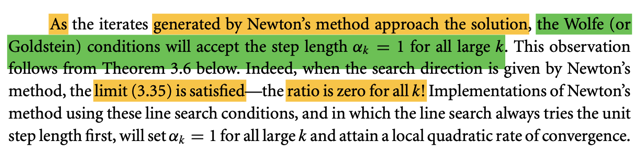</kbd></p>

> [!NOTE]
> Đại khái là khi dùng Newton method, và đến gần solution, thì các điều kiện dừng như Wolfe và Goldstein condition của các thuật toán line search sẽ đều chọn `αk` `=` 1 (gọi là full Newton step).
>
> Phần dưới Theorem 3.6 sẽ cho thấy điều này.

<br>

                    <a id="node-8g6rf7x"></a>
                    - **Phương pháp Quasi-Newton**
<p align="center"><kbd>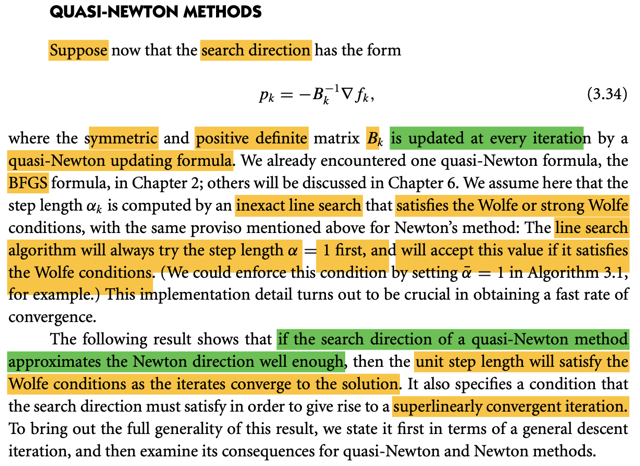</kbd></p>

> [!NOTE]
> Chuyển qua  phân tích cho phương pháp quasi-Newton. Như đã biết, search direction sẽ có dạng: pk `=` - (Bk)inv ∇fk
>
> Trong đó Bk sẽ là matrix symmetric, positive definite matrix, được update tại mỗi iteration.
> Nhớ lại chút xíu về ý tưởng chủ đạo của Quasi-Newton method: Nó sẽ tính toán một matrix Bk với mục đích là xấp xỉ matrix Hessian, và từ đó tính search direction. Mục đích là, **giảm chi phí tính toán khi thay vì phải tính Hessian, ta có cách khác để dùng một bản ước lượng của Hessian**. Mục đích dĩ nhiên là để **hưởng lợi được những tính chất tốt đẹp của Newton method như tốc độ hội tụ nhanh**.
>
> Và một trong những công thức để tính Bk đã gặp ở chương 2 là BFGS, và các công thức khác sẽ nói đến ở chương 6.
>
> Rồi, vậy thì đại khái là người ta giả định, hoặc **chỉ định** rằng: Trong cái bước chọn step length của Quasi-Newton method thì sẽ phải tính step length theo inexact line search và điều kiện dừng Wolfe. Và **cách làm sẽ phải là thử với `αk` `=1` và giảm dần. Và nếu như `α` `=` 1 thỏa thì dùng ngay step length này**.
>
> Thế thì **nếu mà đảm bảo thuật toán làm đúng như vậy** thì theorem sau sẽ chứng minh rằng **chỉ cần search direction sấp xỉ tốt được Newton direction thì thuật toán sẽ hội tụ siêu tuyến tính**.

> [!TIP]
> **🤖 AI Feedback** — ✅ Score: **90/100**
>
> Bản tóm tắt rất chính xác và thể hiện sự hiểu biết sâu sắc về các phương pháp Quasi-Newton. Để hoàn thiện hơn, hãy làm rõ mối liên hệ giữa việc hướng tìm kiếm xấp xỉ hướng Newton và điều kiện bước nhảy đơn vị thỏa mãn điều kiện Wolfe, từ đó dẫn đến hội tụ siêu tuyến tính.

<br>

                      <a id="node-sn062tn"></a>
                      - **Định lý 3.6: Hội tụ siêu tuyến tính**
<p align="center"><kbd>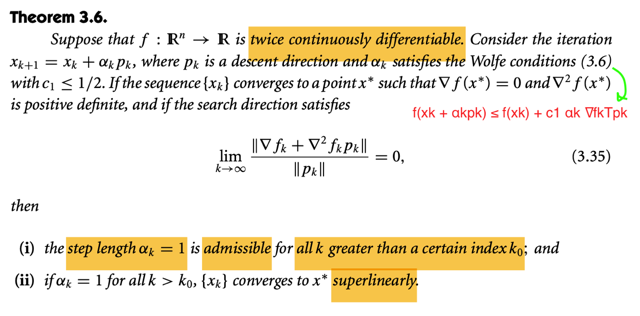</kbd></p>

> [!NOTE]
> ```text
> Đại khái là theorem này nói rằng, nếu như ta có iteration xk+1 = xk + αkpk với pk là descent direction, αk thỏa Wolfe condition với c1 ≤ 1.2 Và nếu chuỗi xk converge về x* có gradient vanish, và Hessian PD và nếu search direction pk thỏa lim k→0 ||∇fk + ∇^2fkpk|| / ||pk|| = 0
> ```
>
> Thì khi đó **thuật toán sẽ chọn `αk` `=` 1 với mọi k lớn hơn k0 nào đó** 
>
> (nôm na là khi qua một thời điểm nào đó (iteraton nào đó) thì step size sẽ luôn `=` 1
>
> Và khi đó sự hội tụ sẽ **cực nhanh (siêu tuyến tính)**

<br>

                        <a id="node-3acxdua"></a>
                        - **Phân tích Armijo với c1**
<p align="center"><kbd>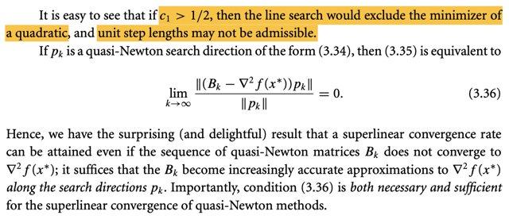</kbd></p>

> [!NOTE]
> Ở đây tác giả nói dễ thấy rằng **nếu c1 > 1/2** thì line search sẽ bỏ `/` **loại trừ minimizer của quadratic và unit step sẽ ko được chấp nhận**. Là sao?
>
>
> Thì có nghĩa là, nếu **c1 > `1/2` thì `αk` `=` 1 SẼ KHÔNG THỎA ARMIJO**, nên nó sẽ không được chọn `/` chấp nhận, mà thuật toán sẽ scale nó xuống.
>
> Ngược lại nếu c1 < `1/2` thì `αk` `=` 1 SẼ THỎA.
>
> Vậy thì mình chỉ cần kiểm tra xem có phải vậy ko.
>
> Nhớ lại Armijo condition: nôm na là **mức giảm hàm f (khi đi từ xk → xk + `αkpk)`
> phải ít nhất là bằng mức giảm của hàm tuýến tính độ dốc tại xk, với độ
> dốc điều chỉnh bởi c1**:
>
> Độ giảm của hàm f (mang dấu dương): f(xk) - f(xk+1) 
>
> phải ≥  
>
> Độ giảm hàm f bởi hàm tuyến tính: - c1 f'(xk) `αk` pk 
>
> ⇨ ta có điều kiện: f(xk) - f(xk+1) ≥ - c1 f'(xk) `αk` pk
>
> ⇔ f(xk+1) - f(xk) ≤ c1 f'(xk) `αk` pk
>
> ⇔ f(xk+1) ≤ f(xk) + c1 f'(xk) `αk` pk
>
> Thế thì, cái chính người ta nói ở đây đó là: 
>
> **khi tới gần x* thì hàm f hành xử rất giống hàm quadratic**, nên **nếu c1 > `1/2` thì `αk` `=` 1 sẽ không thỏa inequality trên**
>
> Mình cần chứng minh cho thấy điều này:
>
> Vậy thì, nếu đã nói hàm f hành xử giống hàm bậc hai, thì ta có:
>
> f(xk+1) ≈ f(xk) + f'(xk)(xk+1 - xk) + `(1/2)f''(xk)(xk+1` - xk)^2
>
> ```text
> = f(xk) + f'(xk)αkpk + (1/2)f''(xk)(αkpk)^2 = g(αk)  (Thay xk+1 - xk = pk)
> ```
>
> ⇨ f(xk+1) ≈ f(xk) + `f'(xk)αkpk` + `(1/2)f''(xk)(αkpk)^2` (1)
>
> Và với `αk` `=` 1, thì `αkpk` sẽ dẫn ta tới minimizer:
>
> ```text
> Tức là g'(1) = 0  ⇔ f'(xk)pk + f''(xk)(pk)^2αk |αk=1 = 0
> ```
>
> ⇔ f'(xk)pk + f''(xk)(pk)^2 `=` 0 
>
> ⇔ pk `=` `-f'(xk)/f''(xk)`
>
> ```text
> Thay vào: αk = 1, pk = -f'(xk)/f''(xk)
> ```
>
> Điều kiện Armijo: f(xk+1) ≤ f(xk) + c1 f'(xk) `αk` pk
>
> Thay  f(xk+1) ≈ f(xk) + `f'(xk)αkpk` + `(1/2)f''(xk)(αkpk)^2` ở (1) vào, ta có:
>
> ```text
> f(xk) + f'(xk)αkpk + (1/2)f''(xk)(αkpk)^2 ≤ f(xk) + c1 f'(xk) αk pk
> ```
>
> ```text
> ⇔ f'(xk)αkpk + (1/2)f''(xk)(αkpk)^2 ≤ c1 f'(xk) αk pk
> ```
>
> ⇔ `(1/2)f''(xk)(αkpk)^2` ≤ (c1-1)f'(xk) `αk` pk
>
> ⇔ `(1/2)f''(xk)(pk)` ≤ (c1-1)f'(xk)
>
> ⇔ `(1/2)f''(xk)(-f'(xk)/f''(xk))` ≤ (c1-1)f'(xk)
>
> ⇔ `(1/2)(-f'(xk)/)` ≤ (c1-1)f'(xk)
>
> ⇔ `(-1/2)f'(xk)` ≤ (c1-1)f'(xk)
>
> Chia hai vế cho f'(xk) là số âm nên đổi dấu:
>
> ⇔ `(1/2)(-1)` ≥ (c1-1)
>
> ⇔ `(-1/2)` ≥ c1-1
>
> ⇔ `1/2` ≥ c1
>
> Như vậy là ta đã **bắt đầu với Armijo condition**, và **thay `αk` `=` 1 vào** và cũng như là **cái mà ta có khi sử dụng the fact là hàm f hành xử như hàm bậc 2** thì thấy rằng để inequality Armijo thỏa thì ta phải có ta phải có c1 ≤ `1/2`

<br>

                          <a id="node-3uu0w64"></a>
                          - **Điều kiện hội tụ siêu tuyến tính Quasi-Newton**
<p align="center"><kbd>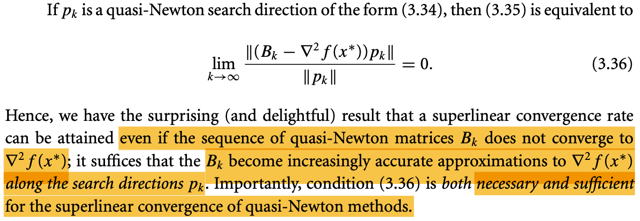</kbd></p>

> [!NOTE]
> Chỉ nói là nếu pk là Quasi-Newton search direction thì cái limit của theorem
> này sẽ có dạng như vầy.
>
> Và nói rằng, **theorem này cho rằng ta sẽ đạt superlinear convergence ngay cả khi Bk ko converge về Hessian ∇^2 f(x*)**, 
>
> mà **chỉ cần nó ngày càng approx tốt Hessian tại x* là đủ**

<br>

                            <a id="node-n31da73"></a>
                            - **Hội tụ siêu tuyến tính Quasi Newton**
<p align="center"><kbd>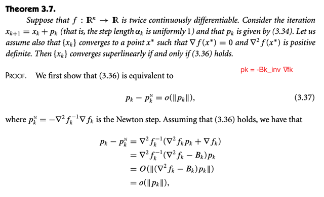</kbd></p>

<p align="center"><kbd>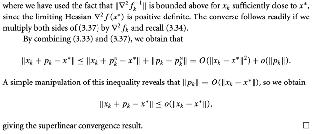</kbd></p>

<p align="center"><kbd>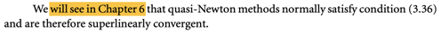</kbd></p>

> [!NOTE]
> Theorem này nói: với xk+1 `=` xk + pk, và pk `=` -(Bk)inv ∇fk của quasi Newton method, và xk hội tụ về x* có gradient `=` 0 và Hessian PD.
>
> Thì **xk sẽ hội tụ siêu tuyến tính khi và chỉ khi ta có cái limit 3.36**
>
> PHẦN CHỨNG MINH QUAY LẠI NGHIÊN CỨU SAU
>
> Ý nghĩa của cái này là chứng minh rằng **quasi Newton cũng hội tụ rất nhanh dù ko bằng Newton thật**
>
> ta sẽ còn nghiên cứu quasi Newton trong chap 6

<br>


<a id="node-att76s3"></a>
## Phương pháp Newton sửa đổi Hessian

<p align="center"><kbd>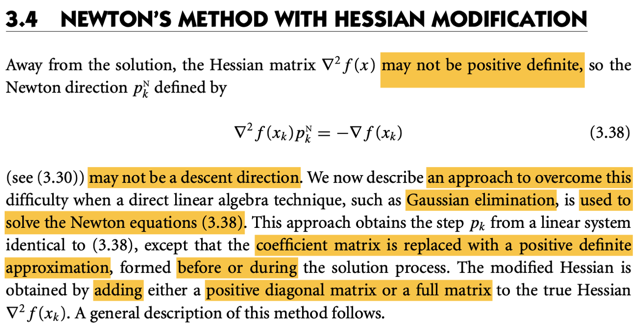</kbd></p>

> [!NOTE]
> Phần này đại khái là, nói về case** khi Hessian không xác định dương**, thì Newton direction vốn như đã biết là solution của equation: 
>
> ∇^2fk pkN `=` - ∇fk
>
> khi đó **sẽ chưa chắc là descent direction**. 
>
> Lí do là vì, khi Hessian PD, thì ta có, pkN `=` - ∇^2fk ∇fk. Directional derivative wrt pkN tạ xk: 
>
> `=` pkNT ∇fk
>
> `=` - (∇^2fk ∇fk) ∇fk 
>
> `=` - ∇fkT ∇^2fk ∇fk sẽ **chắc chắn là âm** nếu gradient khác 0
>
> **Còn khi Hessian ko PD** thì lưu ý là ta **vẫn có thể có nghiệm pkN**, vì Hessian vẫn có thể invertible, hoặc vẫn có thể có nhiều nghiệm (khi - ∇fk nằm trong column space của Hessian) nhưng **không chắc directional derivative wrt pkN tại xk âm nữa**.
>
> Vậy thì ở đây, ý chính là người ta giới thiệu **một kĩ thuật để vượt qua tình huống khó khăn này**. Trong đó đại ý là, **sửa đổi ma trix Hessian để khiến cho nó positive definite giúp đi theo Newton direction giúp giảm giá trị f** 
>
> Việc này **có thể xảy ra trước hoặc trong khi quá trình giải nghiệm diễn ra**. 
>
> Và giải pháp là **bằng cách thêm matrix chéo dương hoặc full matrix vào Hessian**
>
> Và có nhắc đến việc ta sẽ **dùng phương pháp khử Gauss để giải hệ này**

<br>


<a id="node-ij80zd8"></a>
### Newton với sửa đổi Hessian

<p align="center"><kbd>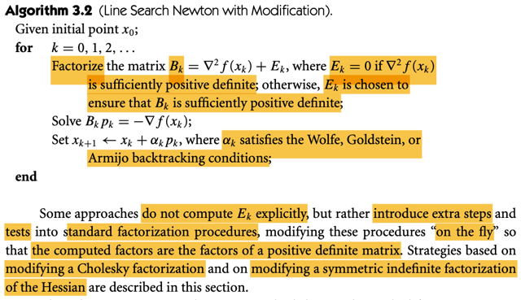</kbd></p>

> [!NOTE]
> Thế thì thuật toán này cho thấy, ta sẽ** thiết lập matrix Bk `=` Hessian tại xk + Ek**
> trong đó **Ek sẽ được chọn để đảm bảo rằng Bk positive definite**.
>
> Nhờ vậy **giải Bk pk `=` - ∇fk sẽ ra nghiệm pk là descent direction**. 
>
> Và sau đó **chạy bước tìm step size thỏa Wolfe `/` Goldstein `/` Armijo condition** như thường lệ
>
> Nói chung, cần hiểu lại là, **cái này là vì Hessian tại xk có thể không PD, nên giải tìm Newton direction tại đó có thể sẽ không phải là descent direction**.
>
> Nên ở đây người ta **có cách làm để sửa nó lại, bằng cách thay Hessian tại k bởi Bk bằng cách cộng thêm Ek vào Hessian khiến Bk là positive definite matrix**, từ đó giúp pk trở thành descent direction.
>
> Tác giả nói thêm vài ý hiểu đại khái là **có nhiều cách làm** (trong việc tính ra Ek) trong đó **có khi người ta ko tính Ek, mà có thêm các bước extra trong quá trình factorization**, thực hiện **theo lối "on the fly" (hiểu đại khái là làm trong lúc đang xảy ra) sao đó kết quả ta có PD matrix**. Những chiến thuật này dựa trên việc chỉnh sửa Cholesky factorization

> [!TIP]
> **🤖 AI Feedback** — ✅ Score: **92/100**
>
> Bạn đã giải thích rất rõ ràng, chính xác và thể hiện sự hiểu biết sâu sắc về mục đích cũng như cơ chế của thuật toán. Tuy nhiên, bạn đã bỏ sót việc đề cập đến "phân tích nhân tử bất định đối xứng" như một chiến lược khác trong phần cuối.

<br>


<a id="node-xamqjj9"></a>
#### Điều kiện hội tụ thuật toán 3.2

<p align="center"><kbd>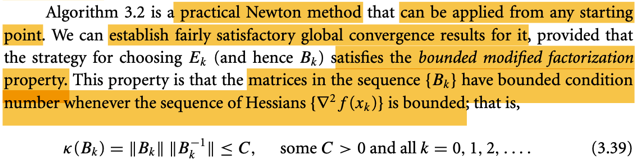</kbd></p>

<p align="center"><kbd>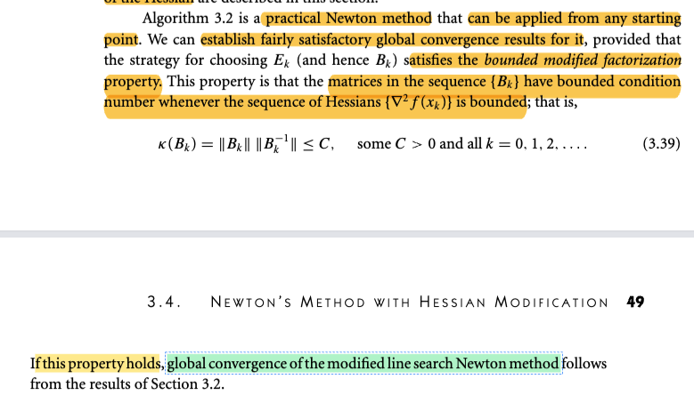</kbd></p>

> [!NOTE]
> Đại khái là ta có thể chứng minh rằng thuật toán 3.2, **nếu như việc chọn Ek thỏa cái gọi là bounded modified factorization**, tức là chuỗi matrix Bk sẽ có **condition number** bị chặn nếu như chuỗi Hessian bị chặn:
>
> Thể hiện bởi toán học: k(Bk) `=` ||Bk|| ||Bkinv|| ≤ C với some C dương, và mọi k `=` 0,1,2,...
>
> Chỗ này ôn lại chút về conditinon number, tại sao k(Bk) `=` ||Bk|| ||Bkinv||:
>
> k(A) theo định nghĩa là tỉ lệ giữa stretching factor lớn nhất và nhỏ nhất bởi matrix A.
>
> Stretching factor lớn nhất: Khi B nhân x, nó tạo vector mới Bx có độ dài thay đổi. Thì người ta gọi tỉ lệ kéo giãn lớn nhất bởi A, là norm A: ||A|| `=` `max_x` ||Ax|| `/` ||x||
>
> Mà ta có thể chứng minh nó chính là λmax(A):
>
> Giải bài toán maximize over x ||Ax|| `/` ||x||:
>
> Vì ||Ax|| `/` ||x|| không âm nên ta có thể giải bài toán tương đương:
>
> maximize over x ||Ax||^2 `/` ||x||^2 `=` xTATAx `/` xTx
>
> ```text
> xTATAx = xTQΛQTx = Σ_i=1:n ((QTx)_i)^2 λi
> ```
>
> Và cái này thì áp dụng λmin ≤ λi ≤ λmax
>
> ```text
> Σ_i=1:n ((QTx)_i)^2 (λmin) ≤ Σ_i=1:n ((QTx)_i)^2 λi ≤ Σ_i=1:n ((QTx)_i)^2 λmax
> ```
>
> ```text
> ⇔ λmin Σ_i=1:n ((QTx)_i)^2 ≤ Σ_i=1:n ((QTx)_i)^2 λi ≤ λmax Σ_i=1:n ((QTx)_i)^2
> ```
>
> ⇔ λmin ||QTx||^2 ≤ `Σ_i=1:n` ((QTx)_i)^2 λi ≤ λmax ||QTx||^2 
>
> ⇔ λmin ||x||^2 ≤ `Σ_i=1:n` ((QTx)_i)^2 λi ≤ λmax ||x||^2
>
> ⇔ λmin ≤ `Σ_i=1:n` ((QTx)_i)^2 λi ≤ λmax
>
> ⇨ λmin ≤ xTATAx `/` xTx ≤ λmax
>
> Lưu ý nãy giờ λ là của ATA
>
> ⇨ `max_x` ||Ax||^2 `/` ||x||^2 `=` λmax(ATA)
>
> ⇨ `max_x` ||Ax|| `/` ||x|| `=` √λmax(ATA)
>
> và `min_x` ||Ax||^2 `/` ||x||^2 `=` λmin(ATA)
>
> ⇨ `min_x` ||Ax|| `/` ||x|| `=` √λmin(ATA)
>
> Mà quan hệ giữa eigenvalue của A và Ainv là: λ(A) `=` `1/λ(Ainv)` 
>
> ⇨ λ(ATA) `=` 1 `/` λ[(ATA)inv]
>
> ```text
> ⇨ λmin(ATA) = 1 / λmax[(ATA)inv]  (ví dụ λ(A) = 2, 3 ⇨ λ(Ainv) = 1/3, 1/2)
> ```
>
> Chỗ này coi chừng lộn nhé, phải là **"1 chia λmax(Ainv)**. Ví dụ λ(A) `=` 2, 3 thì λ(Ainv) `=` `1/3,` `1/2.` 
>
> ```text
> ⇨ λmin(A) (=2) = 1 / λmax(Ainv) (=1/(1/2))
> ```
>
> Vậy [stretching factor lớn nhất] `/` [stretching factor nhỏ nhất] 
>
> `=√` {λmax(ATA) `/` λmin[(ATA)]}
>
> `=√` {λmax(ATA) `/` `[1/` λmax[(ATA)inv]]} 
>
> `=√` {λmax(ATA) . λmax[(ATA)inv]} 
>
> Mà như đã thấy √λmax(ATA) `=` ||A||, thì √λmax[(ATA)inv] `=` ||Ainv||
>
> Như vậy k(A) thì cũng là ||A|| . ||Ainv||
>
> ⇨ k(A) `=` ||A|| . ||Ainv||
>
> `=` √ λmax(ATA) . √λmax(ATAinv)
>
> Mà λ(ATA) thì chính là `σ(A)^2` (cũng như λ(ATAinv) `=` `σ(Ainv)^2`
>
> ⇨ [max stret] `=` √λmax(ATA) `=` `σmax(A)`
>
> Và [min stret] `=` √λmin(ATA) `=` `σmin(A)`
>
> ```text
> và k(A) = [max stret]  / [min stret]= σmax(A) / σmin(A)
> ```
>
> Vậy tóm lại:
>
> k(A) `=` [stretching factor max] `/` [stretching factor min] `=` ||A|| ||Ainv||
>
> `=` √λmax(ATA) . √λmax(ATAinv)
>
> `=` √λmax(ATA) `/` √λmin(ATA) 
>
> ```text
> = σmax(A) / σmin(A)
> ```
>
> `====`
>
> Một trường hợp đặc biệt khi A là symmetric positive definite matrix:
>
> ```text
> Thì khi đó A = QΛQT cũng là UΣVT, nên σ(A) = ||λ(A)|| = √λ(ATA)
> ```
>
> ```text
> ⇨ k(A) = [max stret] / [min stret] = √λmax(ATA) / √λmin(ATA)
> ```
>
> ```text
> = λmax(A) / λmin(A) = σmax(A) / σmin(A)
> ```
>
> Vậy áp dụng ở đây thì k(Bk) `=` ||Bk|| . ||Bkinv||
>
> và theo tác giả thì nếu như **với mọi matrix Bk th2i con số condition number đều bị chặn dưới bởi C dương** nào thì khi đó theorem 3.8 có thể xác nhận rằng **thuật toán Newton method mà trong đó Hessian được sửa đổi để có descent step** sẽ có thể **global convergence**.

> [!TIP]
> **🤖 AI Feedback** — ⚠️ Score: **72/100**
>
> Bài làm của bạn thể hiện sự đào sâu đáng kể vào định nghĩa và các thuộc tính của condition number, một điểm cộng lớn cho sự nỗ lực và kiến thức nền tảng. Tuy nhiên, việc hiểu sai "bounded condition number" là "bị chặn dưới" thay vì "bị chặn trên" là một lỗi nghiêm trọng làm thay đổi hoàn toàn ý nghĩa của thuộc tính quan trọng này trong ngữ cảnh hội tụ thuật toán.

<br>

<a id="node-f4zdhnw"></a>
- **Theorem 3.8**
<p align="center"><kbd>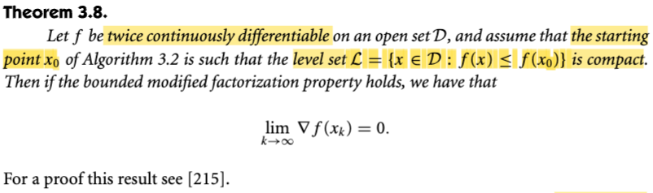</kbd></p>

> [!NOTE]
> Đại khái là theorem này nói rằng nếu như tính chất về vịệc các modified matrix Bk có condition number bị chặn trên như vừa nói, và thuật toán 3.2 có điểm khởi tạo x0 thỏa điều kiện là level set L `=` {x ∈ D: f(x) ≤ f(x0)} là compact set. Thì theorem này nói ta sẽ có: 
> ∇f(xk) → 0 khi k → inf. Mà điều này chính là cho thấy thuật toán sẽ global convergence.
>
> Tác giả không chứng minh ở đây, quay lại xem chứng minh ở trang 215 sau.

> [!TIP]
> **🤖 AI Feedback** — ✅ Score: **95/100**
>
> Bản tóm tắt rất chính xác về các điều kiện và kết luận của định lý, bao gồm cả điều kiện về hàm số và tập mức. Việc giải thích thêm về “condition number” và liên hệ tới “global convergence” cho thấy sự hiểu biết sâu sắc.

<br>

  <a id="node-dxmqa2m"></a>
  - **Hội tụ bậc hai Thuật toán 3.2**
<p align="center"><kbd>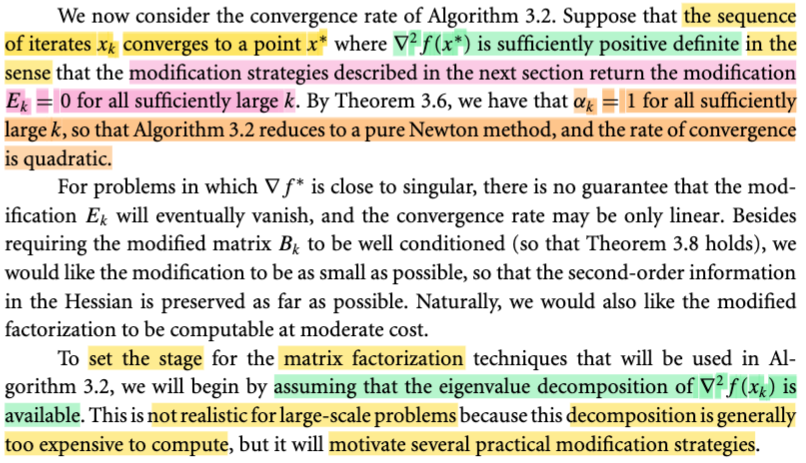</kbd></p>

> [!NOTE]
> Đoạn này đại ý là nếu ta soi thuật toán 3.2 sẽ thấy rằng nếu chuỗi xk converge về x* nơi có ∇^2 f(x*) có tính sufficiently positive definite theo nghĩa là chiến lược chỉnh sửa (mà ta sẽ xem xét trong phần kế tiếp) trả về một matrix Ek `=` 0, 
>
> Mà điều này có nghĩa là khi xk tiến gần đến x* thì Hessian tại đó dần trở thành xác định dương rồi, nên thuật toán chỉnh sửa bằng cách cộng Ek vào Hessian để tạo Bk xác định dương và giúp pk `=` - (Bk)inv ∇fk thỏa yêu cầu là descent direction) không cần add Ek gì nữa
>
> Thì khi đó về cơ bản thuật toán 3.2 chỉ là Newton method bởi nó dùng pk là Newton step, `=` - `(∇^2f_k)inv` ∇fk chứ không cần - (Bk)inv ∇fk nữa.
>
> Hơn nữa, theo theorem 3.2 thì với k đủ lớn, tức xk đủ gần x* thì `αk` `=` 1 sẽ luôn được chọn khiến full Newton step, và theo phân tích của Newton method convergence analysis thì ta biết tốc độ hội tụ sẽ là quadratic

> [!TIP]
> **🤖 AI Feedback** — ❌ Score: **55/100**
>
> Phân tích đoạn đầu khá chi tiết và sâu sắc, nhưng việc nhầm lẫn Định lý 3.6 thành 3.2 là một lỗi nghiêm trọng. Hơn nữa, em đã bỏ qua hoàn toàn hai đoạn văn bản quan trọng còn lại, khiến bản tóm tắt thiếu tính đầy đủ và toàn diện.

<br>

    <a id="node-ul5s5qx"></a>
    - **Hội tụ tuyến tính Hessian đơn trị**
<p align="center"><kbd>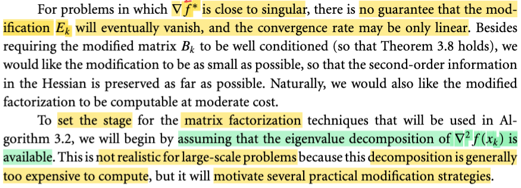</kbd></p>

> [!NOTE]
> ```text
> Ôn lại một chút về cái đang nói: Đó là dùng Newton method khi mà Hessian tại xk không xác định dương, khiến Newton direction - (∇^2f_k)inv ∇f_k không phải descent direction. Thì người ta khắc phục bằng cách thay Hessian ∇^2 f_k bởi B_k bằng ∇^2 f_k + E_k, để có được B_k là xác định dương. ⇨ - (Bk)inv ∇f_k là descent direction.
> ```
>
> Thế thì, như note trước vừa nói, nếu mọi chuyện tốt đẹp thì khi đến một lúc nào đó (k nào đó) Hessian tại k sẽ bắt đầu xác định dương, và việc chỉnh sửa sẽ không còn cần nữa, tức Ek thành 0 và thuật toán trở thành Newton method thật sự, với các đặc điểm tốt đẹp là hội tụ nhanh.
>
> Nhưng điều này không phải luôn xảy ra, không phải lúc nào Hessian gần x* cũng xác định dương. Cụ thể là khi bản thân Hessian tại x* rất gần singular, tức vẫn xác định dương, nhưng λmin của nó rất ≈ 0. Khi đó dĩ nhiên khi xk → x* thì Hessian tại xk cũng vậy. 
>
> ```text
> Khi đó, thuật toán không thể dùng E_k = 0 được, vì nếu vậy thì B_k = ∇^2 f_k + E_k cũng sẽ gần singular ⇨ việc tính - (Bk)inv ∇f_k sẽ bị vấn đề.
> ```
>
> Và do đó, thuật toán này sẽ không dần trở thành Newton method được (vì Ek không thể trở thành 0) khiến cho nó sẽ không đạt được quadratic convergence rate mà chỉ là linear rate → chậm.
>
> Ý tiếp theo đại khái là nói rằng ta cần đảo bảo Bk có well conditioned ⇨ Thỏa theorem 3.8 cũng như là cần phải modify cái Hessian càng ít càng tốt, tức giữ Ek càng nhỏ càng tốt, mục đích là để giữ được thông tin về độ cong giúp estimate chính xác, hay hiểu theo nghĩa là cần phải giữ - (Bk)inv ∇fk càng gần giống Newton direction càng tốt. 
>
> Và lẽ dĩ nhiên ta cũng cần phép phân tách được tính toán với chi phí càng thấp càng tốt.
>
> Cuối cùng đó là, để chuẩn bị nói về các phép phân tách ma trận, dùng trong thuật toán 3.2, ta sẽ bắt đầu với việc giả định là phép phân tách eigenvalue ∇^2 `f_k` tồn tại. Dù trong thực tế thì điều này không phải luôn đúng vì với large-scale problem thì thường là phép phân tách này rất tốn kém.

> [!TIP]
> **🤖 AI Feedback** — ✅ Score: **96/100**
>
> Bài phân tích rất chi tiết và chính xác, thể hiện sự hiểu biết sâu sắc về nội dung. Hầu hết các điểm chính đều được nắm bắt và giải thích rõ ràng. Tuy nhiên, bạn đã bỏ sót một chi tiết nhỏ ở cuối đoạn văn, đó là việc giả định phân tích eigenvalue sẽ "thúc đẩy một số chiến lược điều chỉnh thực tế".

<br>

      <a id="node-8iaysmh"></a>
      - **Sửa đổi giá trị riêng**
<p align="center"><kbd>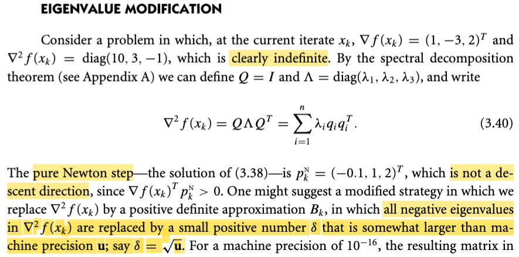</kbd></p>

<p align="center"><kbd>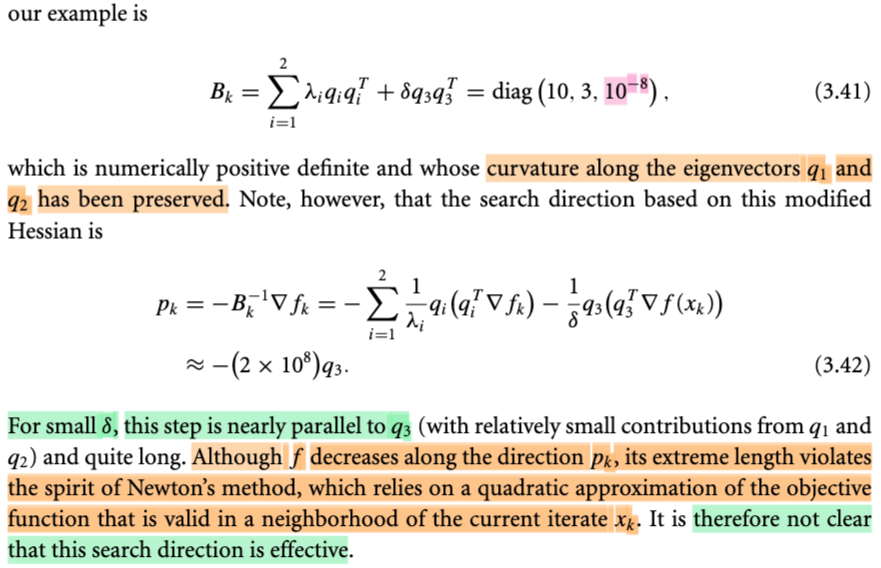</kbd></p>

> [!NOTE]
> Rồi, đại khái là thế này: Tác giả minh họa một tính huống mà nếu ta chỉnh sửa cái Hessian tại k để có được một Bk xác định dương thì thật ra sẽ là thảm họa:
>
> Trong ví dụ này ta có gradient `∇f_k` `=` (1, -3, 2)T, và Hessian tại k là diagonal matrix diag(10, 3, -1), rõ ràng đây là clearly indefinite matrix, tức là ma trận không xác định (các eigenvalues vừa âm vừa dương, không xác định âm cũng không xác định dương).
>
>  Thế thì tính thử, dù như đã biết, `H_k` không xác định dương thì chưa chắc Newton step đã là descent direction: 
>
> Tính thử - (Hk)inv `∇f_k`
>
> ```text
> = - diag(1/10, 1/3, 1/-1) [1, -3, 2]T
> ```
>
> Ở đây nói về kiến thức đại số tuyến tính chút xíu, nhờ MIT 1806 mình đã biết: Với diagonal matrix (hay nói chung triangular matrix) thì eigenvalues nằm trên đường chéo. Và λ(Ainv) `=` 1 `/` λ(A) ⇨ Ta có (Hk)inv như vậy, hoặc cũng có thể dùng Hk (Hk)inv `=` I để suy ra (Hk)inv.
>
> Kết quả phép nhân trên cho ra vector pk `=` `[-1/10,` 1, 2]T. 
>
> Tính thử directional derivative wrt hướng pk:
>
> ```text
> pkT∇f_k = -1/10 × 1 + 1 × (-3) + 2 × 2 = -1/10 - 3 + 4 = 1 - 1/10 = 9/10 > 0, tức là dương ⇨ pk không phải descent direction
> ```
>
> Thế thì có thể ta sẽ nghĩ đến chuyện sửa cái Hessian này, bằng cách cộng vào một số nhỏ thôi để vừa đủ để làm cho matrix trở thành xác định dương. Và ta làm vậy bằng cách cộng vào cái giá trị -1, để biến nó thành dương (khi đó mọi trị riêng đều dương thì matrix xác định dương)
>
> ```text
> Và vì sao ta không muốn cộng số lớn, là bởi như đã nói, nguyên tắc là chỉ thay đổi Hessian càng ít càng tốt để không làm mất đi thông tin về độ cong mà nó mang theo. Và cũng không thể cộng vào trị riêng đó sao cho chỉ tạo ra một số dương vô cùng nhỏ được, vì máy tính sẽ bị lỗi. nên mới thấy tác giả nói về con số dương nhỏ nhất gọi là machine precision. Tức là ta sẽ thay cái trị âm của H_k bởi con số dương δ này. δ = √u. Ví dụ là √10^-16 = 10^-8
> ```
>
> Khi đó `B_k` `=` diag(10, 3, 10^-8) đã xác định dương. Thử tính lại pk:
>
> ```text
> pk = - (Bk)inv ∇f_k = - diag(1/10, 1/3, 1/δ) [1, -3, 2]T
> ```
>
> ```text
> = - [(1/10) × 1, (1/3) × (-3), (1/δ) × 2]T
> ```
>
> ```text
> = [-1/10, -1, 2/δ]T
> ```
>
> ```text
> Vấn đề là với δ = 10^-8 thì 2/δ là con số rất lớn, khiến pk sẽ rất lớn, và có thể thấy với tọa độ thứ 3 rất lớn thì nó sẽ gần như song song với hướng của e3. Cũng có thể phân tích như tác giả trong sách:
> ```
>
> ```text
> H_k = I Hk I = I Hk IT . Và H_k với bản thân là diagonal matrix thì ta có thể coi như đây là eigendecomposition của nó. Có nghĩa là các eigenvector của nó chính là các basis e's.
> ```
>
> Và nhớ lại Q Λ QT với các góc nhìn thứ hai khi nhân Q và Λ đã học từ MIT 1806, ta sẽ thấy nó là:
>
> [λ1q1, λ2q2, ..λnqn] QT 
>
> và theo góc nhìn thứ 4, ta sẽ có tổng các rank 1 matrix: λ1q1q1T +..λnqnqnT
>
> `=` `Σ_i=1:n` λiqiqiT
>
> ⇨ H `=` `Σ_i=1:n` λiqiqiT (λ1, λ2, λ3 là các trị riêng)
>
> ```text
> Dĩ nhiên cũng không khó để thấy H_inv cũng = Σ_i=1:n (1/λi)qiqiT
> ```
>
> Và Bk `=` diag(λ1, λ2, `δ)` thì ta có:
>
> ```text
> pk = - (Bk)inv ∇fk = [ (1/λ1)q1q1T + (1/λ2)q2q2T + (1/δ)q3q3T ] ∇fk
> ```
>
> ```text
> = (1/λ1)q1q1T∇fk + (1/λ2)q2q2T∇fk + (1/δ)q3q3T∇fk
> ```
>
> Thế vào và tính ra, trừ q3 để minh họa ý định sau, thì ta sẽ có ≈ (2 × 10^8)q3
>
> Và đây chính là thể hiện rõ hơn rằng **pk gần như song song với q3 và là một vector siêu dài.** 
>
> Và vấn đề là ở chỗ: Nó vi phạm ý tưởng của Newton method: Là vì với Newton method, nên nhớ là ta đang approx hàm f bằng một hàm quadratic. Và dĩ nhiên sự ước lượng này chỉ đúng trong một phạm vi nhất định nào đó quanh xk, có nghĩa là nếu giới hạn bước đi trong phạm vi nào đó quanh xk thì còn có thể đúng, đồng nghĩa pk còn có thể là descent direction. Còn với một pk quá dài như vậy, hàm f có thể không những giảm mà còn có thể tăng vọt, vì ước lượng không còn đúng thì pk không còn chắc là descent direction nữa.

> [!TIP]
> **🤖 AI Feedback** — ⚠️ Score: **88/100**
>
> Bài phân tích của bạn rất chi tiết và thể hiện sự hiểu biết sâu sắc về các khái niệm. Mặc dù có một vài lỗi nhỏ trong việc tính toán dấu, nhưng luận điểm chính và cách giải thích của bạn rất xuất sắc.

<br>

        <a id="node-a9edmoj"></a>
        - **Các chiến lược sửa đổi Hessian**
<p align="center"><kbd>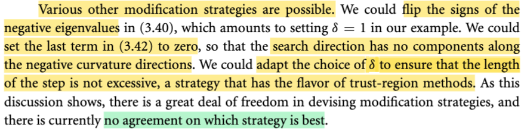</kbd></p>

> [!NOTE]
> Đọan này đại ý là có rất nhiều cách khác để chỉnh sửa matrix Hessian. Trong cách nói trên là ta thay cái trị riêng âm của Hk bởi số dương nhỏ nhất có thể cho phép. 
>
> Thì các cách khác có thể đơn giản là đổi dấu con số âm này, hoặc bỏ đi cái term q3 ở trên, để chỉ còn hai cái term q1, q2 gắn với hai eigenvalues dương mà thôi.
>
> Một cách nữa là cũng dùng `δ` dương để thay cái trị riêng âm nhưng dùng giá trị sao cho cái pk nó đừng có quá lớn (excessive), mà cách này thì khiến phương pháp này gần giống với trust-region method.
>
> Tuy nhiên cũng chưa có nghiên cứu này cho thấy cách nào là tốt nhất cả

<br>

          <a id="node-915bw72"></a>
          - **Matrix delta a có Fnorm nhỏ nhất**
<p align="center"><kbd>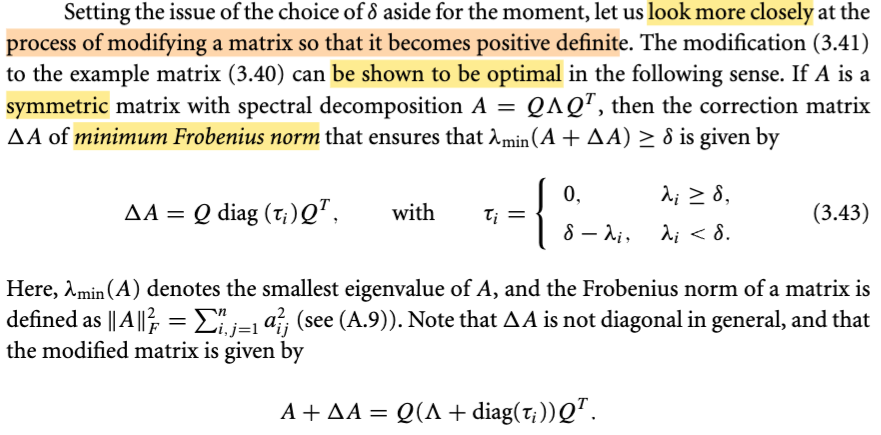</kbd></p>

> [!NOTE]
> ```text
> Đại khái đoạn này là vầy, tạm thời bỏ qua cái vụ nếu chọn δ không kĩ thì sẽ có vấn đề, ta sẽ xem xét kĩ hơn cái bước sửa matrix để nó thành xác định dương. Và tác giả nói rằng, việc sửa matrix, có thể có cách để chứng minh rằng cách sau đâu sẽ là tối ưu. Và tối ưu ở đây theo nghĩa là, ta sẽ chỉ cần add một matrix ΔA vào A để thành A + ΔA xác định dương với ΔA tối thiểu.
> ```
>
> ```text
> Và tối thiểu ở đây đo bằng Frobenius norm. Và cái matrix ΔA có F norm tối thiểu đó chính là: Q diag(τ1,...τn) QT với τi = 0 nếu eigenvalue tương ứng của A, λi đã ok, tức đã dương và cụ thể hơn là đã lớn hơn δ là giá trị dương nhỏ nhất mà ta có thể xài (ví dụ như √u, machine precision hồi nãy). Và τi = δ - λi nếu như λi chưa ≥ δ.
> ```
>
> Thế thì, làm rõ vài ý: Vì sao `ΔA` `=` Q diag(τi) QT?
>
> ⇨ Đơn giản thôi khi đó A + `ΔA` `=` Q Λ QT + Q diag(τi) QT `=` Q (Λ + diag(τi)) QT. 
>
> Và matrix này sẽ có eigenvalues là λi + τi. Và với τi như vậy thì sẽ đảm bảo các eigenvalues của nó đều ≥ `δ.`
>
> Còn vì sao chọn `ΔA` như vậy thì sẽ là tối ưu, tức vì sao `ΔA` như này sẽ có Frobenius norm nhỏ nhất?
>
> ⇨ Thì đây là bước mà trong sách chỉ nói "can be shown", ta thử suy nghĩ:
>
> ```text
> Ok, bài toán sẽ là, tìm ΔA sao cho λ(A + Δ) ≥ δ nhưng ||ΔA||_F nhỏ nhất.
> ```
>
> Bài toán này chính là inequality constrained optimization problem:
>
> miminize `||ΔA||_F` subject to λ(A + `ΔA)` ≥ `δ`
>
> ```text
> Thế thì vì A đối xứng nên dĩ nhiên ΔA cũng đối xứng (dễ hiểu mà, nếu để tạo A + ΔA xác định dương thì nó phải vẫn đối xứng trước đã), nên ΔA = QT diag(τi) QT. Đây chỉ là việc đang nói là vì ΔA đối xưng nên có thể phân tách thành "dạng Q Λ QT" thôi nhé.
> ```
>
> ⇨ `||ΔA||_F` `=` ||Qdiag(τi)QT||.
>
> Tới đây, hãy nhớ lại tính chất của Frobenius norm của A theo định nghĩa, nó chỉ là căn bậc hai của tổng tất cả các phần tử của ma trận ⇨ ||A||F `=` `Σ_ij` (Ajj)^2. Và ta nhớ là có thể thể hiện cái này bởi tr(ATA), vì tr(ATA) là tổng các entries đường chéo của ATA.
>
> ```text
> ⇨||ΔA||_F = tr[(ΔA)TΔA)] = tr{[Qdiag(τi)QT]T(QTdiag(τi)QT)}
> ```
>
> `=` tr{Qdiag(τi)QTQdiag(τi)QT} `=` tr{Qdiag(τi)^2QT}
>
> `=` tr{Qdiag(τi)^2QT]T} | tr(A) `=` tr(AT)
>
> `=` tr{QQTdiag(τi)^2}
>
> `=` tr{diag(τi)^2}
>
> `=` `Σi` τi^2
>
> Như vậy objective trở thành minimize `Σi` τi^2 subject to λ(A + `ΔA)` ≥ `δ`
>
> Mà cái constraint có thể dễ thấy chính là λi + τi ≥ `δ` ⇔ `δ` - τi - λi ≤ 0 với i `=` 1,2...n 
>
> Viết lại bài toán: minimize `Σi` τi^2 subject to `δ` - τi - λi ≤ 0, hay `δ` - τ - λ ≺ 0 
>
> Nhớ lại dạng tổng quát của inequality constrained optimization:
>
>  minimize x f(x) subject to fi(x) ≤ 0, hi(x) `=` 0
>
> ⇨ Lagrangian: L(x, λ, ν) `=` f(x) + `Σi` λi fi(x) + `Σi` νi hi(x)
>
> KKT conditions: QUAY LẠI SAU (Sau khi ôn lại cuốn Convex Optimization S.Boyd)
>
> ```text
> Nói chung là có thể chứng minh rằng solution của bài toán này chính là τi = 0 nếu λi ≥ δ và bằng δ - λi nếu ngược lại. Và do đó diag(τi) là matrix có minimum Frobenius norm đảm bảo λmin(A + ΔA) ≥ δ
> ```

> [!TIP]
> **🤖 AI Feedback** — ✅ Score: **95/100**
>
> Học sinh thể hiện sự hiểu biết sâu sắc về nội dung, không chỉ dừng lại ở việc đọc hiểu mà còn chủ động tìm cách chứng minh tính tối ưu của phương pháp được đề cập, cho thấy khả năng tư duy phản biện và liên hệ kiến thức rất tốt.

<br>

            <a id="node-o2shqb0"></a>
            - **Delta A có cấu trúc diagonal và có spectral norm (L2 norm) nhỏ nhất**
<p align="center"><kbd>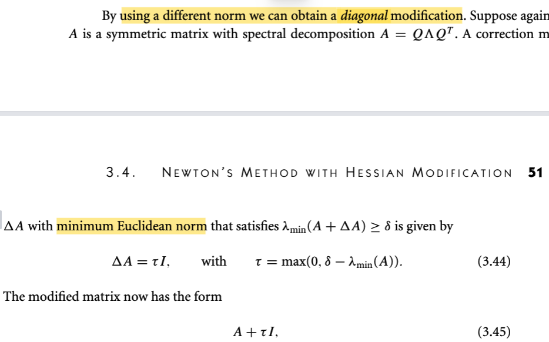</kbd></p>

> [!NOTE]
> Tiếp theo, đại ý là vừa rồi ta tìm `ΔA` tối thiểu để cộng vào A giúp sửa lại A sao cho eigenvalue nhỏ nhất của nó ≥  `δ` (một số dương nhỏ nhất có thể dùng được mà không bị lỗi máy tính) nhờ vậy mà nó trở nên xác định dương. Thì nói "tối thiểu" ở trên là theo Frobenius norm. Và theo cách này thì `ΔA` là một matrix tuy Fnorm tối thiểu nhưng là một matrix dense đặc.
>
> ```text
> Vậy thì bằng cách dùng "tối thiểu" đo bởi norm khác, ví dụ spectral norm (là cái mà ta đã học trong Chapter 11 của sách thầy Strang: ||A|| = max_x ||Ax|| / ||x||, tức stretching factor lớn nhất có được khi biến đổi tuyến tính x bởi A) thì ta có thể có ΔA là một diagonal matrix.
> ```
>
> ```text
> Và ΔA đó = τI, với τ = max(0, δ - λmin(A))
> ```
>
> ⇨ A + `ΔA` `=` A + τI.
>
> Nói chung là tạm hiểu rằng `ΔA` `=` τI chính là cái có spectral norm nhỏ nhất (trong số nhiều cái có spectral norm nhỏ nhất) mà có cấu trúc diagonal.
>
> Rồi, xét eigenvalues thay đổi thế nào: Nếu x, λ là vector riêng, trị riêng của A thì:
>
> Ax `=` λx. 
>
> Cộng hai vế cho τI:
>
> Ax + τIx `=` λx + τIx
>
> ⇔ (A + τI)x `=` (λ + τ)x. 
>
> Điều này cho thấy λ + τ là eigenvalues của A + τI, eigenvector vẫn là x.
>
> Vậy việc cộng τI với A đã shift, đẩy mọi giá trị riêng của A một khoảng `δ,` và do đó, cái thằng nhỏ nhất giờ sẽ ≥ `δ.`
>
> Tác giả cũng không chứng minh nên đành biết vậy thôi.

> [!TIP]
> **🤖 AI Feedback** — ❌ Score: **45/100**
>
> Bài phân tích thể hiện sự hiểu biết tốt về ảnh hưởng của phép cộng τI lên các trị riêng và mục đích làm cho ma trận xác định dương. Tuy nhiên, có sự nhầm lẫn nghiêm trọng trong việc diễn giải các chuẩn ma trận (Euclidean norm, Frobenius norm, spectral norm) như được trình bày trong văn bản gốc, dẫn đến mâu thuẫn về việc chuẩn nào tạo ra sự sửa đổi đường chéo. Cách dùng từ cũng chưa đủ chính xác khi nói về độ dịch chuyển của các trị riêng.

<br>

              <a id="node-7f8x060"></a>
              - **Chiến lược chỉnh sửa ma trận**
<p align="center"><kbd>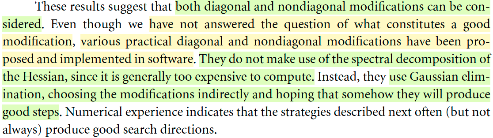</kbd></p>

> [!NOTE]
> Đại khái là nói rằng cái việc mà chỉnh sửa bằng cách là tạo thêm một cái ma trận để mà cộng vào ma trận gốc có thể được sử dụng một ma trận chéo hoặc là không chéo 
>
> Tuy vậy Mình vẫn chưa giải thích được mình vẫn chưa trả lời được cái câu hỏi là điều gì họ sẽ tạo nên một cái phép chỉnh sửa tốt
>
> Người ta nói trong thực tế thì người ta không dùng phép phân rã matrix Hessian vì nó quá tốn kém tính toán.
>
> Thay vào đó họ dùng Gaussian elimination, chỉnh sửa ma trix một cách gián tiếp với các chiến lược khác nhau với hi vọng là sẽ tạo ra được một good step.
>
> Đoạn tiếp theo sẽ nói về các strategies mà kinh nghiệm cho thấy thường là sẽ tạo ra good direction

> [!TIP]
> **🤖 AI Feedback** — ❌ Score: **40/100**
>
> Bài tóm tắt này thể hiện sự thiếu chính xác và hời hợt đáng kể. Việc sử dụng ngôn ngữ không trang trọng ("Đại khái là nói rằng", "Mình") hoàn toàn không phù hợp với văn phong học thuật. Sinh viên đã bỏ sót nhiều thông tin quan trọng, đặc biệt là về việc các phép chỉnh sửa đã được đề xuất và triển khai trong phần mềm, cũng như bỏ qua giới hạn "nhưng không phải lúc nào cũng vậy" khi nói về hiệu quả của các chiến lược, làm sai lệch ý nghĩa gốc. Cần cải thiện đáng kể về độ chính xác, đầy đủ và tính chuyên nghiệp.

<br>

                <a id="node-vo3sl8p"></a>
                - **Cholesky với cộng ma trận đơn vị**
<p align="center"><kbd>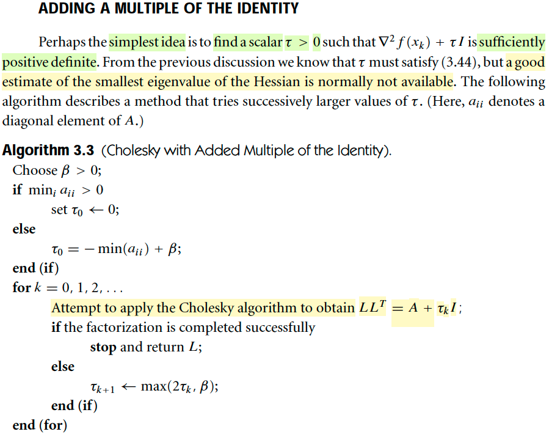</kbd></p>

<p align="center"><kbd>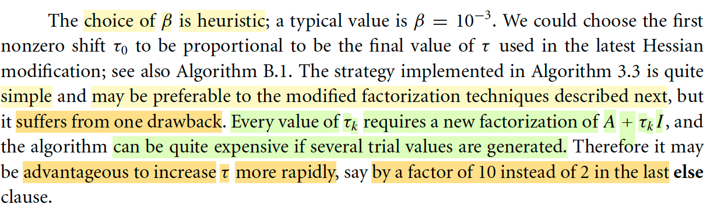</kbd></p>

> [!NOTE]
> Đại khái thuật toán này là sao?
>
> Nó khởi đầu với idea là, cách đơn giản nhất để chỉnh sửa A chính là add vào nó τI (mà hồi nãy, với τ `=` max(0, `δ` - λmin(A)) sẽ tạo ra cái matrix có spectral norm nhỏ nhất + và là diagonal matrix.
>
> Thì đại ý là, như nói ở đoạn trước, rằng cái việc tính được λmin(A) với A là là Hessian cũng không phải là dễ (rẻ). Thành ra trong thực tế sẽ có thể dùng các cách khác mang tính chất kinh nghiệm hơn.
>
> Ví dụ như ở đây, ý tưởng chủ đạo là: Check thử xem các entries trên đường chéo đã dương chưa, nếu chưa thì chắc chắn là chưa matrix chưa xác định dương, (ý này rất hay mà mình sẽ nói dưới) khi đó ta sẽ cộng một gía trị vào để cho nó thành dương.
>
> Khi đó dĩ nhiên nó vẫn chưa chắc là xác định dương (nhưng mà âm thì chắc chắn là không xác định dương), ta mới thử chạy thuật toán Cholesky factorization. Để rồi nếu chạy thuật toán thành công, đồng nghĩa matrix đã xác định dương, thì return. Còn ngược lại, lúc chạy thuật toán Cholesky factorization mà bị lỗi, thì ta sẽ tăng τ lên và làm lại.
>
> Nên nhìn vào thuật toán ta thấy: Nó check entries đường chéo nhỏ nhất (min i aii) xem có âm không, nếu không âm thì thôi, còn nếu âm thì cộng vào giá trị để nó dương, ví dụ min i aii `=` -2, thì cho τ `=` +2 + con số `β` dương nhỏ nữa ví dụ 10^-3 để nó thành 10^-3, dương.
>
> Qua bước sau, nó chạy thuật toán Cholesky factorization: LLT `=` A + τi I
>
> nếu thuật toán thành công tức A đã xác định dương thì return L
>
> ngược lại, thì lại tăng τi lên `(=` max(2τk-1, `β)` và làm lại bước thử factor.
>
> Thế thì nhược điểm của thuật toán này: Là nó có cái kiểu hên xui. Hên nhất là khi thử với τ0 là đã có A xác định dương rồi (phân rã ok). Nhưng xui thì thử nhiều τ (tăng τ nhiều lần) thì mới "phân rã Choleseky được". Mà mỗi lần factor thì cũng tốn kém.
>
> Cuối cùng ở đây ta học được một cách kiến thức chưa được nói đến ở MIT 1806 (có thể nói trong sách mà mình đọc không kĩ): Nếu A xác định dương thì mọi entreis đường chéo của nó phải dương (nhưng ngược lại thì chưa chắc đúng, có lẽ vì vậy mà nó ko thành theorem)
>
> Ôn lại 1806 mình đã biết 4 cách check tính xác định dương của ma trận: 
>
> 1) Mọi trị riêng dương
>
> 2) Det dương
>
> 3) Mọi leading principal: tức các matrix con tính từ góc trái mở rộng xuống dưới cũng phải có det dương
>
> 4) Quadratic form: xTAx phải dương với mọi x khác 0.
>
> Và từ cái 4 ta sẽ thấy mọi entries đường chéo phải dương, nếu mà âm thì chắc chắn là không xác định dương:
>
> Chọn x `=` standard basis vector e1 ⇨ e1TAe1 phải dương, mà cái này chính là: A11, vì sao?
> vì Ae1 cho ra cột 1 của A, → e1T(Ae1) lấy ra hàng 1 của (Ae1) tức là cái phần tử đầu tiên, chính là A11. Vậy e1TAe1 dương thì A11 phải dương. Tương tự như vậy với e2,...en ta sẽ thấy  ngay các Aii phải dương.
>
> Như vậy việc check min _i aii chính là cách để check nhanh xem A có qua được vòng 1 không, nếu ko thì bù vào để cho nó có entries đường chéo dương đã (dĩ nhiên như đã nói, vẫn chưa chắc là có đường chéo dương thì xác định dương)
>
> Quay lại đây, tác giả nói rằng để khắc phục nhược điểm này thì ta nên tăng τ nhanh lên, factor 10 thay vì 2.

> [!TIP]
> **🤖 AI Feedback** — ⚠️ Score: **70/100**
>
> Ghi chú của bạn thể hiện sự nắm bắt khá tốt về ý tưởng và động lực của thuật toán. Tuy nhiên, bạn đã mắc lỗi trong công thức cập nhật τk+1 (sử dụng τk-1 thay vì τk) và quan trọng hơn là một lỗi cơ bản về điều kiện định thức dương cho ma trận xác định dương, điều này cần được chỉnh sửa. Phần giải thích tại sao các phần tử đường chéo phải dương rất sâu sắc và chính xác.

<br>

                  <a id="node-pwaeza0"></a>
                  - **Modified Cholesky factorization**
<p align="center"><kbd>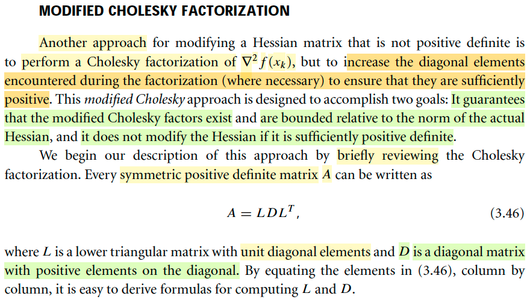</kbd></p>

> [!NOTE]
> Rồi, qua thuật toán này. Gọi là Modified Cholesky factorization. 
>
> Trước tiên Ôn lại một chút về thuật toán Cholesky with Added Multiple of Identity học ở bài trước: Thì cách làm đại khái là ta sẽ 1) Check các entries đường chéo có âm không, để bơm giá trị tối thiểu thêm cho nó trở thành dương (mục đích là để ít nhất đường chéo ko âm, vì âm thì chắc chắn là không thể xác định dương) Và bước 2) là thử chạy thuật toán Cholesky factorization. Mà cái này thì chỉ chạy thành công nếu ma trận xác định dương, nên nếu nó fail. tức là còn xác định âm, thì ta sẽ bơm thêm vào bằng cách cộng τI, với τ tăng dần sau mỗi lần fail. Cho đến khi nó không fail nữa, khi đó matrix đã trở thành xác định dương như đã nói.
>
> Thì cách này nó dở cái là nó có thể khiến phải chạy nhiều lần cái thuật toán Cholesky factorization gây tốn kém.
>
> Nên qua cách này, tức là thuật toán Modified Cholesky factorization thì đại khái là sẽ nâng cấp hơn. Cũng là dùng Cholesky factorization đối với Hessian tại xk, nhưng ta sẽ tăng giá trị của item trên đường chéo sao cho đảm bảo nó đủ dương giúp matrix xác định dương.
>
> Và ta sẽ tìm hiểu sau nhưng đại ý tác giả cho biết muốn đạt được hai mục tiêu: Đại khái thứ nhất vẫn là đảm bảo có thể Cholesky factorization có thể xảy ra. Và thứ hai là chỉ chỉnh sửa tối thiểu để norm của ma trix không quá khác với norm của Hessian gốc (nói chung cũng là để bảo toàn nhiều nhất thông tin curvature của Hessian)
>
> Vậy thì đầu tiên là ôn lại về Cholesky factorization. Ông nói mọi matrix đối xứng xác định dương sẽ đều có thể phân tách thành:
>
> A `=` LD(LT) với L là ma trận tam giác dưới có đường chéo unit, tức `=` 1 hết. D là chéo 
>
> Mình nghĩ: Trong MIT 18.06 chưa được học về Cholesky factorization (có thể đọc sách kĩ hơn thầy có nói). Nhưng ta nhớ nếu A symmetric thì ta có A `=` Q Λ QT.
>
> Rồi thế thì quay lại đây tác giả sẽ nói vè việc tính các entries của L D bằng cách equate entries của hai vế.

> [!TIP]
> **🤖 AI Feedback** — ✅ Score: **93/100**
>
> Ghi chú đã nắm bắt rất chính xác về phương pháp Cholesky Factorization được sửa đổi và các mục tiêu của nó. Điểm cộng là bạn còn cung cấp thêm bối cảnh về thuật toán trước đó, giúp tăng chiều sâu của nội dung. Có hai chi tiết nhỏ có thể bổ sung là mục tiêu không sửa đổi Hessian nếu nó đã xác định dương và các phần tử đường chéo của D cũng phải dương.

<br>

                    <a id="node-ijshp9n"></a>
                    - **Giải thích cách tính L, D**
<p align="center"><kbd>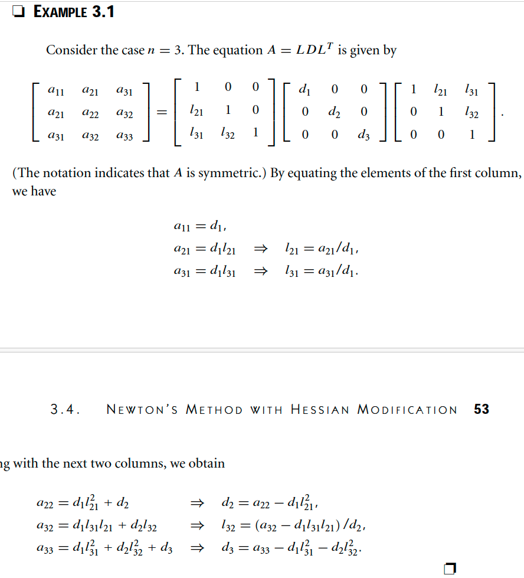</kbd></p>

> [!NOTE]
> Như đã nói ở note trước, ở đây tác giả cho ta thấy cách tính các entries của matrix L và D, mục đích để từ đó ta hiểu các bước tính toán của thuật toán Modified Cholesky Factorization sẽ nói ở sau.
>
> Vì sao a11 `=` d1?
>
> Dễ thôi, đã học 4 góc nhìn (hay bức tranh) nhân hai matrix A và B trong MIT 18.06. Thì theo column picture, xét cột 1 của LD(LT):
>
> Nó sẽ là kết quả của:
>
> 1) Tính LD: Ta sẽ linearly combine 3 cột của L với entries cột 1 của D, tức là ta có d1 × cột L1 
>
> 2) Sau đó (trong bước nhân với LT) thì lại linear combine các cột của LD với cột 1 của LT: và nó chỉ y nguyên, do cột đó là [1 0 0]T.
> Thành ra hàng 1 cột 1 của LD(LT) chính là `d1L_11` `=` d1.
>
> Nói chung lập luận tương tự ta sẽ hiểu các equation khác, từ đó có công thức tính các entries của L và D

> [!TIP]
> **🤖 AI Feedback** — ✅ Score: **95/100**
>
> Ghi chú giải thích rất rõ ràng và sâu sắc về cách các phần tử của ma trận L và D được tính toán, sử dụng trực giác từ phép nhân ma trận (column picture). Điều này giúp người đọc hiểu rõ hơn nền tảng của các công thức được đưa ra trong ví dụ.

<br>

                      <a id="node-bapd4vr"></a>
                      - **Thuật toán Cholesky LDLT**
<p align="center"><kbd>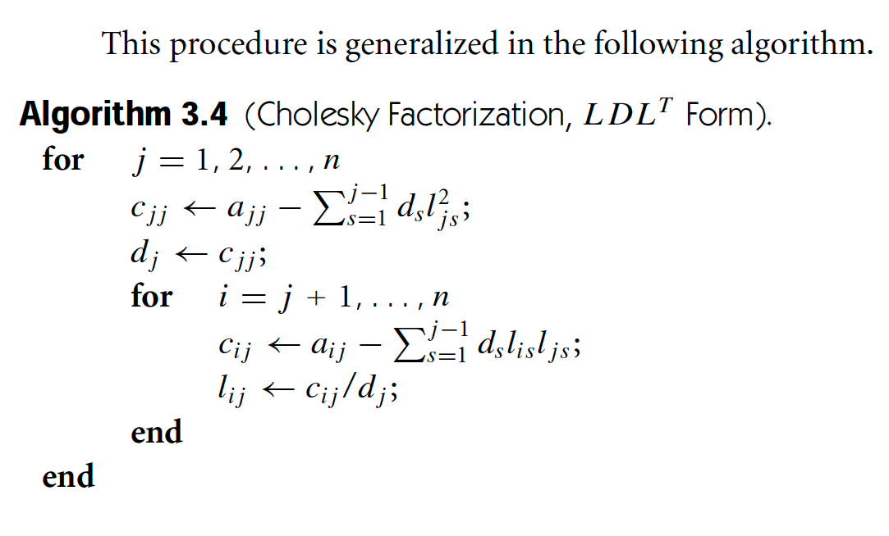</kbd></p>

> [!NOTE]
> Đây là thuật toán Cholesky Factorization: Nhắc lại, nó chỉ là thuật toán giúp tính ra matrix L và D, để giúp factor A thành LD(LT), chứ không phải là thuật toán Modified Cholesky Factorization đang sắp nói
>
> Nhìn vào thì cơ bản là nó làm cái bước mà ta vừa xem ở note trước thôi. Nhưng để ý chỗ này để thấy vấn đề của nó:
>
> Đó là nó có bước gán cjj cho dj và chia cij cho dj để tính lij.
>
> Nếu dj bằng 0, thuật toán này sẽ crash.

> [!TIP]
> **🤖 AI Feedback** — ✅ Score: **98/100**
>
> Phân tích rất chính xác, đặc biệt là việc chỉ ra nguy cơ lỗi chia cho 0 khi dj = 0, đây là một điểm quan trọng trong độ ổn định số của thuật toán Cholesky. Nội dung thể hiện sự hiểu biết sâu sắc về các vấn đề tiềm ẩn.

<br>

                        <a id="node-m1ru7a4"></a>
                        - **Phân tích Cholesky tiêu chuẩn**
<p align="center"><kbd>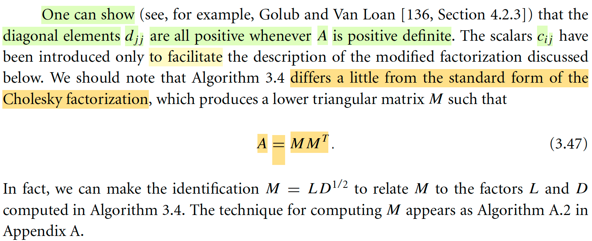</kbd></p>

> [!NOTE]
> Một ma trận xác định dương sẽ có các phần tử trên đường chéo chính đều dương. Việc chứng minh được thực hiện bằng cách xét dạng toàn phương (quadratic form) của ma trận với các vector cơ sở chuẩn (standard basis). Khi đó, giá trị của dạng toàn phương sẽ chính là các phần tử trên đường chéo. Do ma trận xác định dương nên dạng toàn phương luôn cho kết quả dương, từ đó suy ra các phần tử trên đường chéo chính cũng phải dương.
>
> Tiếp theo là nói về thuật toán Cholesky Factorization. Ở đây nó hơi khác với cái thuật toán Cholesky Factorization chuẩn, trong đó nó phân tách ma trận A thành M M transpose với M là một cái ma trận ở bên dưới.

<br>

                          <a id="node-f1zouok"></a>
                          - **Cholesky Factorization chuẩn**
<p align="center"><kbd>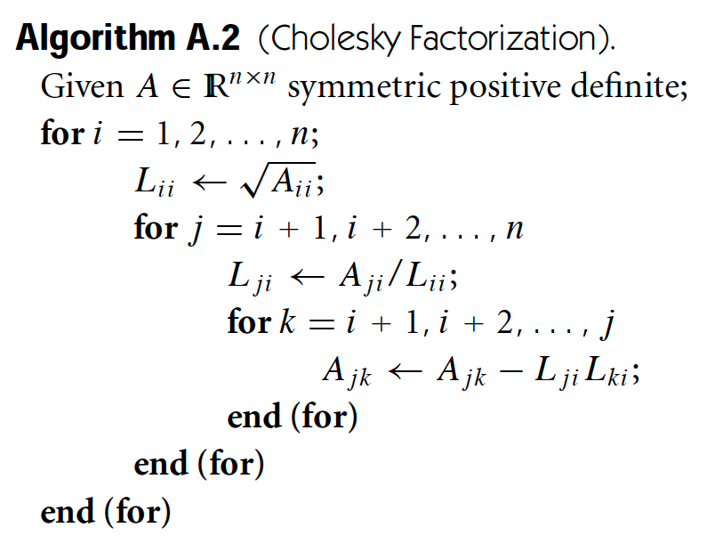</kbd></p>

> [!NOTE]
> Đây là thuật toán Cholesky Factorization chuẩn. Tách A `=` L(LT), hay M(MT).
>
> Có lẽ cũng không khó để hiểu. Bằng cách cho các entries tương ứng của A và L(LT) bằng nhau mình sẽ hiểu các bước của thuật toán này.
>
> Ví dụ vì sao Lii `=` √Aii:
>
> Xét A11, thì entry 11 của LLT chính là: Lấy L nhân với cột 1 của LT và lấy phần tử đầu tiên. cột 1 của LT là hàng 1 của L, là [L11,0...] (vì L là tam giác dưới) Vậy L . [cột 1 của LT] cho ra L11 nhân cột 1 của L, rồi lấy phần tử đầu tiên thì chính là L11^2
>
> Vậy A11 `=` L11^2 ⇨ L11 `=` √A11
>
> Còn các bước sau cũng dễ.
>
> Nói chung là ta sẽ chú ý thuật toán này sẽ crash nếu như A11 âm, vì lấy căn số âm, hoặc khi Lii `=` 0 trong bước Lji `=` Aji `/` Lii

> [!TIP]
> **🤖 AI Feedback** — ✅ Score: **95/100**
>
> Phân tích rất chính xác về thuật toán Cholesky Factorization, từ cơ sở lý thuyết A = LLT đến ví dụ cụ thể Lii = √Aii. Việc chỉ ra các trường hợp thuật toán có thể 'crash' cũng rất hữu ích và thể hiện sự hiểu biết sâu sắc.

<br>

                            <a id="node-nxpccgq"></a>
                            - **Modified Cholesky Factorization**
<p align="center"><kbd>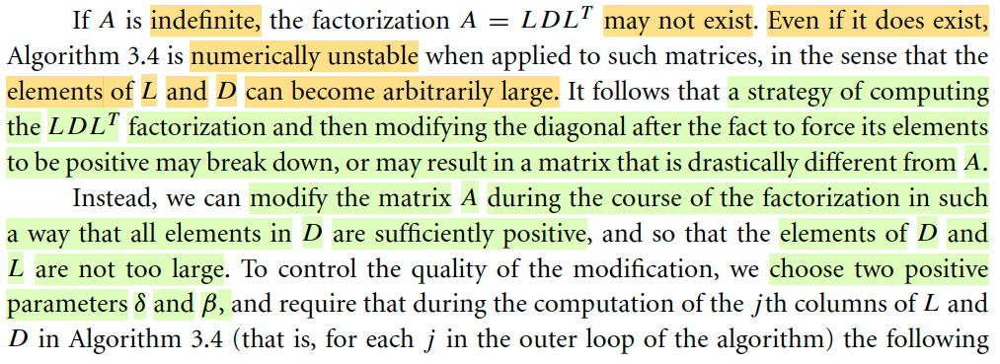</kbd></p>

<p align="center"><kbd>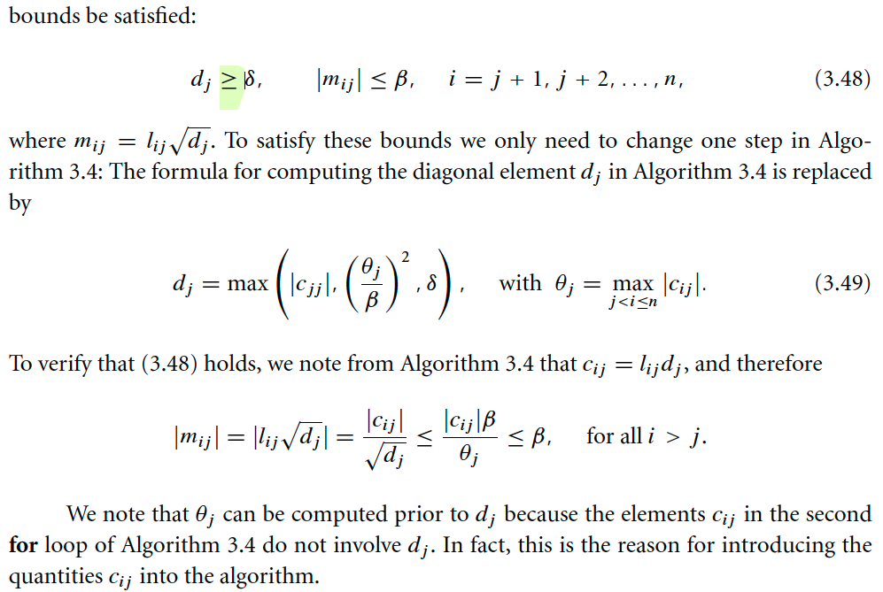</kbd></p>

> [!NOTE]
> Rồi, đại khái là vầy: Nhìn vào các bước của thuật toán Cholesky Factorization (A `=` LDLT hay A `=` MMT) thì sẽ thấy ngay cả khi A có thể factorized thì nếu các phần tử của L và D có thể rất lớn dẫn đến lỗi (numerical unstable)
>
> (Ví dụ bước ljj `=` cjj)
>
> Bên cạnh đó, cũng chưa chắc là A có thể factored thành công nếu như nó indefinite.
>
> Từ đó một thuật toán Cholesky factorization tốt hơn có idea như sau:
>
> Tại cái bước dj `=` cjj. Ta sẽ thay nó (tức thay vì dùng cjj, ta sẽ thay) bằng một con số đảm bảo 3 điều kiện sau:
>
> 1) Nó phải ít nhất là giữ nguyên nếu như cái bước đó đã ok, tức nếu cij đã đủ tốt, có nghĩa là lớn, và dương: thì ta sẽ lấy |cjj|
>
> 2) Nó phải là một số dương tối thiểu. Ta sẽ chọn `δ` `=` 10^-6. Đây là cái bước sửa matrix trở thành xác định dương. Vì trong A `=` LD(LT) thì D chính là diagonal matrix chứa các pivot của nó. Mà ta nhớ, trong MIT1806, nếu các pivot đều dương thì matrix xác định dương.
> Vậy nếu như đảm bảo việc chọn dj ít nhất là bằng `δ` thì kết quả ta sẽ có một matrix xác định dương.
>
> Lưu ý theo thuật toán 3.4 thường (ko có vụ chỉnh sửa), thì thuật toán này sẽ crash (fail) trong các case sau: dj ra số 0 hoặc rất nhỏ ≈ 0 khiến cij `/` dj rất lớn (explode). Nên nếu A ban đầu indefinite, thì khi đó pivot có thể bằng 0 (xác định dương `/` âm thì pivot nhất định dương `/` âm) → thuật toán crash. Như vậy ngay cả khi nó xác định âm thì có thể nó vẫn ko crash. 
>
> Đây cũng là khác biệt so với Cholesky Factorization chuẩn (A `=` M (MT)), vì nó sẽ yêu cầu pivot phải dương nên thuật toán sẽ crash nếu A không xác định dương.
>
> Tóm lại, việc đảm bảo dj ít nhất là phải dương tối thiểu `(δ)` mục đích để:
>
> Nếu A không xác định và có pivot  `=` 0 sẽ gây crash
>
> Nếu A xác định âm thì bước này sẽ sửa thành xác định dương
>
> 3) Nó phải đảm bảo kết quả không quá lớn. Mà kết quả ở đây là phần tử mij của M:
>
> Tức là ta có A `=` LD(LT), cũng là M(MT) với M `=` `LD^1/2.` Từ đó ta sẽ có entries của M như sau:
>
> Ví dụ Mij `=` [hàng i của L] ⋅ [cột j của `D^1/2]`
>
> `=` Lij × `D^1/2_jj` 
>
> ⇨ mij `=` lij × √dj
>
> Vậy thì đại khái là mình muốn |mij| ≤ `β` (tức nó phải ko thể quá lớn được, nó phải bị chặn, bị kiểm soát)
>
> Và từ đây mình sẽ có một yêu cầu cho dj: đó là phải làm cho |mij| ≤ beta với mọi i
>
> (Nhờ vậy mà nếu thằng dj `j=1,2...` nào cũng thỏa thì nó sẽ khiến mọi phần tử mij đều thỏa ko quá lớn)
>
> ⇔ |lij × √dj| ≤ `β` với mọi i
>
> Mà lij `=` cij `/` dj
>
> ∴ ⇔ |(cij `/` dj) × √dj| ≤ `β` 
>
> ⇔ |cij| `/` `β` ≤ √dj
>
> ⇔ (|cij| `/` `β)^2` ≤ dj
>
> ⇔ dj ≥ (cij `/` `β)^2,` nhắc lại, với mọi i
>
> Như vậy: dj ≥ `[(max_i` cij) `/` `β]^2`
>
> Đặt `θj` là max |cij|
>
> Con số dj phải có giá trị ít nhất là từ mấy thằng này trở lên, nên nó sẽ là:
>
> ```text
> max(|cjj|, δ, (θj / β)^2)
> ```
>
> Vậy trong cái thuật toán 3.4 của Cholesky Factorization thông thường, có dj `=` cjj
> ```text
> ta sẽ thay bằng dj = max(|cjj|, δ, (θj / β)^2)
> ```

> [!TIP]
> **🤖 AI Feedback** — ✅ Score: **98/100**
>
> Bài làm của bạn thể hiện sự hiểu biết sâu sắc và toàn diện về các vấn đề cũng như giải pháp được đề xuất trong tài liệu tham khảo. Bạn đã giải thích rất rõ ràng từng khía cạnh của thuật toán được sửa đổi.

<br>

                              <a id="node-50cg30c"></a>
                              - **Quay lại nói về ý nghĩa của thuật toán Modified Cholesky Factorization**
<p align="center"><kbd>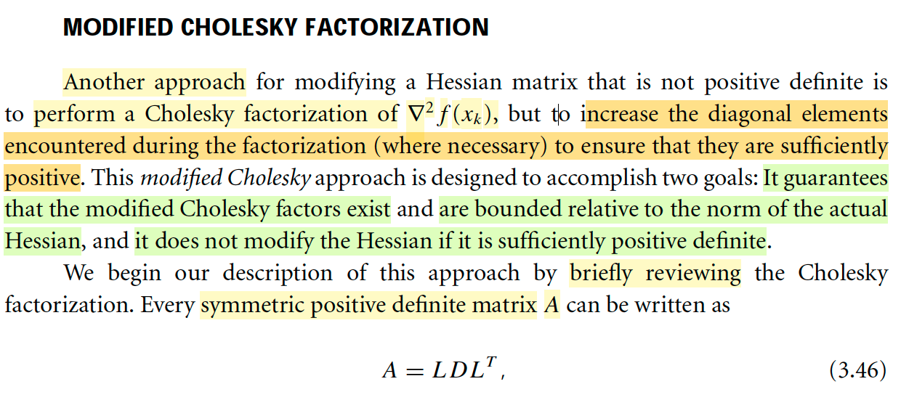</kbd></p>

> [!NOTE]
> Đại khái là mình sẽ quay lại chút xíu mình nói về cái vai trò của kỹ thuật toán mới này thì trong cái lần trước trong cái note trước mình đã có một cái ghi chú nói rằng cái quá trình mà mình chỉnh sửa cái ma trận Hessian đó là mình sẽ:
>
> đầu tiên là mình khiến cho các phần tử trong đường chéo dương 
>
> sau đó mình mới chạy cái thuật toán phân rã nếu như cái ma trận nó chưa xác định dương thì cái thuật toán phân rã tiêu chuẩn nó sẽ bị fail
>
> thì khi đó mình sẽ bơm thêm vô bằng cách mình cộng với một cái ma trận chéo có độ lớn quyết định bởi một cái tham số τ 
>
> khi đó chạy lại nếu mà nó xác định dương rồi thì nó thành công còn không thì nó lại fail và lại chạy lại 
>
> Thì cái lần này mình sẽ không có cần phải chạy đi chạy lại nữa mà mình sẽ chỉ việc chạy cái thuật toán mà có chỉnh sửa này để cái quá trình nó nếu mà nó gặp một cái ma trận chưa xác định dương thì nó sửa ngay trong cái lần đó luôn để rồi nó chỉ cần cần chạy một lần là xong

> [!TIP]
> **🤖 AI Feedback** — ⚠️ Score: **75/100**
>
> Học viên đã nắm bắt được mục đích chính của phân rã Cholesky cải tiến và lợi ích của nó trong việc tránh lặp lại. Tuy nhiên, có sự nhầm lẫn nhỏ trong mô tả cơ chế sửa đổi cụ thể.

<br>

                                <a id="node-pcqci56"></a>
                                - **Thuật toán Cholesky sửa đổi**
<p align="center"><kbd>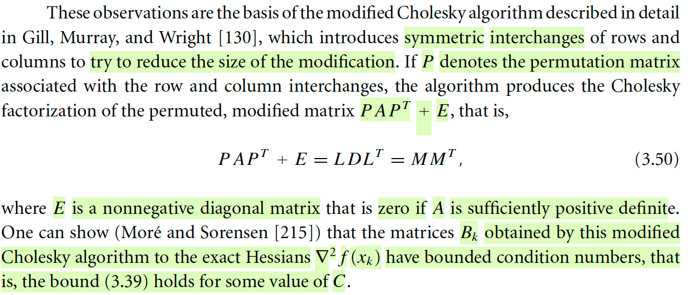</kbd></p>

> [!NOTE]
> Đại khái là cái vụ modified Cholesky factorization có thể thể hiện dưới dạng toán học là thế này:
>
> P A PT + E `=` L D LT  `=` M MT
>
> Trong đó P là matrix hoán vị.
>
> E là diagonal matrix với phần tử đường chéo sẽ bằng 0 nếu ban đầu A đã đủ xác định dương rồi. 
>
> Ta nên hiểu thế này: Quá trình của modified Cholesky factorization mà ta vừa bàn ở note trước. Đó là can thiệp vào bước gán giá trị cho dj.
>
> Thì về bản chất, nó chính là ta chỉnh sửa cái đường chéo của A bằng cách bơm giá trị vào.
>
> Do đó mới nói kết quả sẽ giống như ta cộng vào một matrix diagonal không âm E.

> [!TIP]
> **🤖 AI Feedback** — ⚠️ Score: **70/100**
>
> Ghi chú đã trình bày chính xác công thức và định nghĩa các ma trận P, E. Tuy nhiên, em đã bỏ sót mục đích chính của việc sử dụng hoán vị đối xứng (P) là để giảm kích thước sửa đổi, và quan trọng hơn là lợi ích của thuật toán Cholesky cải tiến này trong việc đảm bảo các ma trận B_k có số điều kiện bị chặn.

<br>

                                  <a id="node-2ltif9d"></a>
                                  - **Phân tích đối xứng bất định sửa đổi**
<p align="center"><kbd>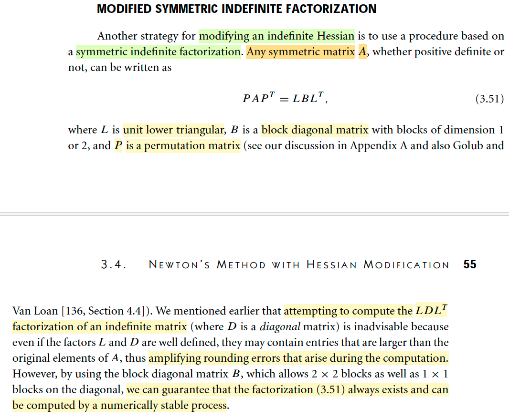</kbd></p>

> [!NOTE]
> Đại khái là, ở đây nói về việc modify một Hessian mà indefinite.
>
> Tác giả nói ta có thể dùng một chiến thuật khác để chỉnh sửa indefinite Hessian đó là dùng symmetric indefinite factorization. 
>
> Nhớ lại, trong note liền trước, mình đã hiểu, A dù là indefinite vẫn có thể được phân tách thành L D LT, (có nghĩa là thuật toán nó vẫn không crash, nếu hên, khi indefinite matrix A có pivot khác không) 
>
> Tuy nhiên, vấn đề có thể xảy ra, cũng là ý giáo sư nói không được khuyên (nên tránh) việc này, là vì, dù pivot khác 0, khiến thuật toán không crash, nhưng nó quá nhỏ thì sẽ vẫn gây vấn đề.
>
> Cụ thể, ta hiểu đại khái là vầy: Liên hệ với Gauss elimination cổ điển Ta nhớ, cái vụ đưa A thành U, sau đó backsubtitute để giải ra nghiệm. Thế thì trong khi khử Gauss: Một cách đơn giản nhất, ví dụ trừ hàng 2 cho 2 hàng 1, thực chất chính là lấy hàng 1 nhân cho a22 `/` a11 cũng là a22 `/` pivot 1. Mà giả sử pivot 1 nó tuy khác 0 nhưng rất nhỏ, thì kết quả sẽ ra con số rất lớn. Để rồi con số rất lớn này khi tham gia tính toán sẽ gây họa. Cụ thể là nó gây ra cái loại  lỗi tạm gọi là nuốt chửng độ chính xác, mà mình từng học trong MIT 18s096.
> Đây chính là cái ý giáo sư nói "khuếch đại rounding error")
>
>
> Vậy thì đại ý là ở đây tác giả nói rằng, dựa trên một kiến thức toán học nói rằng bất kể matrix đối xứng A nào cũng có thể được viết ở dạng:
>
> PA(PT) `=` LB(LT) với B là một block diagonal matrix (matrix chéo dạng block, sẽ hiểu kĩ hơn sau khi đọc Appendix)
>
> Và ta sẽ dựa trên cái này, để mà xây dựng một thuật toán chỉnh sửa Hessian bị indefinite mà có tính chất là ổn định về mặt tính toán nhờ tính chất tốt đẹp của việc dùng diagonal block matrix. Cụ thể thì hiểu nôm nà là vầy:
>
> Thì cái này nó có cái hay là vầy: Giống như khi ta khử Gausse theo cách thông thường, tức là các pivot là các con số. Thì ta có thể bị cái vụ nói trên nếu pivot quá nhỏ. Nhưng cũng có thể khử Gause theo cách khác gọi là theo block. Thì khi đó, pivot là một block matrix. Và cái vụ tính multipler bằng a22 `/` pivot 1 sẽ tương ứng với lấy [block 22] nhân [pivot block 1]_inv.
>
> Và cái hay là, có thể nếu xét single number pivot thì nó nhỏ gây lỗi, nhưng khi làm bởi block pivot thì dạng invert của nó vẫn ổn định.
>
> Nói chung hiểu đại ý là vậy.

> [!TIP]
> **🤖 AI Feedback** — ✅ Score: **90/100**
>
> Phân tích của bạn rất sâu sắc, đặc biệt là phần giải thích chi tiết về nguyên nhân khuếch đại lỗi làm tròn liên hệ với phép khử Gauss và pivot nhỏ. Tuy nhiên, cần nhấn mạnh rõ hơn ngay từ đầu rằng phân tích LDL^T cho ma trận bất định là không nên làm, dù về mặt lý thuyết nó vẫn có thể thực hiện được trong một số trường hợp.

<br>

                                    <a id="node-g9xdq5g"></a>
                                    - **Ví dụ của P A PT `=` L B LT**
<p align="center"><kbd>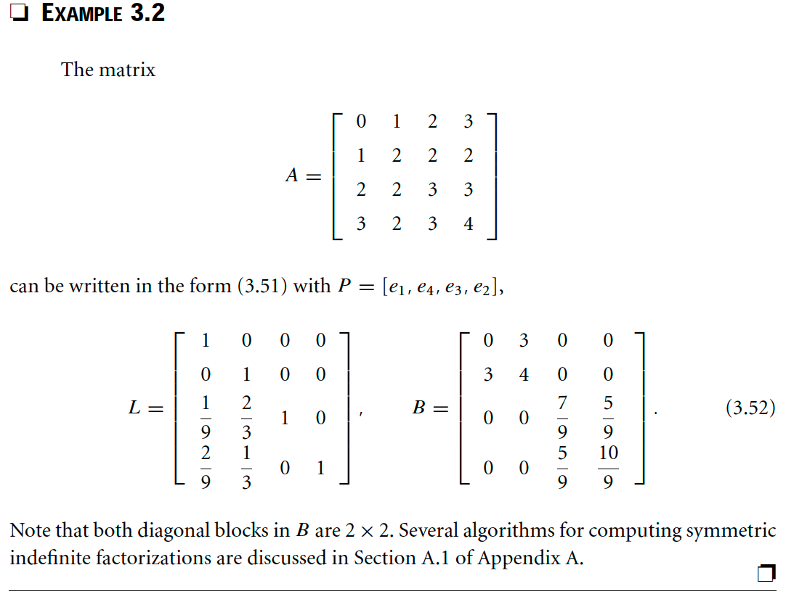</kbd></p>

> [!NOTE]
> Đại khái là ông cho xem một ví dụ trong đó cái matrix A, để ý nhé, pivot 1 `=` 0. Nếu khử Gausse như cách cổ điển, nó sẽ crash ở bước tính multipler.
>
> Nhưng ta vẫn có thể phân tách nó thành dạng P A PT `=` L B LT với B và L như vầy.
>
> Nói chung là Appendix A có nói về các thuật toán giúp factor A thành L và B như này.

<br>

                                      <a id="node-qlg6w8b"></a>
                                      - **Modified indefinite symmetric factorization**
<p align="center"><kbd>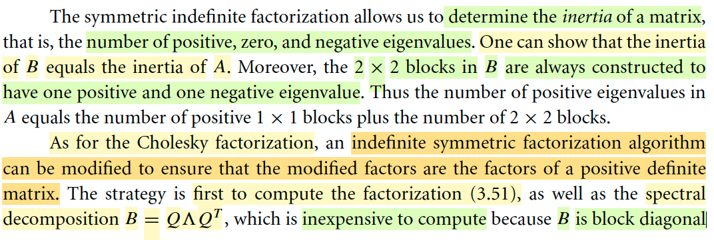</kbd></p>

<p align="center"><kbd>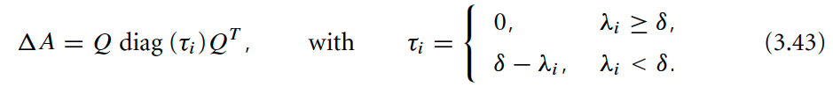</kbd></p>

<p align="center"><kbd>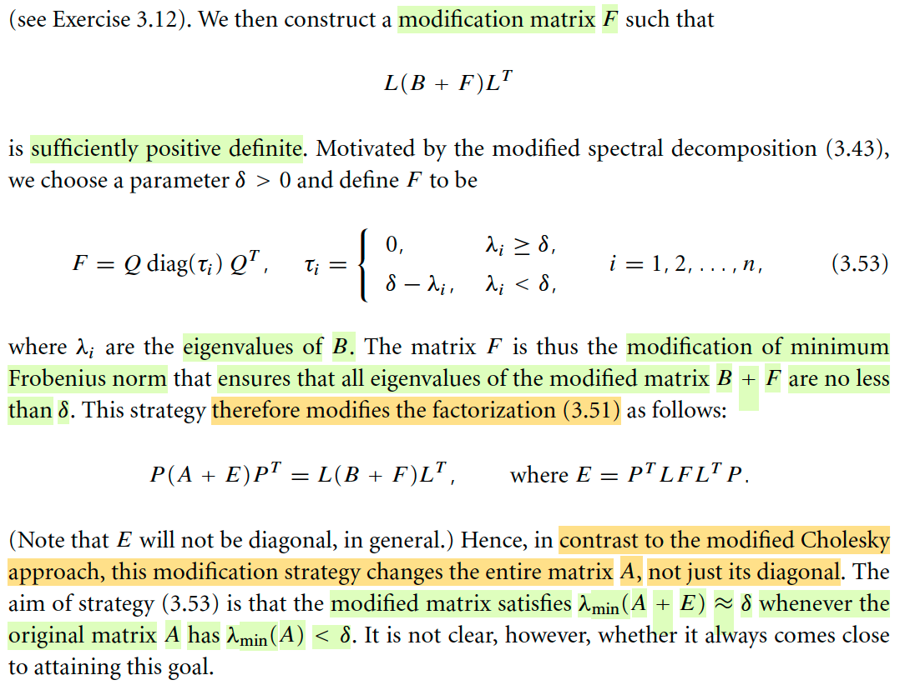</kbd></p>

> [!NOTE]
> Đầu tiên, tác giả cho rằng, ta nên biết có một định lý nói rằng, trong quan hệ phân rã nói trên (của matrix đối xứng A bất kì, xác định dương, xác định âm hay không xác định): P A PT `=` L B LT thì thằng B là matrix có cùng inertia với A. Tức là số lượng trị riêng dương, âm, bằng 0 của chúng giống nhau. 
>
> Tác giả nói đến cái này là muốn lót đường cho việc chỉnh sửa: Nếu ta chỉnh sửa B để giúp mọi trị riêng của nó đều dương thì tự động trị riêng của A cũng sẽ dương, khiến A trở nên xác định dương. (Làm rõ khỏi bắt bẻ: Ta nói là ta sửa B để A thành xác định dương thì phải hiểu là ta sửa B bằng cách cộng vào cho nó một matrix `ΔB` khiến có được B + `ΔB` xác định dương, khi đó ta sẽ có kết quả phân rã của một matrix A + `ΔA` xác định dương. Chứ bản chất A xác định âm thì bố nó cũng không biến nó thành xác định dương được)
>
> Một điểm lót đường nữa, là ông nói về đặc địểm của B như đã nói, có dạng block diagonal, khiến cho việc tính trị riêng rất dễ. Cụ thể là với cái block 1x1 thì trị riêng chính là nó (y như với diagonal matrix thì trị riêng cũng là entries đường chéo, hãy hiểu diagonal matrix là cái dạng block diagonal matrix 1x1). Còn với block 2x2 thì tính trị riêng cũng dễ chứ không khó gì, dĩ nhiên ta sẽ tính ra được hai trị riêng, tức là trị riêng của cái block 2x2 đó chính là 2 cái trị riêng của B.
>
> Dừng lại tí suy nghĩ xem tính làm sao mà nói dễ? Ta biết để tìm eigenvalue, thì mình sẽ giải cái tìm nghiệm của characteristic equation: det (A - λI) `=` 0. Thế thì nếu A chỉ là matrix 2 × 2 thì det của A - λI chỉ là một cái đa thức bậc 2, và giải equation này chỉ là giải cái phương trình bậc hai chứ ko có gì khó.
>
> Rồi. Thế thì ta sẽ làm giống như trong Cholesky factorization mà trong đó, đại ý là ngay trong lúc chạy thuật toán Cholesky factorization, ta sẽ làm cái bước chỉnh sửa, để mà ngay cả khi ta bắt đầu với một matrix không xác định hoặc xác định âm hoặc xác định dương nhưng chưa đạt (ví dụ như pivot dj quá nhỏ, khiến có thể gây vấn đề) thì ta vẫn sẽ kết thúc với một matrix xác định dương tốt.
>
> Thì đây cũng vậy, ta sẽ chỉnh sửa Indefinite symmetric factorization này. Nhưng không phải sửa on-the-fly như cái kia, mà cụ thể là ta sẽ factor trước, rồi mới sửa B. 
>
> Để xong là ta có một matrix xác định dương (nên hiểu ý một chút: Nói chính xác từng chữ thì sẽ là: Để khi xong ta có một kết quả phân rã giống như của một cái matrix A ban đầu đã xác định dương tốt rồi vậy. Có nghĩa là, giống như trong Cholesky modified factorization, thì mục đích là ta sẽ có kết quả phân rã của một cái matrix đã chỉnh sửa sao cho nó giống như đã xác định dương ngay từ đầu vậy. Và ta sẽ xài cái bộ matrix phân rã này né chứ không phải nhân vô lại để có cái A xác định dương, vì việc tính toán với dạng phân rã của A sẽ khiến quá trình tính toán nhanh hơn - nhớ factor solve method không?)
>
> Rồi, vậy thì cách sửa thế nào? 
>
> ```text
> Đó là ta sẽ dùng cái cách giống như trong 3.43: Trong đó mình dùng ΔA = Q diag(τi) QT với τi = 0 nếu trị riêng tương ứng λi đã ok rồi (đã dương rồi, và cụ thể là đã > δ, một con số dương tối thiểu rồi) còn nếu chưa thì τi = δ - λi để mà nâng nó lên, bơm nó lên.
> ```
>
> Trong phần đó mình cũng nhớ tác giả nói rằng, đây là cái `ΔA` có Frobenius norm nhỏ nhất giúp sửa lại cho A (thành A `+ΔA)` trở thành xác định dương.
>
> ```text
> Thì ở đây cũng vậy ta sẽ sửa cái B: bằng cách cộng với F = Q diag(τi) QT, với τi = 0 nếu λ(B)i đã ≥ δ và τi = δ - λ(B)i nếu chưa,
> ```
>
> Và again, F cũng là cái có F norm nhỏ nhất giúp sửa B thành ra (B + F) xác định dương, để rồi cũng chính là giúp ta có kết quả phân rã của một matrix A đã chỉnh sửa (thành A + E nào đó) mà A + E xác định dương.
>
> ```text
> Cuối cùng là một điểm đáng lưu ý đó là: Giáo sư nhấn mạnh với modified Cholesky factorization thì về cơ bản là ta chỉ sửa các phần tử đường chéo của A mà thôi (cái bước gán dj bởi max (|cjj|, δ, (θj/β)^2). Để rồi thể hiện matrix chỉnh sửa A bởi: P A PT + E = L D LT
> ```
> thì E là diagonal matrix.
>
> Còn ở đây, ta ko chỉ sửa đường chéo của A, mà thay đổi hoàn toàn cấu trúc của A, tức là  thể hiện ở dạng P(A + E)PT `=` L(B + F)LT thì E ko phải là diagonal matrix

> [!TIP]
> **🤖 AI Feedback** — ✅ Score: **98/100**
>
> Bài viết thể hiện sự hiểu biết sâu sắc và toàn diện về phương pháp chỉnh sửa phân rã đối xứng không xác định. Các giải thích chi tiết, đặc biệt là sự so sánh với phân rã Cholesky sửa đổi và phân tích về mục đích thực sự của việc chỉnh sửa, cho thấy khả năng nắm bắt vấn đề vượt trội.

<br>


<a id="node-kq099iv"></a>
## Hướng tìm kiếm và sải bước

<p align="center"><kbd>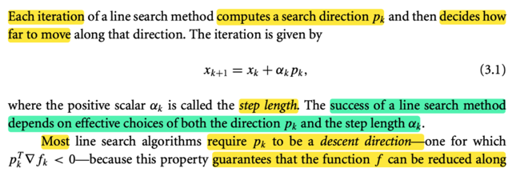</kbd></p>

<p align="center"><kbd>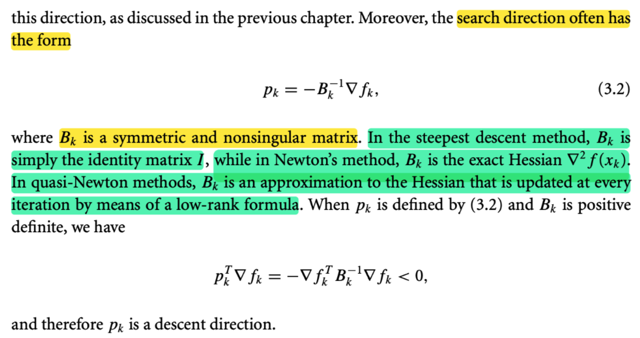</kbd></p>

<p align="center"><kbd>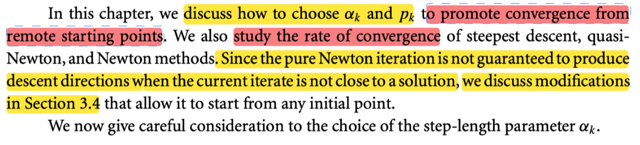</kbd></p>

> [!NOTE]
> Rồi, như đã biết ở phần trước, trong line search, ở mỗi iteration, ta sẽ 1) **xác định hướng pk**, và 2) **xác định sải bước**. Để thực hiện bước đi:
>
> ```text
> x_(k+1) = x_k + αk p_k
> ```
>
> Và **hai bước này tốt thế nào sẽ quyết định chất lượng của thuật toán**.
>
> Tác giả cho biết **phần lớn line search algo đều yêu cầu `p_k` là descent direction**, tức `p_k` . `∇f_k` (directional derivative wrt `p_k` không âm)** nhằm đảm bảo là ta sẽ giảm hàm f** khi đi theo hướng đó (tất nhiên phải có step size phù hợp nữa)
>
> Thế thì như **search direction có dạng chung chung là pk `=` -(Bk)inv ∇f_k**
>
> Để khi Bk là I thì pk `=` - `∇f_k,` chính là steepest descent direction
>
> Còn Bk là Hessian ∇^2 `f_k` thì nó chính là - `(∇^2f_k)inv` `∇f_k,` là Newton direction
>
> Còn khi Bk được chọn là một xấp xỉ gần đúng của Hessian như trong công thức ở phần trước thì ta có quasi-Newton direction
>
> Và khi **miễn là đảm bảo Bk positive definite** thì ta **chắc chắn pk `=` -(Bk)inv ∇fk sẽ là
> descent direction**: Đơn giản là vì khi đó directional derivative wrt pk:
>
> ```text
> = p_k . ∇f_k = - ∇fkT (Bk)inv ∇fk là (negative) quadratic form của (Bk)inv cũng là positive definite ⇨ luôn âm miễn là gradient ∇fk ko vanish.
> ```
>
> `====`
>
> Chapter này mình sẽ **bàn về việc chọn step size và pk**, cũng như **phân tích tốc độ hội tụ** của các phương pháp

<br>


<a id="node-g271n8m"></a>
### Đánh đổi trong độ dài bước

<p align="center"><kbd>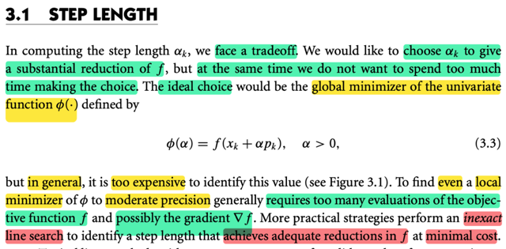</kbd></p>

<p align="center"><kbd>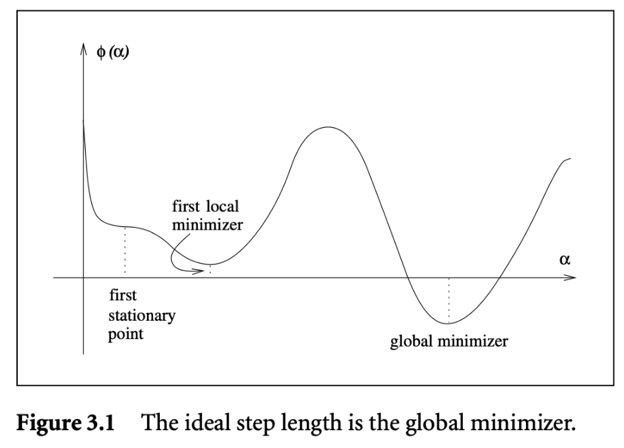</kbd></p>

> [!NOTE]
> Đại khái là khi tìm step length `αk,` ta phải gặp một đánh đổi: Muốn** tìm được `αk` tối ưu thì phải hi sinh chi phí tính toán** nhiều. Vì lựa chọn lí tưởng là giải bài toán univariate: 
>
> ```text
> minimize Φ(α)  = f(x_k + α p_k), α > 0.
> ```
>
> Nhưng để giải bài toán này thì **đại khái là ta phải inference hàm f và có thể là cả gradient ∇f rất nhiều lần** → tăng chi phí.
>
> Do đó thường người ta sẽ dùng **cách tiếp cận INEXACT, tìm `αk` giúp giảm f đủ tốt nhưng với chi phí tính toán tối thiểu**.
>
> (cái này mình đã học trong Convex Optimization ở đây chỉ nhắc lại thôi)

<br>


<a id="node-th2emo8"></a>
#### Line Search: Điều kiện Giảm Đủ

<p align="center"><kbd>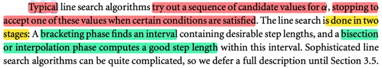</kbd></p>

<p align="center"><kbd>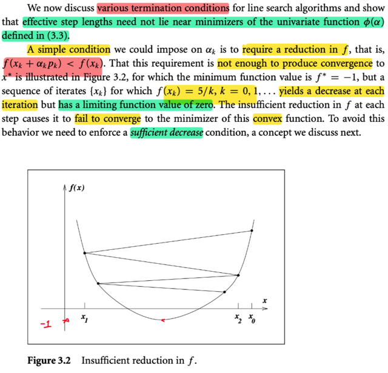</kbd></p>

> [!NOTE]
> Đại khái là **một thuật toán line search điển hình** sẽ làm việc sau:** Thử nhiều giá trị của `α` cho đến khi chọn được cái phù hợp** (thỏa một condition nào đó)
>
> Và nó làm theo hai phase: 
>
> 1) là **bracketing một khoảng mà sẽ chứa `α` tốt**, 
>
> 2) là **dùng bisection hay interpolation để tìm ra `α` đó** nhờ mấy bài của AlgoForOpt mà mình cũng đã biết qua vụ này.
>
> Thế thì, đầu tiên là nói về **điều kiện khi nào thì dừng tìm kiếm** (termination condition) step length, tức là khi nào thì ok.
>
> Đại khái một cách đơn giản đầu tiên, là **cứ chọn `αk` sao cho f(xk + `αkpk)` nhỏ hơn f(xk) là được**. 
>
> Và giáo sư minh họa ở đây ví dụ như cứ làm sao cho f(xk) `=` `5/k,` thì **dù là cách làm này vẫn giúp giảm f sau mỗi iteration, nhưng nó SẼ KO BAO GIỜ CONVERGE về local minimizer**, nơi mà f* `=` -1, vì cách làm này sẽ chỉ đưa f về 0 là hết cỡ.
>
> Có nghĩa là giáo sư đưa ra ví dụ này đề minh họa rằng, c**ách chọn `αk` theo tiêu chí cứ để f sau thấp hơn f trước là KHÔNG ĐỦ** (mọi chuyện ko đơn giản như vậy)
>
> Do đó, ta sẽ phải thiết lập một cái gọi là **SUFFICIENT DECREASE** condition, hiểu nôm na là điều kiện này **quy định mức giảm phải đủ lớn**

> [!TIP]
> **🤖 AI Feedback** — ✅ Score: **95/100**
>
> Ghi chú đã tóm tắt chính xác định nghĩa và hai giai đoạn của thuật toán line search từ hình ảnh. Ngoài ra, ghi chú còn cung cấp thêm ngữ cảnh và độ sâu rất tốt về các điều kiện để chọn độ dài bước, giúp nâng cao đáng kể sự hiểu biết về chủ đề.

<br>

<a id="node-c14ii57"></a>
- **Điều kiện giảm đủ Armijo**
<p align="center"><kbd>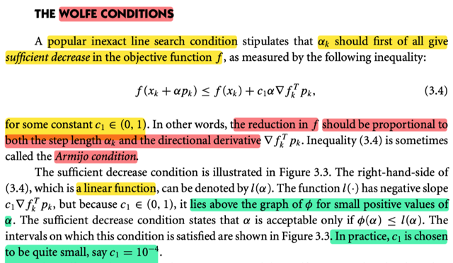</kbd></p>

<p align="center"><kbd>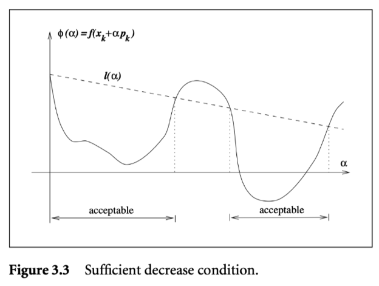</kbd></p>

> [!NOTE]
> Đại khái là, đây một loại condition cho inexact line search phổ biến, qui định rằng yêu cầu đầu tiên cho `αk` đó là nó phải khiến **tạo ra một mức giảm đủ lớn** (sufficient decrease) đối với function f, thể hiện bởi:
>
> f(xk + `αpk)` ≤ f(xk) + c1 `α` (∇fk)T pk với c1 có giá trị nào đó trong (0,1)
>
> Và ý nghĩa của cái này là, mức giảm tối thiểu của f phải tỉ lệ thuận với step length `αk` và directional derivative (∇fk)T pk. Là sao? 
>
> ⇨ Thì cái trên ⇔ f(xk) - f(xk + `αpk)` ≥ - c1 `α` (∇fk)T pk
>
> ⇔ mức giảm của f ≥ - c1 `α` (∇fk)T pk, và đây đương nhiên là hàm tuyến tính của pk và `α.` Tức là nếu giữ pk, thì nó tuyến tính theo `α` và ngược lại. 
>
> Điều kiện này còn có tên là **Armijo condition**.
>
> HÌnh 3.3 minh họa điều này.
>
> ```text
> Đường thẳng l(α) chính là l(α) = f(xk) + c1 α ∇fkTpk, nó có độ dốc âm (vì c1∇fkTpk âm: pk là hướng descent direction của f, nên ∇fkTpk âm, nhân với c1 dương nữa, nên vẫn âm).
> ```
>
> Nhưng vì **có c1, nên nó sẽ nằm trên `Φ(α)` `=` f(xk + `αpk)` nếu `α` nhỏ**. Là sao?
>
> ⇨ Là vì hàm **Φ(α), là hàm f, giới hạn trên một direction là pk, trở thành hàm đơn biến theo α,** trong đó, **đạo hàm của nó tại `α` `=` 0, như đã biết, là directional derivative của f đối với hướng pk**, `=` ∇fkTpk, mang giá trị âm.
>
> Thế thì, **độ dốc của hàm Φ tại điểm ban đầu lớn hơn độ dốc của `l(α)` tại đó,
> do với `l(α)` đã được điều chỉnh bởi c1.**
>
> Do đó khi **xuất phát từ xk thì tạm thời `l(α)` sẽ cao hơn Φ(α)**. Nhưng **đi xa hơn thì ko chắc vì hàm Φ phi tuyến, có thể nó sẽ vọt lên**
>
> Vậy thì theo hình, **những giá trị `α` khiến mức giảm của hàm f (theo hương pk, tức là `Φ(α))` ít nhất là bằng mức giảm của hàm `l(α)` sẽ tạo nên một khoảng các giá trị `α` acceptable, tức thỏa Amijo condition.**
>
> Thực tế thì người ta thường chọn c1 `=` 10^-4

> [!TIP]
> **🤖 AI Feedback** — ✅ Score: **98/100**
>
> Bản ghi chú rất chính xác và có chiều sâu, đặc biệt trong việc giải thích mối quan hệ giữa l(α) và Φ(α) khi α nhỏ. Các giải thích chi tiết giúp người đọc hiểu rõ hơn về điều kiện Armijo.

<br>

  <a id="node-a2xp2eh"></a>
  - **Điều kiện cong và ý nghĩa**
<p align="center"><kbd>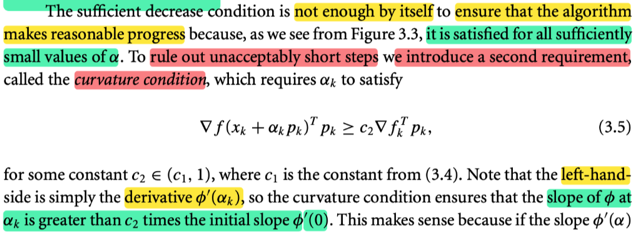</kbd></p>

<p align="center"><kbd>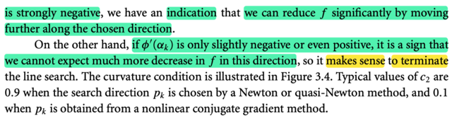</kbd></p>

> [!NOTE]
> Đại khái là **điều kiện "giảm đủ" (sufficient decrease) không đủ để đảm bảo thuật toán sẽ có  được một tiến triển tốt**, vì rất dễ hiểu là chỉ cần `α` rất nhỏ là đảm bảo sẽ thỏa được Armijo condition. Mà `α` nhỏ quá thì ko được vì sẽ rất chậm.
>
> Do đó người ta mới thêm một điều kiện nữa: **Curvature condition**.
>
> ∇f(xk + `αkpk)Tpk` ≥ c2 ∇fkTpk
>
> Vế trái, tương tự như ∇fkTpk, là directional derivative của f wrt pk tại xk, thì.. 
>
> **∇f(xk + `αkpk)Tpk` là directional derivative wrt pk tại xk + αkpk**
>
> Và vì đã hiểu **directional derivative của hàm f wrt pk thì cũng là đạo hàm hàm `Φ(α)` `=` f(xk + αpk)** nên: 
>
> ```text
> (∇)_(pk) f(x)|x=xk = Φ'(α)|α=0, mang ý nghĩa là độ dốc theo hướng pk tại điểm đầu: xk
> ```
>
> ```text
> Và (∇)_(pk) f(x)|(x=xk + αkpk) = Φ'(α)|α=αk, mang ý nghĩa là độ dốc theo hướng pk tại điểm "bước tới": xk + αkpk
> ```
>
> Do đó, điều kiện này chính là:
>
> ```text
> Φ'(α)|α=αk ≥ c2 Φ'(α)|α=0
> ```
>
> Và ý nghĩa là **αk phải làm sao để khi bước tới đó (xk + `αkpk)` thì độ dốc (theo hướng pk) tại đó `(Φ'(α)|α=αk)` phải bớt dốc hơn** (≥) (nói đúng theo toán học là tăng, để từ rất âm thành bớt âm, chính là bớt dốc xuốc hơn), **so với độ dốc tại điểm đầu được điều chỉnh bởi c2**, là một con số ∈ (c1, 1)
>
> Và ý nghĩa của cái điều kiện thứ 2 là, **nếu như tại xk mà độ dốc chưa thỏa curvature condition**, tức là độ dốc tại đó, chưa bớt dốc xuống hơn so với điểm đầu, **đồng nghĩa là nó còn đang rất dốc, thì đó là dấu hiệu rằng ta nên đi tiếp vì hàm f còn giảm nhiều thêm nữa**. 
>
> Ngược lại, **nếu nó đã thỏa, tức là độc dốc đã bớt âm đi nhiều, thì đó là dấu hiệu việc đi tiếp ko còn giúp giảm thêm f đáng kể nữa thì nên dừng**
>
> `====`
>
> Sách cũng cho biết giá trị thường dùng của c2

> [!TIP]
> **🤖 AI Feedback** — ✅ Score: **100/100**
>
> Giải thích rất chính xác và chi tiết, đặc biệt là phần diễn giải ý nghĩa của điều kiện độ cong trong việc xác định độ dốc và hành động tiếp theo trong thuật toán tối ưu. Nội dung phân tích khớp hoàn toàn với hình ảnh và cung cấp thêm chiều sâu đáng kể.

<br>

    <a id="node-tmtgy6j"></a>
    - **Minh họa điều kiện đường cong**
<p align="center"><kbd>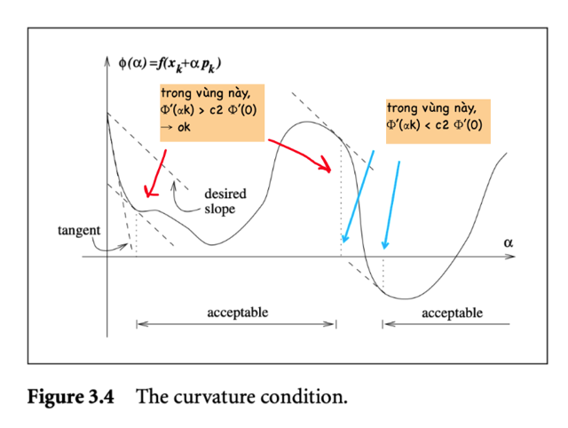</kbd></p>

> [!NOTE]
> Minh họa điều kiện curvature condition, đường dash line tangent là có độ dốc là đạo hàm Φ'(0), tức ∇fkTpk, ta muốn adjust chút xíu bởi c2, để có độ dốc mong muốn c2∇fkTpk tức, ta muốn độ dốc tại xk + `αkpk` phải lớn hơn giá trị này, và kết quả là những vùng  mà tại đó đường cong hàm Φ bắt đầu có độ dốc lớn hơn c2∇fkTpk sẽ là vùng acceptable.
>
> Có thể cần giải thích thêm nếu chưa rõ:
>
> Cái điểm `α` tại vị trí mũi tên đỏ thứ nhất, chính là giá trị mà độ dốc của hàm Φ bắt đầu lớn hơn độ dốc ban đầu có adjust bởi c2 (c2 Φ'(0)) và hãy để ý trong khoảng từ đó đến đầu mũi tên đỏ thứ hai thì độ dốc hàm Φ luôn luôn lớn lớn hơn c2 Φ'(0) 
>
> Nhưng sau đó thì nó bắn đầu nhỏ hơn (đường cong hàm cắm đầu đi xuống tại điểm mũi tên xanh thứ nhất), và duy trì như vậy cho đến mũi tên xanh thứ hai), tạo nên đoạn không thỏa Curvature condition.
>
> Và từ mũi tên xanh thứ hai thì độ dốc lại tăng (hàm quay đầu đi lên) nên nó cũng là vùng mà Curvature condition bắt đầu thỏa.

> [!TIP]
> **🤖 AI Feedback** — ✅ Score: **90/100**
>
> Bài giải thích rất chi tiết và đúng đắn về điều kiện độ cong (curvature condition) và cách nó được minh họa trên đồ thị. Tuy nhiên, có một điểm chưa rõ ràng trong câu cuối cùng khi mô tả "độ dốc lại giảm" trong khi hàm "quay đầu đi lên", vì khi hàm quay đầu đi lên thì độ dốc đang tăng.

<br>

      <a id="node-7kgcs2p"></a>
      - **Điều kiện Wolfe và Wolfe mạnh**
<p align="center"><kbd>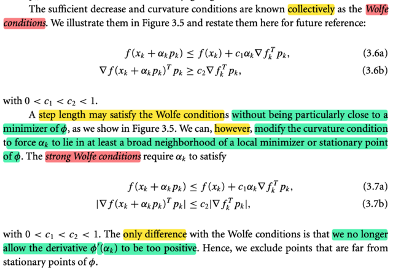</kbd></p>

> [!NOTE]
> Hai cái điều kiện này cùng nhau tạo thành **Wolfe condition**.
>
> Tuy nhiên, còn một vấn đề là: **Thỏa cái này, cũng chưa chắc đảm bảo ta có một `α` nằm gần local minimizer.**
>
> Do đó **người ta điều chỉnh cái curvature condition chút xíu**, để **ép `αk` phải
> nằm trong một vùng lân cận rộng (broad neighborhood) của local minimizer** 
>
> Từ đó ta có **Strong Wolfe condition**:
>
> f(xk + `αkpk)` ≤ f(xk) + c1 `αk` ∇fkTpk (**Armijo**)
>
> |∇f(xk + `αkpk)Tpk|` ≤ c2|∇fkTpk| (**Strong Curvature condition**)
>
> Và ý nghĩa của nó là, tại xk + `αkpk,` **độ dốc phải vừa bớt âm nhưng cũng ko được qúa dương**

> [!TIP]
> **🤖 AI Feedback** — ✅ Score: **98/100**
>
> Nội dung tóm tắt rất chính xác và đầy đủ, truyền tải đúng ý nghĩa của các điều kiện Wolfe và Strong Wolfe từ văn bản gốc. Việc bổ sung tên riêng cho từng điều kiện (Armijo, Strong Curvature condition) cũng giúp tăng thêm độ sâu cho phần giải thích.

<br>

        <a id="node-rf79ndq"></a>
        - **Điều kiện Wolfe**
<p align="center"><kbd>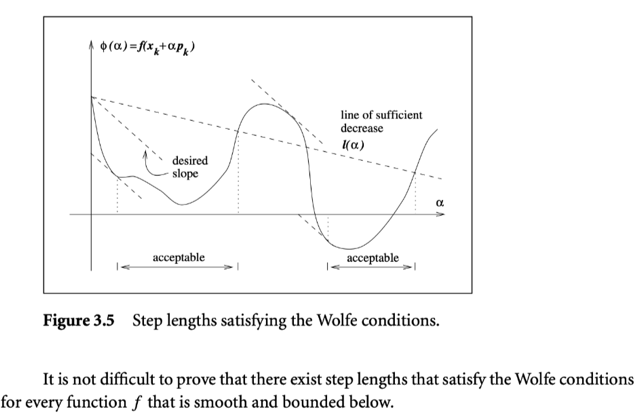</kbd></p>

> [!NOTE]
> kết hợp Armijo và Curvature condition.

> [!TIP]
> **🤖 AI Feedback** — ⚠️ Score: **85/100**
>
> Ghi chú này rất chính xác khi nêu bật sự kết hợp của điều kiện Armijo và Curvature tạo nên các điều kiện Wolfe, điều này hoàn toàn phù hợp với hình minh họa. Để tăng thêm chiều sâu, bạn có thể bổ sung giải thích ngắn gọn về ý nghĩa hoặc vai trò của từng điều kiện.

<br>

          <a id="node-7p4nmz2"></a>
          - **Chứng minh tồn tại độ dài bước Wolfe**
<p align="center"><kbd>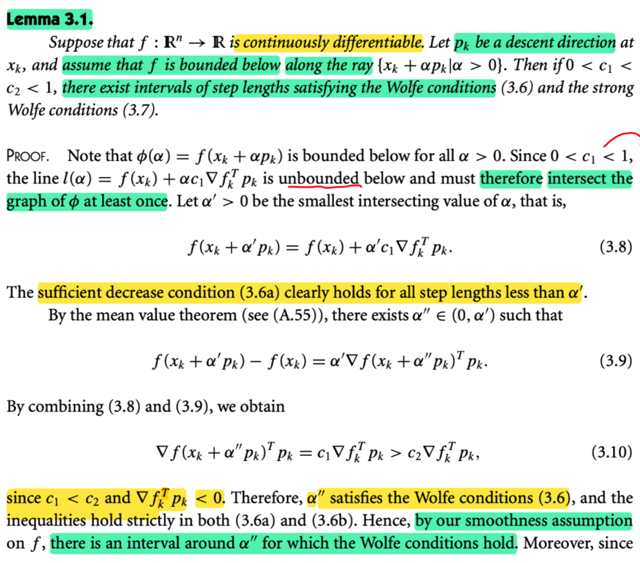</kbd></p>

<p align="center"><kbd>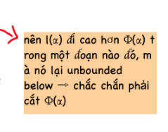</kbd></p>

<p align="center"><kbd>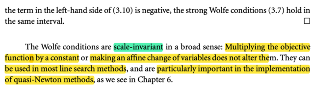</kbd></p>

> [!NOTE]
> ```text
> Đại khái là bổ đề này nói rằng, cho hàm f continuously differentiable, p_k là descent direction tại x_k và giả sử f bounded below theo tia x_k + α p_k | α > 0 thì:
> ```
>
> **Nếu 0 < c1 < c2 < 1, thì, chắc chắn tồn tại step length thỏa Wolfe condition, và Strong condition **
>
> (Nói chung cái bổ đề này nhằm chứng minh, khi đặt ra cái condition kiểu đó thì nhất định sẽ có điểm thỏa, chứ ko phải là vô lí)
>
> Đại ý là chứng minh như sau:
>
> ```text
> Vì đã giả định là hàm f bị chặn dưới theo tia x_k + α p_k | α > 0, tức là sao?
> ```
>
> Tức là **hàm `Φ(α)` `=` `f(x_k` + `α` `p_k)` sẽ (nôm na là) không đi xuống hoài đến -∞** được.
>
> Trong khi đó, xét hàm tuyến tính:
>
> ```text
> l(α) = f(x_k) + α c1 ∇f_k T p_k
> ```
>
> ```text
> Nó sẽ unbounded below, vì nó có thể kéo xuống - inf. Bên cạnh đó, độ dốc của l(α) tại điểm bắt đầu (α = 0) lại bớt âm hơn độ dốc của hàm Φ tại đó, như đã nói ở trên (do độ dốc của nó được điều chỉnh bởi c1 khiến nó bớt dốc xuống hơn so với độ dốc của f theo phương p_k tại x_k: c1 ∇f_k T p_k sẽ bớt âm hơn ∇f_k T p_k).
> ```
> Điều này đồng nghĩa trong một giai đoạn nào đó, hàm l sẽ đi cao hơn hàm Φ nhưng sau đó
> Φ sẽ đi lên, còn I tiếp tục đi xuống. 
>
> Mà như vậy thì có nghĩa là phải có lúc nào đó `(α'` nào đó) l sẽ cắt Φ. Và ta gọi tại đó là `α'.`
>
> Như vậy ta có: `Φ(α')` `=` `l(α')` (cắt nhau, nên giá trị hàm Φ và I bằng nhau)
>
> ```text
> Hay, f(x_k + α' p_k) = f(x_k) + α' c1 ∇f_k T p_k
> ```
>
> ```text
> ⇔ f(x_k + α' p_k) - f(x_k) = α' c1 ∇f_k T p_k (1)
> ```
>
> Tiếp, xét đoạn từ 0 đến `α'` (làm việc với hàm Φ):
>
> Thì theo mean value theorem, mà bản chất cũng là Taylor theorem:
>
> Nhắc lại Taylor theorem: Đi từ a → b, thì sẽ có: 
>
> f(b) `=` f(a) + f'(c)(b-a) với c nằm đâu đó trên khoảng (a,b) 
>
> ```text
> Do đó, Φ(α') = Φ(0) + Φ'(ξ)α' với some ξ nằm trong (0, α')
> ```
>
> ```text
> ⇨ α' Φ'(ξ) = Φ(α') - Φ(0) = f(x_k + α' p_k) - f(x_k)
> ```
>
> ```text
> ⇨ f(x_k + α' p_k) - f(x_k) = α' Φ'(ξ) (1)
> ```
>
> ```text
> Mà Φ(α) = f(x_k + α p_k), thì Φ'(α) =  d/dα Φ(α)
> ```
>
> ```text
> = d/dα f(x_k + α p_k)
> ```
>
> ```text
> = d/d(x_k + α p_k) f(x_k + α p_k) ∘ d/dα (x_k + α p_k)
> ```
>
> ```text
> = ∇f(x_k + α p_k) ∘ p_k
> ```
>
> ```text
> (Có thể chứng minh d/dα (x_k + α p_k) = p_k theo cách của MIT 18s096 như sau:
> ```
>
> ```text
> Xét g(α) = x_k + α p_k, dg = g(α + dα) - g(α) = (x_k + α p_k + dα p_k) - (x_k + α p_k)
> ```
>
> ```text
> = dα p_k. Như vậy dg = p_k dα. Mà hàm g là scalar - vector function, nên dg/dα sẽ là
> ```
> ```text
> vector. Mà ta đang có dg = p_k dα, là linear operator act on dα nên p_k chính là g')
> ```
>
> Và dĩ nhiên `Φ(α)` là scalar - scalar, nên 
>
> ```text
> ∇f(x_k + ξ p_k)T p_k. Nên kết quả trên.. ∇f(x_k + α p_k) ∘ p_k phải là dot product của hai vector
> ```
>
> ```text
> => (1) = α' ∇f(x_k + ξ p_k)T p_k (2)
> ```
>
> ```text
> Từ (1) và (2) ⇨  α' c1 ∇f_k T p_k = α' ∇f(x_k + ξ p_k)T p_k
> ```
>
> ```text
> ⇔ c1 ∇f_k T p_k = ∇f(x_k + ξ p_k)T p_k
> ```
>
> ```text
> ⇔ ∇f(x_k + ξ p_k)Tpk = c1 ∇f_k T p_k
> ```
>
> Mà assumption c1 < c2, đồng thời ta có `∇f_k` T `p_k` âm
>
> ```text
> → ∇f(x_k + ξ p_k)T p_k = c1 ∇f_k T p_k < c2 ∇f_k T p_k
> ```
>
> Như vậy, tại ξ, thì ta đã thỏa curvature condition (vì mean value theorem, nói nhất định phải tồn tại ξ)
>
> Và thêm vài ý râu ria nữa giúp kết luận có thể chứng minh tồn tại  điểm thỏa
>
> Cuối cùng gs cho biết cái Wolfe condition có tính chất scale-invariant. Nhân hàm với constant hay thực hiện một affine change ko làm thay đổi.

> [!TIP]
> **🤖 AI Feedback** — ✅ Score: **98/100**
>
> Tuyệt vời! Bạn đã nắm bắt rất chính xác và chi tiết nội dung của bổ đề cũng như các bước chứng minh. Khả năng giải thích sâu sắc về định lý giá trị trung bình và đạo hàm của Φ(α) thực sự ấn tượng, cho thấy sự hiểu biết rất vững chắc về kiến thức nền tảng.

<br>

            <a id="node-yhc1w7l"></a>
            - **Các điều kiện Goldstein**
<p align="center"><kbd>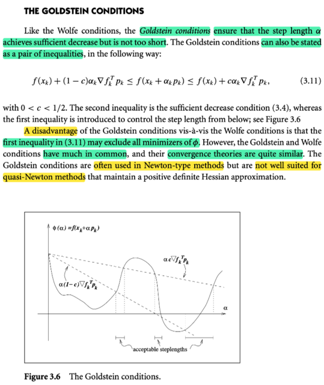</kbd></p>

> [!NOTE]
> Nói về GoldStein conditions, đại khái là nó cũng khá giống Wolfe condition, khi nó yêu cầu:
>
> ```text
> f(x_k + α_k p_k) ≤ f(x_k) + c α_k ∇f_k T p_k (chính là Amijo conds)
> ```
>
> ```text
> Còn điều kiện kia là f(x_k) + (1 - c) α_k ∇f_k T p_k ≤ f(x_k + α_k p_k)
> ```
>
> QUAY LẠI SAU

> [!TIP]
> **🤖 AI Feedback** — ❌ Score: **55/100**
>
> Em đã nhận diện đúng các điều kiện Goldstein và trình bày được hai bất đẳng thức cấu thành. Tuy nhiên, điều kiện đầu tiên không phải là điều kiện Armijo, và em có thể bổ sung thêm về ý nghĩa từng điều kiện cũng như ưu nhược điểm của chúng.

<br>

              <a id="node-sf5t6wa"></a>
              - **Sufficient Decrease And Bactracking**
<p align="center"><kbd>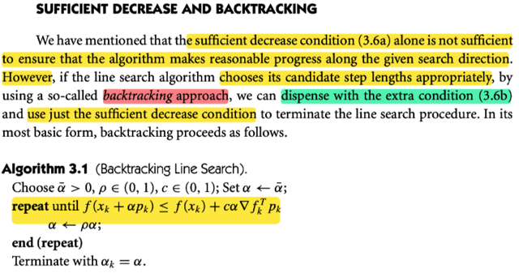</kbd></p>

> [!NOTE]
> Đại khái là, như phần trước có nói, **nếu chỉ dựa vào sufficient decrease condition** (Armijo) thì sẽ **ko đủ** để đảm bảo chọn được `α` khiến thuật toán tiến triển tốt vì **chỉ cần `α` nhỏ là nó sẽ thỏa**.
>
> Do đó mới có thêm cái **curvature condition**.
>
> Nhưng **có một cách làm khác, ko cần dùng đến curvature condition**.
>
> Đó là thông qua backtracking approach:
>
> Đại khái ta **bắt đầu với `αbar` nào đó**, ví dụ `=` 1 khi dùng line search với Newton direction (tức pk là Newton direction).
>
> Sau đó thuật toán sẽ **giảm dần `α` (ban đầu gán bởi `αbar)` bởi một factor ρ**. Cho đến khi nó thỏa Armijo condition thì dừng việc tìm `α`

> [!TIP]
> **🤖 AI Feedback** — ✅ Score: **98/100**
>
> Giải thích rất rõ ràng và nắm bắt được bản chất của cách tiếp cận backtracking giúp loại bỏ điều kiện độ cong riêng biệt, chỉ sử dụng điều kiện giảm đủ. Các bước của thuật toán backtracking cũng được mô tả chính xác và có thêm ví dụ thực tế về cách chọn αbar.

<br>

                <a id="node-rj5oln3"></a>
                - **Backtracking: Chiều dài bước nhảy**
<p align="center"><kbd>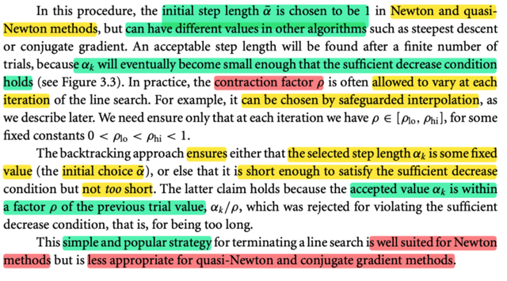</kbd></p>

> [!NOTE]
> Đại khái là, như vừa nói, ta sẽ **scale dần `α` xuống bởi ρ**, là con số nằm trong (0,1). 
>
> Thì **cái factor rho này có thể được phép thay đổi tại mỗi iteration của line search** nữa (cái này sẽ nói rõ hơn ở các phần sau)
>
> Ý cuối, là backtracking đảm bảo là giá trị `αk` được chọn sẽ: 
> 1) Là giá trị **fixed** (ví dụ như **αbar đã thỏa armijo ngay**), thì lần nào cũng sẽ  dùng `α` `=` `αbar` 
>
> (mình hiểu vụ này từ ee364a, khi trong Newton method **đã qua Newton phase thì nó (line search algorithm) sẽ luôn chọn step factor `=` 1**)
>
> 2) Là **một giá trị nhỏ đủ để thỏa Armijo** (vì nếu `α_bar` ko thỏa thì scale nó vài lần nó sẽ nhỏ đủ để thỏa)
>
> 3) **Không quá nhỏ**. Ý này đơn giản thôi. Ta biết rằng thuật toán sẽ lặp lại quá trình: 
>
> check → scale xuống, check → scale xuống cho đến khi thỏa.
>
> ```text
> Vậy gọi α* là giá trị thỏa, thì cái mức trước đó ko thỏa sẽ phải là α' = (α*/ρ) vì nó ko thỏa nên nó mới bị scale xuống bởi rho: ρ * α' để có α* thỏa.
> ```
>
> Vậy n**ếu giả sử `α'` quá dài, nên ko thỏa, thì ko thể nào chỉ scale nó xuống bởi ρ mà nó trở thành quá ngắn được**, đại khái là vậy
>
> Cuối cùng gs cho biết **backtracking phù hợp với Newton method** nhưng** ít phù hợp với quasi-Newton hay conjugate gradient**
>
> (Có lẽ vì với tối ưu lồi hầu như Newton method đóng vai trò quan trọng nên trong Convex Optimization, mình nhớ initial `α` (trong sách đó là t hay sao á) `=` 1

> [!TIP]
> **🤖 AI Feedback** — ✅ Score: **98/100**
>
> Ghi chú của học sinh thể hiện sự hiểu biết rất tốt về quy trình tìm kiếm đường lùi (backtracking line search), giải thích chính xác tất cả các khía cạnh chính và thể hiện độ sâu đáng nể.

<br>


<a id="node-mki4e3t"></a>
## 3.2 Convergence Of Line Search Method

<p align="center"><kbd></kbd></p>

<p align="center"><kbd></kbd></p>

> [!NOTE]
> Đại ý là để có thể **đạt được global convergence** thì **chọn step length tốt thôi là chưa đủ**, mà còn **phải chọn search direction tốt** nữa.
>
> Vậy phần này sẽ **bàn về việc chọn p_k**, tập trung vào khía cạnh: **góc `θ` bởi nó
> và steepest descent direction - `∇f_k` **
>
> Thế thì mào đầu, tác giả nhắc đến một theorem có ảnh hưởng lớn, bởi Zoutendijk, nó cho thấy rằng **với steepest gradient descent, thì chắc chắn ta sẽ globally convergence.**
>
> Cũng như là với các phương pháp khác thì ta sẽ thấy nó có thể khác chút đỉnh so với steepest descent nhưng **sẽ vẫn global convergence**.

> [!TIP]
> **🤖 AI Feedback** — ⚠️ Score: **85/100**
>
> Điểm mạnh của ghi chú là việc tóm tắt chính xác các yêu cầu về global convergence (cần cả step length và search direction tốt) và trọng tâm của phần này (góc giữa p_k và -∇f_k) theo đúng nội dung trong hình ảnh. Ghi chú cũng thể hiện sự hiểu biết sâu sắc về chủ đề bằng cách đề cập đến các khía cạnh liên quan mặc dù không trực tiếp có trong hình ảnh.

<br>


<a id="node-lo220yk"></a>
### Theorem 3.2 về tính hội tụ toàn cục (global convergence)

<p align="center"><kbd></kbd></p>

> [!NOTE]
> Theorem này nói rằng: xét một iteration có dạng 3.1, tức là xk+1 `=` xk + `αkpk` 
> với pk là một descent direction và `αk` thỏa Wolfe conditions. 
>
> Cho rằng f bị chặn dưới trong R^n, và f liên tục khả vi trong tập mở N chứa level set L `=` x: f(x) ≤ f(x0).
>
> Giả sử thêm **gradient ∇f là Lipschitz continuous** trên N sao cho tồn tại hằng số L > 0 sao cho ||∇f(x) - `∇f(x_tilde)||` ≤ L||x - `x_tilde||.` Với mọi x, `x_tilde` ∈ N
>
> Thì khi đó:
>
> `Σk≥0` `[cos(θ_k)]^2` (||∇fk||)^2 < ∞

> [!TIP]
> **🤖 AI Feedback** — ✅ Score: **99/100**
>
> Bài ghi rất chính xác và đầy đủ các điều kiện cũng như kết luận của định lý. Cách giải thích chi tiết, đặc biệt là về điều kiện Lipschitz và công thức lặp, rất hữu ích và làm tăng sự rõ ràng. Hãy tiếp tục duy trì mức độ chi tiết và chính xác này.

<br>


<a id="node-hyrj1r6"></a>
#### Chứng minh theorem 3.2

<p align="center"><kbd></kbd></p>

> [!NOTE]
> Để chứng minh thì đầu tiên dùng 3.6b (curvature condition)
>
> ∇f(xk + `αkpk)Tpk` ≥ c2 ∇fkTpk
>
> Ý là, vì theorem này nói rằng ta thực hiện một bước update có dạng xk+1 `=` xk + `αkpk` với 
>
> ** `p_k` là descent direction** và 
>
> **αk thỏa Wolfe condition**, tức là nó sẽ khiến xk+1 thỏa điều kiện Amijo (Sufficient decrease 
>
> → f(xk + `αpk)` ≤ f(xk) + c1 `α` (∇fk)T pk
>
> và curvature condition, nên ta sẽ có độ dốc theo hướng pk tại xk+1 bớt âm so với độ dốc theo hướng pk tại xk)
>
> ⇨ ∇f(xk+1)Tpk ≥ c2 ∇f(xk)Tpk
>
> hay viết tắt là ∇fk+1Tpk ≥ c2 ∇fkTpk
>
> Trừ hai vế cho ∇fkTpk:
>
> ∇fk+1Tpk - ∇fkTpk ≥ c2 ∇fkTpk - ∇fkTpk
>
> ⇔ (∇fk+1 - ∇fk)Tpk ≥ (c2 - 1) ∇fkTpk (1)
>
> Tới đây, dùng giả định ban đầu ta có tính chất của gradient ∇f là Lipschitz continuous trên N mà tính chất này thể hiện theo toán học là:
>
> Tồn tại L dương sao cho: ||∇f(x) - ∇f(x~)|| ≤ L||x - x~|| với mọi x, x~ ∈ N Điều này mang ý nghĩa là, **khi đi từ x → x~ thì mức thay đổi của độ lớn của gradient sẽ không thể quá nhanh.**
>
>  Áp dụng với xk+1 và xk: ||∇fk+1 - ∇fk|| ≤ L||xk+1 - xk||
>
> ⇔ ||∇fk+1 - ∇fk|| ≤ L||xk + `αkpk` - xk||  (thay xk+1 `=` xk + `αkpk)`
>
> ⇔ ||∇fk+1 - ∇fk|| ≤ `L||αkpk||`
>
> ⇔ ||∇fk+1 - ∇fk|| ≤ `αkL` ||pk||  
>
> ```text
> Do ||αk pk|| = |αk| ||pk|| = α ||pk|| vì α dương.
> ```
>
> ⇔ ||∇fk+1 - ∇fk||||pk|| ≤ `αkL(||pk||)^2` (nhân hai vế cho ||pk||)
>
> mà (∇fk+1 - ∇fk)Tpk `=` ||∇fk+1 - ∇fk||||pk||cos `θ` ≤ ||∇fk+1 - ∇fk||||pk||*1 
>
> `(θ` là góc giữa ∇fk+1 - ∇fk và pk)
>
> ⇨ (∇fk+1 - ∇fk)Tpk ≤ `αk` L(||pk||)^2
>
> Chia hai vế cho (||pk||)^2 là số dương)
>
> ⇨ `αk` ≥ (∇fk+1 - ∇fk)Tpk `/` L(||pk||)^2  
>
> Tới đây kết hợp (∇fk+1 - ∇fk)Tpk ≥ (c2 - 1) ∇fkTpk
>
> ⇨ `αk` ≥ (∇fk+1 - ∇fk)Tpk `/` L(||pk||)^2 ≥ (c2 - 1) ∇fkTpk `/`  L(||pk||)^2
>
> ⇔ `αk` ≥ [(c2 - 1) `/` L] (∇fkTpk `/` (||pk||)^2)
>
> ⇔ `αk` ≥ - [(1 - c2) `/` L] (∇fkTpk `/` (||pk||)^2)
>
> Đặt vế phải là cục A, ta có `αk` ≥ cục A.
>
> Tới đây dùng điều kiện Amijo: f(xk + `αpk)` ≤ f(xk) + c1 `α` (∇fk)T pk
>
> Cũng là fk+1 ≤ fk + `c1αk∇fkTpk` `=`  fk + `αk` c1∇fkTpk
>
> ```text
> Ở trên ta có αk ≥ cục A, mà cục B = c1∇fkTpk âm do c1 dương, ∇fkTpk âm lí do là pk là descent direction. Vậy cục B âm, nhân hai vế cho αk ≥ cục A ta có αk cục B ≤ cục A cục B
> ```
>
> `αk` c1∇fkTpk ≤ - [(1 - c2) `/` L] (∇fkTpk `/` (||pk||)^2) c1∇fkTpk
>
> Vậy fk+1 ≤ fk + `c1αk∇fkTpk` ≤ fk - [(1 - c2) `/` L] (∇fkTpk `/` (||pk||)^2) c1∇fkTpk
>
> `=` fk - c1 [(1 - c2) `/` L] (∇fkTpk)^2 `/` (||pk||)^2) 
>
> Tới đây dùng: ∇fkTpk `=` ||∇fk||||pk|| cos `θk`
>
> ⇨ fk+1 ≤ fk - c1 [ (1 - c2) `/` L] (||∇fk||||pk|| cos `θ)^2` `/` (||pk||)^2)]
>
> ⇔ fk+1 ≤ fk - c1 [ (1 - c2) `/` L] (||∇fk||cos `θ)^2)]`
>
> Đặt c `=` c1 [ (1 - c2) `/` L]
>
> ⇨ fk+1 ≤ fk - c (cos `θk)^2` (||∇fk||)^2

> [!TIP]
> **🤖 AI Feedback** — ✅ Score: **100/100**
>
> Bài giải thích cực kỳ chi tiết và chính xác từng bước trong chứng minh, bao gồm cả các lý do và bước biến đổi trung gian không có trong hình ảnh gốc. Độ sâu của phân tích vượt trội, giúp người đọc hiểu rõ bản chất của từng bất đẳng thức.

<br>

<a id="node-v1jjzmd"></a>
- **Chứng minh theorem 3.2 (tt)**
<p align="center"><kbd></kbd></p>

> [!NOTE]
> Rồi, từ kết quả đã có ở note trước:
>
> fk+1 ≤ fk - c (cos `θk)^2` (||∇fk||)^2
>
> Tới đây, viết cái inequality này với mọi j từ 0 tới k
>
> f1 ≤ f0 - c (cos `θ0)^2` (||∇f0||)^2
>
> f2 ≤ f1 - c (cos `θ1)^2` (||∇f1||)^2
>
> ...
>
> fk+1 ≤ fk - c (cos `θk)^2` (||∇fk||)^2
>
> Cộng vế theo vế cả đám:
>
> f1 + f2 +...+ fk+1 ≤ f0 + f1 +...+ fk - `Σ_j=0:k` c (cos `θj)^2` (||∇fj||)^2
>
> ⇔ fk+1 ≤ f0 - `Σ_j=0:k` c (cos `θj)^2` (||∇fj||)^2
>
> Cuối cùng ta có f0 - fk+1 ≥ `Σ_j=0:k` c (cos `θj)^2` (||∇fj||)^2
>
> Mà vì hàm f có giả thiết là bị chặn dưới, nôm na là nó không thể xuống -inf được, do đó khoảng giảm từ f0 đến fk+1 không thể lớn vô cùng được:
>
> ⇨ f0 - fk+1 ≤ inf
>
> ⇨ `Σ_j=0:k` c (cos `θj)^2` (||∇fj||)^2 ≤ inf.
>
> ⇔ `Σ_j=0:k` (cos `θj)^2` (||∇fj||)^2 ≤ inf. Chứng minh xong

> [!TIP]
> **🤖 AI Feedback** — ⚠️ Score: **80/100**
>
> Điểm mạnh của note là giải thích rất rõ ràng quá trình tổng chuỗi (telescoping sum) và việc sử dụng tính chất hàm f bị chặn dưới để chứng minh tổng hữu hạn bị chặn là chính xác. Tuy nhiên, để đạt được kết quả cuối cùng như trong ảnh (chuỗi vô hạn), note cần bổ sung bước lấy giới hạn khi k tiến tới vô cùng và sử dụng ký hiệu `< ∞` thay vì `≤ inf` để rõ ràng hơn.

<br>

  <a id="node-aepjpf5"></a>
  - **Chứng minh theorem 3.2 (tt)**
<p align="center"><kbd></kbd></p>

> [!NOTE]
> đại khái là nếu ta thay vì dùng giả định là `αk` thỏa Wolfe condition mà ta dùng thỏa strong Wolfe conditions hoặc Goldstein condition thì ta cũng có kết quả tương tự.
>
> Đoạn dưới đại ý là những giả định của theorem này cũng ko quá gắt gao, ví dụ như giả định function f bị chặn dưới thật ra là ko có gì ghê gớm, bởi lẽ nếu hàm f vi phạm điều này thì bài toán tối ưu đã không thể hình thành (vô nghiệm).
>
> Còn giả định về tính trơ - Lipschitz continuity của gradient thì nó cũng thường là thỏa trong thực tế

> [!TIP]
> **🤖 AI Feedback** — ❌ Score: **65/100**
>
> Bạn đã hiểu đúng về việc các điều kiện Goldstein hoặc Wolfe mạnh mang lại kết quả tương tự và lý do hàm f bị chặn dưới là hợp lý. Tuy nhiên, bạn đã bỏ sót thông tin quan trọng về điều kiện Zoutendijk và có thể diễn đạt rõ hơn về giả định độ trơn của gradient.

<br>

    <a id="node-uvhjcp1"></a>
    - **Ý nghĩa của theorem này: Nếu pk là descent direction thì chắc chắn sẽ hội tụ toàn cục**
<p align="center"><kbd></kbd></p>

<p align="center"><kbd></kbd></p>

> [!NOTE]
> Rồi, thế thì cái Dutendit condition `Σ_j=0:k` (cos `θj)^2` (||∇fj||)^2 ≤ inf có một ý nghĩa như vầy.
>
> Tổng của chuỗi số với số hạng tổng quát (cos `θk)^2` (||∇fk||)^2 hội tụ về  một giá trị nào đó, chứ ko nổ tung `(=` infinity). 
>
> Thế thì có một định lí về dãy số nói rằng (mà cũng dễ hiểu) là số hạng tổng quát (cos `θk)^2` (||∇fk||)^2 phải hội tụ về 0 khi k → inf (vì chỉ có như vậy thì cái tổng mới hội tụ về giá trị hữu hạn được)
>
> Do đó ta suy ra lim k → inf (cos `θk)^2` (||∇fk||)^2 `=` 0
>
> ```text
> Thế thì cái chính sẽ là, chỉ cần pk được chọn là hướng hợp với - ∇fk một góc nhọn, tức cos θk theo công thức 3.12 cosθk = - ∇fkTpk / ||∇fk|| |pk|| là số dương, thì khi đó, để cái lim trên tiến về không thì bắt buộc ∇k phải → 0
> ```
>
> Và từ đó, ý nghĩa quan trọng của theorem này là:
>
> **CHỈ CẦN TA CHỌN SEARCH DIRECTION KO VUÔNG GÓC VỚI GRADIENT, VÀ LINE SEARCH TÌM `αk` THỎA WOLFE HAY GOLDSTEIN CONDITION THÌ NORM CỦA GRADIENT ∇fk SẼ DẦN DẦN HỘI TỤ VỀ 0, MÀ ĐIỀU NÀY CÓ NGHĨA LÀ, NÓ SẼ DẦN ĐẾN ĐƯỢC ĐIỂM CÓ GRADIENT VANISH**
>
> Tuy nhiên nó ko chắc là local minimizer, vì có thể là saddle point

> [!TIP]
> **🤖 AI Feedback** — ✅ Score: **95/100**
>
> Bài giải thích rất rõ ràng, bám sát các bước suy luận từ điều kiện Zoutendijk đến kết luận về sự hội tụ của chuẩn gradient. Việc giải thích vai trò của cos θk và bổ sung về điểm yên ngựa thể hiện sự hiểu sâu sắc, cho thấy bạn đã nắm vững kiến thức. Để bài viết hoàn hảo hơn, bạn có thể diễn đạt điều kiện Zoutendijk một cách tường minh hơn là "tổng chuỗi hội tụ về một giá trị hữu hạn" thay vì "≤ inf" ban đầu.

<br>

      <a id="node-cihen3y"></a>
      - **Hội tụ toàn cục và cực tiểu**
<p align="center"><kbd></kbd></p>

> [!NOTE]
> Đại khái là, ta dùng thuật ngữ **globally convergent** để chỉ **các thuật toán mà thỏa tính chất này**. 
>
> Nhưng chú ý là thỉnh thoảng có thể được **dùng trong bối cảnh khác để ám chỉ thứ khác**. 
>
> **Với line search method, thì limit này là kết qủa mạnh nhất mà ta có thể có:** 
>
> Ta **không thể khẳng định là thuật toán sẽ hội tụ về minimizer, mà chỉ có thể nói là nó hội tụ về một stationary point** (nơi có gradient vanish ∇, nhưng chưa chắc là local minimizer)
>
> Nhưng **nếu thêm vào một điều kiện nữa của search direction, liên quan đến curvature condition thì ta có thể tăng cường kết quả để đảm bảo sự hội tự về local minimum**

> [!TIP]
> **🤖 AI Feedback** — ✅ Score: **98/100**
>
> Bản dịch rất chính xác và đầy đủ các ý chính từ văn bản gốc, bao gồm cả những sắc thái về việc sử dụng thuật ngữ. Việc bổ sung giải thích cho "stationary point" là một điểm cộng lớn, giúp làm rõ khái niệm.

<br>

        <a id="node-6goo9bw"></a>
        - **Chứng minh Theorem 3.2 với Newton `/` quasi Newton direct**
<p align="center"><kbd></kbd></p>

> [!NOTE]
> Tiếp theo đại khái là ta sẽ chứng minh theorem hội tụ toàn cục với Newton `/` quasi Newton direction.
>
> Xét Newton-like method (3.1), (3.2) tức là thực hiện bước update bởi (3.1): 
>
> xk+1 `=` xk + `αk` pk với **pk là Newton direction hoặc quasi Newton direction** 
>
> (ôn lại tí xíu: Nếu pk là Newton direction, thì nó là nghiệm của hệ: Bk pk `=` - ∇fk với Bk là Hessian tại k: ∇^2 fk, còn với quasi Newton direction, thì người ta thay bằng matrix Bk nào đó (tính bằng vài cách) xấp xỉ cho Hessian) 
>
> Như vậy, ở đây, khi họ **assume Bk positive definite**, dĩ nhiên là ta có thể có (Bk)inv:
>
> ⇨ pk `=` - (Bk)inv ∇fk cũng như là ∇fk `=` - Bk pk
>
> Và cũng assume tồn tại hằng số M sao cho ||Bk|| ||Bvinv|| ≤ M với mọi k, gọi là uniformly bounded condition number.
>
> ```text
> Rồi, cos θk theo định nghĩa 3.12 rằng: cos θk = - ∇fkTpk / ||∇fk||.||pk||
> ```
>
> Thay pk vào:
>
> ```text
> cos θk = - ∇fkTpk / ||∇fk||.||pk|| = cos θk = - ∇fkT[-(Bk)inv ∇fk] / ||-Bk pk||.||pk||
> ```
>
> `=` ∇fkT (Bk)inv ∇fk `/` ||Bk pk||.||pk||
>
> `=` ∇fkT (Bk)inv Bk (Bk)inv ∇fk `/` ||Bk pk||.||pk||
>
> `=` ((Bk)inv∇fk)T Bk ((Bk)inv ∇fk) `/` ||Bk pk||.||pk||
>
> `=` (-pk)T Bk (-pk) `/` ||Bk pk||.||pk||
>
> `=` (pk)T Bk pk `/` ||Bk pk||.||pk||
>
> Vậy tới đây ta có cos `θk` `=` (pk)T Bk pk `/` ||Bk pk||.||pk||
>
> Tiếp, nhìn lại bức tranh tổng thể thì ta muốn chứng minh rằng nếu dùng pk là Newton `/` quasi Newton direction thì nếu Bk p.d và có tính chất ||Bk|| ||Bkinv|| ≤ M thì ta sẽ chứng minh rằng cái (cos `θk)` ≥ `1/M` nhằm mục đích là cho thấy rằng khi đó ta sẽ chứng minh rằng gradient ∇fk sẽ → 0, tức là chứng minh rằng phương pháp này cũng sẽ global convergence.
>
> Vậy thử tử số có ≥ gì, và mẫu số ≤ gì.
>
> Tử số, (pk)T Bk pk là quadratic form của Bk, là positive definite matrix như ban đầu assume
>
> Phân tách Bk `=` Q Λ QT, thì ta có (pk)T Bk pk `=` (QTpk)T Λ (QTpk), 
>
> (Λ là matrix eigenvalue của Bk, Q là orthogonal matrix tạo bởi các eigenvectors của Bk)
>
> `=` `Σi` λi ((QTpk)_i)^2 ≥ `Σi` λmin(Bk) (QTpk)_i^2 
>
> `=` λmin(Bk) `Σi` (QTpk)_i^2 `=` λmin(Bk) ||QTpk||^2 
>
> `=` λmin(Bk) ||pk||^2  (do ||QTpk|| `=` ||pk||)
>
> Vậy (pk)T Bk pk ≥ λmin(Bk) ||pk||^2
>
> `====`
>
> Còn mẫu số, ||Bk pk||.||pk||:
>
> Thì áp dụng bất đẳng thức liên quan đến norm của matrix: ||Ax|| ≤ ||A|| ||x|| 
>
> ⇨ ||Bk pk|| ≤ ||Bk|| ||pk||
>
> Ôn lại chút xíu về norm matrix
>
> Thế thì bàn về cái norm ||Bk|| một chút:
>
> Theo định nghĩa ||A||p `=` max x ≠ 0 ||Ax||p `/` ||x||p
>
> Với việc dùng l2 norm: thì ||A||2 `=` max x ≠ 0 ||Ax||2 `/` ||x||2
>
> Và ý nghĩa của nó là, norm của A chính là cái scale factor lớn nhất tạo bởi A khi linearly transform một vector x: Ta biết khi nhân với x, Ax sẽ tạo ra vector khác (nằm trong column space C(A)), và vector mới này có thể dài ra hoặc ngắn lại (ý nói đến norm của nó: ||Ax||), thế thì có với x khác nhau thì Ax dài ngắn khác nhau (nếu x mà nằm trong nullspace thì Ax thành 0). Vậy thì sẽ có cái x nào đó khiến sau khi transform, thì tỉ lệ giữa ||Ax|| `/` ||x|| là lớn nhất. Và cái tỉ lệ lớn nhất này, chính là norm của A: ||A||. Và nếu xài thước đo độ dài vector ||Ax||, hay ||x|| theo L-p norm thì ta cũng có L-p norm A, ||A||p, nhưng thông thường thì hay dùng L2 norm như nói trên
>
> Do đó mới nói ||A|| `=` max x ||Ax|| `/` ||x|| 
>
> Mà như vậy thì dĩ nhiên với mọi x thì ||Ax|| `/` ||x|| phải luôn nhỏ hơn cái tỉ lệ lớn nhất: ||A||, nên mới có:
>
> ∀x  ||Ax|| `/` ||x|| ≤ ||A||
>
> Quay lại đây tương tự, thì ta có: 
>
> ∀ pk thì ||Bk pk|| `/` ||pk|| ≤ ||Bk||
>
> ⇔||Bk pk|| ≤ ||Bk|| ||pk||
>
> Rồi, quay lại cái ||A|| `=` max x ||Ax|| `/` ||x||.
>
> Tức là để tìm ||A||, ta sẽ giải bài toán tối ưu, maximize x g(x) `=` ||Ax|| `/` ||x||
>
> Vì hàm objective không âm, nên ta có thể chuyển thành bài toán tương đương:
>
> maximize (g(x))^2 `=` (||Ax||)^2 `/` (||x||)^2, ví với u không âm thì u1 > u2 thì u1^2 > u2^2
>
> ```text
> maximize x  (||Ax||)^2 / (||x||)^2  = (Ax)T(Ax) / xTx = (xT ATA x) / xTx
> ```
>
> Rồi, ATA dĩ nhiên là **symmetric**, nên nó **luôn có đủ các eigenvector độc lập để có thể diagonalizable**: 
>
> ATA `=` Q Λ QT
>
> Xét xTATAx `/` xTx `=` xTQ Λ QTx `/` xTx 
>
> `=` `Σi` λ(ATA)_i (QTx)_i^2 `/` xTx
>
> ≤  `Σi` λmax(ATA) (QTx)_i^2 `/` xTx (1)
>
> `=` λmax(ATA) `Σi` (QTx)_i^2 `/` xTx
>
> `=λmax(ATA)` ||QTx||^2 `/` xTx
>
> `=` λmax(ATA) ||x||^2 `/` xTx    | Do QTx ko thay đổi norm
>
> `=` λmax(ATA) ||x||^2 `/` ||x||^2
>
> `=` λmax(ATA)
>
> Vậy max x ≠ 0 ||Ax||^2 `/` ||x||^2 `=` λmax(ATA)
>
> ⇨ max x ||Ax|| `/` ||x|| `=` √λmax(ATA) 
>
> Suy nghĩ đơn giản thôi: 
>
> Nếu hàm [g(x)]^2 đạt max `=` a tức, [g(x)]^2 ≤ a, và g(x) ≥ 0, thì ta ⇔ g(x) ≤ √a ⇨ g(x) có max `=` √a
>
> Rồi.
>
> Nếu áp dụng cái này cho matrix Bk thì ta có:
>
> max x ||Bkx|| `/` ||x|| `=` √λmax(BkTBk)
>
> mà với matrix Bk positive definite thì ta có:
>
> BkTBk `=` (Q Λ QT)T (Q Λ QT) `=` Q Λ QT Q Λ QT `=` Q Λ^2 QT
>
> Và cái này chính là **singular value decomposition của BkTBk**, mà **cũng là eigenvalue decomposition của nó.**
>
> Tức là **eigenvalue của BkTBk chính là singular value cuả nó, và đều là λ(Bk)^2, tức là bình phương eigenvalue của Bk**
>
> Nên tất nhiên **eigenvalue lớn nhất của BkTBk cũng chính là bình phương eigenvalue lớn nhất của Bk**
>
> ⇨ √λmax(BkTBk) `=` √(λmax(Bk))^2 `=` λmax(Bk)
>
> Vậy ta có **max_x ||Bkx|| `/` ||x|| `=` λmax(Bk)**, hay cũng là **||Bk|| `=` λmax(Bk)** (1)
>
> Hay, cũng là ||Bkx|| `/` ||x|| ≤ λmax(Bk)
>
> ⇔ ||Bk  x|| ≤ λmax(Bk) ||x||
>
> Hay thay x bởi pk ta có
>
> **||Bk pk|| ≤ λmax(Bk) ||pk||** là vậy
>
> `====`
>
> Vậy tử số (pk)T Bk pk ≥ λmin(Bk) ||pk||^2 
>
> còn mẫu số ||Bk pk|| ≤ λmax(Bk) ||pk||
>
> ⇨ ||Bk pk|| ||pk|| ≤ λ(Bk)_max ||pk||^2
>
> ⇨ cos `θk` `=` (pk)T Bk pk `/` ||Bk pk|| ||pk||  (kết qủa ta có ở trên) 
>
> ≥ λmin(Bk) ||pk||^2 `/` λmax(Bk) ||pk||^2 
>
> ⇔ **θk ≥ λmin(Bk) `/` λmax(Bk)**
>
> Mà đề bài cho gì: ||Bk|| ||Bkinv|| ≤ M ⇨ `1/(||Bk||` ||Bkinv||) ≥ `1/M`
>
> Mà cần chứng minh gì, cos `θk` ≥ `1/M`
>
> Vậy thử xem cos `θk` có lớn hơn `1/(||Bk||` `||Bk_inv||)` không?
>
> Ta đang có cos `θk` ≥ λmin(Bk) `/` λmax(Bk)
>
> Mà λmax(Bk)  `=` ||Bk|| (hồi nãy đã chứng minh lại rồi đó, xem lại điểm (1) ở trên)
>
>  ||Bkinv||, cũng tương tự `=` λmax(Bkinv)
>
> ```text
> Mà λ(Binv) = 1 / λ(B) ⇨ λmax(Binv) = 1/λmin(Bk)
> ```
>
> ⇔ **1/λmax(Binv) `=` λmin(Bk)**
>
> ```text
> ⇨ cos θk ≥ λmin(Bk) / λmax(Bk) = (1/||Bkinv||) / ||Bk||  = 1/(||Bkinv|| ||Bk||)
> ```
>
> Và `1/(||Bk||` `||Bk_inv||)` ≥ `1/M`
>
> ⇨ **θk ≥ 1/M**. Chứng minh xong. 
>
> Và kết hợp với kết qủa (cos `θk)^2` ||∇fk||^2 → 0 thì điều này có nghĩa là ∇fk → 0
>
> Và như vậy ta có thể kết luận rằng **chỉ cần Bk positive definite và có tính chất là tồn tại M sao cho ||Bk|| ||Bkinv|| ≤ M thì ta sẽ có global convergnence.**

> [!TIP]
> **🤖 AI Feedback** — ✅ Score: **90/100**
>
> Bài làm thể hiện sự hiểu biết sâu sắc và khả năng trình bày chi tiết về chứng minh hội tụ toàn cục. Tuy nhiên, việc áp dụng ||Bk|| = λmax(Bk) và ||Bk^-1|| = 1/λmin(Bk) đòi hỏi giả định rằng ma trận Bk là đối xứng và dương xác định, điều này cần được nêu rõ trong quá trình chứng minh.

<br>

          <a id="node-4g13lre"></a>
          - **Chứng minh global convergence với các algo khác**
<p align="center"><kbd></kbd></p>

<p align="center"><kbd></kbd></p>

<p align="center"><kbd></kbd></p>

> [!NOTE]
> QUAY LẠI SAU
> rồi Cái này để ý là nó nói là một số cái thuật toán Ví dụ như cái thuật toán liên hợp Green thì nó là ta có thể chứng minh rằng cái giới hạn 3.18 nhưng mà một cái phiên bản yếu hơn

> [!TIP]
> **🤖 AI Feedback** — ❌ Score: **0/100**
>
> Bạn đã ghi nhận tài liệu này, đó là một khởi đầu tốt! Để đạt điểm cao hơn, bạn hãy cố gắng tóm tắt những ý chính hoặc thông tin quan trọng từ đoạn văn. Lần tới, hãy thử ghi lại những gì bạn hiểu nhé!

<br>

