# Chapter 4 Trusted Region Method

📊 **Progress:** `35` Notes | `47` Screenshots | `26` AI Reviews

---

## Line search vs Trust Region

<kbd>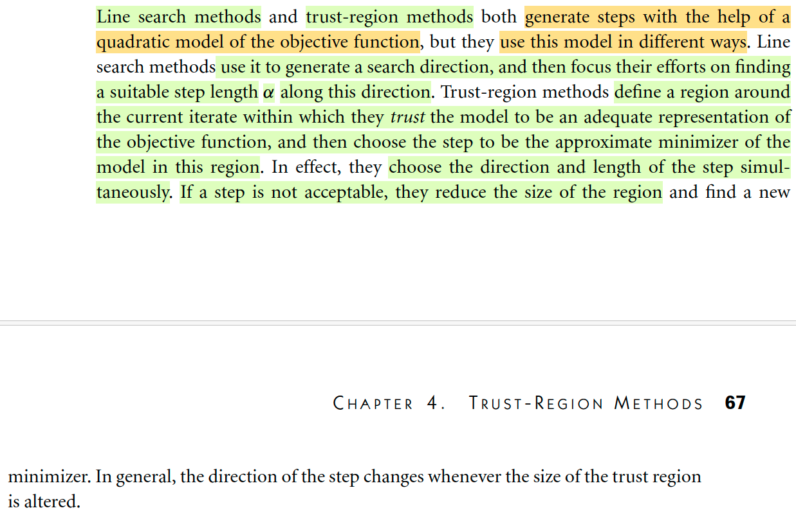</kbd>

> [!NOTE]
> Đầu tiên tác giả cho biết line search methods và trust region method đều có điểm chung là dựa vào việc ước lượng xấp xỉ hàm objective bởi một hàm bậc hai và từ đó tính toán ra hướng + độ lớn hướng di chuyển.
>
> Nhưng nó khác nhau ở cách làm. Cụ thể là line search sẽ tính ra direction trước, và tìm step size theo hướng đó sau. Còn trust-region method thì tìm toán một bán kính mà trong phạm vi đó có thể xem như hàm số hoạt động như hàm bậc hai, để từ đó tìm bước đi giúp minimize hàm bậc hai, và dùng nó để thực hiện bước nhảy. Nếu step tính ra không đạt nó sẽ thu hẹp lại trusted region và làm lại.
>
> Nhớ lại một chút về line search, mình đã biết có nhiều cách làm trong bước chọn direction có thể dùng các steepest gradient descent, hoặc Newton direction. Sở dĩ nói đây cũng là dựa trên việc xấp xỉ hàm số bởi hàm bậc hai là vì: Với Newton method thì rõ rồi, vì việc tính toán ra Newton step chính là dựa vào việc xấp xỉ hàm số bởi hàm bậc hai. Còn steepest gradient descent? 
>
> Đại khái là thế này: Quadratic approx của hàm f tại xk:
>
> f(xk + p) ≈ f(xk) + ∇f(xk)Tp + (1/2)pT∇^2f(xk)p
>
> Đặt vế phải là hàm mk(p) 
>
> Vậy thì đại khái là nếu trong phạm vi p hợp lý thì có thể xấp xỉ hàm f bởi hàm bậc hai.
>
> Và dựa vào đó ta xác định p là vector khiến minimize hàm bậc hai này.
>
> Viết lại mk(p) = fk + ∇fkTp + (1/2)pTHkp
>
> ∇mk(p) = Hkp + ∇fk
>
> First order condition: ∇mk(p) = 0 ⇔ Hkp + ∇fk = 0 ⇔ p = - ∇fk(Hk)inv. Đây chính là Newton step
>
> Nếu dùng Bk thay Hk, tức là một matrix xấp xỉ Hessian, thì ta sẽ có p = - ∇fk(Bk)inv, là quasi-newton step
>
> Còn nếu dùng (1/α) I thay cho Hk, tức là một hằng số nhân với Identity. Ta sẽ có:
>
> p = -∇fk (1/α I)inv  = -∇fk α = -α∇fk Thì đây chính là steepest gradient descent.
>
> Do đó thật ra đều là xấp xỉ hàm objective bởi quadratic, chẳng qua là khác nhau cách chọn dùng matrix Hessian. Nếu chọn cách tính chính xác Hessian, thì ta có Newton step, với việc có được thông tin về curvature dẫn đường thì dĩ nhiên là rất tốt. Còn nếu thay bởi xấp xỉ của Hessian cho giảm nhẹ tính toán thì ta có quasi Newton method, vẫn nhanh tuy không bằng Newton method xịn. Cuối cùng là coi như không dùng thông tin curvature thì ta có steepest gradient descent.

> [!TIP]
> **🤖 AI Feedback** — ✅ Score: **95/100**
>
> Bài phân tích rất chính xác các điểm chung và riêng giữa line search và trust-region methods như mô tả trong văn bản. Ngoài ra, bạn đã thể hiện sự hiểu biết sâu sắc về nền tảng toán học của việc xấp xỉ hàm bậc hai trong các phương pháp tối ưu, điều này vượt xa nội dung được cung cấp và là một điểm cộng lớn.

 

<kbd>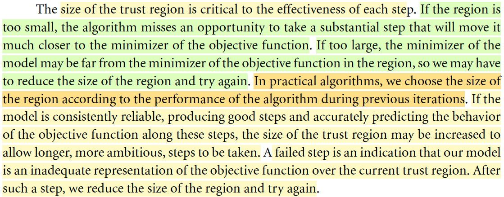</kbd>

> [!NOTE]
> Thế thì vì ý tưởng của trust region là vậy - tìm một phạm vi mà trong đó hàm số có thể coi như giống một hàm bậc hai, để từ đó tìm ra bước đi. Do đó dĩ nhiên là bước này rất quan trọng.
>
> Nếu phạm vi này quá lớn, thì trong phạm vi đó hàm số không hoạt động đúng với hàm bậc hai, nên hướng đi sẽ trật, thể hiện bởi bước hậu kiểm sẽ fail, và phải thu nhỏ trust region lại để làm lại.
>
> Nếu phạm vi này quá nhỏ, thì lãng phí, vì giống như ta sẽ quá cẩn trọng, trong khi đáng lẽ có thể thực hiện những bước đi dài hơn giúp hội tụ nhanh hơn.
>
> Ta sẽ tính toán trust region dựa vào kết quả của bước iteration trước đó. Kiểu như là nếu trước đó cho thấy là tốt: cụ thể là bước hậu kiểm cho thấy chọn trust region là ok, giúp trong phạm vi đó hàm số hành xử giống hàm bậc hai, thì trong lần iterate kế tiếp có thể tăng trust region lên. Ngược lại thì thu hẹp lại.
>
> Vậy mới thấy rõ là trust region sẽ cơ bản là tìm step size trước (khi nào tìm được rồi, chính là , rồi mới chọn hướng đi.

> [!TIP]
> **🤖 AI Feedback** — ⚠️ Score: **88/100**
>
> Bài phân tích cho thấy sự hiểu biết sâu sắc về vai trò và cách điều chỉnh kích thước vùng tin cậy, đặc biệt là các trường hợp quá lớn hoặc quá nhỏ, phản ánh tốt nội dung tài liệu. Tuy nhiên, việc bổ sung thông tin về thứ tự tìm kiếm bước đi không có trong văn bản gốc, cần tập trung hơn vào việc phân tích trực tiếp từ nguồn đã cho.

 

<kbd>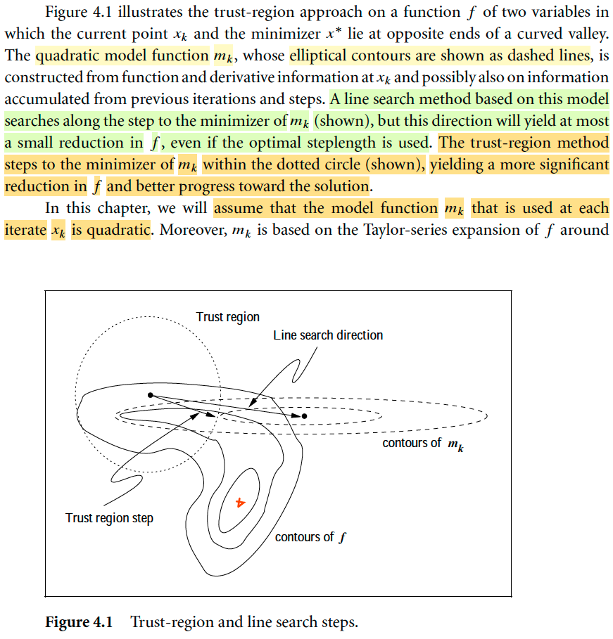</kbd>

> [!NOTE]
> Đoạn này đại ý tác giả muốn minh họa một hoàn cảnh mà có thể thấy Line search direction tệ hơn trust region direction.
>
> Cái contour plot của hàm objective là những đường méo mó, với điểm màu đỏ là x*. Và chấm đen đầu hai mũi tên là xk.
>
> Thế thì nếu là dùng line search method, như đã biết, ta sẽ coi như hàm f tại xk hành xử như hàm bậc hai. Để rồi đi theo Newton step sẽ dẫn ta xuống đáy cái parabol (các contour hình ellips gạch gạch) thì có thể thấy nó khiến hàm f tăng lên (điểm đen tâm của ellipse nằm ngoài đường đồng đẳng của của hàm f so với xk) Mà đó là ta dùng Newton step, tức là có dùng thông tin curvature cung cấp bởi Hessian tại xk rồi mà còn vậy, thì nếu dùng steepest gradient descent hay quasi Newton thì có thể còn tệ hơn.
>
> Trong khi đó, trust region, bằng cách tìm được một bán kính trust region mà trong đó hàm f xấp xỉ tốt bởi hàm bậc hai, nên bước đi của nó (mũi tên ở dưới, giúp hướng về optimizer x* tốt hơn so với line search).
>
> Mình có nhận xét thế này: Tới đây có thể thấy, khi ta xấp xỉ hàm số bởi hàm bậc hai, nhưng dĩ nhiên là phải có một phạm vi nào đó mà sự xấp xỉ này là tốt, bởi bản chất hàm f không phải lúc nào cũng là hàm bậc hai, và định lý Taylor đã cho ta biết khi nào thì được phép dùng dấu xấp xỉ để thay dấu bằng. Vậy thì rõ ràng phương pháp line search sau khi tính ra direction thì phải hết sức cẩn trọng trong việc chọn step size. Nhưng kể cả như vậy thì vấn đề là, cái direction nó có thể đã tệ ngay từ đầu rồi, nên chọn step size chỉ là vớt vát lại ít nhiều thôi.
>
> Trong khi đó, ưu tiên của trust region là chọn vùng an toàn, nơi mà có thể xấp xỉ tốt hàm bởi hàm bậc hai, từ đó mới tính direction, do đó direction của nó tốt hơn.

> [!TIP]
> **🤖 AI Feedback** — ⚠️ Score: **70/100**
>
> Phân tích về nguyên lý của phương pháp trust region và ưu điểm của nó so với line search rất sâu sắc và chính xác, thể hiện sự hiểu biết tốt về khái niệm cốt lõi. Tuy nhiên, nhận định về việc hàm f tăng lên khi sử dụng line search là sai lệch so với thông tin được cung cấp ('at most a small reduction'), và bài viết bị đứt đoạn ở cuối.

 

<kbd>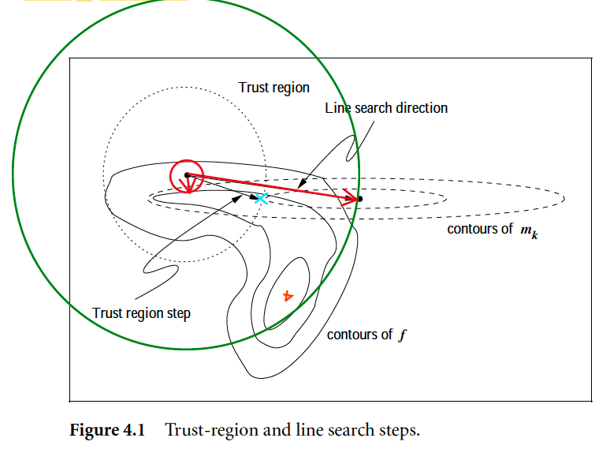</kbd>

> [!NOTE]
> Hiểu thế này, trust region khi đã tìm ra được vùng tin cậy, thì ta tìm trong những điểm trên hoặc trong tròn đó, điểm nào có hàm mk(p) nhỏ nhất.
>
> Nếu bán kính là lớn thì hướng này sẽ trùng với Newton step.
>
> Nếu bán kính nhỏ thì nó sẽ trùng với steepest gradient.
>
> (Những phần sau sẽ nói rõ)

 

- **#4.1, 4.2, 4.3**

<kbd>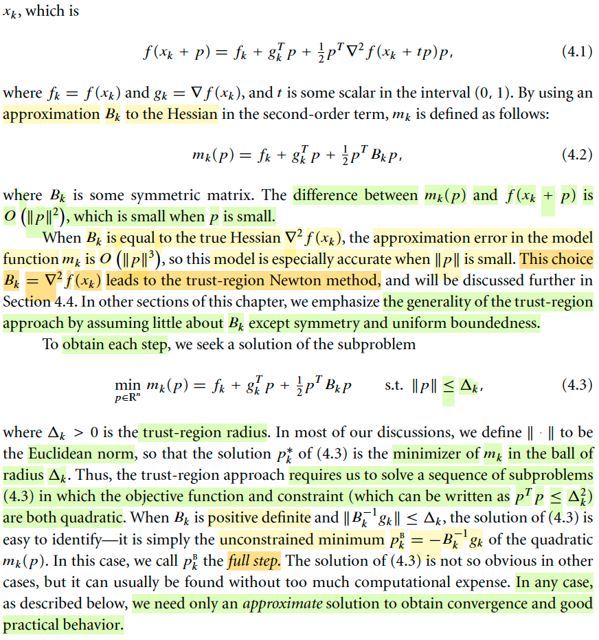</kbd>

> [!NOTE]
> Cùng đọc đoạn này. Tác giả nói trong phần này ta sẽ assume rằng tại mỗi iteration ta đều approx hàm f bởi quadratic function.
>
> Và cái này thì như đã biết từ các chương trước, xuất phát từ Taylor theorem:
>
> Nói rằng khi đi từ xk → xk + p, ta có:
>
> f(xk + p) = f(xk) + ∇f(xk)Tp + (1/2)pT ∇^2f(xk + tp)p for some t in (0,1) (4.1)
>
> Rồi, từ cái này mình sẽ lập luận rằng, nếu t nhỏ trong phạm vi nào đó thì Hessian tại xk + tp có thể coi như bằng Hessian tại xk. Từ đó ta có quadratic approximation:
>
> f(xk + p) ≈ f(xk) + ∇f(xk)Tp + (1/2)pT ∇^2f(xk)p
>
> Còn trong sách, tác giả nói nếu ta thay Hessian tại xk + tp bởi ma trận xấp xỉ Bk symmetric nào đó (mà nếu Bk là Hessian tại k thì ta có kết quả trên) thì ta sẽ có:
>
> f(xk + p) ≈ f(xk) + ∇f(xk)Tp + (1/2)pT Bk p 
>
> Và vế phải là hàm sẽ dùng để approx hàm f
>
> mk(p) =  f(xk) + ∇f(xk)Tp + (1/2)pT Bk p (4.2)
>
> Vậy thì sai khác giữa mk(p) và f(xk+p) sẽ là O(||p||^2) là vì sao?
>
> ⇨ Là vì f(xk + p) - mk(p) sẽ là (1/2)pT (Bk - H(xk+pt)) p. Và đây là O(||p||^2)
> vì nó có dạng Σ αi pi^2
>
> Thì là vì f(xk + p) - mk(p) = (1/2)pT(Bk - ∇^2f(xk+tp)) p
>
> Rồi tại sao khi Bk chính xác là Hessian thì ta sẽ có sai khác O(||p^3||)???
>
> (Quay lại sau)
>
> ====
>
> Tiếp, tác gỉa nói để đảm bảo tính khái quát của trust region method thì ta sẽ chỉ giả định rất ít về Bk, ngoại trừ việc nó đối xứng và "uniform boundedness"???
>
> Rồi, thế thì tại mỗi step, ta sẽ giải bài toán tối ưu:
>
> minimize mk(p) subject to ||p|| ≤ Δk (4.3)
>
> Và vì ||.|| ở đây là L2 norm, nên về cơ bản là ta giải bài toán minimize quadratic function với constraint cũng quadratic vì ||p|| ≤ Δk thì tương đương pTp ≤ Δk^2)
>
> Rồi nếu Bk xác định dương và ||Bkinv gk|| ≤ Δk thì ta có solution là pk_B = - (Bk)inv gk Và trong trường hợp này pk_B gọi là full step.
>
> ?? Vì sao?  Dễ thôi, vì minimizer của mk(p) dễ thấy sẽ là -(Bk)inv gk (y như công thức quasi Newton step đó). Và nếu như  ||(Bk)inv gk|| ≤ Δk (feasible) thì dĩ nhiên chính là thỏa constraint ⇨ là solution của bài toán. 
>
> Và vì nó là solution, nên dùng nó để đi ngay từ xk đến đấy luôn, tức là vector dài nhiêu thì đi theo đó bấy nhiêu nên gọi là full step. 
>
> Còn vì sao phải xác định dương thì là bởi đây là điều kiện đủ bậc hai mình đã biết ở chương 2 
>
> Còn trong trường hợp khác (ko thỏa Bk xác định dương và ||Bkinv gk|| ≤ Δk) thì ta sẽ tìm cách giải bằng các ước lượng.
>
> #4.1, 4.2, 4.3

> [!TIP]
> **🤖 AI Feedback** — ⚠️ Score: **88/100**
>
> Phân tích của bạn rất sâu sắc và chi tiết, đặc biệt là phần giải thích về 'full step' và điều kiện xác định dương của Bk, cho thấy sự hiểu biết vững chắc về lý thuyết. Tuy nhiên, khi tính sai khác f(xk + p) - mk(p), hãy cẩn trọng hơn về dấu của các thành phần trong biểu thức; và lần tới cần hoàn thiện các phần "Quay lại sau" để đạt điểm tối đa.

 

- **Outline of the trust-region method**

<kbd>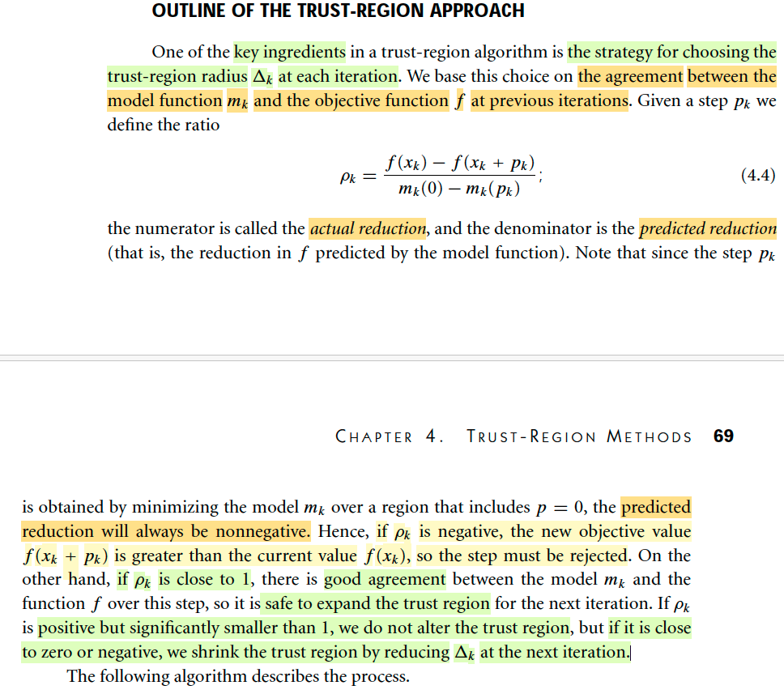</kbd>

> [!NOTE]
> Đại ý là phần này sẽ nói về cách tiếp cận đối với trust-region, vì bước xác định trust region là bước quan trọng đầu tiên cần làm.
>
> Ôn lại một chút về **phương pháp trust region**: So sánh với line search method, thì cả hai có **điểm chung** là (tại một bước update / một iteration để đang đứng ở xk, thực hiện bước đi đếm xk+1) thì về bản chất **đều là xem / coi như hàm objective là hàm bậc hai**, hay nói cách khác, ta dùng một hàm bậc hai để approximate hàm objective. 
>
> Để rồi dựa vào đó, **line search sẽ xác định direction, và step size**. Còn **trust region thì làm ngược thứ tự lại, xác định step size trước** (chính xác hơn thì xác định phạm vi của step size trước, tức trust region), sau đó, mới giải bài toán tối ưu - minimize hàm quadratic với constraint là trong phạm vi trust region để **tìm direction**.
>
> Thế thì, nếu đánh giá về line search, ta sẽ thấy rằng, vấn đề của nó là, nó **dựa vào việc estimate hàm objective bởi quadratic (mk(p) = fk + gkTp + (1/2)pTAp**, để rồi với việc dùng **A = I hay Hessian tại k hay matrix xấp xỉ Hessian tại k, Bk, mà ta có steepest gradient descent, quasi-newton hay Newton method)**, để từ đó giải bài toán minimize hàm mk(p) để xác định direction
>
> Thì điểm không ổn là theo Taylor theorem nói rằng, **trừ khi hàm f là hàm quadratic, còn không thì việc xấp xỉ này chỉ đúng trong một phạm vi nhỏ mà thôi**. Do đó, ngay cả khi dùng Newton method, thì nó chỉ tỏ ra hiệu quả khi xk đã tới gần x*, khiến cho việc ước lượng tại đó, và giải tìm minimizer của hàm mk nó diễn ra trong một phạm vi nhỏ, dẫn đến bảo đảm việc xấp xỉ là chấp nhận được, nên phương pháp phát huy hiệu quả, và dẫn đến tốc độ hội tụ bậc hai.
>
> Ngược lại, **khi xk còn xa x*, thì solution của bài toán minimizing mk method sẽ tạo ra direction có thể rất tệ**, vì nó vi phạm điều kiện của xấp xỉ bậc hai nói trên, rằng chỉ có thể xấp xỉ tốt trong phạm vi nào đó mà thôi.
>
> Ý muốn chỉ ra rằng, **nhược điểm của line search**, hiểu nôm na là **quá tự tin trong việc xác định direction**, và dù rằng bước tìm kiếm step length theo sau có thể cũng đảm bảo cho việc update có tiến triển nào đó, nhưng direction có thể đã tệ thì bước tìm step length cũng không gỡ gạc lại được.
>
> Từ đó ta mới nghĩ về trust region method, nó muốn **khắc phục bằng cách quyết định một trust region trước**, và cơ chế của nó nhằm mục đích, **nếu lần iterate trước có vẻ không ổn, thì sẽ thu hẹp trust region lại, và ngược lại thì sẽ mở rộng ra thêm**. 
>
> **Điều này giống như một người đi đường cẩn trọng, khi họ quyết định sẽ bước ngắn hơn nếu lần trước cảm thấy bị hụt chân v(vì nó cho thấy họ đang đoán sai về địa hình phía trước). Nhưng sẽ bước dài hơn nếu họ không thấy bị hụt chân hay chông chênh, chứng tỏ họ đang đoán đúng địa hình.**
>
> Tất nhiên, trust region **cũng xác định hướng đi bằng cách minimize hàm mk, nhưng ràng buộc bởi bán kính, khiến nó (pk) nó sẽ khác với hướng pk giải ra bởi bài toán minimize mk không ràng buộc.**
>
> Và đoạn này nói về việc **check tỉ số ρk chính là xem thử độ hụt**, hay cảm giác bị hụt chân / hay khựng (tưởng tượng bạn bước xuống cầu thang, khi bạn đoán nó thấp hơn thực tế bạng sẽ bị khựng, ngược lại, bạn sẽ bị cảm giác hụt chân) chính là **tỉ lệ giữa độ giảm của hàm f (từ xk → xk + pk) và độ giảm của hàm mk (mk tại 0. tức xk và tại pk, tức xk + pk).**
>
> **Nếu tỉ lệ này gần bằng 1**: Đây chính là **cảm giác chắc chắn**. cho thấy dự đoán đúng thực tế, ta tự tin sải bước dài hơn (tăng Δk, tức lần sau cho Δk+1 lớn hơn)
>
> Ngược lại, **nếu nó gần 0 hoặc âm**, có nghĩa là rất tệ, mà ở đây nói, nếu nó âm thì có nghĩa là hàm mục tiêu thậm chí còn đang đi lên → không thể chấp nhận được.  Khi đó ta sẽ giảm Δk.
>
> Còn **nếu nó vẫn dương nhưng không gần 1, thì cứ giữ Δ** vì cũng ko quá tốt cũng không quá tệ.
>
> Tóm lại, nếu **ví von hai phương pháp như cách ngừơi mù đi xuống thung lũng**. Thì, với line search: Ổng **sờ định hình dưới chân để đoán hướng đi**, rồi **dò dẫm để chọn sải bước**. 
>
> Còn với trust region, thì **ổng dựa vào cảm giác hụt chân hay bị khựng ở bước trước đó để quyết định sải bước**, sau đó **tìm hướng đi giúp xuống thấp nhất trong phạm vi sải bước đó**.
>
> #Công thức 4.4 ρk = f(xk) - f(xk + pk)] / [mk(0) - mk(pk)]

> [!TIP]
> **🤖 AI Feedback** — ✅ Score: **95/100**
>
> Bản phân tích của bạn cực kỳ kỹ lưỡng và sâu sắc, vượt xa việc tóm tắt nội dung trực tiếp từ văn bản, thể hiện sự hiểu biết vững chắc về các phương pháp tối ưu. Tuy nhiên, bạn có thể đề cập rõ hơn đến tính chất luôn không âm của predicted reduction để đảm bảo độ chính xác tuyệt đối.

 

- **Algorithm 4.1 (Trust Region)**

<kbd>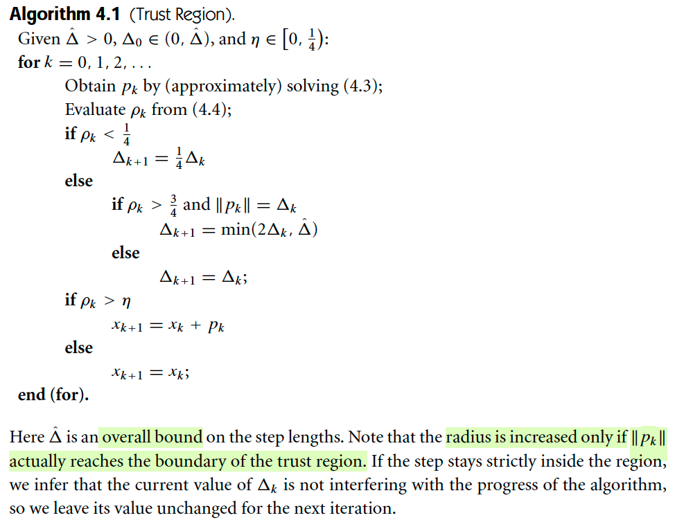</kbd>

> [!NOTE]
> Algorithm 4.1 (Trust Region)
>
> Iteratively lặp lại các bước k'th
>
> Tính pk là solution của bài toán minimizing over pk {mk(pk) = f(xk) + gkTpk + (1/2)pkBkpk s.t ||pk|| ≤ Δ
>
> Tính ρk = [f(xk) - f(xk + pk)] / [mk(0) - mk(pk)]
>
> Nếu ρk < 1/4 thì có nghĩa là hụt chân, vì mức giảm quá lớn so với thực tế → giảm trust region lại
>
> Nếu ρk > 3/4 và ||pk|| = Δ → chắc chân → tăng trust region
>
> còn ca ở giữa thì cứ giữ nguyên.
>
> Cuối cùng, nếu pk thỏa điều kiện > η (là giá trị chọn trước ∈ [0, 1/4]) thì mới thực hiện bước update xk+1 = xk + pk còn ngược lại thì giữ nguyên xk+1 = xk
>
> Chỉ có để ý là, nó chỉ tăng trust region lên nếu như ở bước trước đó, ||pk|| = Δk, có nghĩa nôm na là việc tìm kiếm ra điểm thấp nhất trong phạm vi cho phép cho ra điểm ngay trên biên. Điều này cùng với việc tỉ số ϱk "đạt" thì ta mới mở rộng trust region.

 

- **Bài toán (4.5) sẽ là minimize mk(p) = fk + gkTp + (1/2)pTBkp subject to ||pk|| ≤ Δk**

<kbd>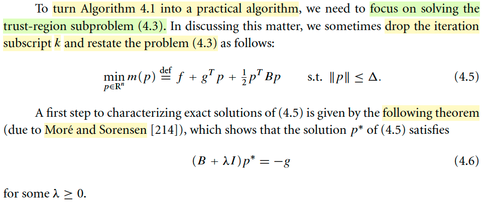</kbd>

> [!NOTE]
> Thế thì trong thuật toán vừa rồi, thì bước đầu tiên là giải bài toán tìm pk, (sau khi đã có trust region radius Δk
>
> Như đã biết, tại iteration k, đứng ở xk, ta tìm cách đến xk+1.
>
> Thì bài toán (4.5) sẽ là minimize mk(p) = fk + gkTp + (1/2)pTBkp subject to ||pk|| ≤ Δk 
>
> (gk là gradient tại k, ∇f(xk), Bk thì có khi là I, có thể là xấp xỉ của Hessian ∇^f(xk) hoặc có thể là ∇^f(xk))
>
> Cho gọn thì ta tạm bỏ đi subscript:
>
> minimize f + gTp + (1/2)pTBp subject to ||p|| ≤ Δ (
>
> Thì đại ý là, để giải bài toán này, ta sẽ dùng một theorem mà ta sẽ chứng minh sau, theorem này nói rằng: nếu p* là solution của bài toán 4.5 thì nó sẽ thõa:
>
> (B  + λI)p* = -g (4.6)
>
>
> #4.5, 4.6

 

- **Theorem 4.1**

<kbd>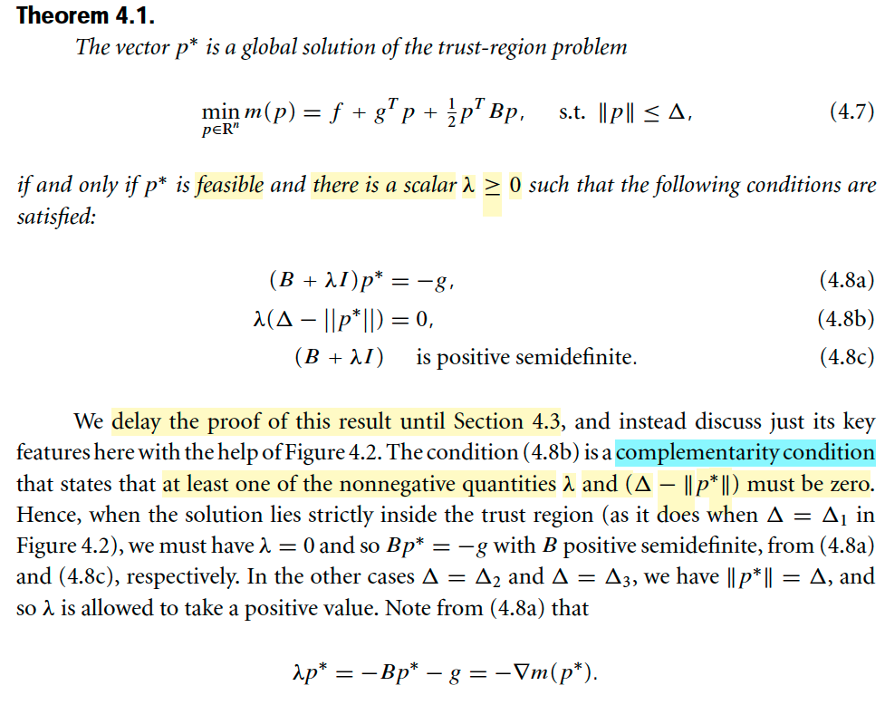</kbd>

<kbd>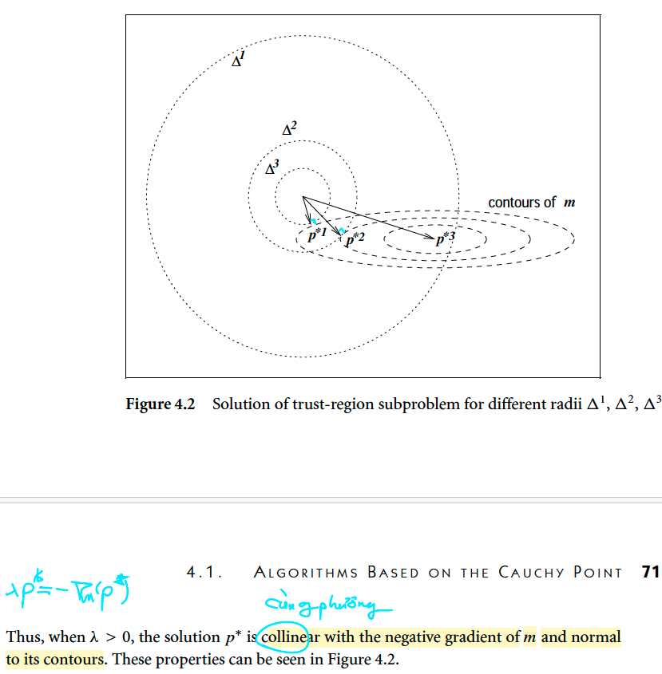</kbd>

> [!NOTE]
> Theorem 4.1
>
> Rồi, theorem vừa nhắc đến, nó rằng p* là global solution của bài toán minimize m(p) = f + gTp + (1/2)pTBp s.t ||p|| ≤ Δ KHI VÀ CHỈ KHI p* feasible và tồn tại λ ≥ 0 thỏa:
>
> (B + λI)p* = -g (4.8a)
>
> λ(Δ - ||p*||) = 0 (4.8b)
>
> (B + λI) xác định bán dương. (4.8c)
>
> Như đã nói, tác giả sẽ chưa chứng minh theorem này. Mà ta sẽ phân tích vài hệ quả trước. (sau đó, trước khi đọc tiếp, mình sẽ ôn lại KKT condition học ở Convex Optimization S.Boyd để chỉ ra thực ra mấy cái trên chính là KKT conditions)
>
> Vài nhận định cũng dễ hiểu thôi:  
>
> Thứ nhất: 
>
> vì thỏa 4.8b, λ(Δ - ||p*||) = 0 nên nếu Δ - ||p*|| > 0 thì λ phải = 0, và nếu λ > 0 thì (Δ - ||p*||) phải = 0 (cái này rõ ràng chính là complementary slackness)
>
> Thì ý nghĩa của nó, là, khi solution p* nằm TRONG trust region, tức ||p*|| < Δ ⇔ Δ - ||p*|| > 0 thì λ phải = 0, dẫn đến cùng với 4.8a và c ta phải có:
>
> Bp* = - g và B xác định bán dương.
>
> Còn ngược lại nếu minimizer xảy ra tại biên, ||p*|| = Δ thì λ phải dương. Khi đó 4.8a ⇔ Bp* + λp* = -g ⇔ λp* = - Bp* - g ⇔ λp* = - (Bp* + g)
>
> và đây chính là gradient của mk tại p* (không có gì khó hiểu sau khi đã học MIT 18s096)
>
> Vậy λp* = - ∇m(p*)
>
> Và phương trình này cho thấy p* CÙNG PHƯƠNG với nagative gradient, và mình thì đã biết gradient sẽ vuông góc với contour plot, nên ta kết luận p* sẽ vuông góc với contour plot.
>
> Có chỗ dễ gây lú: 
>
> Ta đứng tại xk, và giải bài toán minimize mk(p) = fk + gkTp + (1/2)pTBkp s.t ||p|| ≤ Δ, để có mk(p*) là điểm thấp nhất trong phạm vi cho phép.
>
> Thì thật ra bản chất ý nghĩa của việc xấp xỉ f(xk + p) ≈ f(xk) + gkTp + (1/2)pT Hk p nói rằng khi đi từ xk → ra khỏi xk thì trong phạm vi nào đó thì ta có thể xem nó hành xử như hàm quadratic.
>
> và nếu mình tìm ra p* là cái giảm thiểu cái này, thì cũng chính là p* dẫn ta từ xk đi đến xk + p* là điểm thấp nhất
>
> Nếu có thêm constraint thì có nghĩa là p* là hướng di chuyển (và sải bước) giúp ta đi từ xk đến xk + p* thấp nhất có thể trong phạm vi hình tròn (xk, Δk).
>
> Nên p* là hướng, là vector, vậy thì  ∇mk(p*) có nghĩa là sao? Đây là chỗ có thể gây bối rối.
>
> Câu trả lời đơn gỉan là: Thì nó có nghĩa là gradient của hàm mk tại p* chứ sao. Nhưng ở trên hình thì nó chính là xk + p*.
>
> Nói rõ hơn: mình phải nhận thức rõ, hàm mk(p), vì là hàm của p, mà bản chất là gì, là x - xk, vì mk(p) vốn xuất thân từ xấp xỉ bậc 2, cũng là Taylor expansion của f xung quanh xk:
>
> f(x) ≈ f(xk) + ∇f(xk)T(x-xk) + (1/2)(x-xk)T ∇^2f(xk) (x-xk) 
>
> Rồi ta mới lấy vế phải, đặt p = x - xk, và đăt hàm mk(p) = f(xk) + ∇f(xk)Tp + (1/2)p ∇^2f(xk) p
>
> Thì theo đó, sự tương ứng sẽ là: **Trong hệ quy chiếu x, ta đi từ xk → xk + p*, thì tương ứng với trong hệ quy chiếu p, thì ta đi từ p = 0, đến p = p***
>
> Nên nói về gradient của mk(.) tại p*, thì nó sẽ tương ứng với điểm xk + p* trong hệ quy chiếu x.
>
> Nói chung hiểu rõ như vậy thì ta sẽ không còn thắc mắc kiểu như ủa p* là hướng, ko phải là điểm (như xk, hay xk + p*) mà lại có ∇mk(p). Mà có thể hiểu p*, chính là tương ứng với xk + p* trong hệ trục tuyệt đối.
>
> Nên nếu ∇f(x)|x=xk + p* là vector gradient của hàm f thì ∇mk(p*) là vector gradient của hàm mk.

> [!TIP]
> **🤖 AI Feedback** — ✅ Score: **95/100**
>
> Ghi chú của bạn rất chính xác và thể hiện sự nắm vững xuất sắc các điều kiện của bài toán con vùng tin cậy, bao gồm cả hiểu biết sâu sắc về các phép biến đổi tọa độ cơ bản và sắc thái của việc diễn giải gradient.

 

- **Lập luận lại KKT conditions.**
> [!NOTE]
> Lập luận lại cái KKT nhé:
>
> Đầu tiên, nhớ ý quan trọng này, **đối diện với bài toán inequality + equality constraint opt problem** có dạng: 
>
> minimize x {f0(x)} s.t fi(x) ≤ 0, hi(x) = 0, i = 1,2...
>
> Thì solution của bài toán này sẽ là một điểm x* feasible (thoả các constraint) và khiến f0(x) nhỏ nhất.
>
> Thì cái **lí luận của việc xây dựng Lagrangian function** đó là vì** ta muốn "tích hợp" cái constraint vào, để đưa về bài toán unconstraint**. Và ta làm bằng cách, gắn trọng số vào các inequality:
>
> Generalized Lagrangian function: L(x, λ, v) = f0(x) + Σi λi fi(x) + Σi vihi(x)
>
> Thế thì tuy tích hợp vào để thành bài toán unconstraint, nhưng **phải làm sao đó để phản ánh được constraint**, đó là ta muốn **fi(x) ≤ 0** và hi(x) = 0. 
>
> Vậy làm sao để khi minimize L theo x thì nó khiến fi(x) âm. Câu trả lời là phải **ràng buộc λi ≥0 **. Vì nếu không, quá trình tối ưu khi muốn minimize L sẽ đẩy fi(x) càng dương càng tốt vì điều này dẫn đến λifi(x) càng âm.→ Và fi(x) dương sẽ khiến vi phạm constraint.
>
> Do đó ta có một trong KKT conditions: λi ≥ 0, hay viết là λ ≽ 0 (vector λ)
>
> Thế thì, để minimize L over x, dĩ nhiên sẽ dẫn ta đến gradient của L wrt x = 0, vì đây là điều kiện cần bậc 1. Nên ta mới có ∇L(x*, λ, v) = ∇f0(x*) + Σi λi ∇fi(x*) + Σi vi ∇hi(x*) = 0. Đó chính là điều kiện KKT tiếp theo.
>
> Tiếp, khi mà ta đã minimize over x hàm Lagrangian, **thì Lagrangian tại đó, (tức tại x là solution của bài toán minimize over x hàm Lagrangian) sẽ không còn phụ thuộc vào x nữa**, nó là hàm theo λ và v. Đây là định nghĩa của **dual function**: g(λ, v) = inf x L(x, λ, v)
>
> và ta sẽ có một inequality:
>
> g(λ, v) ≤ L(x, λ, v) **với mọi x** do định nghĩa của dual function.
>
> Rồi. Tới đây nhận định thế này, nếu gọi **x* là solution của primal problem**, tức là **feasible point + minimize f0(x)** thì ta có: 
>
> g(λ, v) ≤ L(x*, λ, v) = f0(x*) + Σi λi fi(x*) + Σi νi hi(x*) (1)
>
> điều này là **đương nhiên, vì inequality này thỏa với mọi x** cơ mà. 
>
> Và vì x* thỏa constraint (x* trước hết phải là feasible point), nên: 
>
> λi × fi(x*) ≤ 0, (a) và 
>
> vi × hi(x*) = 0. (b)
>
> Giúp ta có: 
>
> g(λ, v) ≤ L(x*, λ, v) = f0(x*) + Σi λi fi(x*) + Σi νi hi(x*)
>
> = f0(x*) + Σi λi fi(x*) + 0 (do (b))
>
> ≤ f0(x*) (do (a))
>
>
> Vậy g(λ, v) ≤ f0(x*) 
>
> Mang ý nghĩa **dual function là lower bound của optimal value p* = f0(x*)**
>
> Vậy thì câu chuyện tiếp theo sẽ là, nếu đã nhận định g(λ, v) là lower bound của p*, tức f0(x*), thì ta **muốn tìm cái lower bound tốt nhất (tức cao nhất). **Bằng cách maximize over λ, v đối với g(λ,v), bài toán này gọi là **dual problem**.
>
> gọi d* là sup λ ≽ 0, v {g(λ, v)}. gọi là **dual optimal value**. Thì ta sẽ lại có inequality: 
>
> d* ≤ p*
>
> Điều này chỉ là hệ quả của g(λ, v) ≤ p* ⇨ max của nó vẫn sẽ ≤ p*
>
> Và p* - d* gọi là **duality gap**
>
> Tới đây, **có một theorem nói rằng** nếu như **trong bối cảnh convex problem** và **thỏa một số điều kiện gọi là qualification constraint**, thì ta sẽ có **strong duality**: d* = p*, hay zero duality gap (p* - d* = 0)
>
> d* = p*
>
> cũng là g(λ*, v*) = f0(x*)
>
> tức f0(x*) + Σi λ*ifi(x*) + Σi v*ihi(x*) = f0(x*)
>
> mà dĩ nhiên là hi(x*) = 0 vì x* là primal optimal nên dĩ nhiên feasible
>
> nên cái trên chỉ còn **Σi λ*ifi(x*) = 0** 
>
> và với fi(x*) ≤ 0, thì cái này cho thấy nếu fi(x*) âm thì λi phải bằng 0 và ngược lại nếu λi > 0 thì fi(x*) phải = 0.
>
> Và đây chính là một điều kiện KKT nữa, có tên là **complementary slackness**.
>
> Do đó KKT conditions bao gồm:
>
> Gradient của Lagrangian đối với x tại x* = 0 . Đây gọi là **stationary condition**
>
> **Complementary slackess**: Σi λ*ifi(x*) = 0 với mọi i
>
> λi* ≥ 0, đây gọi là **dual constraint**, tức constraint của dual problem
>
> fi(x*) ≤ 0, hi(x*) = 0. gọi là **primal constraint**, constraint của primal problem.
>
> Và một điểm lưu ý quan trọng: 
>
> Nếu như **bài toán lồi và thỏa constraint qualification**, ví dụ điển hình là Slater's condition. **Giải KKT giúp kết luận x* là global optimal** (tức là coi như điều kiện cần + đủ)
>
> Còn theo Gemini mới dạy mình, là v**ới bài toán khác, vẫn có thể dùng KKT condition**, nhưng **chỉ được dùng như điều kiện cần** (chứ chưa đủ)

> [!TIP]
> **🤖 AI Feedback** — ⚠️ Score: **80/100**
>
> Bài phân tích KKT của bạn thể hiện sự hiểu biết sâu sắc và mạch lạc về hầu hết các khía cạnh lý thuyết. Tuy nhiên, cần chỉnh sửa lại một số lập luận cốt lõi để đạt được sự chính xác tuyệt đối.

 

- **Nói sơ về nội dung sắp tới**

<kbd>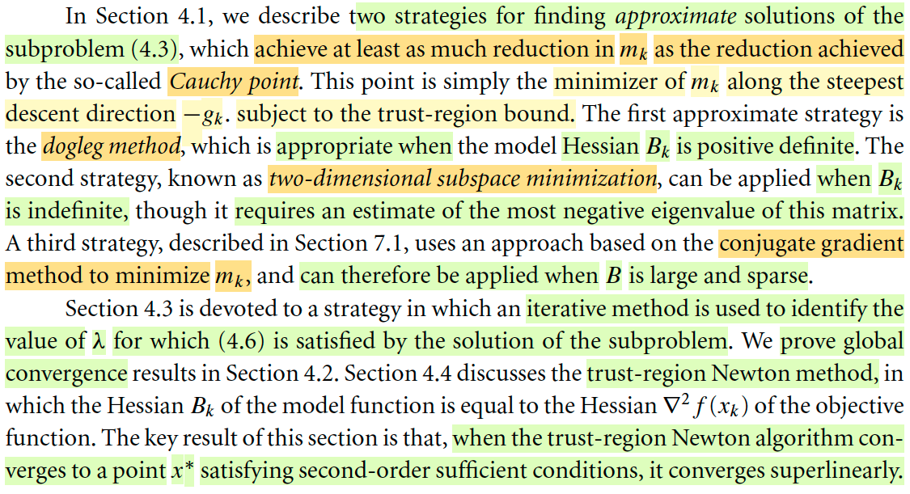</kbd>

> [!NOTE]
> Đại ý phần này nói sơ về nội dung sắp tới. 
>
> Section 4.1 sẽ bàn về cách giải solution của bài toán 4.3 - tức là bài toán minimize over p mk(p) constraint ||p|| ≤ Δ (mà ý nghĩa là từ xk đi tới đâu trong phạm vi vòng tròn chop phép đề xuống được thấp nhất nếu coi như đang đi trên cái bát quadratic mk). Thì có vài cách để giải bài toán này, tùy theo là Bk có tính chất gì.
>
> (nhớ lại: mk(p) = fk + ∇fkTp + (1/2)pT Bk p. Và Bk có thể chọn là ma trận xấp xỉ Hessian tại k hoặc cũng có thể là Hessian tại k, và mỗi cách chọn nó sẽ cho ra phương pháp khác)
>
> Thì nếu Bk xác định dương thì ta sẽ dùng phương pháp "dogleg"
>
> Nếu Bk không xác định thì dùng phương pháp "2D subspace minimization" 
>
> Và còn phương pháp thứ 3 nữa qua chương 7 mới nói, liên quan đến conjugate gradient.
>
> Qua phần 4.2 sẽ bàn về tốc độ hội tụ của mấy cái này.
>
> 4.3 thì bàn về một chiến thuật để dùng cách tiếp cận iterative để tính ra λ thỏa 4.6 (tức là (B + λI)p* = -g)
>
> 4.3 thì bàn về trust-region Newton method, chính là khi mà dùng Hessian tại k cho Bk nói ở trên. Và ta sẽ nói về đặc điểm của cái này là khi thuật toán này converge về một điểm x* có tính chất là thỏa điều kiện đủ bậc hai (tức là Hessian tại đó xác định dương đó) thì tốc độ hội tụ sẽ là siêu tuyến tính.

> [!TIP]
> **🤖 AI Feedback** — ❌ Score: **65/100**
>
> Bài làm cho thấy sự hiểu biết khá tốt về các phương pháp giải quyết bài toán phụ, nhưng mắc lỗi nghiêm trọng trong việc phân biệt nội dung giữa các phần, đặc biệt là Phần 4.3 và 4.4.

 

## The Cauchy Points

<kbd>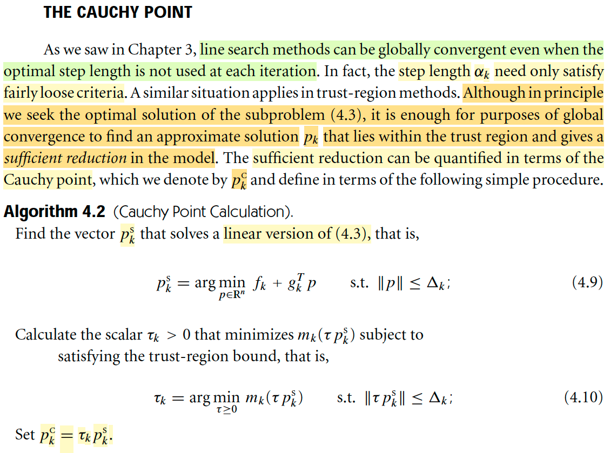</kbd>

> [!NOTE]
> Đại ý tác giả nói là cũng giống như trong chapter trước (về line searcg), mình đã thấy rằng, ngay cả khi việc chọn step size không phải là optimal (như việc ta không cần giải bài toán exact line search - minimize hàm g(t) = f(xk + tpk)), mà chỉ cần chọn step size đủ tốt (thông qua việc thỏa các điều kiện dừng) thì ta vẫn có thể có hội tụ toàn cục (global convergence).
>
> Thì ở đây tương tự, đó là ta cũng không cần phải tìm pk là solution tuyệt đối của bài toán minimize mk(p) s.t ||p|| ≤ Δ. thay vào đó chỉ cần pk đủ tốt, ý là giúp giảm hàm f đủ tốt (sufficient reduction). Và mức giảm đủ tốt này có thể được thể hiện bởi Cauchy points. 
>
> Để tìm nó cần 2 bước:
>
> Đầu tiên tìm pk_s = argmin fk + gkTp s.t ||p|| ≤ Δk, ý nghĩa của cái này có thể hiểu nôm na là: Nếu coi như đi từ xk → xk + p hàm f ứng xử như hàm tuyến tính thì trong phạm vi cho phép đi tới đâu là thấp nhất.
>
> Sau đó, nếu xét trong cái hướng pk_s, và vẫn trong phạm vi cho phép, thì ở đâu giúp mk thấp nhất.
>
> Mình hình dung vầy: Việc xác định pk_s, giống như là, mình vẽ cái mặt phẳng tiếp tuyến với đồ thị hàm f tại xk, độ dốc của nó (gradient của nó) tại xk = gradient ∇fk. Rồi, rõ ràng mặt phẳng này, với việc ta giới hạn phạm vi trong bán kính Δ, giống như hàng rào bao quanh thì câu chuyển là ta đi trong mặt phẳng này tới đâu trong phạm vi hàng rào để xuống thấp nhất, Khi đó ta xá định được pks và dễ thấy nó phải là điểm chạm vào hàng rào. 
>
> Rồi, tiếp theo thì về cơ bản là ta giới hạn hàm mk theo phương pks, để giải bài toán minimize hàm đơn biến mk(τpks) s.t ||τpks|| ≤ Δ.
>
> Khi đó ta sẽ có pkc = τkpks

> [!TIP]
> **🤖 AI Feedback** — ⚠️ Score: **85/100**
>
> Học sinh thể hiện sự hiểu biết sâu sắc về điểm Cauchy và mối liên hệ với phương pháp tìm kiếm đường và vùng tin cậy. Tuy nhiên, cần chú ý hơn đến tính chính xác trong định nghĩa cuối cùng.

 

### Close formed solutin pls

<kbd>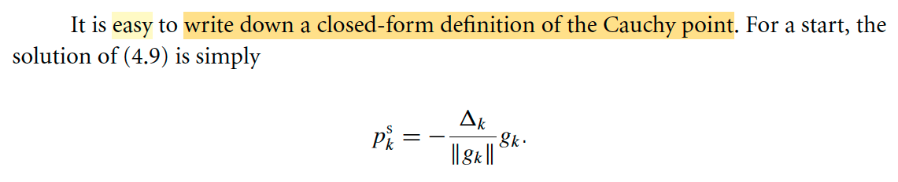</kbd>

> [!NOTE]
> Ở đây tác giả nói bài toán 1 tìm pks có thể có closed form solution như vầy, cùng thử xem tại sao:
>
> Bài toán là minimize fk + gkTp s.t ||p|| ≤ Δk
>
> ≡ (equivalent) minimize gkTp s.t ||p|| ≤ Δk
>
> -||gk|| ||p|| ≤ gkTp = ||gk|| ||p|| cos(θ) ≤ ||gk|| ||p|| (công thức tích vô hướng, và tính chất hàm cosine)
>
> Vậy ta có gkTp ≥ -||gk|| ||p|| 
>
> Dùng constraint ||p|| ≤ Δ ⇔ -||p|| ≥ - Δ ⇔ -||gk|| ||p||  ≥ -||gk|| Δ
>
> ⇨ gkTp ≥ -||gk|| ||p||  ≥ -||gk|| Δ
>
> Vậy solution của bài toán là p sao cho gkTp = -||gk|| Δ ⇔ ||gk|| ||p|| cos θ = -||gk|| Δ
>
> ⇔ cos theta = -1, và ||p|| = Δ
>
> tức là p = -(gk Δ)/ ||gk||, hay (- Δ / ||gk||) gk
>
> Nói chung đay

> [!TIP]
> **🤖 AI Feedback** — ✅ Score: **95/100**
>
> Bản giải thích này rất rõ ràng và chính xác, chứng minh được công thức cho điểm Cauchy một cách đầy đủ. Để bài làm hoàn hảo hơn, bạn nên thêm tên gọi chính thức của bài toán này ngay từ đầu.

 

#### Công thức Cauchy point

<kbd>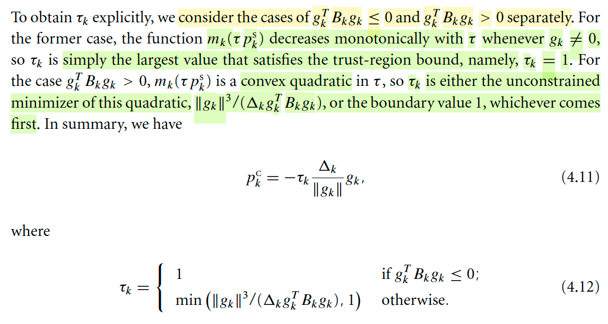</kbd>

> [!NOTE]
> Rồi, qua bài toán sau: minimize mk(τ) = fk + gT(τp) + (1/2)(τp)TBk(τp) 
>
> Với p là pks = - (Δk / ||gk||) gk, g là gradient của f tại xk
>
> Thì lập luận là, ta sẽ xét 2 trường hợp:
>
> gkTBkgk ≤ 0: Thì (τp)TBk(τp) = τ^2 pTBkp = τ^2 (Δk / ||gk||)^2 gkTBkgk cũng sẽ ≤ 0 ∀ τ
>
> mk(τ) = fk + τ gkT [-(Δk / ||gk||) gk] + (1/2) τ^2 (Δk / ||gk||)^2 gkTBkgk
>
> = fk - τ gkTgk [(Δk / ||gk||)] + (1/2) τ^2 (Δk / ||gk||)^2 gkTBkgk
>
> = fk - ||gk|| Δk τ + (1/2) τ^2 (Δk / ||gk||)^2 gkTBkgk
>
> Xét đạo hàm theo τ của hàm g(τ) = mk(τpks):
>
> g'(τ) = (Δk / ||gk||)^2 gkTBkgk τ - ||gk|| Δk thì có thể thấy với mọi τ ≥ 0 thì cái này đều luôn âm ⇨ hàm monotone decreasing. ⇨ Hàm luôn giảm nên bài toán minimize sẽ có solution tại boundary: Tức τ là giá trị khiến τ||pks|| = Δ ⇔ τΔ = Δ ⇔ τ = 1
>
> ====
>
> Xét trường hợp 2: gkBkgk > 0:
>
> giải g'(τ) = 0:
>
> ⇔ (Δk / ||gk||)^2 gkTBkgk τ - ||gk|| Δk = 0
>
> ⇔ (Δk / ||gk||)^2 gkTBkgk τ = ||gk|| Δk 
>
> ⇔ [Δk^2 / (||gk||)^2] gkTBkgk τ = ||gk||Δk
>
> ⇔ τ = (||gk||)^3 / ΔkgkTBkgk
>
> g''(τ ) = (Δk / ||gk||)^2 gkTBkgk, và nó sẽ luôn > 0. 
>
> Nên nếu thỏa constraint, tức ||τ*pks|| ≤ Δk
>
> ⇔ (||gk||)^3 / ΔkgkTBkgk Δk ≤ Δk
>
> ⇔ (||gk||)^3 / ΔkgkTBkgk ≤ 1 thì minimizer là (||gk||)^3 / ΔkgkTBkgk
>
> Ngược lại, thì minimize sẽ = 1 vì hàm số chỉ có một cực tiểu, và lúc này nó nằm ngoài biên, nên trong phạm vi cho phép thì tại biên nó thấp nhất
>
> Nên kết luận τk = min(1,  (||gk||)^3 / ΔkgkTBkgk)
>
> Vậy tổng hợp hai case: τk = 1 nếu gkTBkgk ≤ 0 và min(1,  (||gk||)^3 / ΔkgkTBkgk) otherwise.

> [!TIP]
> **🤖 AI Feedback** — ✅ Score: **95/100**
>
> Bài làm thể hiện sự hiểu biết sâu sắc và khả năng phân tích xuất sắc đối với bài toán. Các bước đạo hàm và lập luận cho từng trường hợp đều chính xác và đầy đủ. Chỉ một điểm nhỏ cần lưu ý là cách giải thích từ τ||pks|| = Δ để suy ra τ=1 có thể chính xác hơn, nhưng điều này không ảnh hưởng đến kết quả cuối cùng.

 

##### Bước Cauchy và hội tụ

<kbd>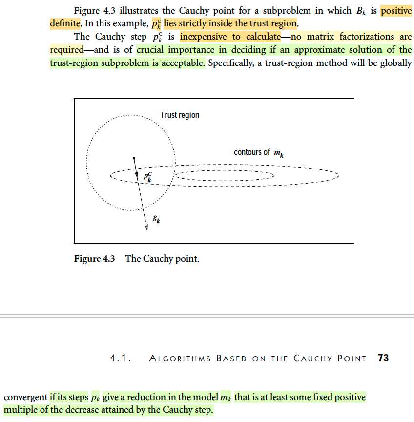</kbd>

> [!NOTE]
> Hình ảnh này minh họa tình huống mà pkC nằm trong bán kính.
>
> Nói chung tác giả cho rằng việc tính toán Cauchy step không tốn nhiều chi phí, vì quá trình hoàn toàn không cần phải factor matrix.
>
> Vì sao nhỉ, có thể thấy là vì công thức chỉ là tính norm của gk, và gkTBkgk, mà tính cái này thì cơ bản chỉ là nhân matrix với vector. Không phải tính nghịch đảo hay giải hệ phương trình (ví dụ như tìm nghịch đảothì ta sẽ phải phân rã
>
> Và ý chính là, nếu pk giúp tạo ra một mức giảm ít nhất là bằng một con số dương nào đó nhân với mức giảm của Cauchy step thì thuật toán chắc chắn sẽ hội tụ toàn cục.
>
> Mình nghĩ: Nhớ lại, ở trên đã nói, tương tự như bên line search, khi step size có thể không cần tối ưu, mà chỉ cần đủ tốt, bằng cách thỏa điều kiện dừng, là sẽ đảm bảo hội tụ toàn cục thì ở đây cũng tương tự, chỉ cần pk giúp giảm đủ tốt (bằng cách so

 

- **Improving on the Cauchy Points**

<kbd>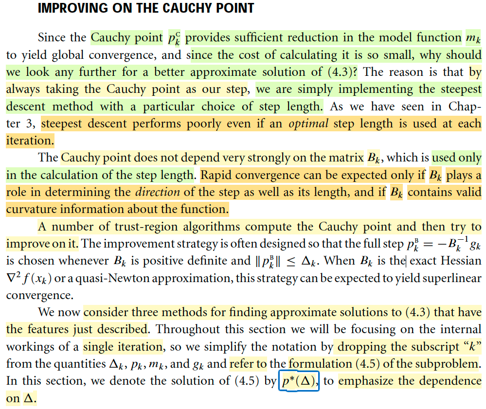</kbd>

> [!NOTE]
> Đại khái đoạn này nói là: **Ta có thể thắc mắc rằng**, **nếu như việc tính toán Cauchy step rẻ như vậy**, và như đã nói nếu **pk có thể tạo ra mức giảm đủ tốt dựa theo Cauchy step** thì **sao ta không dùng luôn Cauchy step**, mà phải đi tìm một solution tốt hơn (why we should look any further for a better approximate solution of 4.3)
>
> Thì đại ý là vì một điều tương tự như trong **chap 3 mình đã thấy phân tích hội tụ của steepest descent cho thấy nó rất kém**, ngay cả khi dùng step length tối ưu (mà mình nhớ hình ảnh là nó sẽ nhảy qua nhảy lại giữa hai vách núi, do nó luôn chọn hướng vuông góc với contour, nên nếu optimization landscape giống một thung lũng hẹp thì nó sẽ nhảy qua nhảy lại liên tục)
>
> Và đại khái là **Cauchy point, mình nhớ, bước tính pkS, tức là chọn hướng, về cơ bản chính là đi theo steepest descent direction**. Chính là ý mà tác giả nói, **Bk, vốn là có thể chứa thông tin curvature giúp xác định hướng tốt hơn** (giống như Hessian, giúp chọn Newton step tốt hơn là steepest descent direction vậy) **thì lại không tham gia vào việc tính pkS**. Mà nó **chỉ tham gia vào bước xác định step size**. Xem lại là hiểu.
>
> Do đó, tác giả nói, **có vài trust region method sẽ làm theo cách là tính Cauchy point trước, sau đó cải thiện thêm**. Và **cách thức có thể là bằng cách lôi Bk vào bước tính direction**. Cụ thể là nếu Bk xác định dương là thì nó sẽ tính pkB = - Bkinvgk.
>
> (Chỗ này chưa rõ lắm, pkB là để dùng luôn cho pk hay là sao)
>
> Thế thì phần sau ta sẽ học những phương pháp giúp tìm approximation solution của 4.3.
>
> Ôn lại chút chỗ này: 4.3 là bài toán này:
>
> minimize fk + gkTp + (1/2)pTBkp s.t ||p|| ≤ Δk
>
> Thì đại khái là ta **có thể không cần giải chính xác solution**. Mà chỉ cần approx solution thôi, dựa trên yêu cầu là nó đủ tốt (so sánh bởi / với Cauchy step).
>
> Thì những phần tiếp sẽ nói về cách giải các approx solution của bài toán này.

> [!TIP]
> **🤖 AI Feedback** — ✅ Score: **90/100**
>
> Bài làm cho thấy sự nắm bắt vững chắc các khái niệm cốt lõi của việc cải thiện điểm Cauchy và hiểu biết sâu sắc về vai trò của ma trận $B_k$. Tuy nhiên, còn một điểm nhỏ cần làm rõ hơn về chiến lược tích hợp các bước cải tiến.

 

- **The Dogleg method**

<kbd>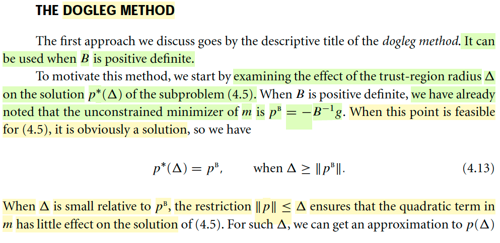</kbd>

<kbd>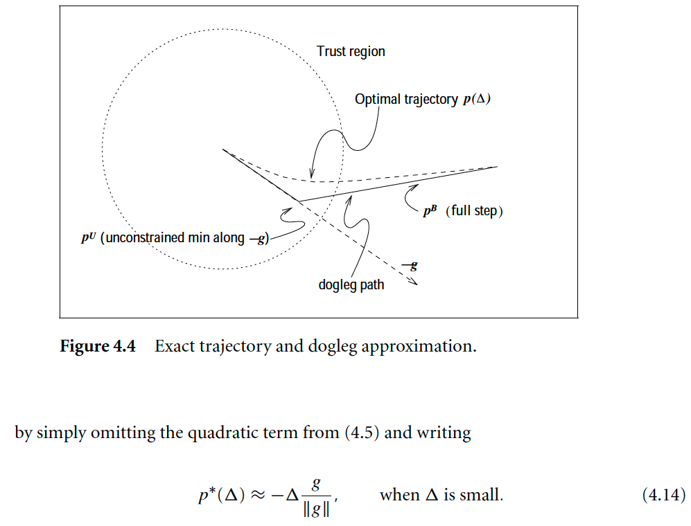</kbd>

<kbd>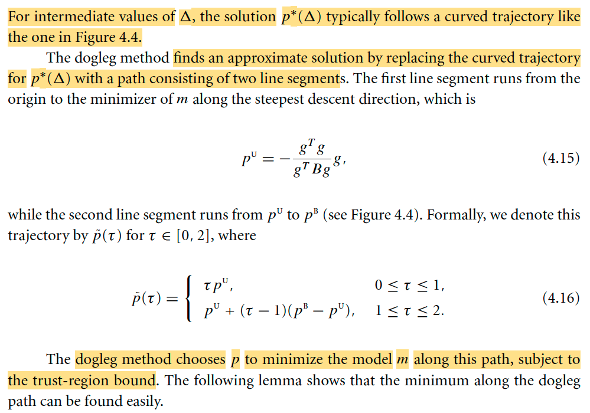</kbd>

> [!NOTE]
> Đại khái là vầy: Phương pháp này nó sẽ làm như sau:
>
> Đầu tiên mình **xét bài toán minimize m(p) = f + gTp + (1/2)pTBp không constraint**, thì dễ thấy **solution của nó chính là -(B)inv g**
>
> (**giống như công thức Newton step** khi B là Hessian vậy).
>
> Và ta có thể **coi như đây là solution của bài toán có constraint ||p|| ≤ Δ có điều cho Δ rất lớn**. Nên mình **ghi p*(Δ) = - Binv g** thể hiện là nó sẽ là giá trị này nếu Δ rất lớn, nên nó **cũng phụ thuộc Δ**.
>
> Tương tự, **nếu Δ rất nhỏ, thì solution của bài toán này với constraint ||p|| ≤ Δ cũng sẽ có norm rất nhỏ**. 
>
> Mà **khi đó thì m(p) = f + gTp + (1/2)pTBp sẽ ≈ m(p) = f + gTp**. 
>
> Do đó ta **dùng solution của bài toán minimize k(p) = f + gTp s.t ||p|| ≤ Δ để coi như (approx) cho solution của bài toán minimize m(p) = f + gTp + (1/2)pTBp s.t ||p|| ≤ Δ**.
>
> Mà **solution của bài toán minimize k(p) thì cơ bản chính là pkS mà ta biết trong phần định nghĩa của Cauchy points**. Nên nó là = -(Δ/||g||) g
>
> Và do đó với Δ nhỏ thì solution của bài toán minimize mk s.t ||p|| ≤ Δ, p*(Δ) sẽ ≈ -(Δ/||g||) g. Đó là lí do có dấu approx. (Vì ta chỉ mượn solution của bài toán xấp xỉ, minimize k(p), chứ m(p) phải có cái quadratic term)
>
> Vậy thì đại ý là thế này: Ta thấy Δ mà lớn thì p*(Δ) nó khác mà Δ nhỏ thì nó khác. Do đó đại ý là khi Δ tăng từ nhỏ đến lớn thì p*(Δ) sẽ thay đổi từ từ, để **TẠO NÊN MỘT QUỸ ĐẠO (TRAJECTORY)** là cái đường cong cong trong hình.
>
> Vậy thì giờ mới nói về dogleg method: Nó sẽ làm vầy: Đại khái là nó sẽ **dùng một cái quỹ đạo tạm hiểu là xấp xỉ cái đường cong đó**, tạo bởi 2 phần, tạo thành hình chân chó. pU và pB.
>
> Trong đó pU là solution của bài toán **minimize f + gTp + (1/2)pTBp**
> nhưng **RESTRICT TO HƯỚNG STEEPEST: -g**. 
>
> Hay nói cách khác, thì pU là solution của bài toán: 
>
> minimize g(t) = m(tp)|p=-g = f + gT(-gt) + (1/2)(-gt)TB(-gt) 
>
> = f - t||g||^2 + (1/2) t^2 gTBg. 
>
> Đây là **hàm đơn biến bậc hai theo t**. Dễ thấy solution của bài toán này là:
>
> g'(t) = 0 ⇔ - ||g||^2 + 2t gTBg = 0 ⇔ t = ||g||^2 / gTBg
>
> ⇨ pU chính là  ||g||^2 / gTBg (-g) = - [||g||^2 / gTB] g chính là công thức 4.15 trong sách.
>
> Rồi, còn pB thì dễ rồi, nó là -Binv g (cũng là cái p*(Δ) với Δ rất lớn (coi như unconstrain ở trên)
>
> Vậy thì cái chân chó sẽ là: đi từ điểm xuất phát xk đến xk + pU, và từ xk + pU đến xk + pB.
>
> Nên thể hiện như sau: 
>
> p(τ) = τ × pU với τ từ 0 tới 1.
>
> và = pU + (τ - 1)(pB - pU) với τ từ 1 tới 2.
>
> Và **phương pháp dogleg sẽ chọn p để mininize model m theo đường đi này, ràng buộc là trust-region bound**. Và cái bổ đề kế tiếp sẽ cho thấy việc tìm solution của bài toán này có thể dễ.
>
> Vậy thì dừng lại một chút, để nhớ lại bối cảnh hiện tại. Ta đang trong phần improveing on the Cauchy point, mà vấn đề đặt ra là, Cauchy point đại khái là tạo ra mức giảm đủ tốt, vậy tại sao ta không dùng luôn Cauchy point. Thì nguyên nhân là, trong Cauchy point, thì phần direction pkS chính là nó lấy steepest descent direction, và sau đó mới tìm step size theo hướng đó sao cho trong phạm vi cho phép, đi xuống thấp nhất. Vậy thì vì nó chọn hướng theo steepest descent, nên nó sẽ bị cái nhược điểm của phương pháp này mà ta đã phân tích ở chương trước. Cụ thể là vì nó không dùng thông tin curvature, nên dù là cái hướng steepest, nhưng nhiều khi lại là hướng tệ, khiến hội tụ chậm.
>
> Do đó, sắp tới ta mới bàn về các các thức để CẢI THIỆN CAUCHY POINT. Mà dogleg vừa nói trên chính là cách đầu tiên. Và nó làm theo kiểu đã phân tích, tức là, nó sẽ chọn ra một quỹ đạo, mà cái quỹ đạo này bắt chước, xấp xỉ cái quỹ đạo của p* khi phạm vi cho phép từ rất nhỏ đến rất lớn. Nói dễ hiểu hơn: khi nới lỏng trust region từ rất nhỏ đến rất lớn thì p* sẽ thay đổi từ theo hướng steepest descent trở thành hướng Newton. để rồi nó tạo ra một cái quỹ đạo như hình chân chó. Thế thì bằng cách minimize m(p) theo quỹ đạo xấp xỉ cái quỹ đạo chân chó này này ta sẽ thấy nó tạo ra tác dụng là: 
>
> Nếu như trust region nhỏ, thì p* sẽ là hướng steepest (vì khúc đầu của đường gấp khúc chính là steepest descent, khi Δ nhỏ thì cơ bản ta chỉ minimize hàm m(p) trong hướng này)
>
> Còn nếu trust region lớn, thì p* sẽ có thể dần lai lai về hướng Newton, chứ không bị giới hạn chỉ được đi theo hướng steepest không thôi (vì khi Δ mở rộng, nó sẽ chứa đoạn thứ hai của đường gấp khúc, cho phép việc minimize m(p) có thể tìm thấy p gần với hướng Newton hơn)

> [!TIP]
> **🤖 AI Feedback** — ✅ Score: **95/100**
>
> Bài phân tích rất sâu sắc và chính xác, đặc biệt là phần dẫn giải chi tiết cách tìm pU và giải thích mối liên hệ cũng như ưu điểm của phương pháp dogleg so với Cauchy point. Tuy nhiên, cần lưu ý cách diễn đạt rằng p*(Δ) 'phụ thuộc Δ' khi Δ rất lớn, vì trong trường hợp này, p*(Δ) thực chất là hằng số pB khi Δ đủ lớn, không biến đổi theo Δ.

 

- **Bổ đề 4.2**

<kbd>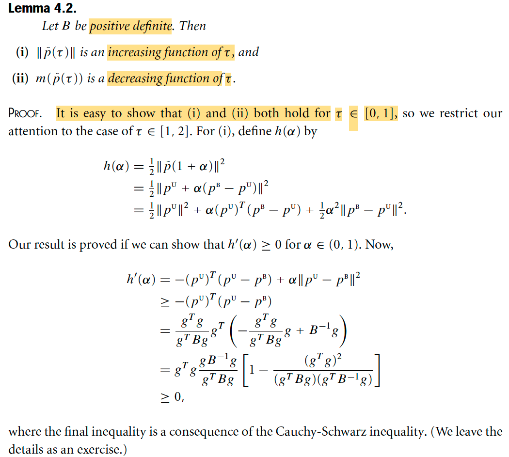</kbd>

<kbd>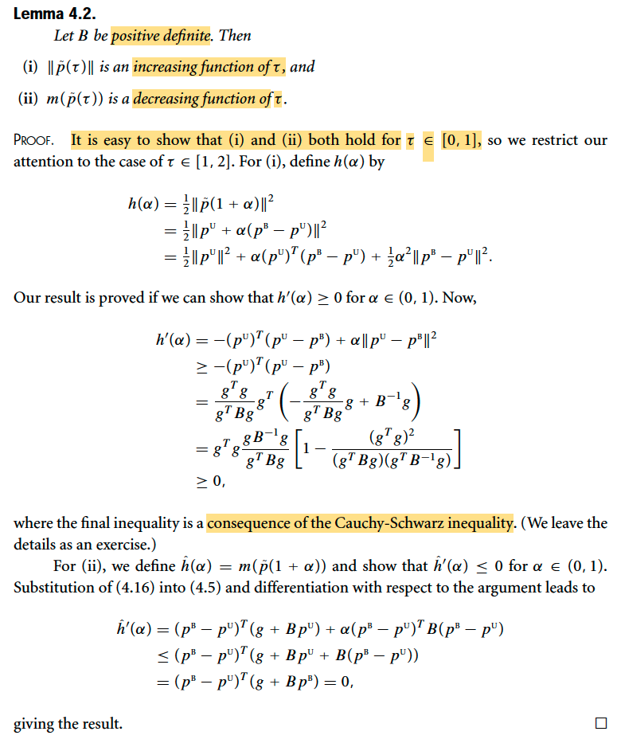</kbd>

> [!NOTE]
> Rồi, bổ đề này đại ý là, cho B xác định dương, thì i) ||p_tilde(τ)|| là hàm tăng theo τ ii) m(p_tilde(τ)) là hàm giảm theo τ.
>
> Để chứng minh thì tác giả cho là rất dễ khi xét τ ∈ [0,1]. Thử xem sao mà dễ.
>
> Đầu tiên nhắc lại, p_tilde(τ) là = τpU khi τ ∈ [0, 1] và pB + (τ - 1)(pB - pU) khi τ ∈ [1, 2]
>
> với pU = - [gTg / gTBg] g
>
> Vậy thì khi τ ∈ [0, 1], p_tilde(τ) = τpU, ⇨ ||p_tilde(τ)|| = |τ| ||pU|| = τ ||pU||. Để xét xem có phải là hàm tăng không thì xét d/dt ||p_tilde(τ)|| thôi, dễ thấy nó sẽ bằng ||pU||, là không âm → hàm non-dereasing / increasing hoặc nếu giả sử g khác 0, thì cái này còn dương → hàm strictly increasing.
>
> Còn m(p_tilde(τ)): 
>
> = f + gTp_tilde(τ) + (1/2)p_tilde(τ)TBp_tilde(τ)
>
> = f + gTτpU + (1/2)[τpU]TBτpU
>
> = f + τgTpU + (1/2)(τ^2)pUTBpU
>
> Xét đạo hàm theo τ: dễ thấy = gTpU + pUTBpU τ 
>
> = gT {- [gTg / gTBg] g} + {- [gTg / gTBg] g}T B {- [gTg / gTBg] g} τ
>
> = - [gTg / gTBg] gTg + [gTg / gTBg]^2 gTBg τ
>
> = - (gTg)^2 / (gTBg) + [(gTg)^2 / (gTBg)] τ
>
> = (gTg)^2(-1 + τ) / (gTBg)
>
> Với τ ∈ [0,1] thì -1 + τ ∈ [-1, 0] nên cái này ≤ 0 → m decreasing function of τ
>
> ====
>
> Đoạn chứng minh với τ ∈ [1,2]
>
> Thay p_tilde(τ) với τ ∈ [1,2] bởi p_tilde(1+α) với α ∈ [0,1].
>
> ⇨ ||p_tilde(τ)|| = theo công thức nhắc lại khi nãy, = ||pB + (τ - 1)(pB - pU)|| 
>
> = ||pB + α(pB - pU)||
>
> Ta mới đặt hàm h(α) = (1/2) ||p_tilde(1 + α)||^2:
>
> h'(α) = d/dα [(1/2) ||p_tilde(1 + α)||^2] 
>
> = d/d(||p_tilde(1 + α)||) [(1/2) ||p_tilde(1 + α)||^2] . d/dα ||p_tilde(1 + α)|| 
>
> = ||p_tilde(1 + α)|| . d/dα ||p_tilde(1 + α)||
>
> Nếu ta chứng minh h'(α) ≥ 0 với mọi α ∈ [0,1] thì đồng nghĩa ||p_tilde(1 + α)|| . d/dα ||p_tilde(1 + α)|| ≥ 0 ∀ α ∈ [0,1], ⇔ d/dα ||p_tilde(1 + α)|| ≥ 0 ∀ α ∈ [0,1], ⇨ p_tilde(1 + α) là increasing function of α trên ∈ [0,1], cũng chính là chứng minh xong ý i).
>
> (Chú ý, ở đây, thay vì đạo hàm hàm ||p_tilde(1 + α)|| (là hàm cần chứng minh increasing) ta sẽ dễ hơn nếu làm với hàm (1/2) ||p_tilde(1 + α)||^2 theo lí do trên, vì đạo hàm hàm này dễ hơn nhiều)
>
> Quay lại h(α), = (1/2) ||p_tilde(1 + α)||^2
>
> = (1/2) ||pU + α(pB - pU)||^2
>
> = (1/2) (pU + α(pB - pU))T(pU + α(pB - pU)
>
> = (1/2) (pUT + α(pB - pU)T)(pU + α(pB - pU)
>
> = (1/2) [pUTpU + α(pB - pU)TpU + pUTα(pB - pU) + α(pB - pU)Tα(pB - pU)]
>
> = (1/2) [pUTpU + 2α(pB - pU)TpU + α^2 (pB - pU)T(pB - pU)]
>
> = (1/2) ||pU|| + α(pB - pU)TpU + (1/2) α^2 ||pB - pU||^2
>
> h'(α) = (pB - pU)TpU + α ||pB - pU||^2
>
> vì α ||pB - pU||^2 ≥ 0 
>
> ⇨ h'(α) ≥ (pB - pU)TpU, hay -pUT(pU - pB) cho giống sách cũng được.
>
> Thay vô:
>
> .. ≥ -[- [gTg / gTBg] g]T([- [gTg / gTBg] g] - pB)
>
> = [gTg / gTBg] gT([- [gTg / gTBg] g] - (-Binv g))
>
> = [gTg / gTBg] gT([- [gTg / gTBg] g] + Binv g)
>
> ... Khúc cuối do dùng bdt Cauchy và ý ii) quay lại sau

> [!TIP]
> **🤖 AI Feedback** — ❌ Score: **35/100**
>
> Bài làm chứng minh được tính chất cho τ ∈ [0,1] một cách chính xác dựa trên các giả định bên ngoài. Tuy nhiên, bài phân tích này đã bỏ qua hoàn toàn nội dung chứng minh trọng tâm của ảnh (đạo hàm h'(α) cho τ ∈ [1,2]), vốn là phần khó và chi tiết nhất trong ảnh.

 

<kbd>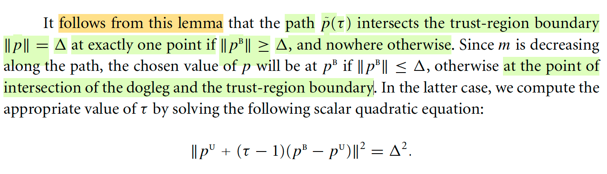</kbd>

> [!NOTE]
> Rồi, nhắc lại tí cho đỡ quên context, bổ đề vừa rồi cho biết hàm norm của p_tilde(τ), tức τpU khi τ ∈ [0,1] và pU + (τ - 1)(pB - pU) khi τ ∈ [1,2] là increasing function theo τ, và mk(p_tilde(τ)) là hàm decreasing function. Mà ý nghĩa của nó, nôm na là:
>
> KHI TA ĐI TRÊN QUỸ ĐẠO HÌNH GẤP KHÚC thì độ lớn của p_tilde(τ) luôn tăng và hàm m luôn giảm.
>
> Cụ thể thì ||p_tilde(τ)|| sẽ tăng liên tục từ 0, đến ||pU|| (khi τ từ 0 → 1), và từ ||pU|| đến ||pB|| khi τ từ 1 → 2. Và vì nó tăng liên tục, nên dĩ nhiên là nếu ||pB|| mà lớn hơn Δ, thì sẽ **chỉ có một lần** nó vượt qua giá trị Δ, chính là ý nói rằng cái đường gấp khúc này chỉ cắt tại một điểm. Nhưng nếu ||pB|| nhỏ hơn Δ, cũng chính là khi cái đáy của cái bát quadratic nằm bên trong phạm vi trust region, thì dĩ nhiên sẽ không có intersection.
>
> Rồi, vì ý thứ hai của bổ đề nói m giảm liên tục trên đường gấp khúc, nên khi ta tìm điểm trên đó khiến m nhỏ nhất trong phạm vi cho phép, thì dễ hiểu là nếu minimizer nằm trong phạm vi cho phép thì không nói có gì để nói, chứ nếu nằm ngoài thì minimizer chính là giao điểm của đường gấp khúc với boundary.
>
> Do đó trong trường hợp sau, ta sẽ giải phương trình này để tìm giao điểm 
> (tức là tìm τ mà tại đó quỹ đạo gấp khúc cắt boundary, cũng là τ minimizer m(p_tilde(τ)) subject to ||p_tilde(τ)|| ≤ Δ.
>
> ||pU + (τ - 1)(pB - pU)||^2 = Δ^2

> [!TIP]
> **🤖 AI Feedback** — ✅ Score: **90/100**
>
> Bài phân tích rất chi tiết và chính xác, không chỉ tóm tắt mà còn mở rộng và giải thích rõ ràng các khái niệm nền tảng của phương pháp dogleg, đặc biệt là hành vi của chuẩn vector và hàm mục tiêu. Cách diễn giải về điều kiện giao điểm và lựa chọn điểm tối ưu rất logic và thể hiện sự nắm vững kiến thức.

 

<kbd>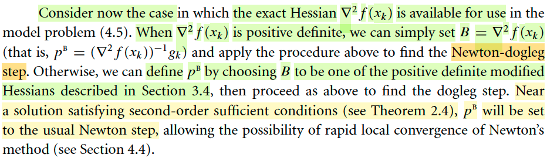</kbd>

<kbd>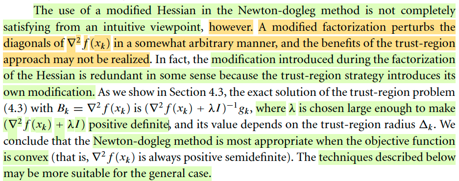</kbd>

> [!NOTE]
> Đại khái là nói về B trong bài toán minimize f + gTp + (1/2)pTBp s.t ||p|| ≤ Δ, thì như đã biết B có thể là Hessian, hay xấp xỉ Hessian. Thì ở đây là nói lại ý đó, cụ thể là nếu trong tình huống mà ta có Hessian avaiable (dĩ nhiên đây là Hessian tại điểm bắt đầu, xk, vì đây thật ra viết đầy đủ là bài toán minimize f(xk) + gkTpk + (1/2)pkTBkpk s.t ||pk|| ≤ Δ, giúp tìm pk gíúp giảm đủ), và available có nghĩa là có thể tính được hay có được mà không quá tốn kém, vì thật ra nguyên nhân chủ yếu của việc không có Hessian là vì chi phí tính toán, thì ta sẽ dùng B = Hessian, tức ∇^2f(xk).
>
> Khi đó cái mà ta có từ phương pháp dogleg gọi là **Newton-doglog step**.
>
> Mặc khác, tức là nếu như exact Hessian không available hoặc Hessian không xác định dương thì ta có thể dùng các matrix Hessian chỉnh sửa (modified Hessian) mà chương trước đã nói (ôn nhanh, đại khái là có các cách thức trong đó ta chỉnh sửa Hessian để cho nó thành xác định dương)
>
> Đoạn sau đại khái nói thế này: Việc dùng modified Hessian trong phương pháp dogleg thật ra không phù hợp lắm bởi vì việc chỉnh sửa Hessian mà ta còn nhớ nó sẽ thay đổi đường chéo của Hessian để giúp nó thành xác định dương, thì việc này xảy ra có tính chất tùy tiện (arbitrary), và lợi ích của phương pháp trust-region có thể không được nhận ra một cách đầy đủ.
>
> Cụ thể là ở phần sau ta sẽ thấy đại ý là khi tính solution của bài toán trên với Bk là Hessian, thì solution nó là (∇^2f(xk) + λI)inv gk trong đó λ được chọn sao cho (∇^2f(xk) + λI) xác định dương rồi, có nghĩa là, bản thân phương pháp trust region thì có thể coi như nó cũng đã thực hiện cái việc chỉnh sửa Hessian rồi, khiến việc chỉnh sửa bởi các thuật toán modified Hessian không cần thiết (redundant)
>
> Rồi, tác giả kết luận Newton-dogleg method sẽ phù hợp với tình huống mà objective function convex (khi đó như đã biết từ Convex Optim Boyd, Hessian luôn xác định bán dương).
>
> Còn trong các trường hợp khác, thì ta sẽ dùng technique khác.

> [!TIP]
> **🤖 AI Feedback** — ❌ Score: **65/100**
>
> Bài phân tích đã nắm bắt được một số ý chính nhưng còn bỏ sót các điều kiện quan trọng về tính xác định dương của ma trận Hessian và kết luận cuối cùng về trường hợp áp dụng phù hợp nhất của phương pháp Newton-dogleg. Sự thiếu sót các chi tiết cốt lõi này cho thấy sự chưa thấu đáo trong việc nắm bắt toàn bộ nội dung.

 

- **Two-dimensional Subspace Minimization**

<kbd>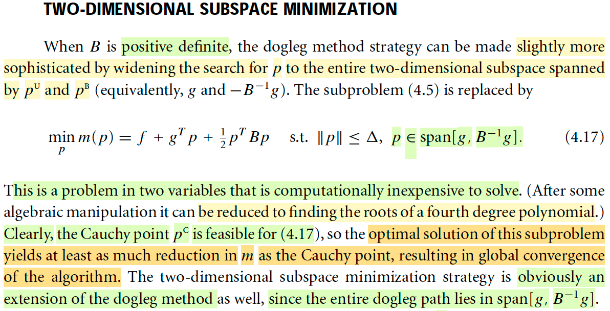</kbd>

<kbd>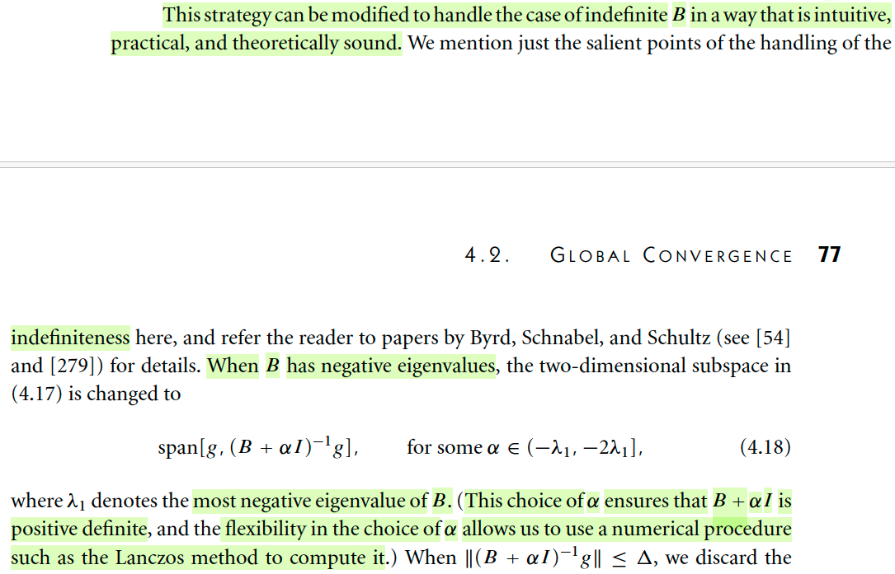</kbd>

<kbd>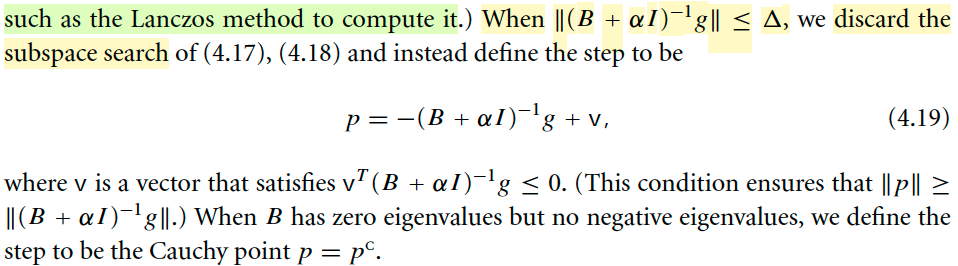</kbd>

<kbd>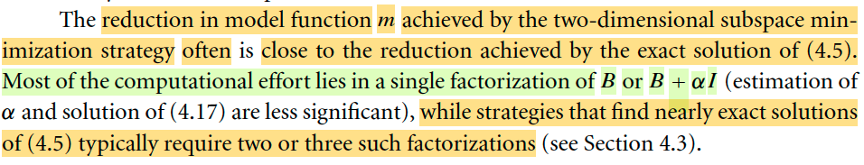</kbd>

> [!NOTE]
> Đoạn đầu đại ý là: Nói rằng khi B xác định dương, thì ta có thể LÀM CHO PHƯƠNG PHÁP DOGLEG PHỨC TẠP HƠN TÍ, bằng cách mở rộng không gian tìm kiếm chút xíu. Nói rõ hơn, đại khái là vầy: Để hiểu rõ ngọn ngành thì ta cần ôn lại chút về ý tưởng của dogleg method: Mục đích ngắn gọn của nó là CẢI THIỆN CAUCHY POINT. Là sao? 
>
> Là vầy, tác giả đã nói, tương tự như bên line search, ta có thể không cần thiết phải tốn công đi tìm exact (optimal) step length, mà chỉ cần step length đủ tốt, như thỏa Wolfe / Strong Wolfe conditions là được, vì như vậy cũng đủ giúp hội tụ toàn cục rồi. Thì ở đây cũng vậy, ta cũng chỉ cần pk (hay bỏ qua subscript k) p, giúp giảm đủ là được.Thì cái sự đủ ở đây chính là đối chiếu / lấy tấm gương của Cauchy point. Và Cauchy point, là p được tính bởi 2 bước: Tìm pkS là hướng steepest descent, và giải tìm pU = tpkS: minimize hàm m(p) (= f + gTp + (1/2)pTBp) nhưng restrict to hướng pkS (minimize g + gTpkS × t + (1/2)pkSTBpkS × t^2 và ||pkS t|| ≤ Δ)
>
> Thế thì, vấn đề là, cái hướng của Cauchy point, là steepest gradient descent, mà ta đã biết, nó hội tụ rất tệ, vì nó không dùng thông tin curvature (chứa trong Bk, tức B). Thành ra người ta mới tìm cách cải thiện Cauchy point, mà đầu tiên là dogleg: Họ sẽ lập luận thế này: khi Δ thay đổi từ rất nhỏ đến rất lớn, thì solution của bài toán minimize m(p) s.t ||p|| ≤ Δ sẽ thay đổi từ pU đến pB, tạo ra một quỹ đạo hình cẳng chó. Vậy thì dogleg method mới định ra một đường gấp khúc xấp xỉ cái cẳng chó đó, và minimize hàm m(p) s.t ||p|| ≤ Δ restrict to cái đường gấp khúc này.
>
> Vậy thì, quay lại đây, ta sẽ thấy việc vừa nói, chính là tìm kiếm trong một 1D subspace (đường gấp khúc). Thì có khi cái điểm tốt nhất lại nằm ngoài cái đường đó. Lí do là vì ta đang dùng cái cây gậy gấp khúc để xấp xỉ cái đường chân chó chứ không phải là cái quỹ đạo chân chó thật sự, nên điểm tốt nhất có thể không nằm trên cây gậy, mà nằm ở ngoài. Do đó người ta mới mở rộng phạm vi tìm kiếm ra thành subspace span bởi pU và pB, thì cũng là span bởi g và Binvg (vì đã nói pU chính là hướng pkS, tức là hướng steepest descent → -g.
>
> Chỉ vậy thôi, và tác giả nói bài toán này cũng không quá expensive.
>
> Một điểm nữa, đó là Cauchy point dĩ nhiên nằm trong subspace này, nên ý là bài toán mở rộng này ít nhất là tìm ra điểm ngon hơn hoặc bằng Cauchy point, nên sẽ đảm bảo giảm đủ để hội tụ toàn cục.
>
> ====
>
> Rồi, đoạn tiếp theo là nói rằng phương pháp này có thể MỞ RỘNG ĐỂ DEAL VỚI TÌNH HUỐNG MÀ B INDEFINITE. Vậy phải chú ý rằng phương pháp trên chỉ áp dụng với B xác định dương, rõ ràng, là bởi khi B xác định dương thì pB mới là descent direction:
>
> Ta nhớ lại chỗ này: Đạo hàm theo hướng d tại xk: ∇f(xk)Td, hay gTd (xem link Điểm dừng và tối ưu hóa..) ⇨ đạo hàm theo hướng (-Binv g, chú ý nhé, pU = - Binv g, còn span thì dùng Binv g cũng được vì cũng là cùng một phương như nhau) tại xk: - gT Binv g. Và với việc B không xác định dương thì gT Binv g chưa chắc là luôn dương ⇨ - gT Binv g chưa chắc là luôn âm. Mà directional theo hướng d = -Binv g tại xk chưa chắc luôn âm thì có nghĩa là d chưa chắc là descent direction.
>
> Rồi, thế thì đại ý là, nếu như B indefinite, để rồi pB = -Binv g không chắc là descent direction, thì việc tìm kiếm trong span [g, Binv g] có thể sẽ cho ra kết quả không tốt. Do đó người ta sẽ thay span [g, Binv g] bởi span [g, (B + αI)inv g] với α đâu đó từ (-λ1 tới -2λ1] và λ1 là **trị riêng âm nhất** của B. Mục đích là, dễ thấy B + αI sẽ không còn trị riêng âm nữa → ma trận trở thành xác định dương (chú ý cái khoảng của α là (-λ1 tới -2λ1], nên chắc chắn trị riêng của B + αI đều dương). Còn sở dĩ giới hạn bởi -2λ1 thì hiểu đại khái là để không trị riêng không quá lớn (có thể là yếu tố kinh nghiệm, hoặc vì lí do nào đó, ở đây tác giả chỉ nói sơ (salient point), khuyên ta đọc paper của Byrd, Schnabel,....)
>
> Và cũng vì lí do nào đó, mà khi ||(B + αI)inv g|| ≤ Δ, ta sẽ bỏ vụ tìm kiếm trong subspace đi, thay nó bằng p = -(B + αI)inv g + v với v thỏa vT(B + αI)inv g ≤ 0 .
>
> Rồi khi B có trị riêng 0, và ko có trị riêng âm (tức là B xác định dương) thì cho p = pC (cauchy point)
>
> Nói chung là để hiểu cặn kẽ ta có thể phải đọc paper. Tạm thời bỏ qua khúc này.
>
> ====
>
> Cái đoạn áp chót, nói khi exact Hessian available thì ta có thể cho B = Hessian và khi Hessian xác định dương thì bài và  Δ đủ lớn thì bài toán subspace minimization có thể được giải bởi Newton step là sao nhỉ: Thì đơn giản là vì khi đó Newton step - Hinv g thỏa constraint ||p|| ≤ Δ, nó cũng nằm trong span [g, Hinv g] (dĩ nhiên) và đương nhiên ta biết nó sẽ minimize f + gTp + (1/2)pTHp, nên nó là solution chứ sao. 
>
> ====
>
> Nói chung là tác giả nói, cách làm này (2D subspace minimization) giúp đem đến một mức giảm hàm f gần bằng với mức giảm tạo bởi EXACT SOLUTION nhưng tốt ít chi phí tính toán hơn (vì chỉ tốn 1 bước factorizatizion matrix B hoặc B + αI thay vì 2 hoặc 3)

> [!TIP]
> **🤖 AI Feedback** — ⚠️ Score: **82/100**
>
> Bản ghi chú của bạn thể hiện sự hiểu biết sâu sắc về các khái niệm, đặc biệt là trong việc đặt ngữ cảnh cho phương pháp dogleg và điểm Cauchy. Tuy nhiên, có một lỗi đáng kể trong việc diễn giải điều kiện cho vector 'v' khi 'B' là không xác định, điều này cần được chỉnh sửa để đảm bảo tính chính xác hoàn toàn.

 

## Hội tụ toàn cục điểm Cauchy

<kbd>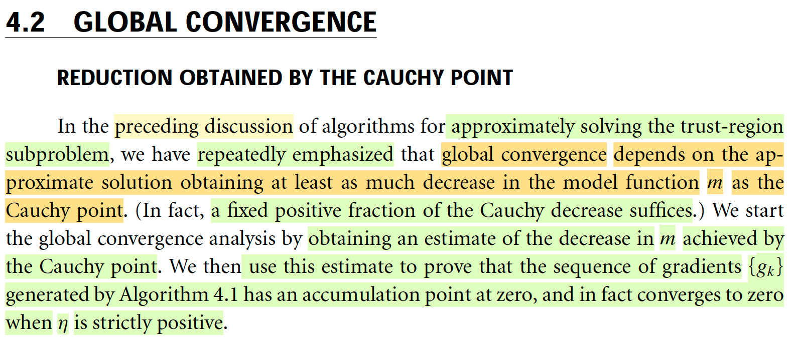</kbd>

> [!NOTE]
> Đầu tiên, đại ý là, trong những phần trước tác giả đã nhấn mạnh nhiều lần rằng để phương pháp trust region có thể có hội tụ toàn cục (global convergence) thì cái bài toán subproblem (tức là trong iteration xk, tìm xk+1, bằng cách giải bài toán minimize m(p) = fk + gkTp + (1/2)pTBkp s.t ||p|| ≤ Δ, thì p phải giúp giảm f đủ nhiều, và sự đủ ở đây sẽ so sánh với mức giảm bởi Cauchy point.
>
> Ôn lại chút, Cauchy point là gì: Đại khái là tính thế này: Chọn hướng steepest descent: pkS, rồi xem thử đi theo hướng đó, trong phạm vi cho phép thì mk đến đâu là xuống được thấp nhất
>
> Thì bước chọn pkS, tuy chính là steepest descent direction nhưng nói đầy đủ như trong sách thì nó là giải bài toán:
>
> minimize fk + gkTp s.t ||p|| ≤ Δ, và như đã biết dễ thấy giải bài toán này ta sẽ ra pkS chính là hướng -g, nhưng dĩ nhiên độ lớn thì  = Δ, nên cụ thể pkS = - (Δ / ||g||) g
>
> Còn bước sau, chính là bài toán: 
>
> minimize mk(t × pkS) = fk + gT τ pkS + (1/2)(τpkS)TBk(τpkS) s.t ||(t × pkS)|| ≤ Δ. Giải ra τ*, ta  có pkC, tức Cauchy point = τ* × pkS.
>
> Quay lại đây, thế thì, ta sẽ bắt đầu phân tích hội tụ bằng cách **tính mức giảm của m khi đi theo Cauchy point**. Và dùng kết quả này để mà chứng minh rằng chuỗi gradient {gk} tính bởi thuật toán 4.1 (link) sẽ có điểm tích lũy tại 0 (hiểu nôm na là gradient sẽ giảm về 0) và thật sự sẽ hội tụ về 0 khi η dương.

> [!TIP]
> **🤖 AI Feedback** — ✅ Score: **95/100**
>
> Bài phân tích rất chính xác và sâu sắc, không chỉ dịch đúng nội dung mà còn giải thích rõ ràng cách xây dựng Cauchy point, thể hiện sự hiểu biết vững chắc về chủ đề. Cần lưu ý thống nhất ký hiệu (ví dụ t và τ) để đảm bảo tính mạch lạc tối đa.

 

### Mức giảm Dogleg và Wolfe

<kbd>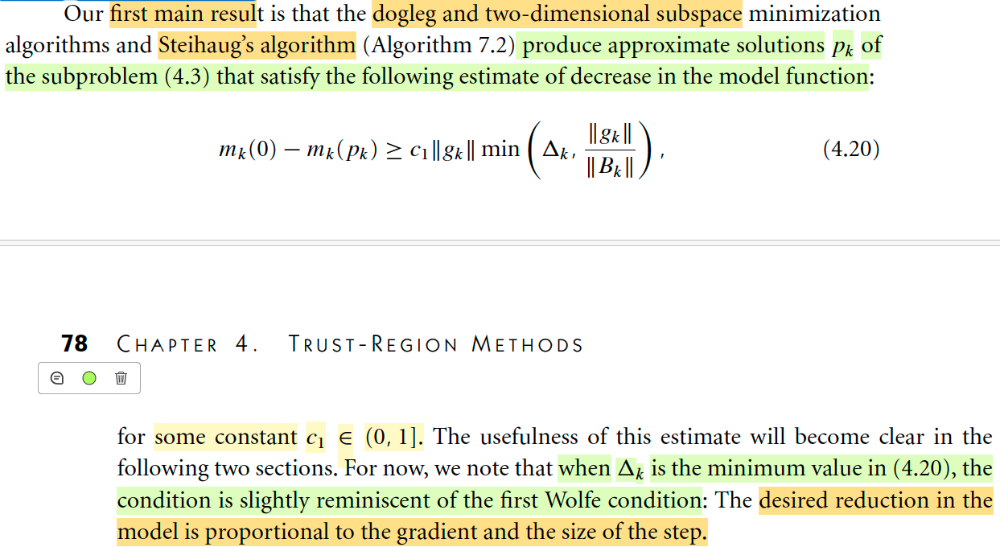</kbd>

> [!NOTE]
> Rồi, họ nói trước, ta sẽ chứng minh để dẫn đến kết quả rằng: phương pháp Dogleg và 2D subspace minimization, cũng như thuật toán Steihaug's (như bài trước đã biết, có 3 phương pháp thuộc dạng Improving Cauchy point mà 2 trong đó nói ở Chapter này, cái còn lại nói ở chapter 7) đều sẽ có tính chất sau (về mức giảm tại mỗi iteration):
>
> mk(0) - mk(pk) ≥ c1 ||gk|| min (Δk, ||gk|| / ||Bk||) for some constant c1 ∈ (0, 1] (4.20)
>
> Gỉai thích một chút, vế trái, là thay đổi của mk khi từ 0 đến pk. Cần hiểu k ở đây là để chỉ ta đang xét outer iteration thứ k, nơi ta đang đứng ở xk, và thực hiện bước đi để đến xk+1. Và để làm vậy, theo phương pháp trust region, ta sẽ giải bài toán: minimize over p của mk(p) = fk + gkTp + (1/2)pTBkp s.t ||p|| ≤ Δ. Với ý nghĩa / cách hiểu nôm na là: Ta giả bộ / coi như hàm mục tiêu hành xử như một hàm quadratic, thì trong một phạm vi nhất định quy định bởi ||p|| ≤ Δ thì điều này có thể chấp nhận được, khi đó ta sẽ tìm hướng đi, p sao cho được hàm quadratic này nhiều nhất có thể trong phạm vi cho phép. Như vậy mk(0), chính là f(xk), là "độ cao" ở điểm ban đầu, và mk(p) sẽ là độ cao (tính bởi hàm quadratic tại điểm xk + p, (hay xk + pk, nếu muốn gắn k vào p để chỉ rõ đây là tìm p ở iteration thứ k). Và như vậy điều kiện 4.20 này quy định là: À, nếu muốn sự hội tụ tốt toàn cục thì tại mỗi iteration, bước đi p phải giúp giảm hàm mk một khoảng tối thiểu, chính là vế phải.
>
> Tác giả cho rằng ta sẽ thấy cái này hữu ích trong những phần sau.
>
> Còn bây giờ điểm đáng chú ý là: Nếu Δk là min trong hai cái trong ngoặc của vế phải, thì 4.2 sẽ có dạng giống giống first Wolfe condition (tức sufficient decrease condition, hay Armijo) đó là mức giảm mong muốn sẽ tỉ lệ với gradient và kích thước step. Là sao nhỉ:
>
> Nhớ lại điều kiện giảm đủ, ta nhớ story của nó là muốn step size giúp mức giảm của hàm f phải ít nhất là bằng mức giảm của hàm tuyến tính với độ dốc tại xk được điều chỉnh bởi tham số nào đó. Vậy thì dễ hiểu mức giảm mong muốn này sẽ phụ thuộc độ dốc tại xk, và sải bước, vì hàm tuyến tính càng dốc, và sải bước càng lớn thì độ giảm sẽ càng lớn
> Vậy nhìn vào đây, nếu vế phải là c1 ||gk|| Δk thì ta sẽ một term cũng tỉ lệ với graidient gk và sải bước (Δk đóng vai sải bước)
>
> #4.20

> [!TIP]
> **🤖 AI Feedback** — ✅ Score: **92/100**
>
> Bản tóm tắt rất chính xác, đặc biệt là phần diễn giải về mối liên hệ với điều kiện Wolfe đầu tiên và sự tỉ lệ với gradient và kích thước bước, thể hiện sự hiểu biết sâu sắc. Tuy nhiên, việc đưa thêm thông tin không có trong đoạn văn được đánh dấu ("có 3 phương pháp thuộc dạng Improving Cauchy point...") cần được cân nhắc lại khi chỉ tóm tắt một đoạn văn cụ thể. Cụm từ "Là sao nhỉ" cũng quá thân mật cho một ghi chú học thuật.

 

#### Lemma 4.3: Cauchy point thỏa điều kiện giảm đủ

<kbd>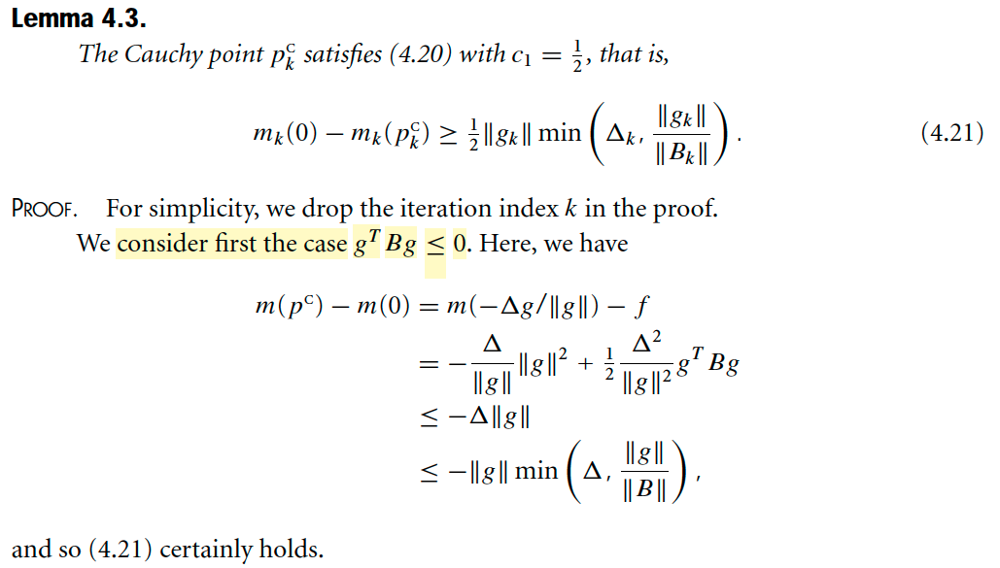</kbd>

<kbd>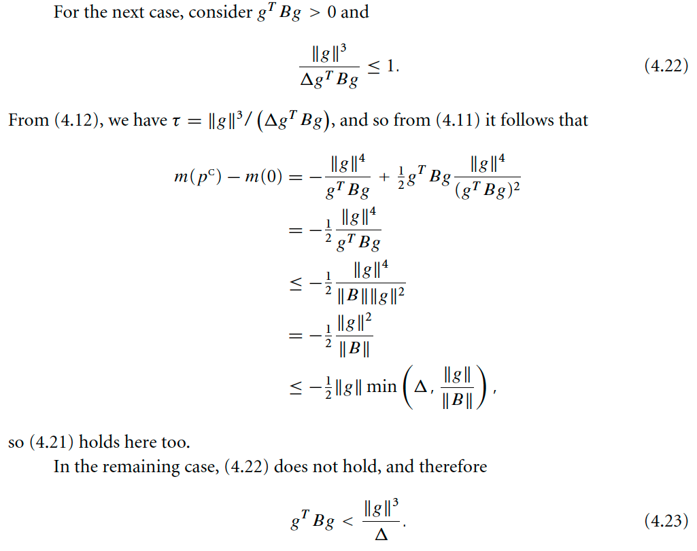</kbd>

<kbd>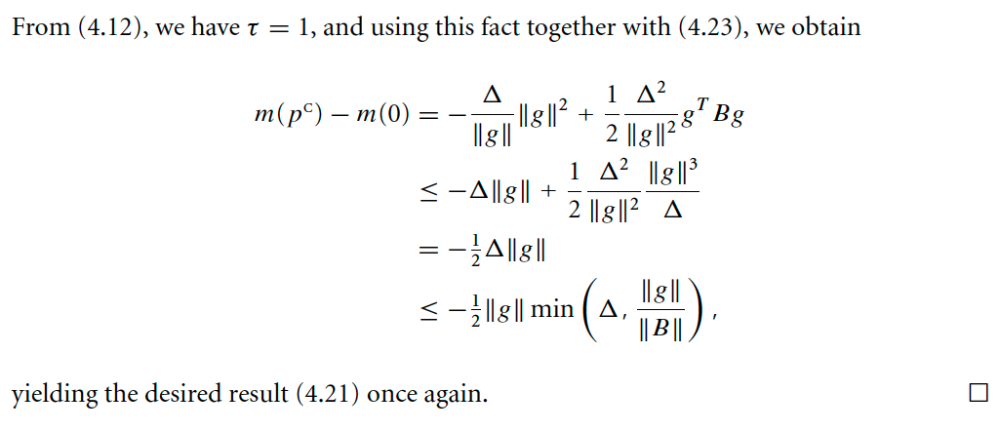</kbd>

> [!NOTE]
> Qua bổ đề 4.3, nó nói rằng Cauchy point có thể thỏa điều kiện 4.20. Nhắc lại, điều kiện 4.20 nói về điều kiện của mức giảm khi thực hiện bước đi, mà ta sẽ thấy vì sao nếu thỏa điều kiện này thì sẽ dẫn đến sự hội tụ toàn cục (tác giả nói ta sẽ thấy sự hữu ích của nó sau): 
>
> mk(0) - mk(pk) ≥ c1 ||gk|| min (Δk, ||gk|| / ||Bk||) for some constant c1 ∈ (0, 1]
>
> Gỉai thích một chút, vế trái, là thay đổi của mk khi từ 0 đến pk. Cần hiểu k ở đây là để chỉ ta đang xét outer iteration thứ k, nơi ta đang đứng ở xk, và thực hiện bước đi để đến xk+1. Và để làm vậy, theo phương pháp trust region, ta sẽ giải bài toán: minimize over p của mk(p) = fk + gkTp + (1/2)pTBkp s.t ||p|| ≤ Δ. Với ý nghĩa / cách hiểu nôm na là: Ta giả bộ / coi như hàm mục tiêu hành xử như một hàm quadratic, thì trong một phạm vi nhất định quy định bởi ||p|| ≤ Δ thì điều này có thể chấp nhận được, khi đó ta sẽ tìm hướng đi, p sao cho được hàm quadratic này nhiều nhất có thể trong phạm vi cho phép. Như vậy mk(0), chính là f(xk), là "độ cao" ở điểm ban đầu, và mk(p) sẽ là độ cao (tính bởi hàm quadratic tại điểm xk + p, (hay xk + pk, nếu muốn gắn k vào p để chỉ rõ đây là tìm p ở iteration thứ k). Và như vậy điều kiện 4.20 này quy định là: À, nếu muốn sự hội tụ tốt toàn cục thì tại mỗi iteration, bước đi p phải giúp giảm hàm mk một khoảng tối thiểu, chính là vế phải.
>
> Vậy thì bổ đề này nói rằng: pkC, Cauchy point thỏa được cái này, và cụ thể c1 = 1/2.
>
> Để chứng minh, ta sẽ tạm bỏ đi cái chữ k trong kí hiệu cho đơn giản: Tức là ta sẽ chứng minh:
>
> m(0) - m(pC) ≥ c1 ||g|| min (Δ, ||g|| / ||B||) for some constant c1 ∈ (0, 1] 
>
> Bắt đầu từ vế trái, m(0), như đã nói ở trên, chính là fk, hay bỏ k cho gọn, ta có f.
>
> Còn m(pC), với pC, là Cauchy point, ta còn nhớ nó có story là hướng dốc nhất, và đi theo hướng đó để mk đạt tối thiểu: Có nghĩa là 
>
> Bước 1, xác định pS: = - (Δ / ||g||) g (hướng -g và có độ dài Δ) 
>
> Bước 2, gỉai bài toán tối ưu hàm đơn biến: 
>
> minimize over τ hàm g(τ) = f + gT(τpS) + (1/2)(τpS)T B (τpS) s.t ||τpS|| ≤ Δ
>
> = f + τ gT(pS) + (1/2)(pS)TB(pS) τ^2  
>
> = f + τ gT(- (Δ / ||g||) g) + (1/2)(- (Δ / ||g||) g)TB(- (Δ / ||g||) g) τ^2
>
> = f - τ Δ ||g|| + (1/2)(Δ / ||g||)^2 gTBg τ^2
>
> Khi đó ta sẽ có hai trường hợp mà đã nói ở phần Cauchy point
>
> 1) Khi gTBg ≤ 0, đại khái là ta sẽ có thể chứng minh đạo hàm của g(τ) sẽ âm với mọi τ, từ đó hàm là monotone decreasing, thành ra solution sẽ là τ = 1 ⇨ pC = - (Δ / ||g||) g
>
> HÌnh ảnh rất dễ hiểu, độ cong của hàm m tại xk âm, và với việc m là quadratic function, nên giới hạn trong hướng pS thì nó g là hàm bậc hai đơn biến thì độ cong của nó là hằng số, có nghĩa là ở đâu thì nó cũng chỉ đang cong xuống, nên dĩ nhiên dễ hiểu là điểm thấp nhất sẽ đụng hàng rào
>
> ⇨ m(pC) = f + gTpC + (1/2) pCT B pC 
>
> = f + gT[- (Δ / ||g||) g] + (1/2) [- (Δ / ||g||) g]T B [- (Δ / ||g||) g]
>
> = f - (Δ / ||g||) gTg + (1/2) (Δ / ||g||)^2  gTBg
>
> = f - (Δ / ||g||) ||g||^2 + (1/2) (Δ / ||g||)^2  gTBg
>
> = f - Δ ||g|| + (1/2) (Δ / ||g||)^2  gTBg
>
> Từ đó m(0) - m(pC) = f - [f - Δ ||g|| + (1/2) (Δ / ||g||)^2  gTBg]
>
> = f - f + Δ ||g|| - (1/2) (Δ / ||g||)^2  gTBg
>
> = Δ ||g|| - (1/2) (Δ / ||g||)^2  gTBg
>
> Viết lại: m(0) - m(pC) = Δ ||g|| - (1/2) (Δ / ||g||)^2  gTBg
>
> Tới đây ta xét B thỏa: gTBg ≤ 0, điều này ⇔ - (1/2) (Δ / ||g||)^2  gTBg ≥ 0
>
> ⇨ Δ ||g|| - (1/2) (Δ / ||g||)^2  gTBg ≥ Δ ||g||
>
> Và Δ dĩ nhiên ≥ min(Δ, ||g|| / ||B||) 
>
> (vì nếu min(Δ, ||g|| / ||B||) = Δ thì ta có Δ ≥ Δ, còn nếu min(Δ, ||g|| / ||B||) = ||g|| / ||B|| thì ta có Δ ≥ ||g|| / ||B||)
>
> ⇨ Δ ||g|| ≥ ||g|| min(Δ, ||g|| / ||B||) 
>
> ≥ 1/2 ||g|| min(Δ, ||g|| / ||B||) (vì ||g|| min(Δ, ||g|| / ||B||) là số không âm, nên a ≥ (1/2) a)
>
> Vậy đã chứng minh được với gTBg ≤ 0 thì pC thỏa 4.21.
>
> ====
>
> 2) Còn khi gTBg > 0, thì hình ảnh lúc này là hàm bậc hai đơn biến g(τ) có độ cong dương tại điểm bắt đầu (và cũng sẽ không âm tại mọi điểm)
>
> Khi đó, đơn giản là dùng điều kiện cần bậc 1, và vì đây là hàm convex nên nó cũng đủ để kết luận minimum τ* = (||g||)^3 / ΔgTBg, pC* = [(||g||)^3 / ΔgTBg] [-g Δ / ||g||] và lúc này sẽ có hai trường hợp xảy ra: 
>
> a) là điểm thấp nhất này nằm ở trong khoảng từ xk đến xk + pkS, tức là: ||τ* pkS|| ≤ Δ cũng là τ* ≤ 1
>
> Khi đó ta kết luận τ* = (||g||)^3 / Δ gTBg.
>
> b) điểm thấp nhất nằm ngoài phạm vi cho phép, thì lúc này solution lại là đụng hàng rào: τ = 1
>
> Tổng hợp lại ⇨ τ = min(1,  (||g||)^3 / Δ gTBg)
>
> Vậy quay lại đây, xét case 2a: với τ = (||g||)^3 / Δ gTBg, để pC có thỏa điều kiện giảm đủ không:
>
> Khi đó pC = [(||g||)^3 / Δ gTBg] [-g Δ / ||g||] 
>
> = [(||g||)^2 / gTBg] [-g] 
>
> = - [(||g||)^2 / gTBg] g
>
> m(0) - m(pC) 
>
> = f - [f + gT{- [(||g||)^2 / gTBg] g} + (1/2) {- [(||g||)^2 / gTBg] g}TB{- [(||g||)^2 / gTBg] g}
>
> = gTg [(||g||)^2 / gTBg] - (1/2) [||g||^4 / (gTBg)^2] gTBg
>
> = [(||g||)^4 / gTBg] - (1/2) [||g||^4 / (gTBg)]
>
> = (1/2) ||g||^4 / (gTBg)
>
> Tới đây xét cái quaratic form ở mẫu: gTBg. Ta sẽ có gTBg ≤ ||B|| ||g||^2. Vì sao:
>
> Nhớ lại định nghĩa của norm of matrix B. Nói bằng lời, nó là stretch factor lớn nhất khi linear transform một vector bởi B: max_u ||Bu|| / ||u||. Nên ||B|| ≥ ||Bu|| / ||u|| Từ đó ta có inequality ||B|| ||u|| ≥ ||Bu||. ⇨ Áp dụng với g: ||B|| ||g|| ≥ ||Bg||
>
> Thế thì xét gTBg, nó chính là gT(Bg), theo công thức dot product, = ||g|| ||Bg|| cos θ(g, Bg). Và với tính chất cosine ≤ 1 ta có: gT(Bg) ≤ ||g|| ||Bg||
>
> Mà ở trên ta có ||B|| ||g|| ≥ ||Bg|| ⇨ gT(Bg) ≤ ||g|| ||B|| ||g||   
>
> Vậy gT(Bg) ≤ ||B|| ||g||^2 (*)
>
> ⇨ (1/2) ||g||^4 / (gTBg) ≥ (1/2) ||g||^4 / ||B|| ||g||^2  
>
> = (1/2) ||g||^2 / ||B|| = (1/2) (||g|| / ||B||) ||g|| 
>
> và cái này thì dĩ nhiên ≥ (1/2) ||g|| × min(Δ, ||g|| / ||B||)
>
> Vậy chứng minh xong với case này thì m(0) - m(pC) vẫn thỏa "điều kiện giảm đủ"
>
> ====
>
> Còn case thứ 2b, khi τ = 1: Xảy ra khi t* > 1, tức (||g||)^3 / ΔgTBg > 1
>
> ⇔ (||g||)^3 / Δ > gTBg. 
>
> Lúc này việc chứng minh cũng y như case 1, vì pC = -(Δ/||g||) g
>
> m(0) - m(pC)  = Δ ||g|| - (1/2) (Δ / ||g||)^2 gTBg
>
> Chỉ khác là gTBg > 0 ta phải lập luận khác: 
>
> Với (||g||)^3 / Δ > gTBg ⇔ - (||g||)^3 / Δ < - gTBg hay - gTBg > - (||g||)^3 / Δ 
>
> ⇨ -(1/2) (1/2) (Δ / ||g||)^2 gTBg > - (1/2) (Δ / ||g||)^2 (||g||)^3 / Δ 
>
> ⇨ m(0) - m(pC)  = Δ ||g|| - (1/2) (Δ / ||g||)^2 gTBg > - (1/2) (Δ / ||g||)^2 (||g||)^3 / Δ 
>
> = Δ ||g|| - (1/2) Δ ||g||
>
> = (1/2) Δ ||g||
>
> Và cái này thì dĩ nhiên ≥ (1/2) ||g|| min (Δ, ||g||/||B||). 
>
> Chứng minh xong.

> [!TIP]
> **🤖 AI Feedback** — ❌ Score: **65/100**
>
> Bài phân tích cho thấy sự hiểu biết tốt về bối cảnh và các trường hợp của bổ đề. Tuy nhiên, phần chứng minh cho trường hợp gTBg > 0 với τ ≤ 1 còn thiếu một bước suy luận quan trọng để thiết lập cận dưới min(Δ, ||g||/||B||), làm cho lập luận chưa hoàn chỉnh và không hoàn toàn chính xác.

 

##### Theorem 4.4 về điều kiện giảm đủ của pk khi tương quan với Cauchy point

<kbd>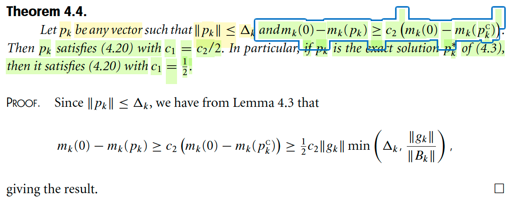</kbd>

> [!NOTE]
> Theorem 4.4 về điều kiện giảm đủ của pk khi tương quan với Cauchy point
>
> Rồi, đại ý là một khi đã chứng minh Cauchy point thỏa điều kiện giảm đủ thì cũng dễ dàng chứng minh được với pk bất kì miễn là thỏa ||pk|| ≤ Δ và mức giảm của nó đạt được trạng thái ít nhất bằng một tỉ lệ nào đó của mức giảm Cauchy point (ví dụ như luôn ít nhất = 1/3 mức giảm của Cauchy point) thì theorem này nói rằng khi đó pk đó cũng thỏa điều kiện giảm đủ.
>
> Việc chứng minh rất đơn giản: 
>
> với pk thỏa mk(0) - mk(pk) ≥ c2(mk(0) - mk(pkC))
>
> thì vì mk(0) - mk(pkC) ≥ 1/2||gk|| min(Δk, ||gk|| / ||Bk||) (do Cauchy point thỏa điều kiện với c1 = 1/2)
>
> ⇨ c2(mk(0) - mk(pkC)) ≥ c2/2||gk|| min(Δk, ||gk|| / ||Bk||)
>
> ⇔ mk(0) - mk(pk) ≥ c2/2||gk|| min(Δk, ||gk|| / ||Bk||)
>
> Chứng tỏ pk thỏa điều kiện giảm đủ ..
>
> mk(0) - mk(pk) ≥ c1 ||gk|| min (Δk, ||gk|| / ||Bk||) for some constant c1 ∈ (0, 1] 
>
> với c2/2 đóng vai trò c1

> [!TIP]
> **🤖 AI Feedback** — ❌ Score: **65/100**
>
> Bản phân tích của bạn có một lỗi đáng kể khi trích dẫn Bổ đề 4.3, bạn đã bỏ sót hệ số c2 có trong phần chứng minh gốc. Ngoài ra, việc sử dụng ký hiệu "⇔" không phù hợp trong các bước suy luận; tuy nhiên, bạn đã đưa ra kết luận cuối cùng chính xác theo định lý.

 

- **Đại ý là dogleg và 2D subspace method thỏa.**

<kbd>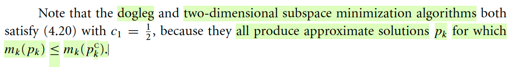</kbd>

> [!NOTE]
> Đại ý là dogleg và 2D subspace method thỏa.

 

- **Convergence to Stationary Points**

<kbd>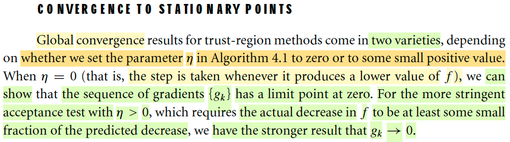</kbd>

> [!NOTE]
> #Convergence to Stationary Points
>
> Đại khái là nói rằng kết quả hội tụ toàn cục của phương pháp trust region đến từ hai biến thể (varieties), phụ thuộc ta chọn η bằng 0 hay số dương (trong (0,1/4)) trong thuật toán 4.1
>
> Theo link để biết thuật toán, nhưng đại khái có thể ôn lại nhanh thuật toán lặp đi lặp lại việc sau đây:
>
> a) Xác định pk, giải bài toán minimize fk + gkTpk + (1/2)pkBkpk s.t ||pk|| ≤ Δk
>
> b) Tính và check tỉ lệ sụt thật và độ sụt ước đoán: ρk = [fk - fk+1] / [mk - mk+1] để nếu quá nhỏ (<1/4) thì thu nhỏ trust region: Δk+1 = .. (nhỏ hơn Δk), nếu lớn (≈ 1) và ||pk|| = ||Δk|| thì tăng lên còn không thì giữ nguyên.
>
> c) Cũng xem độ sụt ρk có > η không thì update: xk+1 = xk + pk, ngược lại thì giữ nguyên (không di chuyển)
>
> Vậy ở đây nói nếu η được chọn 0, thì với bước c) ta có thể hiểu là mĩên là độ sụt dương, không care là có bị hụt chân hay không (sự giảm estiamate bởi mk có gần đúng sự giảm thực tế của f không), thì vẫn thực hiện bước update.
>
> Còn ngược lại, nếu phải thỏa ρk > η dương thì có nghĩa là, chỉ khi tỉ lệ mức độ hụt thực tế và ước lượng đủ lớn thì mới "bước đi"
>
> Thế thì, tác giả nói, ở case thứ nhất ta có thể chứng minh chuỗi gradient gj sẽ hội tụ về 0, và với case sau (nghiêm ngặt hơn) thì thậm chí ta còn có kết quả tốt hơn.

 

- **Một số giả định trước khi đi vào phân tích**

<kbd>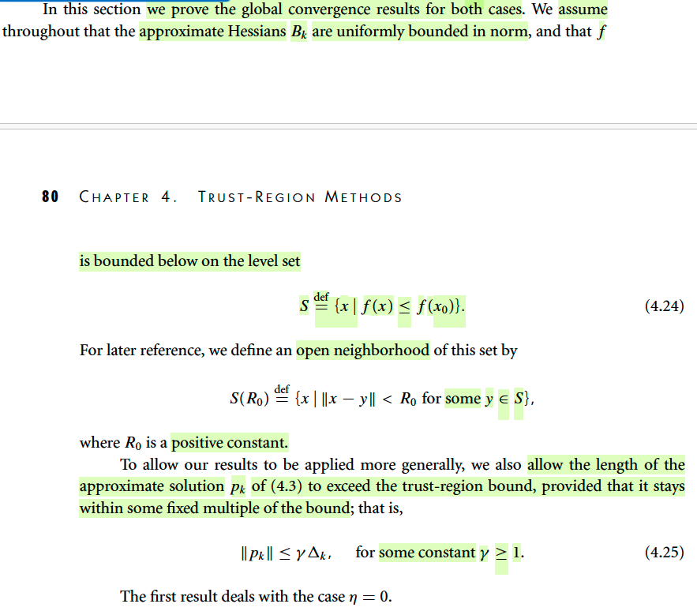</kbd>

> [!NOTE]
> Một số giả định trước khi đi vào phân tích
>
> Tác giả cho rằng ta sẽ giả định Bk (ma trận xấp xỉ Hessian) sẽ uniformly bounded in norm
>
> (Ý này chưa hiểu để làm gì nhưng ta đã từng gặp giả định này trong Line Search, sẽ đóng vai trò kết quả phân tích hội tụ)
>
> Và giả thiết nữa là f bị chặn dưới trong level set S, S = {x|f(x) ≤ f(x0)}: Có nghĩa là trong phạm tập S này thì f không thể đi xuống trừ vô cùng
>
> Và để dùng sau, ta định nghĩa một vùng lân cận mở (open neighborhood) của tập S này:
>
> S(R0) = {x: ||x - y|| < R0 với some y ∈ S} (4.24)
>
> Một điểm nữa cũng chưa rõ lắm nhưng đại ý là tác giả nói để kết quả phân tích có thể được áp dụng một cách khái quát hơn, ta sẽ cho phép chiều dài của pk có thể vượt quá trust region method, nhưng vẫn nằm trong phạm vi là nó bằng một scaled factor nào đó của trust region.
>
> ||pk|| ≤ γ Δk (4.25)
>
> #Công thức 4.24, 4.25

 

- **Theorem 4.5**

<kbd>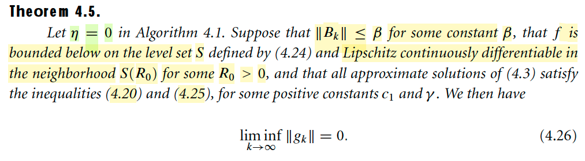</kbd>

> [!NOTE]
> #Theorem 4.5
>
> Theorem này nói rằng, với η = 0, thì giả sử 
>
> a) **||Bk|| ≤ β với constant β nào đó**
>
> b) **f bị chặn trong tập level set S**
>
> c) và có tính **Libschitz continously differentiable trong neighborhood S(R0)** với some R0 > 0. 
>
> d) mọi approximate solutions của bài toán 4.3 (bài toán dùng để tìm pk) đều **thỏa điều kiện giảm đủ** 
>
> mk(0) - mk(pk) ≥ c1 ||gk|| min (Δk, ||gk|| / ||Bk||) for some constant c1 ∈ (0, 1] (4.20)
>
> ||pk|| ≤ γ Δk (4.25)
>
> S(R0) = {x: ||x - y|| < R0 với some y ∈ S} (4.24)
>
> Thì khi đó lim inf k → inf ||gk|| = 0 (4.26)
>
> Chú ý đây là liminf tức là giới hạn dưới.

 

- **Chứng minh theorem 4.5**

<kbd>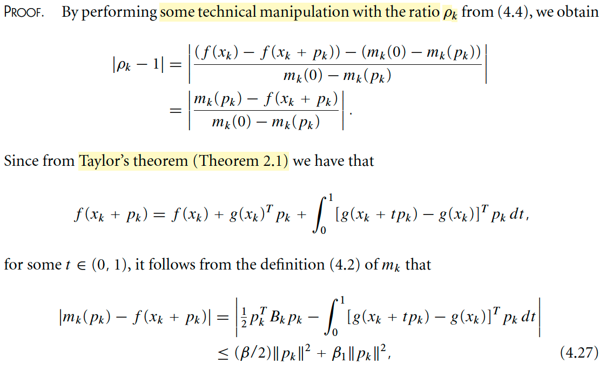</kbd>

> [!NOTE]
> #Chứng minh theorem 4.5 
>
> Cùng xem kĩ phần chứng minh:
>
> Đầu tiên biến đổi |pk - 1|:
>
> Công thức 4.4 ρk = [f(xk) - f(xk + pk)] / [mk(0) - mk(pk)]
>
> ρk - 1 = [f(xk) - f(xk + pk)] / [mk(0) - mk(pk)] - [mk(0) - mk(pk)] / [mk(0) - mk(pk)]
>
> = {[f(xk) - f(xk + pk)] - [mk(0) - mk(pk)]} / [mk(0) - mk(pk)]
>
> = [f(xk) - f(xk + pk) - mk(0) + mk(pk)] / [mk(0) - mk(pk)]
>
> = [mk(pk) - f(xk + pk)] / [mk(0) - mk(pk)]  | vì mk(0) chính là = f(xk)
>
> ⇨ |ρk - 1| = |[mk(pk) - f(xk + pk)] / [mk(0) - mk(pk)]|
>
> Tiếp theo là áp dụng định lý Taylor để có kết quả 
>
> f(xk + pk) = f(xk) + g(xk)Tpk + ∫0:1 [g(xk + tpk) - g(xk)]Tpkdt 
>
> Là sao?
>
> Xét hàm h(t) = f(x + tp):
>
> ⇨ d/dt h(t) (hay h'(t)) = d/dt f(x + tp) = d/d(x + tp) f(x + tp) . d/dt (x + tp)
>
> = ∇f(x + tp) . p = ∇f(x + tp)Tp
>
> Viết lại h'(t) = ∇f(x + tp)Tp
>
> Rồi, ta mới áp dụng FTC 1, trong đó nói rằng: Nếu G là nguyên hàm của f tức: G'(x) = f(x) thì ∫a:b f(x)dx = G(b) - G(a)
>
> Nên áp dụng cho g là nguyên hàm của h' (dĩ nhiên)
>
> ⇨ ∫0:1 h'(t)dt = h(1) - f(0)
>
> Thay h'(t) = ∇f(x + tp)Tp, 
>
> h(1) = f(x + 1 × p) = f(x + p), h(0) = f(x) thì ta có:
>
> **∫0:1 ∇f(x + tp)Tpdt = f(x + p) - f(x)**
>
> Tới đây chú ý, trong sách kí hiệu g(.) là hàm gradient, tức ∇f(x + tp) chính là g(x + tp), tức gradient tại x + tp.
>
> Viết lại ta có: f(x + p) - f(x) = ∫0:1 g(x + tp)Tpdt
>
> Cộng và trừ bớt cho g(x)Tp
>
> f(x + p) - f(x) = ∫0:1 [g(x + tp) - g(x) + g(x)]Tpdt 
>
> ⇔ f(x + p) - f(x) = ∫0:1 [g(x + tp) - g(x)]Tpdt  + ∫0:1 g(x)Tpdt 
>
> ⇔ f(x + p) - f(x) = ∫0:1 [g(x + tp) - g(x)]Tpdt  + g(x)Tp ∫0:1 dt 
>
> (đưa g(x)Tp ra ngoài tích phân vì không dính đến t)
>
> ⇔ f(x + p) = f(x) + g(x)Tp + ∫0:1 [g(x + tp) - g(x)]Tpdt   
>
> Đấy chính là công thức mà tác giả nói là từ Taylor's theorem, nhưng đáng lý tác giả nói từ FTC thì dễ hiểu hơn vì nếu soi từ 3 công thức Taylor theorem 2.4 → 2.6 thì hơi khó nhìn ra 
>
> Áp dụng vào đây ta có:
>
> f(xk + pk) = f(xk) + g(xk)Tpk + ∫0:1 [g(xk + tpk) - g(xk)]Tpkdt 
>
> **CHÚ Ý, TÁC GIẢ GHI SAI / THỪA "for some t ∈ (0,1)"**
>
> Với mk(pk) = f(xk) + gkTpk + (1/2)pkTBkpk và f(xk + pk) bằng ở trên ta sẽ tính:
>
> |mk(pk) - f(xk + pk)| 
>
> = |f(xk) + gkTpk + (1/2)pkTBkpk - [f(xk) + g(xk)Tpk + ∫0:1 [g(xk + tpk) - g(xk)]Tpkdt ]|
>
> = |f(xk) + gkTpk + (1/2)pTBkpk - f(xk) - g(xk)Tpk - ∫0:1 [g(xk + tpk) - g(xk)]Tpkdt ]|
>
> = |(1/2)pkTBkpk - ∫0:1 [g(xk + tpk) - g(xk)]Tpkdt ]|
>
> Tác giả ghi cái này ≤ {(β/2)||pk||^2 + β1||pk||^2 với β1 là Lipschitz constant cho g trong set S(R0)m và assume ||pk|| < R0
>
> Làm rõ chỗ này:
>
> Đầu tiên: Dùng bất đẳng thức tam giác: |A + B| ≤ |A| + |B|
>
> ⇨ |(1/2)pkTBkpk - ∫0:1 [g(xk + tpk) - g(xk)]Tpkdt ]| 
>
> ≤ |(1/2)pkTBkpk| + |-∫0:1 [g(xk + tpk) - g(xk)]Tpkdt ]|
>
> = |(1/2)pkTBkpk| + |∫0:1 [g(xk + tpk) - g(xk)]Tpkdt ]|
>
> Xét cái hạng tử đầu tiên: |(1/2)pkTBkpk|
>
> |pkTBkpk| = |pkT(Bkpk)| ≤ | ||pk|| . ||Bkpk|| | (vì aTb = ||a|| ||b|| cos θ(a,b) ≤ ||a|| ||b||)
>
> Dùng định nghĩa của norm ||A||:  max x ||Ax|| / ||x|| ⇨ ||Ax|| / ||x|| ≤ ||A||. Áp dụng vào đây: ||Bkpk|| / ||pk|| ≤ ||Bk||, hay ||Bkpk|| ≤ ||Bk|| . ||pk||
>
> ⇨ |pkTBkpk| = |pkT(Bkpk)| ≤ | ||pk|| . ||Bkpk|| | ≤ | ||pk|| ||Bk|| ||pk|| | = | ||Bk|| ||pk||^2 | = ||Bk|| ||pk||^2
>
> Dùng giả thiết của theorem tác giả đã nói ||Bk|| ≤ β for some constant β.
>
> ⇨ pkTBkpk = pkT(Bkpk) ≤ ||pk|| . ||Bkpk|| ≤ ||pk|| ||Bk|| ||pk|| = ||Bk|| ||pk||^2 ≤ β ||pk||^2
>
> Thêm 1/2 vào, viết lại: (1/2)pkTBkpk ≤ (1/2)β ||pk||^2 Đây là cái hạng tử đầu tiên của 4.27
>
> ====
>
> Xét hạng tử thứ 2: |∫0:1 [g(xk + tpk) - g(xk)]Tpkdt ]|
>
> Dùng tính chất Lipschitz continuous, ta nhớ cái này đại ý nôm na là vầy: Khi đi từ x đến y thì gradient không thay đổi qúa đột ngột. Và thể hiện bởi toán học là:
>
> ||h(x) - h(y)||/||x - y|| ≤ L với L là hằng số Lipschitz, mang ý nghĩa là độ dốc từ x đến y bị chặn trên bởi số hữu hạn.
>
> Áp dụng ở đây, giả thiết cho  "Lipschitz continously differentiable trong lân cận S(R0).." chính là nói hàm gradient ∇f(x), hay g(x) là có tính chất Lipschitz continous.
>
> Nên độ dốc giữa hai điểm xk và xk+tpk phải bị chặn trên bởi số hữu hạn:
>
> ||g(xk + tpk) - g(xk)||  / ||(xk + tpk) - xk|| ≤ L, và ở đây tác giả dùng β1 cho Lipschitz constant.
>
> Viết lại: ||g(xk + tpk) - g(xk)||  / ||(xk + tpk) - xk|| ≤ β1
>
> ⇔ ||g(xk + tpk) - g(xk)|| ≤ β1 ||(xk + tpk) - xk||
>
> ⇨ |∫0:1 [g(xk + tpk) - g(xk)]Tpkdt |
>
> Đưa dấu giá trị tuyệt đối vào trong tích phân: 
>
> = ∫0:1 |[g(xk + tpk) - g(xk)]Tpk| dt 
>
> ≤ ∫0:1 ||[g(xk + tpk) - g(xk)|| ||pk|| dt  (áp dụng aTb ≤ ||a|| ||b||)
>
> ≤ ∫0:1 β1 ||(xk + tpk) - xk|| ||pk|| dt
>
> = ∫0:1 β1 ||tpk|| ||pk|| dt
>
> = ∫0:1 β1 |t| ||pk|| ||pk|| dt 
>
> = ∫0:1 β1 |t| ||pk||^2 dt
>
> = β1 ||pk||^2 ∫0:1 t dt (do t ≥ 0)
>
> ≤  β1 ||pk||^2 ∫0:1 dt (do t ≤ 1)
>
> = β1 ||pk||^2 
>
> Đây là term thứ 2:
>
> Kết hợp lại ta có :
>
> |mk(pk) - f(xk + pk)| ≤ (1/2)β ||pk||^2 + β1 ||pk||^2  như tác giả viết (4.27)

> [!TIP]
> **🤖 AI Feedback** — ⚠️ Score: **85/100**
>
> Phần chứng minh của bạn rất chi tiết và thể hiện sự hiểu biết sâu sắc về các định lý cơ bản như Định lý cơ bản của Giải tích (FTC) và tính chất Lipschitz. Đặc biệt, việc bạn tự mình dẫn ra công thức Taylor dạng tích phân và chỉ ra sự thiếu chính xác trong cách đặt câu "for some t ∈ (0,1)" trong văn bản gốc là điểm rất ấn tượng. Tuy nhiên, trong bước đánh giá cận trên cho hạng tử thứ hai của bất đẳng thức (4.27), mặc dù kết quả cuối cùng khớp với văn bản gốc, việc chuyển từ ∫t dt = 1/2 sang ≤ ∫1 dt = 1 khiến cho việc suy luận thiếu chặt chẽ. Cụ thể, sau khi tính được ∫0:1 t dt = 1/2, hạng tử chính xác phải là (β1/2)||pk||^2. Việc dùng cận lỏng hơn (≤ β1||pk||^2) là đúng về mặt toán học, nhưng một bài chứng minh chặt chẽ sẽ hoặc giữ nguyên cận chặt nhất hoặc giải thích rõ ràng lý do sử dụng cận lỏng hơn. Hãy chú ý hơn đến sự chính xác và chặt chẽ trong từng bước toán học.

 

- **Chứng minh theorem 4.5 (cont 1)**

<kbd>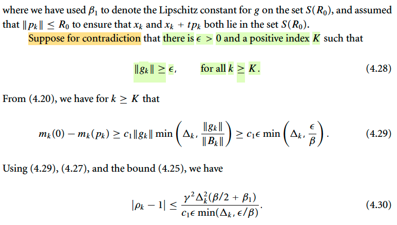</kbd>

> [!NOTE]
> #Chứng minh theorem 4.5 (cont 1)
>
> Tiếp, tác giả giả định tồn tại ε dương và một index number K nào đó mà ||gk|| ≥ ε ∀ K, điều này có nghĩa tác giả đang giả định điều mà theorem này nói không xảy ra, gradient gk luôn (có trị tuyệt đối) lớn hơn giá trị dương nào đó, đồng nghĩa nó không liminf k → ∞ ||gk|| = 0.
>
> Dùng 4.20, ý là giải thiết của thoerem rằng các pk đều thỏa điều kiện giảm đủ: 
>
> mk(0) - mk(pk) ≥ c1 ||gk|| min(Δk, ||gk|| / ||Bk||)
>
> Với ||gk|| ≥ ε nói trên, và ||Bk|| ≤ β của giả thiết: 
>
> c1 ||gk|| min(Δk, ||gk|| / ||Bk||) ≥ c1 ε min(Δk, ε / β)
>
> ⇨ mk(0) - mk(pk) ≥ c1 ε min(Δk, ε / β) (4.29)
>
> Dùng tiếp kết quả hồi nãy:
>
> |mk(pk) - f(xk + pk)| ≤ (1/2)β ||pk||^2 + β1 ||pk||^2 (4.27)
>
> ||pk|| ≤ γΔk for some constant γ (4.25) 
>
> và (4.29) ở trên ta có:
>
> |ρk - 1| = |[mk(pk) - f(xk + pk)] / [mk(0) - mk(pk)]|
>
> ≤ | [(1/2)β ||pk||^2 + β1 ||pk||^2 ] | / [c1 ε min(Δk, ε / β)] |  (dùng 4.27, 4.29)
>
> ≤ | [(1/2)β (γΔk)^2 + β1 (γΔk)^2 ] | / [c1 ε min(Δk, ε / β)] | (dùng (4.25))
>
> = | [(γΔk)^2[β/2  + β1] | / [c1 ε min(Δk, ε / β)] |
>
> = [(γΔk)^2[β/2  + β1] | / [c1 ε min(Δk, ε / β)]  (số không âm, bỏ trị tuyệt đối)

> [!TIP]
> **🤖 AI Feedback** — ✅ Score: **92/100**
>
> Phần giải thích về giả định phản chứng và các bước suy luận toán học đều rất chính xác và đầy đủ, thậm chí còn bổ sung nội dung các phương trình (4.25) và (4.27) không có trong hình ảnh gốc. Tuy nhiên, cách diễn đạt về phương trình (4.20) có thể rõ ràng hơn và cần lưu ý loại bỏ các dấu giá trị tuyệt đối không cần thiết khi các đại lượng đã dương.

 

- **Chứng minh theorem 4.5 (cont 2)**

<kbd>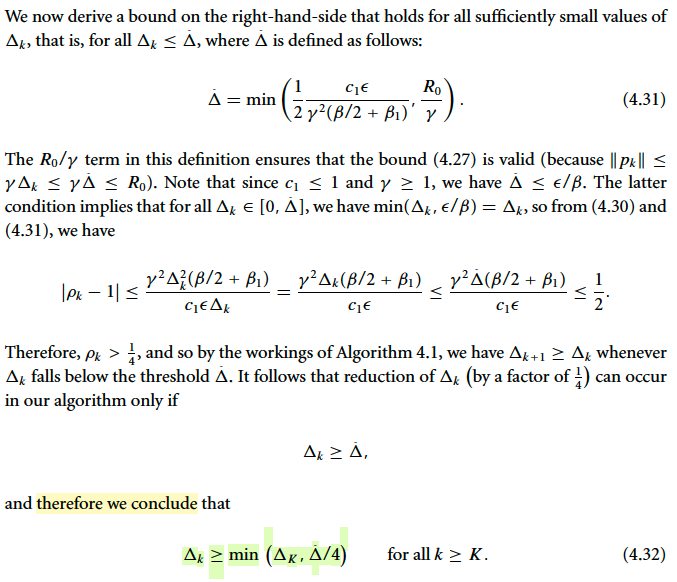</kbd>

<kbd>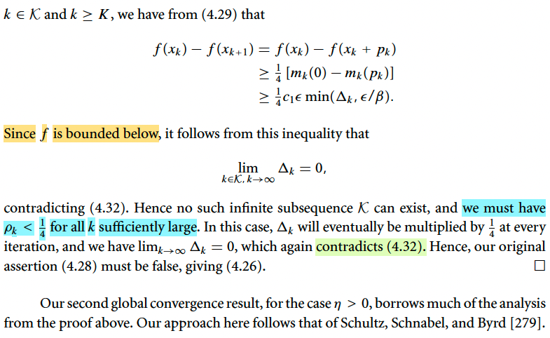</kbd>

> [!NOTE]
> # Chứng minh theorem 4.5 (cont 2)
>
> Tiếp theo là chiến thuật chứng minh phản chứng (Proof by Contradiction):
>
> 1) Đại ý là đầu tiên ta sẽ lập mâu thuẫn từ giả định: Dưới giả định phản chứng ||gk|| ≥ ε ∀ k ≥ K, ta sẽ chứng minh là Δk, trust region sẽ bị chặn dưới, tức không bao giờ bị bóp về 0
>
> 2) Sau đó, ta sẽ chia hai trường hợp: 
>
> a) Giả định là tồn tại một số lượng vô hạn (infinite) các iteration mà mỗi cái thỏa điều kiện giúp Δ không bị thu hẹp (chính là điều kiện mức giảm / độ sụt ρk ≥ 1/4). Khi đó ta sẽ chứng minh rằng điều này dẫn tới việc f(xk) - f(xk+1) ≥ (1/4)c1ε min(Δk, ε/β) và điều này khi cộng với giả thiết hàm f bị chặn dưới sẽ giúp suy ra Δk phải → 0, mâu thuẫn trực tiếp với ý (1)
>
> b) Gỉa định ngược với a), có nghĩa là phải chỉ có hữu hạn iteration nào mà mỗi cái đều thỏa điều kiện ρk ≥ 1/4. Và điều này cũng đồng nghĩa là với k đủ lớn thì những iteration khác còn lại sẽ không thỏa, khiến Δ bị bóp lại. Và sớ iteration như vậy cũng phải lớn đến vô hạn khi k lớn vô hạn. Mà như vậy thì đồng nghĩa là Δ sau mỗi bước sẽ liên tục bị bóp nhỏ lại, và số bước là vô hạn → Δ sẽ phải → 0, cũng lại mâu thuẫn với (1) nốt.
>
>  Cả 2 trường hợp thực tế đều ép Δk → 0, đâm thủng cái "mức sàn" ảo tưởng ở ý (1). Suy ra cái giả định ban đầu (||gk|| ≥ ε) là rác rưởi. Bài toán được chứng minh.
>
> ====
>
> Bây giờ ta thử đi vào các phần chi tiết của chiến lược trên:
>
> Làm khúc dễ trước: Giả sử ta đã chứng minh bước 1, là Δ không bao giờ bị bóp về 0, cụ thể là ta sẽ chứng minh Δk ≥ min(ΔK, Δ/4) ∀ k ≥ K. Và ta gỉa sử 2a) Tồn tại một số lượng vô hạn các iteration mà mỗi cái đều thỏa ρk ≥ 1/4 (trong sách ghi là tồn tại infinite subsequence K_curly, tức là 1 chuỗi con, ví dũ {1,2,4} là chuỗi con của {1,2,3,4} vậy. Nói chung là chỉ cần hiểu là giả sử ta có một số bước iteration k nào đó mà thoả điều kiện này, khiến Δ không bị bóp sau bước đó.
>
> thì f(xk) - f(xk+1) = f(xk) - f(xk + pk) (cái này ko có gì khó cả, chỉ là xk+1 = xk + pk mà thôi)
>
> thế thì vì ρk ≥ 1/4 ⇔ [f(xk) - f(xk+1)] / [m(0) - m(p)] ≥ 1/4 
>
> ⇔ [f(xk) - f(xk+1) ≥ (1/4)[m(0) - m(pk)]
>
> ⇔ f(xk) - f(xk + pk) ≥ (1/4)[m(0) - m(pk)]
>
> Dùng kết qủa (4.29): m(0) - m(pk) ≥ c1 ε min(Δk, ε / β) 
>
> ⇨ f(xk) - f(xk + pk) ≥ (1/4)c1 ε min(Δk, ε / β) 
>
> và bối cảnh là ta đang giả sử là có vô số vòng lặp (iteration) mà mỗi cái đều thỏa điều kiện khiến Δ không bị bóp lại. Thì cái kết quả trên mang ý nghĩa là sau mỗi vòng lặp hàm f đều giảm một mức dương nào đó. Thế thì nếu mỗi lần đều giảm một mức nào đó, và với vô số lần, thì hàm f sẽ PHẢI CẮM ĐẦU VỀ -∞. Mâu thuẫn với giải thiết f bị chặn dưới, nên để điều này xảy ra thì chỉ có thể là Δ phải nhỏ lại về 0. Thì cái này cũng lại mâu thuẫn với ý 1). Tóm lại case này không thể xảy ra.
>
> Và do đó ta phải xét case 2b) Là không có chuyện có vô hạn bước khiến Δ không bị bóp mà chỉ có hữu hạn bước như vậy mà thôi. Thì dễ hiểu là như vậy đồng nghĩa khi số bước đủ lớn thì sẽ có một số lượng rất lớn các bước mà Δ bị bóp lại sau mỗi lần, và dẫn đến Δk → 0. Lại gây mâu thuẫn với ý 1).
>
> Tới đây là chứng minh xong vì cả hai case 2a, 2b đều mâu thuẫn với ý 1) nên toàn bộ giả định 
> giả định tồn tại ε > 0 và index dương K khiến ||gk|| ≥ ε ∀ k ≥ K là không thể xảy ra, gíup chứng minh theorem này.
> ====
>
> Giờ quay lại bước 1) Chứng minh Δ không bao giờ bị bóp về 0:
>
> Chiến lược để chứng minh điều này là ta sẽ:
>
> a) Dựa vào 4.30, ta cho vế phải ≤ 1/2 và giải tìm xem Δk phải như thế nào. Ý định là, nếu ta tìm ra cái mốc của Δk khiến vế phải ≤ 1/2 thì cũng chính là khiến ρk > 1/2 và từ đó dĩ nhiên > 1/4, tức thỏa điều kiện khiến ko cần bóp Δ sau step đó.
>
> Và ta sẽ giải ra cái mốc cần tìm là Δk < (Δ)_bar với (Δ)_bar như trong 4.31.
>
> Và từ đó mình lập luận đơn giản thế này thôi: Với một chuỗi Δk bị bóp dần bóp dần thì luôn đến một lúc nào đó nó nhỏ hơn mốc trên, khi đó nó sẽ KHÔNG BỊ BÓP NỮA, THẾ THÔI. Và nhiêu đó cũng đủ chứng minh Δ sẽ không b5i bóp hoài để thành 0, mà sẽ luôn ≥ số nào đó
>
> Và giả sử tại bước k nó bắt đầu nhỏ hơn mốc trên rồi thì nó sẽ không nhỏ bị bóp hơn nữa. Còn nếu tại bước Δk nào đó nó bằng mức sàn, nhưng chưa thủng, thì nó sẽ bị bóp (vì điều kiện bị bóp là Δ ≥ Δ_bar mà) thì nó sẽ BỊ BÓP LẦN CUỐI, trở thành Δ_bar / 4 và không bao giờ bị bóp nữa.
>
> Thành ra Δk ≥ min (Δ, Δ_bar / 4) là vậy.

> [!TIP]
> **🤖 AI Feedback** — ⚠️ Score: **88/100**
>
> Bạn đã nắm rất vững cấu trúc chứng minh phản chứng và trình bày các trường hợp 2a, 2b một cách cực kỳ rõ ràng, logic, thể hiện sự hiểu biết sâu sắc về tài liệu. Tuy nhiên, phần giải thích chi tiết cho việc Δk bị chặn dưới (tức là Δk ≥ min(ΔK, Δ̂/4)) ở cuối có thể trình bày chặt chẽ và nhất quán hơn về mặt ký hiệu để đạt độ chính xác tuyệt đối.

 

- **Theorem 4.6 #QUAY LẠI SAU**

<kbd>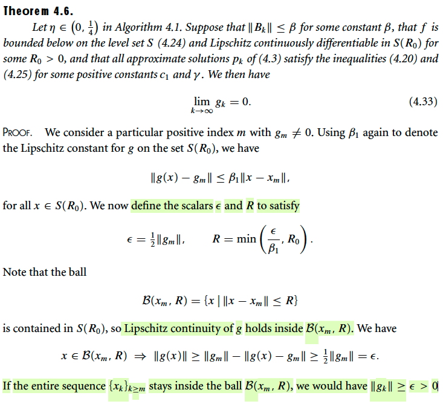</kbd>

<kbd>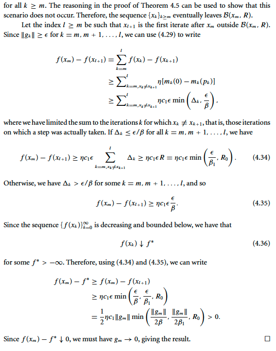</kbd>

> [!NOTE]
> Theorem 4.6 #QUAY LẠI SAU
>
> Ok, vô thẳng phần chứng minh, cùng nhau hiểu:
>
> Đầu tiên, tác giả xét một index dương cụ thể m có gm ≠ 0: Tức là tại một điểm nào đó, gradient khác 0. Và vẫn dùng β1 để kí hiệu cho Lipschitz constant. 
>
> Ôn lại Lipschizt constant: Đại ý Lipschizt coninuous là một điều kiện quy định rằng mức thay đổi của hàm số không được quá đột ngột, thể hiện bởi độ dốc của hàm số trong đoạn di chuyển phải bị chặn trên:
>
> Nên ở đây: ||g(x) - gm|| / ||x - xm|| ≤ β1 ⇔ ||g(x) - gm|| ≤ β1||x - xm||
>
> với mọi x ∈ S(R0) (vì giả thiết của định lý nói rõ f bị chặn dưới trong phạm vi level set S và Lipschitz continuosly differentiable trong S(R0), thì ý sau chính là nói cái này)
>
> Tiếp theo tác giả đặt một scalar ε = (1/2)||gm|| và R = min (ε/β1, R0) và define Euclidean ball: B(xm, R) = {x | ||x - xm|| ≤ R}, tập này nằm trong S(R0) (vì sao?) nên tính liên tục Lipschitz cũng thỏa trong đó.
>
>
> #QUAY LẠI SAU

 

- **4.3 Iterative Solution Of The Subproblem**

<kbd>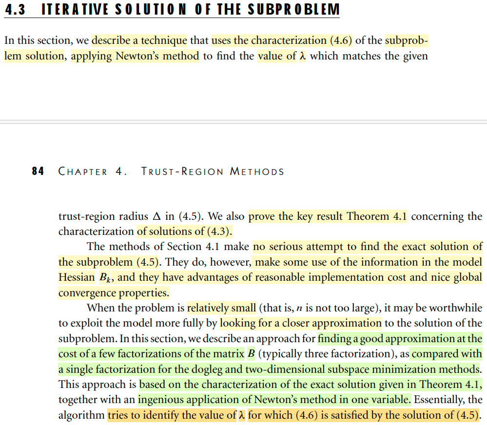</kbd>

<kbd>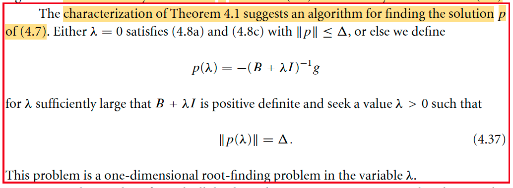</kbd>

> [!NOTE]
> 4.3 ITERATIVE SOLUTION OF THE SUBPROBLEM
>
> Tạm lược dịch, vì tác giả dẫn một loạt các công thức trước đó
>
> Phần này đại ý là tác giả sẽ dùng đặc điểm 4.6, (có theoerem nói rằng nếu p* là solution của bài toán 4.5 thì nó sẽ thỏa: (B  + λI)p* = -g) để giải tìm λ sao cho nó khớp với trust region radius Δ trong bài toán 4.5 (là bài toán minimize f + gTp + (1/2)pTBp subject to ||p|| ≤ Δ)
>
> *Ý này chưa hiểu lắm nhưng sẽ hiểu hơn ở sau)
>
> Sau đó ta cũng sẽ chứng minh kết quả quan trọng của Theorem 4.1 liên quan đến đặc điểm của solution của bài toán 4.3 
>
> (4.3 chỉ bài toán này, minimize mk(p) =  f(xk) + ∇f(xk)Tp + (1/2)pT Bk p subject to ||p|| ≤ Δk, bỏ k đi cho gọn để có 4.5)
>
> Rồi tiếp, tác giả nói trong phần 4.1, ta không thật sự nghiêm túc trong việc muốn tìm ra nghiệm chính xác của subproblem 4.5. Tuy nhiên, ta đã dùng thông tin của Hessian Bk (approx cho Hessian) và có một số lợi thế nhất định về chi phí cũng như tính hội tụ toàn cục tốt.
>
> Khi bài toán tương đối nhỏ, thì có thể cùng đáng để khai thác (exploit) mô hình một cách triệt để hơn bằng cách **tìm kiếm một xấp xỉ gần hơn của subproblem.** 
>
> Trong phần này thì ta sẽ nói về các cách tiếp cận để tùn xấp xỉ tốt hơn nói trên sao cho chỉ tốn vài bước factorization của matrix B (thường là chỉ tốn 3, so với 1 của phương pháp dogleg và 2d subspace minimization)
>
> Cách tiếp cận này được dựa trên đặc địểm của exact solution trong theorem 4.1 (theo link) và với một ứng dụng của Newton method 1 biến.
>
> Và về cơ bản là thuật toán sẽ ráng xác định λ sao cho solution p* của bài toán  minimize f + gTp + (1/2)pTBp subject to ||p|| ≤ Δ (4.5) sẽ có thể thỏa được (B  + λI)p* = -g (4.6)
>
> ====
>
> Sau khi ôn lại KKT condition thì ta sẽ thấy vì sao solution của bài toán 4.5 chính là p* thỏa 4.6:
>
> Viết lại bài toán 4.5:
>
> minimize f + gTp + (1/2)pTBp s.t ||p|| ≤ Δ
>
> Vì ||p|| không âm, và hàm square u^2 với u không âm sẽ đồng biến nên ta có ||p|| ≤ Δ ⇔ ||p||^2 ≤ Δ^2 ⇔ pTp ≤ Δ^2 ⇔ pTp - Δ^2 ≤ 0 ⇔ (1/2)(pTp - Δ^2) ≤ 0 
>
> Nên bài toán equivalent minimize f + gTp + (1/2)pTBp s.t (1/2)(pTp - Δ^2) ≤ 0
>
> Lagragian: f + gTp + (1/2)pTBp + (1/2)λ(pTp - Δ^2)
>
> = f + gTp + (1/2)pTBp + (1/2)λpTp - (1/2)λΔ^2
>
> = (1/2)pT(B + λI)p + gTp + f - λΔ^2
>
> KKT conditions:
>
> **Stationary condition**: ∇p L(p, λ)|p=p* = 0
>
> Gradient của Lagragian theo p:  
>
> (B + λI)p + g = 0
>
> ⇔ (B + λI)p = -g
>
> Đây chính là 4.6 trong sách.
>
> Và nó cũng là 4.8a của theorem 4.1:
>
> (B + λI)p* = -g (4.8a)
>
> λ(Δ - ||p*||) = 0 (4.8b)
>
> (B + λI) xác định bán dương. (4.8c)
>
> Vậy ta làm tiếp luôn để giải thích hai cái còn lại để cho thấy chúng ở đâu ra:
>
> Tiếp tục KKT conditions:
>
> Complementary slackness: Σi λ*i fi(x*) = 0. λ* là dual optimal, x* là primal optimal. Áp dụng ở đây, chính là:
>
> λ*(||p*|| - Δ) = 0 (λ* là dual optimal)
>
> Vì là bài toán với constraint ||p|| ≤ Δ cũng equivalent với pTp ≤ Δ^2 nên ta có quyền xài điều kiện này ở bài toán nào cũng được. Hoặc 
> nếu thích thì cứ dùng điều kiện này ở bài toán equivalent:
>
> λ*(||p*||^2 - Δ^2) = 0
>
> ⇔ λ*(||p*|| - Δ)(||p*|| + Δ) = 0
>
> ⇔ λ*(||p*|| - Δ)  | Do ||p*|| + Δ > 0
>
> Và đây chính là 4.8b
>
> Còn 4.8c: Thì chính là **điều kiện đủ bậc 2**: Để stationary pont là minimal của Lagragian:
>
> Hessian của L: ∇^2L(p, λ) = B + λI, tức là để tại stationary point p* (thỏa Gradient vanish) mà p* là minimal thì Hessian này phải xác định bán dương. 
>
> Một điểm quan trọng ghi lại đây luôn cho nhớ: Trong EE364A có nói, **KKT với bối cảnh bài toán convex thì là điều kiện cần và đủ** (ta có thể để ý trong bài toán convex, người ta **không cần nêu cái vụ Hessian xác định bán dương vì nó đã thỏa rồi**
>
> Nhưng **với bối cảnh này, thì KKT chỉ là điều kiện cần**, và **phải thêm điều kiện đủ bậc 2** như đã thấy.
>
> ====
>
> Thế thì đoạn đóng khung quan trọng, tác giả nói rằng, dựa vào các đặc điểm của λ, p* thỏa các điền kiện trên thì sẽ giúp kết luận p* là solution của bài toán 4.5. Thì từ đó ta **phác thảo ra một thuật toán để giải tìm p***:
>
> Đó là cho λ = 0: Xem thử B + λI = B có xác định bán dương không. Nếu thỏa, thì từ 4.8a (B + λI)p* = -g giải ra p* = -Binv g và check nó có norm thoả điều kiện ≤ Δ không, nếu thỏa thì chốt nghiệm p*. Có thể nhận ra đây chính là Newton step.
>
> Nếu case trên không thỏa thì tìm λ > 0 sao cho B + λI xác định bán dương, và p(λ) = -(B + λI)inv g có norm ||p(λ)|| = Δ
>
> (Vì sao ||p(λ)|| = Δ, là vì complementary slackness: λ(||p*|| - Δ) = 0, khiến cho nếu λ > 0 thì ||p*|| - Δ phải bằng 0.
>
> Và bài toán ở case sau chỉ là giải phương trình ||p(λ)|| = Δ ⇔ ||-(B + λI)inv g|| = Δ, chỉ chỉ là giải một phương trình đơn biến tìm λ thôi.

> [!TIP]
> **🤖 AI Feedback** — ✅ Score: **95/100**
>
> Bản dịch chính xác và việc trình bày chi tiết điều kiện KKT cho thấy sự hiểu biết sâu sắc về lý thuyết tối ưu hóa. Tuy nhiên, cần loại bỏ các lỗi chính tả nhỏ và các nhận xét không chính thức để nâng cao tính chuyên nghiệp của bài ghi chú.

 

<kbd>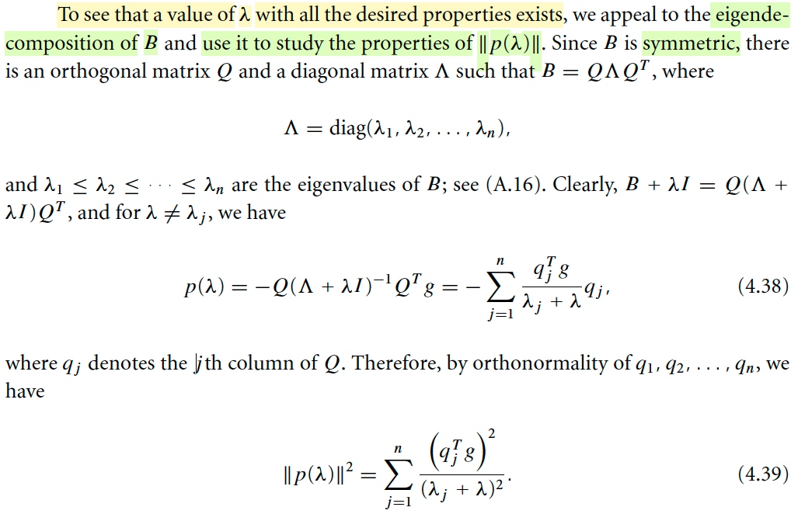</kbd>

> [!NOTE]
> Rồi, thế thì đại ý là ta sẽ phân tách trị riêng vector riêng của B và dùng nó để hiểu về ||p(λ)|| như sau:
>
> Vì B đối xứng, nên có thể phân tách thành Q Λ QT với Q là orthogonal matrix có các cột là eigenvector của B 
>
> p(λ) = -(B + λI)inv g 
>
> = -(Q Λ QT + λI)inv g
>
> = -(Q Λ QT + λQQT)inv g (do QQT = QTQ = I)
>
> = -(Q Λ QT + Q λI QT)inv g
>
> = -Q(Λ + λI)inv QT g 
>
> Dừng lại tí, xét AB, theo góc nhìn thứ 4 nhân matrix với matrix của thầy Strang đã dạy ta trong MIT 1806: AB = tổng các matrix rank 1 tạo bởi cột i của A outer product với hàng i của B
>
> Xét Q(Λ + λI)inv, các cột của nó là gì: 
>
> Các cột của Q là q1, q2,....qn, khi nhân với diagonal matrix M = (Λ + λI)inv, thì theo góc nhìn  thứ hai nhân matrix với matrix: cột 1 của QM là linear combination các cột của Q, với hệ số là cột 1 của M. Mà cột một của M chỉ có cái đầu tiên khác 0. nên kết quả sẽ chỉ là M11 q1. Tương tự cột 2 của QM là M22q2,....
>
> ⇨ các cột của QM là (M11 q1, M22 q2,...)
>
> Nhân QM cho QT: theo góc nhìn thứ 4 nói trên, ta sẽ có tổng:
>
> Σi (cột i của QM: Mii qi) outer product [row i của QT: qiT]
>
> ⇨ QMQT = Σi Mii qiqiT
>
> Giờ xét Mii là gì, dễ thấy nó là nghịch đảo của λi (eigenvalue của B) + λ: 1 / (λi + λ).
>
> Vậy p(λ) = -Q(Λ + λI)inv QT g = - { Σi [qiqiT / (λi + λ)] } g
>
> = - Σi [qiqiTg / (λi + λ)]  (phân phối vô)
>
> = - Σi [qiTg / (λi + λ)] qi  (qiTg là scalar) 
>
> Đây chính là 4.38
>
> ||p(λ)||^2 = {- Σi [qiTg / (λi + λ)] qi }^2
>
> khi khai triển bình phương cái tổng này ra, ta sẽ có các cross - term dính đến dot product của qi, qj với i khác j, thì vì tính trực giao của Q nên đều bằng 0. Chỉ còn:
>
> ..= Σi [qiTg / (λi + λ)]^2 qiTqi 
>
> = Σi [qiTg / (λi + λ)]^2 ||qi||^2 
>
> Đây chính là 4.39

> [!TIP]
> **🤖 AI Feedback** — ✅ Score: **95/100**
>
> Bài giải thích cực kỳ rõ ràng và chính xác, thể hiện sự hiểu biết sâu sắc về đại số tuyến tính và các phép nhân ma trận. Đặc biệt ấn tượng với việc giải thích cặn kẽ các bước dẫn đến công thức 4.38 và 4.39.

 

