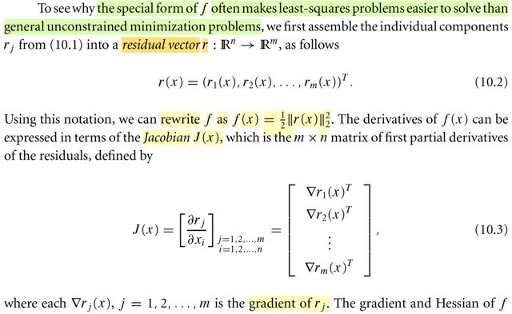
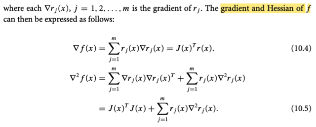
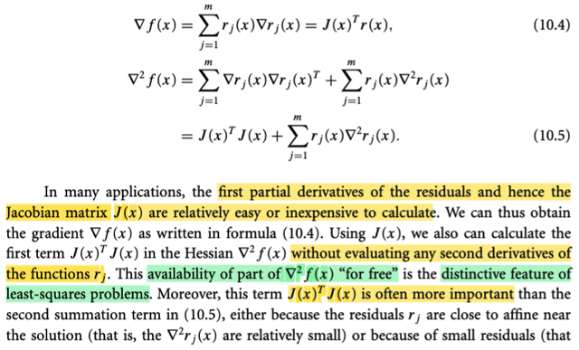
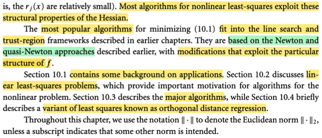
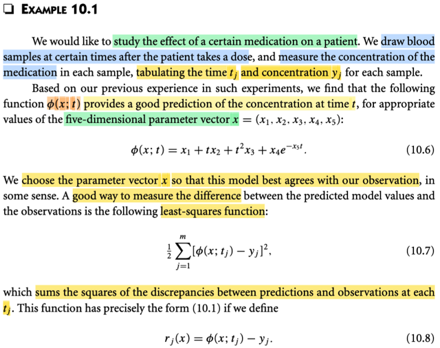
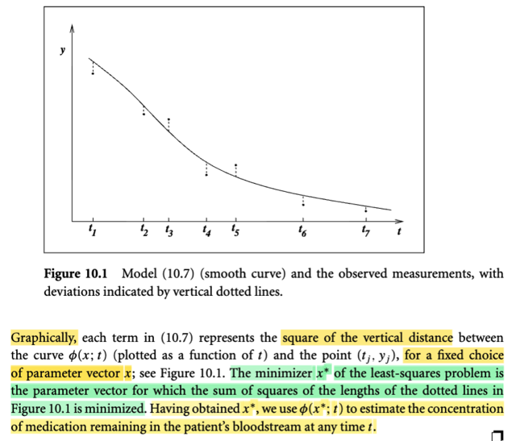
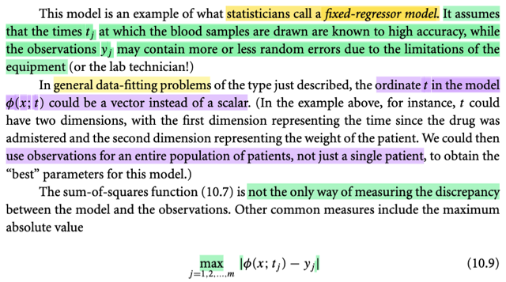
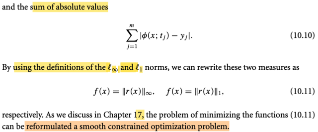

# 10.1 Least-square Problem

📊 **Progress:** `8` Notes | `10` Screenshots

---

<kbd></kbd>

<kbd></kbd>

> [!NOTE]
> Đầu tiên, gs giới thiệu bài toán least-square là bài toán tối ưu mà objective
> function của nó có dạng f(x) = (1/2) Σj rj(x)^2 với rj là smooth R^n → R
> function, được gọi là residual (phần dư).
>
> Đây là bài toán rất phổ biến xuất hiện ở rất nhiều lĩnh vực.
>
> Và chương này mình sẽ học các thuật toán mạnh mẽ để giải bài toán
> này

 

<kbd></kbd>

> [!NOTE]
> Đại khái là gs nói rằng ta sẽ thấy tại sao dạng đặc biệt của f thường sẽ khiến
> cho bài toán least-squares dễ giải hơn là bài toán unconstrained minimization
> problem chung chung.
>
> Thế thì, nhớ là trong bài toán này, objective là (1/2) Σi [ri(x)]^2, tức là tổng của
> bình phương residual ri(x). Bằng cách gom chúng lại thành vector r(x) = [r1(x),
> r2(x),....]T, thì Σi [ri(x)]^2 có thể thể hiện bởi (1/2) ||r(x)||^2, cũng là f(x) = (1/2)
> r(x)T r(x)
>
> Vậy thì, một điểm mình cần hiểu, f(x) là vector → scalar function. Nên
> derivative của f(x) đối với x là gradient vector có các phần tử là partial
> derivative ∇f(x) = (∂f/∂x1,...,∂f/∂xn)
>
> Nhưng ở đây gs nhắc đến Jacobian, thì đang nói về đạo hàm của hàm R^n
> vector → R^m vector r(x), là matrix mà hàng i của nó là vector các partial
> derivative (∂ri(x)/∂x1, ∂ri(x)/∂x2,....∂ri(x)/∂xn), dĩ nhiên, cũng chính là gradient
> vector ∇ri(x)

 

<kbd></kbd>

> [!NOTE]
> Thế thì ta có f(x) = (1/2) r(x)Tr(x) và J(x) là d/dx r(x).
>
> d/dx f(x) = (1/2) d/dx [r(x)Tr(x)]
>
> = (1/2) { d/dr(x) [r(x)Tr(x)] } . d/dx r(x) (Chain-rule)
>
> Tạm dừng chút xíu, xét hàm g(x) = xTx. Tính đạo hàm nhanh theo cách làm
> của MIT 18s096: dg(x) = (x+dx)T(x+dx)-xTx = (xT+dxT)(x+dx)-xTx =
> xTx+dxTx+xTdx+dxTdx-xTx = 2xTdx+dxTdx = 2xTdx (bỏ term bậc cao) ⇨
> ∇g(x) = 2x.
>
> Quay lại đây, dùng kết quả vừa rồi ta có:
>
> ... = (1/2) 2r(x) . J(x) = r(x) . J(x) (dấu . là kí hiệu hàm hợp)
>
> Tiếp, vì f(x), như đã nói là vector → scalar function, nên ∇f(x) dĩ nhiên là
> vector R^n, nên kết quả sẽ là J(x)Tr(x) (có shape [m,n]T[m,1] = [n,m][m,1] =
> [n,1].
>
> Nên ∇f(x) = J(x)Tr(x) là công thức 10.4 trong sách là vậy.
>
> Còn Hessian của f(x), thì cũng là d/dx ∇f(x)
>
> = d/dx [J(x)Tr(x)]
>
> Xét d/dx [J(x)Tr(x)] = d/dx [Σi [cột i của J(x)T] ri(x)]
>
> = Σi d/dx {[cột i của J(x)T] ri(x)}
>
> Xét hàm gi(x) = [cột i của J(x)T] ri(x), cũng chính là [hàng i của J(x)]T ri(x) =
> ∇ri(x) ri(x), là vector có các phần tử [∂ri(x)/∂x1 ri(x), ∂ri(x)/∂x2 ri(x), ...∂ri(x)/xn
> ri(x)]
>
> ⇨ d/dx gi(x) = d/dx [∇ri(x) ri(x)]
>
> = [d/dx ∇ri(x)] . ri(x) + ∇ri(x) . d/dx ri(x)
>
> = [∇^2ri(x)] . ri(x) + ∇ri(x) . ∇ri(x)
>
> Phân tích: gi(x) là R^n vector → R^n vector function, nên d/dx gi(x) là
> Jacobian matrix có shape [n,n].
>
> ri(x) là R^n vector → scalar function → ∇^2 ri(x) là Hessian matrix có shape
> nxn.
>
> cũng như ∇ri(x) là gradient vector, ⇨ ∇ri(x) . ∇ri(x) phải là outer product để
> có nxn matrix: ∇ri(x) ∇ri(x)T
>
> Vậy d/dx gi(x) = ∇^2ri(x) ri(x) + ∇ri(x) ∇ri(x)T
>
> Vậy d/dx [J(x)Tr(x)] = Σi d/dx {[cột i của J(x)T] ri(x)} = Σi d/dx gi(x)
>
> = Σi {∇^2ri(x) ri(x) + ∇ri(x) ∇ri(x)T}
>
> = Σi {∇^2ri(x) ri(x)} + Σi {∇ri(x) ∇ri(x)T}
>
> Term thứ 2, Σi {∇ri(x) ∇ri(x)T}, chính là tổng các rank 1 matrix, theo góc nhìn
> thứ 4 nhân hai matrix, ta có thể thấy đây là tích của hai matrix: [matrix có
> các cột là ∇ri(x)] [matrix có các hàng là ∇ri(x)] = J(x)T J(x)
>
> Vậy kết quả là Σi {∇^2ri(x) ri(x)} + J(x)TJ(x), chính là 10.5

 

<kbd></kbd>

> [!NOTE]
> Thế thì đại khái là vầy: Ta đã thấy rằng trong bài toán least-square, trong đó
> hàm objective là f(x) = Σi ri(x)^2 = r(x)Tr(x) với r(x) là vector → vector
> function, có Jacobian J(x) thì đạo hàm cấp 1 ∇f(x) và Hessian ∇^2f(x) có thể
> được tính bởi hai công thức 10.4 và 10.5. Và gs nói rằng, trong rất nhiều
> ứng dụng thì việc tính toán J(x) rất ít tốn kém. Từ đó, dẫn tới việc tính ra
> gradient và Hessian cũng đều không tốn kém gì mấy. Và đây là một đặc
> điểm mà ông cho rằng khiến bài toán least-square trở nên dễ chịu, và ông
> gọi nó đại khái là ta có được Hessian miễn phí.
>
> Mình hiểu thế này, trong các thuật toán tối ưu mà ta học ở đầu tới giờ, cũng
> như đã học ở Convex Optimization, giúp mình hiểu rằng: Trong các thuật
> toán tối ưu, xét về tốc độ hội tụ, thì Newton method là ngon nhất, và các
> thuật toán tối ưu đều cố gắng dùng thông tin độ cong có trong Hessian
> matrix. Có điều, vấn đề là nhiều khi tính toán Hessian rất tốn kém, thành ra
> trong các chương trước ta mới thấy các thuật toán quasi-Newton trong đó
> người ta cố gắng ước lượng Hessian để có được thông tin độ cong nhưng
> không quá tốn kém. Còn ở đây, ta có được Hessian chính xác mà không
> tốn mấy thì dĩ nhiên là quá tốt.
>
> Phải hiểu thêm là, trong đoạn này còn một ý, nói đại khái là việc tính J(x)
> rẻ, chỉ giúp tính phần J(x)TJ(x) của Hessian là rẻ thôi, còn cái term thứ hai
> thì vẫn liên quan đến Hessian của rj(x), vẫn tốn. Tuy nhiên, đại ý là vì vài lí
> do thì phần đầu mới đóng vai trò quan trọng, thành ra nói chung ta vẫn
> được lợi ích.

 

<kbd></kbd>

> [!NOTE]
> Thế thì chương này ta sẽ bàn về các thuật toán giải bài toán least-square và
> trong đó ta sẽ thấy chúng đều cố gắng khai thác tính chất vừa nói trên.
>
> Và ta sẽ thấy những thuật toán đó đều thuộc vào hai cách tiếp cận lớn mà ta
> đã học Line Search và Trust Region. Cũng như là với mỗi cách, cũng chia ra
> là tiếp cận theo Newton và quasi-Newton method.

 

<kbd></kbd>

> [!NOTE]
> Thế thì ta xét ví dụ này, đại khái là người ta muốn nghiên cứu hiệu quả của
> một loại thuốc tác động lên bệnh nhân. Họ sẽ lấy mẫu (draw sample) máu
> của bệnh nhân tại các thời điểm t khác nhau sau khi bệnh nhân uống thuốc,
> và đo mức độ tập trung của thuộc trong từng mẫu. Tạo thành một cái bảng
> các mốc thời gian tj, ứng với các chỉ số yj. Nói chung data sẽ là các cặp (tj,
> yj).
>
> Thế rồi, dựa vào kinh nghiệm, người ta tìm thấy một function φ(x, t) = x1 +
> x2 t + x3 t^2 + x4 e^(-x5t) là một funcntion hữu ích giúp dự đoán chỉ số y với
> t cho trước. Và bài toán đặt ra là ta tìm vector x = (x1,x2,..x5), là paramter
> vector, sao cho hàm Φ fit được tốt nhất với các data thu thập được.
>
> Dừng lại xíu, có thể nhận ra đây chính là bài toán curve fitting mà chap 1
> trong sách Bishop đã nói. Và cũng cần nhận thấy, đây không phải là bài toán
> linear regression, vì sao? Vì đây không phải hàm tuyến tính theo tham số
> **x**, vì ta thấy x5 tham gia trong e^-x5t, nếu chỉ có ví dụ như x4 e^t, thì đây
> vẫn là hàm tuyến tính theo tham số **x**.
>
> Và cũng chú ý, đây cũng ko phải là bài toán polynomial fitting, vì hàm số này
> ko phải là hàm đa thức của x, vì cái term x4 e^-x5t.
>
> Thế thì, trong bài toán này, người ta nhận ra rằng, hoặc thường dùng hàm
> (1/2) Σi [φ(x, tj) - yj]^2, là tổng bình phương sai lệch giữa dự đoán Φ(x, tj) và
> yj. Ý nói, cái bài toán thực tế này chính là ví dụ điển hình của bài toán least -
> squared khái φ(x, ti) - yjquát mà ta nói đầu đến giờ. Trong đó hàm residual
> rj(x) ở đây chính là rj(x) = φ(x, tj) - yj.

 

<kbd></kbd>

> [!NOTE]
> Hình 10.1 thể hiện các mốc thời gian t khác nhau cùng với các giá trị
> quan sát y tương ứng. Ta có các điểm (t1, y1), (t2, y2), v.v. Đường cong
> chính là đồ thị của hàm φ(x, t).
>
> Hàm φ(x, t) nên được hiểu là đường cong tương ứng với một bộ tham số
> (vector) x nào đó. Nhiệm vụ của chúng ta là tìm bộ tham số x sao cho
> hàm này khớp tốt nhất với các cặp điểm (t, y) đã cho.
>
> Trên hình, các đường chấm chấm thể hiện khoảng cách hoặc sai lệch
> giữa giá trị dự đoán của hàm φ(x, ti) và giá trị yi quan sát được (observed
> value).
>
> Như vậy, bài toán đặt ra là **tìm x sao cho tổng bình phương độ dài của
> các đoạn chấm chấm này là nhỏ nhất**.
>
> Giá trị x tối thiểu hóa này được gọi là x*. Sau khi tìm được x*, ta sẽ sử
> dụng nó để dự đoán cho các mốc thời gian t khác.

 

<kbd></kbd>

<kbd></kbd>

> [!NOTE]
> Giáo sư gọi mô hình này là **fixed regressor model** trong thống kê học. Tạm
> dịch là mô hình hồi quy cố định, tuy nhiên, chúng ta sẽ giữ nguyên thuật ngữ
> fixed regressor model.
>
> Loại mô hình này **GIẢ ĐỊNH rằng các thời điểm t** (thời điểm lấy mẫu máu)
> **được thực hiện rất chính xác**. **Sự không chính xác phát sinh từ việc đo
> lường mẫu máu** hoặc chỉ số trong mẫu máu. Do đó, giá trị quan sát được của
> y (y1, y2, ... ) sẽ **chứa nhiễu và sai số**. Các sai số này mang tính ngẫu
> nhiên, **mức độ nhiều hay ít tùy thuộc vào chất lượng thiết bị** đo đạc.
>
> Trong bài toán thực tế đã đề cập, **t chỉ là các giá trị số, phản ánh thời điểm lấy
> mẫu máu trên một bệnh nhân**. Tuy nhiên, trong bài toán khớp dữ liệu (data
> fitting) tổng quát, **t không nhất thiết là một con số mà có thể là một vector**.
> Cụ thể, t có thể là một **vector bao gồm thời điểm lấy mẫu máu và cân nặng
> của bệnh nhân**. Điều này đồng nghĩa với việc mở rộng khả năng lấy mẫu
> không chỉ trên một bệnh nhân mà trên nhiều bệnh nhân.
>
> Một điểm khác là về hàm đo lường độ chính xác của mô hình. Trước đó, chúng
> ta đã đề cập đến việc sử dụng hàm tổng bình phương các sai lệch. Tuy nhiên,
> cũng **có thể sử dụng các hàm khác như tổng các giá trị tuyệt đối của sai lệch,
> hoặc giá trị tuyệt đối của sai lệch lớn nhất**.
>
> Chúng ta có thể sử dụng khái niệm **norm** để diễn tả các hàm này. Theo định
> nghĩa, norm có các dạng khác nhau: **L2 norm của một vector là căn bậc hai
> của tổng bình phương các phần tử**; **L1 norm của một vector là tổng giá trị
> tuyệt đối của tất cả các phần tử**; và **L-infinity norm của một vector là giá trị
> tuyệt đối của phần tử lớn nhất** trong vector đó.
>
> Với cách thể hiện bằng norm vector, chúng ta có thể thay thế các hàm mục tiêu
> (objective functions) như sau:
>
> Hàm tổng bình phương các discrepancy (sai lệch) chính là **bình phương của
> L2 norm** **của vector r(x)** = [r(x,t1), r(x,t2)...].
>
> Tổng giá trị tuyệt đối của các r (vector residual) chính là **L1 norm của vector
> r(x)**.
>
> Và hàm thứ ba (giá trị tuyệt đối của sai lệch lớn nhất) chính là **L-infinity norm
> của vector** **r(x)**.

 

