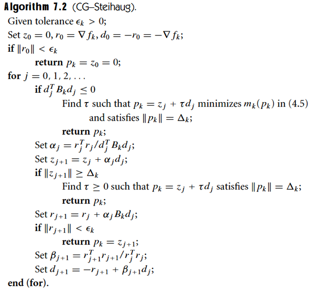
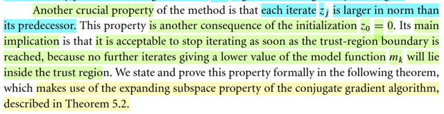
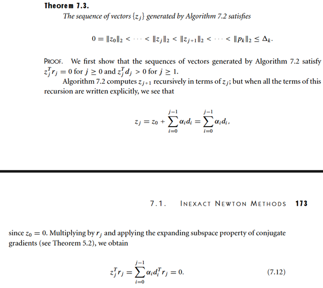
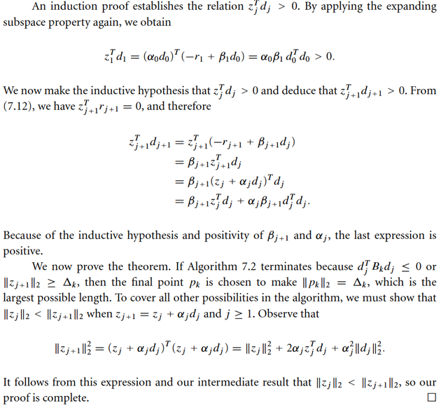
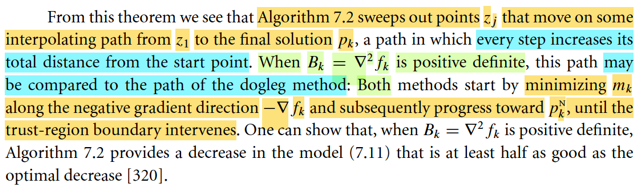
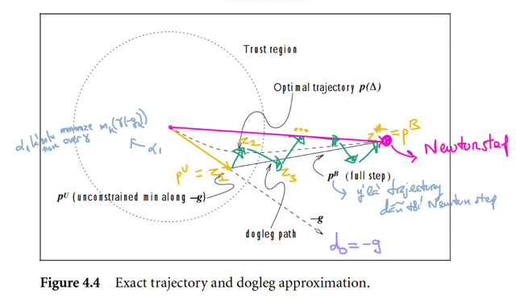
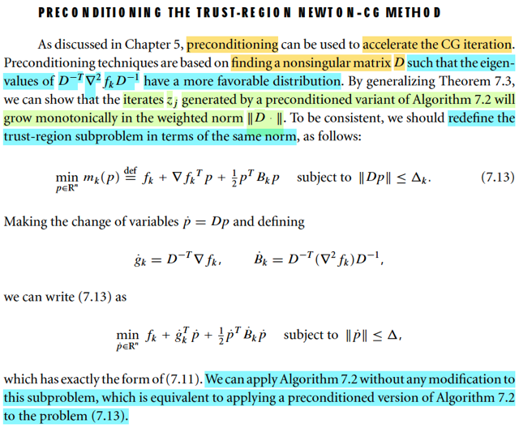

# 7.1 (continue from StudyBoard notebooks)

📊 **Progress:** `6` Notes | `8` Screenshots

---

<kbd></kbd>

<kbd></kbd>

<kbd></kbd>

> [!NOTE]
> Có lẽ nên ôn lại chút xíu về Trust Region Newton CG:
>
> Cơ bản chỉ là ta xét bài toán Trust Region Newton, và dùng CG để giải
> sub-problem:
>
> TRN là ám chỉ trong bài toán sub-problem, ta sẽ dùng Newton direction  cho
> pk.
>
> Và việc dùng CG để giải sub-problem chính là dùng thuật toán CG giúp tìm
> pkN bằng cách giải hệ ∇^2fk pkN = - ∇fk, theo cách iteratively: nói ngắn gọn
> như sau
>
> Ôn nhanh CG cũng như thuật toán 5.2:
>
> Mục đích giải: Ax = b, A xác định dương, ta sẽ coi đây là giải điều kiện cần
> bậc một của bài toán tối ưu hàm số nguyên hàm của Ax - b, tức là hàm f(x) =
> (1/2)xTAx -bTx. Thuật toán đại khái là như sau: Ban đầu ta có x0, và cần đi
> đến x* để thỏa Ax* - b = 0. Chọn p0 = - ∇f(x0) = -Ax0 + b. Thực hiện
> iteratively:
>
> Tính αk, với thuật toán CG, đại khái đây chỉ là giải bài toán minimize hàm
> bậc hai đơn biến, có closed form solution. Thực hiện update tới xk+1 = xk +
> αkpk. Tính pk+1: chính là conjugate wrt A của pk. Ideas chỉ là vậy thôi.
>
> Vậy thì ở đây, cái dễ lú lẫn là kí hiệu.
>
> Vì bài toán cần giải là subproblem: tìm Newton step cho bài toán subproblem
> của thuật toán trust region:
>
> Nói sơ về thuật toán Trust Region:
>
> Cũng là ta sẽ minimize hàm f(x) iteratively
>
> Tại mỗi iteration, thứ k'th ta sẽ giải bài toán subproblem:
>
> Coi hàm f(x) tại k hoạt động như hàm bậc hai: mk(p). Và cùng với trust
> region Δk đã xác định ở iteration trước, ta muốn giải bài toán:
>
> minimize mk(p) = fk + ∇fkTp + (1/2)pT Bk p subject to ||p|| ≤ Δk
>
> (vì đây là Trust Region Newton nên Bk chính là ∇^2fk)
>
> Thế thì, để giải bài toán subproblem, dĩ nhiên ta cũng giải theo lối iterative
> với hai phương pháp đã học trong chap 5: Dogleg và 2D subspace
> minimization. Đều mục đích là tìm ra pk là minimizer của mk(p) s.t ||p|| ≤ Δk.
> thì CG chính là cách thứ
> 3.
>
> Và áp dụng nó vào để giải bài toán subproblem, ta sẽ làm như sau:
>
> Vì thuật toán CG vốn dĩ là giải hệ Ax = b, hay Ax - b = 0. Bằng cách tạo
> chuỗi {xj} đi từ x0 → x1 → ...→ x* sao cho dần dần giảm ||x* - xj|| Nhưng ở
> đây, nó lại phải có constraint. Tức là ta cần giải hệ Bk p = - ∇fk nhưng với
> constraint ||p|| ≤ Δk,
>
> Vấn đề phải hiểu thế này. Việc giải bài toán subproblem là minimize mk(p) s.
> t ||p|| ≤ Δk, về cơ bản đây là bài toán minimize hàm quadratic có inequality
> constraint, ta sẽ thiết lập stationary condition: Gradient của hàm Lagrangian
> = 0, chứ đâu phải là gradient là mk = 0 đâu, có nghĩa là đâu phải là điều kiện
> cần là Ax = b đâu mà lôi CG ra.
>
> Tuy nhiên, cũng chính vì vậy mà mới gọi là modified CG, chỉ lấy cách làm
> của CG, nhưng ko hoàn toàn giống:
>
> Ta sẽ giả sử là không có ràng buộc, và giải hệ Bk p = - ∇fk,
>
> p* đóng vai x*, nên ta sẽ kí hiệu dj, zj đóng vai pk, xj của CG gốc:
>
> Cho z0 = 0, d0 = steepest descent: - (Bk * z0 - ∇fk) = ∇fk
>
> tính α1, cũng là giải bài toán minimize hàm quadratic đơn biến.
>
> tính z1 = z0 + α1d0,
>
> tính d1, là conjugate gradient với d0,
>
> ...
>
> lặp lại, tiếp tục.
>
> Trong quá trình này sẽ đi qua chốt chặn:
>
> zj+1 (= zj + αjdj) (nhớ!: zj ứng với xj của CG gốc, và là thứ sẽ gán cho p để
> trả ra) có khiến ||zj+1|| lớn hơn Δk chưa? → Nếu có thì dừng.
>
> Lúc này, ta mới cơ bản là VẪN LẤY HƯỚNG dj, nhưng khống chế độ dài
> của nó dj) sao cho ||zj+1||= ||zj + τdj|| KHÔNG QUÁ HÀNG RÀO. (gọi là giải
> bài toán minimize zj + τdj). Nó khác với việc ta cứ tính zj+1 = zj + dj rồi cắt
> cụt để norm zj+1 = Δk
>
> (sau đó trust region sẽ đo độ uy tín các kiểu để có quyết định nhảy tới
> không, có tăng / giảm / giữ nguyên trust region không. Chú ý, trust region ko
> có tìm step size gì đâu nhé line search mới tìm step size)
>
> Chốt chặn thứ hai, thật ra sẽ nằm trên chốt chặn thứ nhất: là xem Bk có bị
> xác định âm hay không xác định không, bằng cách check d0Bkd0 ≤ 0. Khi
> đó, đại khái là ta tìm theo hướng d0, như đã biết, chính là steepest descent
> của mk tại điểm ban đầu, sao cho chạm hàng rào. (Thì cái này, chính là
> Cauchy point)
>
> Nếu mọi thứ đều ổn, không bị thoát ở hai cái chốt trên. Và điều kiện dừng
> cuối cùng, tức là z cuối (z*) ko vi phạm ||z*|| ≤ Δk. Thì mình nên hiểu là đó
> cũng ko phải là Newton step. Vì ta sẽ chỉ có Newton step nếu chạy hết n
> iteration để có được p* là solution của Bk p* = - ∇fk. Nhưng người ta sẽ
> không làm vậy, nên dù cho không bị chặn ở hai cái chốt đầu, thì cái ta có
> cũng chỉ là inexact Newton step.
>
> Huống hồ, khả năng là ta sẽ bị chặn ở một trong hai chốt trên. Khi đó, nếu là
> ở chốt thứ nhất: zj+1, ví dụ j = 20, ta có z21, có norm dài hơn Δk, ta sẽ tìm τ
> sao cho ||z20 + τd20|| = Δk (khác với việc ta cắt cụt z21 để ||z21|| = Δk)
>
> Còn nếu nếu bị chặn ở chốt thứ hai: d0Bkd0 ≤ 0. Thì như đã nói trên, đây
> chính là Cauchy point
>
> Ôn nhanh Cauchy point là gì, trong CG gốc: Nó là vầy: Tại x0, lấy hướng
> steepest decent: chính là Ax0-b, và giải bài toán minimize hàm bậc hai đơn
> biến (hàm 1/2xTAx - bTx) nhưng restrict  theo hướng steepest descent và có
> constraint và giải tìm minimizer của nó. Khi đó ta sẽ có hai case, đụng hàng
> rào hoặc nằm trong.
>
> Vấn đề dễ lú là: Trong CG gốc, cái ta giải là Ax - b = 0. và coi như nó là giải
> bài toán minimizer hàm số F(x) = (1/2)xTAx - bTx, mà ∇F(x) = 0 ⇔ Ax - b = 0
> chính là điều kiện cần bậc 1. vài CG giúp giải cái này từ từ. Thành ra nói
> steepest descet tại x0, chính là -∇F(x0) = -Ax0 + b.
>
> Còn trong việc dùng CG giải subproblem. Thì thứ cần giải là Bk p = - ∇fk,
> hay Bk x = - ∇fk. Và cũng chẳng cần phải xem Bk p + ∇fk là gradient của
> hàm nào F nào. Vì F chính là mk(p), là hàm xấp xỉ bậc hai của objective
> function f(x) nguyên thủy. Do đó, chọn d0 là steepest descent direction, thì
> nó chính là -Bkz0 + (-∇fk) = -Bk z0 - ∇fk. Và do chọn z0 = 0, nên là -∇fk.

> [!NOTE]
> Vậy thì quay lại đây, tác giả cho biết một tính chất quan trọng của phương
> pháp này là mỗi iterate **norm zj LUÔN LỚN HƠN cái trước đó zj-1**.
> ({zj},  thứ sẽ converge về z* để gán cho pk (giải Bk pk = - ∇fk), tương ứng
> trong  thuật toán CG  gốc là {xj} converge về x* (giải Ax* = b).
>
> Vậy thì đoạn này đại khái nói là, tính chất này đảm bảo rằng, M**ỘT KHI
> MÀ TA ĐỤNG TRUST REGION**, thì có thể dừng, vì **có iterate thêm thì
> cũng không thể giảm thêm mk trong phạm vi trust region nữa**.
>
> Là sao ta?
>
> Như vừa nói ở note trước, khi giải bài toán subproblem bằng CG, ta cơ
> bản là **dùng CG để giải tìm Newton direction theo lối iteratively**. Mà về
> bản  chất là ta **tìm ra một hướng đi trong vùng tin cậy** sao cho **hướng
> đi đó đủ tốt (inexact Newton step)**. Khi thuật toán chạy cái **giảm dần ở
> trong lúc chạy** CG **norm của error giữa p* với zj** (và cũng là norm giữa
> mk tại p* và mk tại zj).
>
> (Trong thuật toán CG gốc, bản chất là ta minimize hàm quadratic nguyên
> hàm của F(x) = (1/2)xTAx - bTx, nguyên hàm của Ax - b, và mục tiêu là
> giảm  dần ||x* - xj|| cũng là chính là |F(x*) - F(x)| mà trong CG trong
> subproblem  thì zj chính là tương đương với xj)
>
> Thì cái việc **norm zj liên tục lớn dần**, cái sau lớn hơn cái trước  chính là
> ý là **norm của xj cũng lớn dần** trong thuật toán CG gốc, cái sau lớn hơn
> cái trước.
>
> Nhưng trong bối cảnh CG gốc thì ko có ý nghĩa gì đáng nói, nhưng ở đây
> khi  đặt trong bối cảnh có hàng rào bao quanh thì nó có ý nghĩa. Vì điều
> này có nghĩa là **khi chuỗi zj được tạo ra thì mk(j) ngày càng giảm**
> nhưng đồng thời ta cũng **ĐI XA DẦN VỊ TRÍ BAN ĐẦU**: z0 = 0 (tức là
> ngay tại xk). Và do đó, chứng tỏ, nếu đã đụng hàng rào, thì đó là điểm
> giúp đưa mk xuống thấp nhất có thể trong phạm vi cho phép rồi. HÌnh
> dung quỹ đạo là **đường xoắn ốc giảm dần và rộng ra dần**, **thì khi đụng
> biên thì đó là thấp nhất trong phạm vi** cho phép. Đây chính là ý gs
> Nocedal đang nói.

 

<kbd></kbd>

 

<kbd></kbd>

> [!NOTE]
> Theorem 7.3 nói rằng chuỗi {zj}} được sinh ra bởi thuật toán 7.2 sẽ
> luôn thỏa cái sau lớn hơn cái trước về norm.
>
> Phần chứng minh đại ý là vầy:
>
> Đầu tiên trong 7.3, việc cập nhật {zj} theo công thức: zj+1 = zj + αjdj
>
> (Ôn nhanh: d0 là hướng steepest descent, d1, d2... sau đó hướng 
> conjugate wrt matrix Bk với d trước đó. Có dj rồi thì giải bài toán 
> minimize hàm bậc hai đơn biến, là hàm mk restrict theo hướng dj 
> để tìm step size αj)
>
> Thế thì: ||zj+1|| = ||zj + αjdj||
>
> ⇨ ||zj+1||^2 = ||zj + αjdj||^2 = (zj + αjdj)T(zj + αjdj)
>
> = (zjT + αjdjT)(zj + αjdj)
>
> = zjTzj + αjdjTzj + zjTαjdj + αjdjTαjdj
>
> = ||zj||^2 + 2αjdjTzj + αj^2||dj||^2
>
> Đến đây, nếu ta chứng minh được djTzj > 0 thì sẽ chứng minh
> được ||zj+1|| > ||zj|| (1)
>
> Và ta sẽ chứng minh bằng quy nạp: Chứng minh nó đúng với k = 1,
> rồi giả sử đúng với k = j, và chứng ninh nó đúng luôn với k = j+1 thì 
> sẽ có thể kết luận nó đúng với mọi k.
>
> Nhưng trước hết tác giả chứng minh một kết quả để lát sau sẽ dùng:
> đó là zjTrj = 0. Cái này dễ thôi:
>
> Theo công thức update {zj}:
>
> z1 = z0 + α0d0, z2 = z1 + α1d1,....zj = zj-1 + αj-1dj-1
>
> ⇨ thay vào liên tục, ta có: zj = z0 + Σi=0:j-1 αidi
>
> = Σi=0:j-1 αidi (vì theo thuật toán 7.2, z0 được initialized = 0. 
>
> Ta có zj = Σi=0:j-1 αidi, nhân hai vế với rjT:
>
> rjTzj = rjTΣi=0:j-1 αidi = Σi=0:j-1 αi rjTdi
>
> Tới đây, mới xem lại Theorem 5.2, nói nói đại khái là residual tại
> vòng sau, thì luôn vuông góc với mọi direction trước đó (trong thuật
> toán CG gốc, ta sẽ có rkTpi với i = 0,1,...k-1): Cho nên ở đây, ta sẽ
> có rj vuông góc với d0,d1,...dj-1. Nên cái bên phải = 0 ⇨ rjTzj = 0
>
> ------ 
> Quay lại đây, chứng minh quy nạp nói ở trên:
>
> Xét k = 1, d1Tz1 có > 0 không? (z0 = 0 rồi nên ta sẽ chứng minh từ
> k = 1)
>
> d1Tz1 = d1T(z0 + α1d1) = d1Tα1d1 = α1 ||d1||^2 cái này > 0, vì sao?
> vì α1 là step-size, luôn dương (vì sao luôn dương, vì α1 là stepsize tìm
> được bằng cách tối thiểu hóa hàm bậc hai đơn biến mk giới hạn bởi
> d1, mà d1. hay dj luôn là descent direction (nếu ko, tưc djTBkdj ≤ thì 
> thuật toán đã return ở chốt đầu rồi, nên đã qua được chốt đó thì tức là
> djTBkdj > 0. Nên αj = rjTrj / djTBkdj sẽ dương do tử và mẫu dương.
>
> Tiếp, gỉa sử nó đúng với k = j: djTzj > 0
>
> Ta sẽ chứng minh nó đúng với k = j+1: dj+1Tzj+1 > 0
>
> dj+1Tzj+1 = (-rj+1 + βj+1dj)Tzj+1
>
> = -rj+1Tzj+1 + βj+1djTzj+1
>
> = 0 + βj+1djTzj+1 (do đã chứng minh rjTzj = 0, và nó cũng đúng với j+1)
>
> = βj+1 djT(zj + αjdj)
>
> = βj+1djTzj + βj+1djTαjdj
>
> = βj+1djTzj + βj+1αj ||dj||^2
>
> Mà ta đã giả sử djTzj > 0 ⇨ βj+1djTzj > 0 (vì βj+1 = rj+1Trj+1 / rjTrj > 0)
>
> và βj+1αj ||dj||^2 cũng dương nốt.
>
> Vậy chứng minh xong là djTzj > 0 với mọi j ⇨ theo (1), ta đã chứng
> minh xong.

 

<kbd></kbd>

> [!NOTE]
> Ok, nhớ lại về thuật toán Dogleg:
>
> Ideas của nó là như sau:
>
> Nó muốn cải thiện Cauchy points. Cauchy point's story: Đi từ điểm đầu tiên
> x0, theo hướng dốc nhất, ráng đưa mk(p) (giới hạn theo hướng đó) xuống
> thấp nhất trong phạm vi hàng rào. Nó có thể dừng ở trong, hoặc đụng hàng
> rào (Bk xác định âm: đi theo hướng đó sẽ giảm mk vô hạn → đụng hàng
> rào, Bk xác định dương: có thể dừng ở trong hoặc ngoài (đụng hàng rào))
>
> Và ta đã biết vụ Cauchy points là bước nhảy mang lại mức giảm đủ tốt, giúp
> đảm bảo hội tụ toàn cục, đóng vai trò tham chiếu cho các phương pháp
> khác phải  ít nhất là bằng cái này.
>
> Tiếp, mới xét câu chuyện nếu ta cho phạm vi giới hạn tăng từ rất nhỏ đến
> rất rộng. Thì: ở mức nhỏ → hướng Newton cơ bản là trùng hướng dốc nhất.
> Nhưng ở mức lớn, hướng Newton sẽ có thể khác hướng dốc nhất. Nên khi
> đó nếu chỉ một mực dùng hướng dốc nhất, có thể sẽ không lợi ích. Và khi
> mô phỏng việc tăng dần bán kính tin cậy Δ, thì nghiệm của bài toán
> minimize mk với mk dùng Hessian trong Bk, s.t ||p|| ≤ Δ sẽ cho ra / vẽ ra một
> đường cong hình cẳng chó. Và đó là cái quỹ đạo mà ta muốn MEN THEO
> ĐỂ tìm kiếm điểm thấp nhất của mk trong bán kính giới hạn.
>
> Nhưng dĩ nhiên ta ko biết chính xác cái quỹ đạo đó. (vì có cái quỹ đạo đó thì
> cũng đương nhiên là biết p nên bằng gì với Δ cho trước rồi).
>
> Do đó, người ta DỰNG NÊN MỘT XẤP XỈ CỦA QUỸ ĐẠO ĐÓ. Tạo bởi 2
> vector:
>
> pU: là đi theo hướng dốc nhất và tối thiểu hàm mk restrict theo hướng đó
> (tức là pU là γ (-∇fk) với γ là solution của bài toán mininize mk(γ(-∇fk))
>
> pB là hướng Newton: -(Bk)inv ∇fk
>
> Tức là, cái quỹ đạo này sẽ fixed: đầu tiên đi từ 0 → pU. Và sau đó từ pU đi
> theo hướng pB.
>
> Nên phương trình mô tả cái quỹ đạo sẽ là: p~(τ) = pU + (τ - 1) (pB - pU) với
> τ từ 1 → 2.
>
> Từ đó ta sẽ giải bài toán: minimize hàm mk(p) restrict theo quỹ đạo này.
> Giống như ta minimize hàm mk restrict theo hướng steepest, thì nay sẽ là
> restricted theo quỹ đạo này.
>
> Nhưng thật ra ta ko cần giải bài toán này. vì đã có theorem chứng minh
> rằng ĐI THEO QUỸ ĐẠO NÀY THÌ HÀM mk SẼ GIẢM LIÊN TỤC. Do đó bài
> toán  CHỈ ĐƠN GIẢN LÀ TRỞ THÀNH TÌM ĐIỂM XA NHẤT TRÊN QUỸ
> ĐẠO NÀY TRONG PHẠM VI HÀNG RÀO.
>
> Do đó, nếu điểm cuối của hành trình (τ = 2) vẫn trong hàng rào, thì p~* = pU
> + (2-1)(pB - pU) = pB (tức là ta sẽ rất đẹp, lấy luôn Newton step)
>
> còn không thì giải tìm giao điểm của quỹ đạo với hàng rào.
>
> Đó chính là Dogleg algorithm.
>
> ------
>
> VẬY THÌ TẠI SAO CHỖ NÀY GS NÓI THUẬT TOÁN 7.2 CÓ THỂ COI NHƯ
> LÀ GIỐNG GIỐNG DOGLEG:
>
> À thì bởi vì, 7.2 nó cũng
>
> a) BẮT ĐẦU BỞI HƯỚNG DỐC NHẤT: d0 là hướng dốc nhất tại điểm xuất
> phát. Và ta sẽ đi theo hướng đó để giảm mk xuống thấp nhất trong phạm vi
> hàng rao. À, NHƯ VẬY, Y NHƯ pU Ở TRÊN VỪA ÔN LẠI.
>
> b) SAU ĐÓ, các chuỗi d1,d2,...sẽ NHẰM MỤC TIÊU LÀ TẠO z1,z2,....
> converge về z*, hay p* = - Bkinv ∇fk À. NHƯ VẬY, khá tương đương việc
> Dogleg sẽ tiếp tục  đi từ pU theo hướng pB (Newton step), với 7.2 sẽ tạo
> một chuỗi các hướng mà tổng hợp lại cũng dẫn ta đến xấp xỉ pB.
>
> SO SÁNH:
>
> Dogleg: pU → pB (Newton step)
>
> 7.2: z1 cơ bản chính là pU → z1,z2,.. hội tụ về Newton step.

 

<kbd></kbd>

 

<kbd></kbd>

> [!NOTE]
> Qua phần nói về Preconditioning đối với phương pháp Trust-Region Newton CG:
>
> Nhớ lại chút xíu về Preconditioning của CG: Đại ý ta còn nhớ, trong chương về CG, có
> nói, khi phân phối của trị riêng của matrix A có tính chất đặc biệt nào đó, ví dụ như: Tụ
> lại tại một vài cụm, thì khi đó, CG sẽ có thể giải ra  nhanh hơn nhiều (thay vì at most
> trong n step của CG gốc).
>
> Do đó, kĩ thuật Preconditioning là nhằm dùng một matrix D nào đó khiến biến đổi bài
> toán chuyển sang tọa độ với basis mới, thì trong đó matrix hệ số  sẽ có tính chất tốt
> hơn này, như vậy sẽ khiến thuật toán CG hội tụ nhanh hơn.
>
> Vậy thì ở đây cũng chính là nói về cái này. Có điều, vì ở đây, là ta đang dùng CG để
> giải bài toán subproblem của Trust Region Newton, nên khác với CG gốc - giải bài toán
> tối ưu hàm F(x) = (1/2)xTAx - bTx, không có ràng buộc, thì ở đây, ta giải bài toán tối ưu
> hàm mk(p) = (1/2)pTBkp + ∇fkTp + fk có ràng buộc ||p|| ≤ Δk
>
> Đây cũng là lúc nên ôn lại để giúp hiểu hơn:
>
> Ý tưởng như trên nói, là dùng matrix full rank C để đổi biến, chuyển sang bài toán tối
> ưu tương đương (equivalent problem) có matrix hệ số có phân phối trị riêng tốt hơn.
>
> Khi đặt x^ = Cx, suy ra x = Cinvx^
>
> thì thay x vào hàm mục tiêu của bài toán gốc, đang là: f(x) = (1/2)xTAx - bTx,  nó sẽ trở
> thành (1/2) (Cinvx^)TACinvx^ - bT(Cinvx^), đây là hàm theo x^, đặt là f~(x^).
>
> Sắp xếp lại, f~(x^) = (1/2)x^T CinvTACinv x^ - bTCinv x^
>
> = (1/2)x^T CinvTACinv x^ - (CinvTb)T x^
>
> Thế thì đến đây, mình nghĩ là cần phải nói rõ ta đang làm gì, và vì sao được phép đổi
> biến, cơ sở nào cho phép làm vậy.
>
> Cốt lõi vấn đề là ta đang muốn giải hệ Ax = b, chỉ là ta nhìn nhận nó như  việc giải Ax -
> b = 0, với Ax - b là đạo hàm của một hàm số f nào đó, từ đó thấy việc đang làm chính là giải điều
> kiện cần tối ưu bậc nhất: ∇f(x) = 0.
>
> Thay x = Cinv x^, Ax = b trở thành A Cinv x^ = b. Nhân hai vế cho CinvT, phương trình
> sẽ tương đương với CinvTACinv x^ = CinvTb, và từ đó nếu coi đây là phương trình
> điều kiện cần tối ưu bậc nhất thì cái hàm số theo x^ chính là (1/2)x^T CinvTACinv x^ -
> (CinvTb)T x^ có đạo hàm là CinvTACinv x^ - CinvTb.
>
> Do đó giải ra x^* thỏa CinvTACinv x^ = CinvTb, giúp minimize hàm f^(x^) thì Cinv x^*
> sẽ thõa Ax = b, giúp minimize hàm f(x).
>
> -----
>
> Thế thì, làm gì tiếp? Thì trước tiên cần nhớ lại thuật toán CG gốc làm gì:
>
> Bước đầu, ta đứng tại x0, có residual r0 = Ax0 - b. Ta sẽ chọn p0 là steepest descent
> direction: p0 = - ∇f(x0) = - (Ax0 - b) = - Ax0 + b.
>
> vòng lặp đầu tiên:
>
> Tìm step size α1 bằng cách giải bài toán tối ưu hàm bậc hai đơn biến: f(x) restricted to
> hướng p0: f(x0 + αp0).
>
> Đi đến x1: x1 = x0 + α0p0
>
> Tính residual tại x1: r1 = Ax1 - b
>
> Chuẩn bị p1: bắt đầu từ đây, p sau sẽ là hướng conjugate wrt matrix A với p trước:
> pk+1TApk = 0
>
> Và công thức để làm được việc này là:
>
> Công thức tính β1, và p1 = -r1 + β1p0
>
> Qua vòng lặp hai, lặp lại như vậy.
>
> -----
>
> Vậy thì, nếu áp dụng vào bài toán đã đổi biến, tức là ta phải làm gì:
>
> → Chỉ là thay x bằng x^, thay A bằng A^ = (Cinv)TACinv, thay b bằng CinvTb.
>
> Để rồi thuật toán sẽ là:
>
> Bắt đầu tại x^0 nào đó. Có residual r^0 = A^x^0 - b^. Chọn p^0 = -∇f^(x^0) = - A^x^0 + b^
>
> Vòng lặp thứ nhất:
>
> Giải bài toán minimize hàm bậc hai đơn biến f^(x^0 + α^p^0) tính α^0,
>
> Đi đến x^1, x^1 = x^0 + α^0p^0
>
> Tính residual tại đây: r^1 = A^x^1 - b^
>
> Chuẩn bị hướng p^1: là conjugate wrt matrix A^ của p^0: p^1TA^p^0 = 0
>
> Và sẽ làm bằng cách tính β^1 trước, rồi tính p^1 = - r^1 + β^1p^0.
>
> Qua vòng lập tiếp theo.
>
> -----
>
> Vài nhận xét, matrix hệ số A^ = CinvTACinv. Nó sẽ vẫn xác định dương. Và sẽ có phân
> phối trị riêng tốt nếu chọn C khéo léo, thì từ đó, thuật toán CG sẽ hội tụ nhanh hơn
> bình thường (vốn đã nhanh - O(n), vì như đã biết, lí thuyết nói nó chỉ tốn nhiều nhất n
> bước)
>
> Có thể hỏi, vì sao A^ xác định dương? → Xét quadratic form: zTCinvTACinvz, Thì dễ
> thấy vì C full rank, nên N(Cinv) = {zero vector} do đó với mọi z khác 0, Cinvz khác 0.
> Và vì A xác định dương nên (zTCinv)A(Cinvz) cũng sẽ dương với mọi Cinvz khác 0. Từ
> đó ta có zTA^z dương với mọi z khác 0 giúp kết luận nó xác định dương.
>
> -----
>
> Vấn đề là: Ta sẽ phải đi tính A^ = (Cinv)TACinv, b^ = CinvTb. Để là vậy ta sẽ phải tốn
> chi phí ở: Tìm Cinv, và nhân (Cinv)TACinv, đều là những phép tính tốn kém.
>
> Đây là cái mà gs Nocedal gọi là cách làm tường minh "explicitly", và không cần, không
> nên làm vậy vì chi phí của việc này sẽ làm lợi ích của precondition mất đi.
>
> Nên câu hỏi đặt ra là làm sao precondition nhưng ko cần tính Cinv.
>
> -----
>
> Thế thì để hiểu bản chất vì sao  ta phải tính A^, b^ đó là vì: Mình đang giải bài toán
> trong một hệ tọa độ khác: Là hệ tọa độ basis c's:
>
> Khi đặt x^ = Cx thì tọa độ của x trong basis e's, sẽ chuyển sang tọa độ trong basis cinv'
> s (các cột của Cinv): Vì sao?
>
> Để hiểu ý này, nhớ lại Change of basis matrix, đầu tiên xuất phát từ cách xây dựng
> matrix A đại diện cho phép biến đổi tuyến tính
>
> Biến đổi các basis của input space v's bởi phép biến đổi tuyến tính T(.):
>
> để có T(v1), T(v2),..
>
> Thể hiện nó bởi các output space basis w's:
>
> T(v1) = a11 w1 + a21 w2 + ... = W [a11, a21,..]T = W a1 (đặt a1 = a11, a21,..]T
>
> T(v2) = a12 w1 + a22 w2 + ... = W [a12, a22,..]T = W a2 (đặt a2 = a12, a22,..]T
>
> ...
>
> ⇨ [T(v1), T(v2),..] = W [a1, a2, ...]
>
> Thì matrix A chính là: Các cột của nó chính là các tọa độ của T(vi) trong basis w's: [a1,
> a2..]
>
> ⇨ [T(v1), T(v2),..] = W A
>
> ⇨ A = Winv [T(v1), T(v2),..]
>
> Và một vector u = (u1, u2,...) trong basis v's: Σi ui vi. Khi biến đổi bởi T(.) và thể hiện
> trong tọa độ u' s:
>
> Ta sẽ chỉ ra T(u) = Au trong tọa độ w's, tức = (Au)_1 w1 + (Au)_2 w2 + ..
>
> = W Au
>
> Thế thì T(u):
>
> = T(u1v1 + u2v2 + ..)
>
> = u1 T(v1) + u2 T(v2) + ..
>
> = u1 W a1 + u2 W a2 + ..
>
> = u1 (a11 w1 + a21 w2 + ..) + u2 (a12 w1 + a22 w2 + ...)
>
> = (u1 a11 + u2 a12 + ..) w1 + (u1 a21 + u2 a22 + ..) w2 + ...
>
> = (A's row 1)Tu w1 + (A's row 2)Tu w2 + ..
>
> = W [(A's row 1)Tu, (A's row 2)Tu]T
>
> = W Au → Chứng minh xong, cho thấy đúng là A chính là matrix đại diện cho T(v)
>
> -----
>
> Vậy thì bây giờ, nếu T(v) là phép biến đổi identity: T(v) = v, thì khi đó:
>
> [T(v1), T(v2),...] chỉ là [v1, v2,..], đặt là V ⇨ A = Winv V
>
> Và nếu như v's là e's tức input basis là standard basis, thì V chính là I, và ta sẽ có
> matrix giúp đổi tọa độ từ basis e's sang basis w's đơn giản là A = Winv.
>
> Do đó, khi đặt x^ = Cx = (Cinv)inv x thì ta đang đổi tọa độ từ **basis e's sang tọa độ
> của basis cinv' s**, tức là các **cột của Cinv**. (ko phải là của C nhé)
>
> -----
>
> Quay lại đây, ta đang nói bản chất vì sao ta phải tính A^, b^ đó là vì: Mình đang giải bài
> toán trong một hệ tọa độ khác: Là hệ tọa độ basis cinv's.
>
> Thế thì, trong gian hệ tọa độ đó, ta cũng sẽ đi theo một chuỗi điểm x^0 → x^1 → ...để
> đến x^* và điểm này sẽ tương ứng với x* trong tọa độ e's. Nói cách khác, khi có x*^, ta
> sẽ chuyển nó sang lại tọa độ e's bằng cách nhân với change of basis từ basis cinv's
> (chú ý, basis cinv's, ko phải c's) sang basis e's:
>
> (I)inv Cinv = Cinv, tức là x* = Cinv x^*.
>
> Nó giúp ta hiểu sâu hơn bản chất: CHUYỂN SANG HỆ TỌA ĐỘ BASIS cinv'a, TRONG
> ĐÓ BÀI TOÁN CÓ MATRIX HỆ SỐ TỐT HƠN → HỘI TỤ NHANH HƠN → KHI CÓ
> KẾT QỦA, x^*, CHUYỂN NÓ VỀ LẠI TỌA ĐỘ BASIS e's ĐỂ CÓ x*.
>
> Thế thì, từ việc hiểu bản chất này, ta sẽ hiểu ý tưởng của việc né cái vụ làm tường
> minh như sau: TÌM VÌ VẤN ĐỀ TÍNH Cinv CƠ BẢN CHỈ LÀ GIÚP CHUYỂN TỌA ĐỘ
> QUA LẠI GIỮA HAI CƠ SỞ e' s và cinv's nên ta sẽ tìm cách TẠO RA CHUỖI x^1,x^2...
> NHƯNG TRONG TỌA ĐỘ e's LUÔN.
>
> Để hình dung sự bất cập của việc làm Tường minh (Explicitly):
>
> Nếu làm tường minh, thuật toán sẽ chạy vòng vèo như một chuyến đi vô cùng cồng
> kềnh:
>
> Ta đang đứng ở nhà (trong hệ tọa độ basis e's).
>
> Ta tốn một đống chi phí "mua vé" (tính ma trận C) để bay sang không gian mới (hệ tọa
> độ basis cinv's).
>
> Ở không gian đó, ta bước từ x^0 → x^1 → ... → x^* (nhảy thuật toán CG rất nhanh vì
> ma trận hệ số bên đó có phân phối trị riêng tụ lại, đường siêu dễ đi).
>
> Xong việc, ta lại tốn thêm chi phí "mua vé khứ hồi" (tính Cinv) để dịch điểm đích x^* đó
> về lại nhà (trở thành x* trong tọa độ e's).
>
> → HỆ QUẢ: Việc phải trực tiếp đi tính toán các ma trận C, Cinv, A^, b^ chính là "chi phí
> vé khứ hồi" vô cùng đắt đỏ và lãng phí (phép tính tốn kém).
>
> -----
>
> Vậy cụ thể là làm thế nào? Hay thuật toán PCG là gì?
>
> Đại khái là vầy:
>
> Cách làm: Là ta cứ bám sát vào thuật toán "naive" PCG: Nhưng sẽ tìm cách để thể hiện
> các kết quả bằng basis e's, thay vì basis cinv's: 
>
> Theo naive CG, như đã biết:
>
> Ban đầu đứng ở x^0 = Cinv x0. Residual r^0 = A^x^0 - b^. Chọn p^0 = -∇f^(x^0) = - A^x^0 + b^
>
> Vòng lặp thứ k, thuật toán CG:
>
> i) α^k = r^kTr^k / p^kTA^p^k 
>
> ii) x^k+1 = x^k + α^kp^k
>
> iii) r^k+1 = r^k + α^kA^p^k 
>
> iv) β^k+1 = r^k+1Tr^k+1 / r^kTr^k
>
> v) p^k+1 = -r^k+1 + β^k+1p^k
>
> Làm như sau:
>
> x^ là tọa độ trong basis cinv's thì tọa độ trong basis e's của nó là x = Cinv x^ ⇨ x^ = Cx
> → Ta sẽ thay x^ = Cx
>
> r^ = A^x^ - b^ = CinvTACinvCx - CinvTb = CinvTAx - CinvTb = CinvT(Ax - b) = CinvTr
> → Ta sẽ thay r^k = CinvTrk
>
> p^ sẽ cũng = Cp. Nhưng ta nên lập luận từ α^k p^k = x^k+1 - x^k
>
> ⇨ Cxk+1 - Cxk = C(xk+1 - xk) = C αk pk ⇨ p^k = C pk (αk / α^k) = Cpk (xem ý sau) 
>
> → Ta sẽ thay p^k bằng Cp
>
> α^k = r^kTr^k / p^kTA^p^k, nhưng bản chất nó chỉ là scalar. Nên thể hiện con số vô hướng này
> trong basis nào thì nó cũng là chính nó, tức là α^k cũng là phiên bản thể hiện trong basis e's 
> của nó: αk ⇨ α^k = αk 
>
> Chú ý, nhắc lại rằng cơ bản những gì ta sẽ là chỉ là, thể hiện các kết quả của thuật toán
> PCG tường minh theo basis e's. Và như vậy có nghĩa là CHUỖI xj Ở ĐÂY CHỈ LÀ TỌA ĐỘ
> CỦA CÁC ĐIỂM TẠO BỞI THUẬT TOÁN PCG NHƯNG THỂ HIỆN THEO BASIS e's. NÓ HOÀN
> TOÀN KHÔNG PHẢI LÀ CÁC ĐIỂM xj  TẠO BỞI CG. (DÙ ĐIỂM CUỐI x* THÌ CÓ THỂ TRÙNG)
>
> TƯƠNG TỰ NHƯ VẬY, pk Ở ĐÂY, LÀ HƯỚNG KHÁC SO VỚI pk của CG, VÌ NÓ LÀ ĐƯỜNG
> ĐI CỦA PCG TƯỜNG MINH.
>
> Rồi, thế vào ta sẽ có: 
>
> i) α^k trở thành αk = (CinvTrk)TCinvTrk / (Cpk)TCinvTACinvCpk
>
> = rkTCinvCinvTrk / pkTCTCinvTACinvCpk
>
> = rkTCinvCinvTrk / pkT(CinvC)TACinvCpk 
>
> = rkTCinvCinvTrk / pkTApk 
>
> = rkTMinvrk / pkTApk (đặt Minv=CinvCinvT). 
>
> ii) x^k+1 = x^k + α^kp^k trở thành:
>
> Cxk+1 = Cxk + αkCpk ⇨ xk+1 = xk + αkpk
>
> iii) r^k+1 = r^k + α^kA^p^k trở thành:
>
> CinvTrk+1 = CinvTrk + αkCinvTACinvCpk 
>
> ⇔ CinvTrk+1 = CinvTrk + αkCinvTApk
>
> ⇔ rk+1 = rk + αkApk 
>
> iv) β^k+1 = r^k+1Tr^k+1 / r^kTr^k trở thành
>
> βk = (CinvTrk+1)TCinvTrk+1 / (CinvTrk)TCinvTrk
>
> ⇔ βk = rk+1TCinvCinvTrk+1 / rkTCinvCinvTrk
>
> = rk+1TMinv rk+1 / rkTMinv rk
>
> v) p^k+1 = -r^k+1 + β^k+1p^k trở thành
>
> Cpk = -CinvTrk+1 + βk+1 Cpk
>
> ⇔ pk = -CinvCinvTrk+1 + βk+1 CinvCpk
>
> ⇔ pk = -Minv rk+1 + βk+1 pk
>
> Tổng hợp lại các bước:
>
> i) αk = rkTMinvrk / pkTApk (đặt Minv=CinvCinvT). 
>
> ii) xk+1 = xk + αkpk
>
> iii) rk+1 = rk + αkApk 
>
> iv) βk rk+1TMinv rk+1 / rkTMinv rk
>
> v) pk = -Minv rk+1 + βk+1 pk
>
> Và từ đó thuật toán sẽ cần thêm việc tính Minv: = CinvCinvT
>
> Vấn đề là cái mà ta thấy dính với Minv chính là Minv r (Minv rk hay Minv rk+1)
>
> Nên nếu đặt y = Minv r ⇨ My = r. Khi đó, nếu ta giải ra y là nghiệm của hệ My = r, cũng là 
> (CinvCinvT)inv y = y cũng là CTC y = r. Và giải đủ nhanh, thì sau khi có y, thì ta có thể thay
> vào các vị trính cần Minv r, từ đó ta có **THUẬT TOÁN PCG HOÀN CHỈNH**:
>
> Giải M yk = rk để có yk (chính là Minv rk) Nhưng thực ra không cần, vì đây là yk có từ iteration
> trước.
>
> i) αk = rkTyk / pkTApk (chính là rkTMinvrk / pkTApk)
>
> ii) xk+1 = xk + αkpk
>
> iii) rk+1 = rk + αkApk 
>
> Giải M yk+1 = rk+1 để có yk+1 (chính là Minv rk+1)
>
> iv) βk = rk+1Tyk+1 / rkTyk (chính là rk+1TMinv rk+1 / rkTMinv rk
>
> v) pk = -yk+1 + βk+1 pk (chính là -Minv rk+1 + βk+1 pk)

> [!NOTE]
> Thế thì vừa rồi là mình ôn lại về thuật toán PCG. Quay lại đây, đại ý là để CG có thể
> giải bài toán subproblem nhanh hơn, ta cũng có thể áp dụng PCG vào. Và mình hiểu
> điều đó đồng nghĩa là ta sẽ dùng matrix full rank C để đổi biến, chuyển tọa độ sang
> hệ basis cinv's khiến matrix hệ số có phân phối trị riêng tốt hơn.
>
> Thế thì, nhắc lại một chút, trong bài toán subproblem, ta muốn giải hệ Bk p = -∇fk
>
> Tương ứng với minimize hàm mk(p) = (1/2)pT Bk p + ∇fkTp (+ fk nhưng  constant nên
> ta ko care). Có điều, cần có thêm constraint ||p|| ≤ Δk
>
> Thế thì, nếu dùng matrix C, hay ở đây, ta dùng kí hiệu D, để đổi biến thì tương tự như
> khi dùng C để đổi biến x^ = C x, khiến ta sẽ chuyển từ việc deal với bài toán minimize
> f(x) = (1/2)xTAx - bTx để giải tìm x* thỏa Ax* = b sang bài toán minimize f^(x^) =
> (1/2)x^A^x^ - b^Tx^ với A^ = CinvTACinv và b^ = CinvTb.
>
> Thì ở đây khi dùng D để đổi biến p^ = D p, ta cũng sẽ chuyển từ việc deal với bài
> toán minimize mk(p) = (1/2)pTBkp + ∇fkTp  sang bài toán minimize mk^(p^) =
> (1/2)p^TBk^p^
> + ∇fk^Tp^
>
> Với Bk^p = DinvT Bk Dinv, ∇fk^ = DinvT ∇fk
>
> Và nếu như vừa ôn lại bản chất của PCG, thì đây chính là việc VỀ LÍ THUYẾT
> THUẬT TOÁN  TẠO CHUỖI z^1, z^2,... ĐỂ ĐI TỚI z^* NHANH HƠN (giống như trong
> note trước, ta tạo chuỗi x^k đi đến x^*).
>
> Và các direction sẽ là d^1, d^2,....(tương ứng với trong note trước là p^k)
>
> VÀ KHI CÓ z^* (tức là p^*) rồi,  THÌ DÙNG D ĐỂ DỊCH VỀ LẠI p*: p* = Dinv p^*.  VÀ
> VỀ THỰC HÀNH THÌ TA SẼ KHÔNG LÀM THEO LỐI TƯỜNG MINH MÀ SẼ TẠO
> CÁC ĐIỂM NÀY TRONG TỌA ĐỘ e'S LUÔN (CÁI NOTE DÀI VỪA RỒI CHÍNH LÀ
> NÓI CÁI VỤ NÀY)
>
> Tuy nhiên, VẤN ĐỂ LÀ Ở CHỖ: TA ĐANG DÙNG CG TRONG SUBPROBLEM CỦA
> TRUST REGION. nên nó có cái constraint ||p|| ≤ Δk
>
> Thế thì ĐIỀU QUAN TRỌNG CẦN HIỂU: CONSTRAINT NÀY LÀ CONSTRAINT ĐỐI
> VỚI VECTOR p* **TRONG BASIS e's**.
>
> Có nghĩa LÀ : Ta muốn tìm p* là minimizer của hàm mk(p), và **norm của nó phải nhỏ
> hơn Δk**. Thế thì khi ông "làm", thì để cho nhanh, ta có thể đổi biến, đặt p^ = Dp để đi
> giải bài toán minimize m^k(p^). Để rồi về cơ bản là nó tạo chuỗi z^j hội tụ về z^* (tức
> p^*) nhanh hơn là chuỗi zj hội tụ về z* (tức p*)
>
> Nhưng constraint là: vẫn phải đảm bảo khi tìm thấy  minimizer, là p^* có tọa độ trong
> basis gì đó, thì chuyển về basis e's, để có p* , thì norm của nó phải < Δk. CHỨ KO
> PHẢI LÀ TA CHUYỂN SANG BASIS GÌ ĐÓ, RỒI TA ÁP CONSTRAINT THÀNH ra
> ||p^*|| < Δ.
>
> Do đó, bài toán đổi biến sẽ là:
>
> minimize m^k(p^) = (1/2)p^TBk^p^ + ∇fk^Tp^ s.t VẪN LÀ ||p|| ≤ Δk, TƯƠNG ĐƯƠNG
> ||Dinv p^|| ≤ Δk
>
> (chứ ko phải là ||p^|| ≤ Δ)
>
> TUY NHIÊN, LÚC NÀY, CÁI CONSTRAINT TRONG KHÔNG GIAN BIẾN ĐỔI TRỞ
> THÀNH HÌNH ELLIPSE. VÀ THUẬT TOÁN 7.2 KO GIẢI ĐƯỢC, VÌ NÓ CHỈ GIẢI BÀI
> TOÁN MÀ TRUST REGION LÀ HÌNH TRÒN.
>
> DO ĐÓ, NGƯỜI TA SẼ ĐỔI CONSTRAINT CỦA BÀI TOÁN GỐC TRƯỚC: THAY ||p||
> ≤ Δk THÀNH ||D p|| ≤ Δ.
>
> Khi đó, constraint của bài toán đổi biến sẽ trở thành ||D Dinv p^|| ≤ Δk ⇔ ||p^|| ≤ Δk và
> trust region trong bài toán trong tọa độ basis dinv's LẠI TRỞ THÀNH HÌNH TRÒN
> TRỞ LẠI.
>
> Và như vậy, thì lại CÓ THỂ giải nó với thuật toán 7.2.
>
> VÀ TỪ ĐÓ MÌNH HIỂU SÂU HƠN THẾ NÀY:
>
> MÌNH ĐANG HIỂU THEO GÓC NHÌN KHÁC, GS NOCEDAL GÓC NHÌN KHÁC,
> NHƯNG CÙNG LÀ 1 VẤN ĐỀ.
>
> Mình: Đổi biế**n**, để đưa về bài toán mà TRONG KHÔNG GIAN ĐÓ, MATRIX HỆ
> SỐ CÓ PHÂN PHỐI TRỊ RIÊNG TỐT, giúp CG chạy nhanh hơn. Cái này thì hiểu rồi,
> nhưng kẹt là trust region lúc này ko còn là hình tròn, ko giải được bởi 7.2 nữa. Phải
> CHỈNH LẠI CONSTRAINT, để hàng rào trong bài toán đổi biến trở lại thành tròn → gỉai được
> bởi 7.2
>
> Gs Nocedal: Bằng cách đổi constraint trong bài toán gốc thành hình elip thì bằng
> cách đổi biến để chuyển về không gian mà ở đó trust region là hình tròn, thì thật ra ta
> đang giải bài toán đổi biến.
>
> Dĩ nhiên hai cái đều cùng 1 vấn đề thôi.

 

