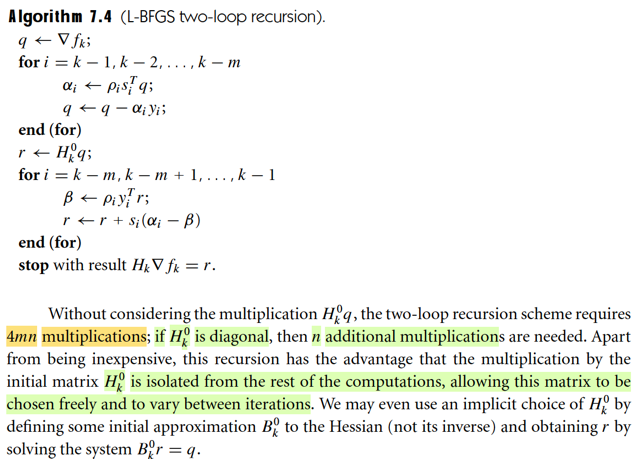
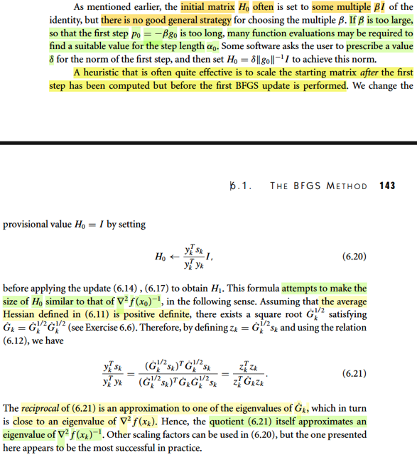
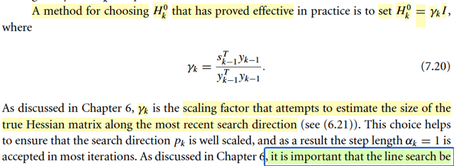
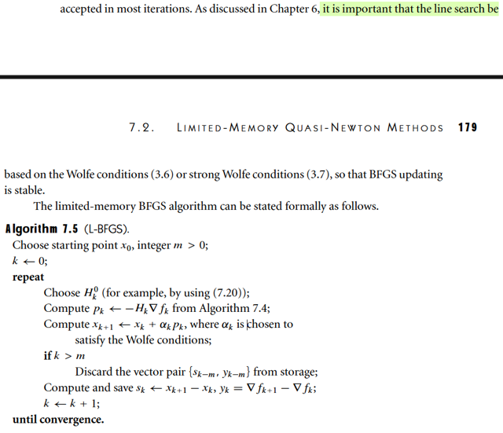

# 7.2 Limited-Memory Quasi-Newton Methods

📊 **Progress:** `9` Notes | `9` Screenshots

---

<kbd></kbd>

> [!NOTE]
> Đại khái là nói về việc phần này sẽ xét những thuật toán hữu ích khi gặp
> những  bài toán tính Hessian quá tốn kém. Khi đó ý tưởng là, ta sẽ chỉ
> lưu trữ một phiên bản xấp xỉ của Hessian nhưng chỉ bằng cách lưu trữ vài
> vector thôi.
>
> Có nhiều biến thể, nhưng cái ta sẽ bàn là L-BFGS, là biến thể được dựa
> trên cách làm của BFGS. Mà ý tưởng là ta sẽ chỉ dùng các thông tin về
> độ cong của các iteration gần nhất, bỏ đi thông tin của các iteration xa hơn.
> Từ đó tiết kiệm chi phí lưu trữ.

 

<kbd></kbd>

 

<kbd></kbd>

> [!NOTE]
> Đầu tiên là ôn lại chút về BFGS.
>
> Thì mình còn nhớ đại ý là vầy:
>
> Ý tưởng chính, đó ta muốn dùng Newton step để làm hướng đi
>
> Ý là, trong quá trình tạo chuỗi điểm {xi} thì ta muốn dùng Newton step pkN để đi
> từ xk đến xk+1. Dĩ nhiên với Newton step, ta không cần phải tính step-size.
>
> xk+1 = xk + pkN
>
> Mà pkN thì biết rồi, = -(∇^2fk)inv ∇fk, công thức này xuất xứ từ việc: tại iteration
> k ta xấp xỉ hàm f bởi quadratic approximation của nó mk(p) = fk + ∇fkTp +
> (1/2)pT∇^2fkp và từ đó, giải bài toán minimize hàm mk(p), dùng điều kiện cần
> bậc nhất:
>
> ∇mk(p) = 0 ⇔ ∇^2fk p + ∇fk = 0
>
> ⇔ p = - (∇^2fk) ∇fk, chính là công thức Newton step.
>
> Nói chung cái mô tuýp này (dùng hàm mk(p) là xấp xỉ bậc hai của hàm f tại xk)
> để tìm hướng đi tại iteration k, là giống nhau ở cả Line Search, Trust Region, ...
>
> Ví dụ như với Line Search, thì tại mỗi iteration, ta cũng minimize mk(p), thì ta có
> thể dùng steepest descent direction, hoặc dùng luôn Newton step, nhưng kể cả
> khi dùng Newton step, ta lại line search để tìm step size chứ không dùng full
> step.
>
> Còn với Trust Region, thì cũng minimize mk(p), nhưng có điều có thêm
> constraint ||p|| ≤ Δk.
>
> BFGS, mình hiểu nó sẽ là thuật toán nhằm mục đích là làm giả
> Newton step để dùng, phục vụ cho bước di chuyển xk → xk+1. Hay mình hiểu
> đơn giản hơn, nó chính là Newton method nhưng làm giả Hessian step để tính
>  thay vì dùng Hessian thật. 
>
> Cái này khác với inexact Newton: Trong đó, ta cố tình tìm Newton step nhưng
> dùng thuật toán lặp (CG).
>
> Có nghĩa là tất cả các thuật toán đều cơ bản là đi từng bước nhưng khác nhau
> ở chỗ chọn step size thế nào (Line Search vs Trust Region) và nếu dùng Newton
> direction thì tính Newton step thế nào (quasi Newton và inexact Newton)

> [!NOTE]
> Thế thì ôn lại cái BFGS, là một quasi-Newton, ý tưởng chính của nó là
> vầy:  Để tính pkN = -(∇^2fk)inv ∇fk, thì thay vì dùng Hessian thật ta sẽ
> dùng một  matrix Bk xấp xỉ của Hessian.
>
> Và ý tưởng cốt lõi để có Bk: Ta sẽ cập nhật nó từ từ, liên tục sau mỗi vòng
> lặp bởi thông tin curvature của vòng lặp trước đó.
>
> Và câu chuyện sẽ là như sau:
>
> Giả sử mình đã đi từ xk → xk+1. Thì mình sẽ dùng thông tin độ cong có
> được để cập nhật Bk, (nói cách khác là tính lại Bk+1). Dùng thế nào, hay
> cập nhật thế nào: Đó là ta sẽ đặt điều kiện cho Bk+1 sao cho mk+1(p)
> (xấp xỉ bậc hai của f tại xk+1: fk+1 + ∇fk+1Tp + (1/2)pT Bk+1 p) phải tính
> được  chính xác độ dốc hàm f tại xk. Thì hành động này, hay điều kiện
> này cũng chính là ép Bk+1 phải chứa thông tin curvature của hàm số khi
> đi từ xk đến xk+1. Và từ đó ta sẽ có cái gọi là secant equation.
>
> Rồi, sau đó, đại khái là từ đó nó sẽ đẻ ra thêm một ý là, để tồn tại nghiệm
> của secant equation, thì ta cần đảm bảo điều kiện skTyk > 0, gọi là
> curvature condition. Và có thể chứng minh với step-size thỏa Wolfe
> condition thì cái này sẽ thỏa, giúp đảm bảo secant equation sẽ có nghiệm.
>
> Tuy nhiên, ta cần áp thêm điều kiện nữa, vì secant equation có thể có vô
> số nghiệm Bk thỏa. Và điều kiện đó chính là, Bk nên giống với Bk-1 nhất.
> Và vì vài nguyên nhân, người ta dùng một loại weighted norm nào đó, để
> dùng trong tiêu chí "gần nhất" này.
>
> từ đó ta có điều kiện hoàn chỉnh của Bk:
>
> minimize_B ||B - Bk|| s.t B thỏa secant equation, và B đối xứng. với norm
> là  ||.||W với W đặc biệt nào đó được chọn để giúp mang lại tính scale
> invariance.
>
> Và giải bài toán này ta sẽ derive ra công thức cập nhật Bk+1 từ Bk.
>
> Nói chung đó cơ bản là ý tưởng chính của BFGS, nhưng sau đó có thêm
> vài bước cải tiến: Đó là thay vì tạo ra công thức để cập nhật Bk, ta sẽ
> dùng một công thức biến đổi, để tạo ra công thức giúp cập nhật (Bk)inv,
> gọi là Hk, vì chung quy lại mục đích chính là tính Newton step. Từ đó ta
> có thuật toán BFGS hoàn chỉnh.

 

<kbd></kbd>

> [!NOTE]
> Đại ý là đoạn này mô tả ý tưởng chính của L-BFGS, ta sẽ không thể lưu trữ
> Hk, khi quy mô bài toán quá lớn. Do đó, ý tưởng sẽ là, ta chỉ lưu trữ các cặp
> vector {yi, si}. Và dùng một cách thức để tính toán ra Hk ∇fk thông qua việc
> tính toán từ các cặp {yi, si} và ∇fk.
>
> Nói cách khác, thay vì tại mỗi vòng, thay vì dùng Hk đang lưu ở vòng trước
> để tính Hk mới (update lại nó) thì ta sẽ dùng bộ các cặp {yi, si} để tính.
>
> Và cách làm này còn hay ở chỗ, sau mỗi vòng, ta sẽ chủ động bỏ bớt một
> cặp {yi, si} "ở xa", để chỉ duy trì m cặp từ m vòng lặp gần nhất. Mang ý nghĩa
> là ta chỉ giữ và dùng curvature info gần nhất thôi.
>
> Nói thêm, vì sao lại là các cặp {yi, si}. Là vì như đã vừa nói ở note trước,
> chênh lệch vị trí (sk = xk+1 - xk) và độ dốc (yk = ∇fk+1 - ∇fk) sẽ mang trong
> mình thông tin curvature từ xk → xk+1, mà việc đặt điều kiện Bk+1 phải
> thỏa secant equation chính là để cho giá trị của nó phản ánh được, chứa
> đựng được thông tin curvature này

 

<kbd></kbd>

> [!NOTE]
> Rồi, đại khái ý tưởng để là cái vụ tạo một quy trình để tính ra cái
> (Hk)∇fk từ set các cặp {si, yi} và ∇fk là vầy:
>
> Đầu tiên, hãy nhìn công thức update Hk mà nguồn cơn của nó từ
> đâu thì mình vừa ôn lại rồi.
>
> Hk+1 = VkTHkVk + ρkskskT, Vk = I - ρkykskT
>
> Để cho đỡ dài dòng minh cứ dùng k = 7 đi.
>
> H8 = V7TH7V7 + ρ7s7s7T
>
> Thay H7 = V6TH6V6 + ρ6s6s6T
>
> ⇨ H8 = V7T(V6TH6V6 + ρ6s6s6T)V7 + ρ7s7s7T
>
> = V7TV6TH6V6V7 + V7Tρ6s6s6TV7 + ρ7s7s7T
>
> lại thay H6 = V5TH5V5 + ρ5s5s5T
>
> ⇨ H8 = V7TV6T[V5TH5V5 + ρ5s5s5T]V6V7 + V7Tρ6s6s6TV7 +
> ρ7s7s7T
>
> = V7TV6TV5TH5V5V6V7 + V7TV6Tρ5s5s5TV6V7 + V7Tρ6s6s6TV7
> + ρ7s7s7T
>
> = V7TV6TV5TH5V5V6V7 + ρ5 V7TV6Ts5s5TV6V7 + ρ6 V7Ts6s6TV7
> + ρ7s7s7T
>
> Và đây chính là công thức 7.19 với k=8, m=3 (Vk-m = V5)
>
> Có nghĩa là, nếu ta giữ các bộ {(s5, y5), (s6, y6), (s7, y7)} và bắt đầu
> từ initial matrix là H5
>
> Thì bằng việc tính V5,V6,V7, rồi tính cái nùi trên, ta sẽ có H8.
>
> Tuy nhiên, cái ta cần tính là Hk ∇fk, ở đây sẽ là:
>
> H8 ∇f8
>
> = [V7TV6TV5TH5V5V6V7 + ρ5 V7TV6Ts5s5TV6V7 
>
> + ρ6 V7Ts6s6TV7 + ρ7s7s7T] ∇f8
>
> = V7TV6TV5TH5V5V6V7∇f8 
>
> + ρ5 V7TV6Ts5s5TV6V7∇f8
>
> + ρ6V7Ts6s6TV7∇f8 + ρ7s7s7T∇f8
>
>
> = V7TV6TV5TH5V5**V6V7∇f8** 
>
> +  V7TV6Ts5ρ5s5T**V6V7∇f8**
>
> + V7Ts6ρ6s6T**V7∇f8** 
>
> + s7ρ7**s7T∇f8**
>
> Nếu tính tay và để cho tiết kiệm phép tính, ta sẽ tính như sau
>
> Bước 1:
>
> i) Lấy **∇f8**, gán cho q
>
> ii) Tính ρ7s7T**∇f8** = ρ7s7Tq → ra scalar, đặt là **α7**: 
>
> iii) Tính V7∇f8 = (I - ρ7y7s7T)q = q - ρ7y7s7Tq = q - **α7**y7
>
> Lấy V7∇f8 = q - α7y7, gán cho q
>
> -----
>
> iv) Tính ρ6s6T**V7∇f8**= ρ6s6Tq → ra scalar, đặt là **α6**
>
> v) Tính V6**V7∇f8**= (I - ρ6y6s6T)q = q - ρ6y6s6Tq = q - **α6**y6
>
> Lấy V6V7∇f8 = q - α6y6, gán cho q.
>
> ----
>
> vi) Tính ρ5s5T**V6V7∇f8**=****ρ5s5Tq, đặt là **α5**vii) Tính V5**V6V7∇f8** = (I - ρ5y5s5T)V6V7∇f8 = (I - ρ5y5s5T)q = q - ρ5y5s5Tq 
>
> Lấy V5V6V7∇f8, gán cho q
>
> -----
>
> (viii) Tới đây, tính H5V5V6V7∇f8, = H5q, gán cho r 
>
> ====
>
> Tại đây nhìn lại để thấy cách ta sẽ làm tiếp:
>
> = V7TV6TV5T**H5V5V6V7∇f8**
>
> +  V7TV6Ts5**ρ5s5TV6V7∇f8**
>
> + V7Ts6**ρ6s6TV7∇f8**
>
> + s7**ρ7s7T∇f8**
>
> Những chỗ in đậm là những cái đã có.
>
> = V7TV6TV5T**r**
>
> +  V7TV6Ts5**α5**
>
> + V7Ts6**α6**
>
> + s7**α7**
>
> Gom lại để thấy cách tính:
>
> V7T[V6TV5Tr + V6Ts5α5 + s6α6] + s7α7
>
> = V7T[V6T[V5Tr + s5α5] + s6α6] + s7α7
>
> Như vậy các bước tiếp theo sẽ là
>
> ix) Tính V5Tr + s5α5
>
> = (I - ρ5y5s5T)Tr = (IT  - (ρ5y5s5T)T) r + s5α5
>
> = (r - (ρ5y5s5T)T) r + s5α5
>
> = r - (ρ5y5s5T)Tr + s5α5
>
> = r - ρ5s5y5Tr + s5α5
>
> Vậy thì đầu tiên tính ρ5y5Tr, gán cho β   
>
> Sau đó tính r - s5β + s5α5 = r + s5(α5 -β), gán cho r
>
> x) Tính V6T[V5Tr + s5α5] + s6α6
>
> = V6Tr + s6α6
>
> = r - ρ6s6y6Tr + s6α6
>
> = r + s6[α6 - ρ6y6Tr]
>
> Tính β = ρ6y6Tr
>
> Tính r + s6[α6 - β], gán cho r
>
> xi) V7T[V6T[V5Tr + s5α5] + s6α6] + s7α7
>
> Tính β = ρ7y7Tr 
>
> Tính r + s7[α7 - β]. 
>
> Đây là **kết quả cuối cùng.**
>
> ------
>
> **TÓM TẮT LẠI**
>
> I) 
>
> q = ∇f8 | từ (i)
>
> α7 = ρ7s7Tq (ii)
>
> q = q - α7y7 (iii)
>
> α6 = ρ6s6Tq (iv)
>
> q = q - α6y6 (v)
>
> α5 = ρ5s5Tq  (vi)
>
> q = q - α5y5 (vii)
>
> r = H5q (viii)
>
> II)
>
> β = ρ5y5Tr
>
> r = r + s5(α5 - β) (ix)
>
> β = ρ6y6Tr
>
> r = r + s6(α6 - β) (x)
>
> β = ρ7y7Tr 
>
> r = r + s7[α7 - β] (xi)
>
> =====
>
> Từ đó ta sẽ có thuật toán:
>
> Khởi tại q = ∇f8, chọn H0_k = H5
>
> Chạy vòng lặp i = 7,6,5
>
> αi = ρisiTq 
>
> q = q - αiyi 
>
> Kết thúc vòng lặp
>
> r = H0q
>
> II)
>
> Chạy vòng lặp i = 5,6,7
>
> β = ρiyiTr
>
> r = r + si(αi - β) 
>
> Kết thúc vòng lặp, trả ra r chính là H8 ∇f8 cần tính.
>
> Tới đây khái quát lên chút, thì nếu ta đang tính Hk ∇fk và "tính" 
> thông tin curvature của m vòng gần nhất (trong ví dụ trên là m = 3)
>
> thì vòng lặp thứ nhất sẽ là i từ k-1 (tương đương 7) → k-m (tương đương 5)
>
> và vòng lặp thứ hai sẽ là i từ k-m → k-1
>
> Và H0k sẽ chọn là Hk-m
>
> Và đó chính là thuật toán **7.4 L-BFGS two-loop recursion**

 

<kbd></kbd>

> [!NOTE]
> Ta có thể tính thử chi phí tính toán:
>
> Còn nhớ đã học trong EE364a, một flop, viết tắt của floating points operation
> sẽ có thể coi như một phép nhân scalar-scalar + một phép cộng scalar-scalar
>
> Nên dot product của hai R^n vector sẽ tốn n phép nhân scalar và n-1 phép 
> cộng scalar → coi như tốn (2n-1)/2 = (n-1/2) flops
>
> Vậy thì ở đây trong vòng lặp thứ nhất,
>
> αi = ρisiTq ⇨ tốn n flops cho siTq và 1 flops cho ρisiTq
>
> q = q - αiyi ⇨ tốn n/2 flops cho - αiyi và n/2 flops cho q - αiyi
>
> ⇨ tổng cộng là n + 1 + n = 2n+1
>
> và vòng lặp này sẽ chạy m vòng ⇨ tốn 2mn + m
>
> Vòng lặp thứ hai:
>
> β = ρiyiTr ⇨ tốn n flops cho yiTr và 1 flops cho ρiyiTr
>
> r = r + si(αi - β) ⇨ tốn n/2 flops cho si(αi - β) và n/2 cho r + si(αi - β)
>
> ⇨ tổng cộng tốn 2n + 1
>
> Cũng chạy m lần ⇨ tốn 2mn + m
>
> TỘng cộng là 2mn + m + 2mn + m = 4mn + 2m coi như 4mn.
>
> Dù trong sách gs tính phép nhân, nhưng mình có thể tính luôn ra flops.
>
> -----
>
> Đoạn sau cũng dễ hiểu khi gs nói ta có thể thấy việc tính toán bước r := H0k q
> hoàn toàn tách khỏi hai vòng lặp, nên H0k hoàn toàn có thể được chọn khác
> nhau ở mỗi vòng lặp.
>
> Và ta thậm chí có thể thay bằng cách chọn B0k và giải B0k r = q để rồi mang
> tính chất là ta đang chọn H0k một cách ngầm định.

 

<kbd></kbd>

> [!NOTE]
> Quay lại đoạn này trong chap 6 - nói về chiến lược khởi tạo H0 của thuật toán
> BFGS gốc. Trong những phần trước, đã nói đến việc **thường thường người ta
> chọn H0** = **βI**. nhưng β chọn thế nào thì không có cách nào là best practice
>
> Nếu **β quá lớn, thì bước đi đầu tiên p0 = - β g0 sẽ quá dài**, dẫn đến backtracking
> line search sẽ phải chạy rất nhiều lần để chọn α0.
>
> Mình hiểu ý này như vầy: Bản chất trong quasi-Newton method thì cái chính là ta
> **cập nhật matrix Hk** **qua từng vòng** lặp, bằng cách **cho nó thỏa secant
> equation** để Hk ở vòng sau **mang curvature information của hàm số khi đi từ
> xk-1 → xk**.
>
> Thế thì tính chất của việc dùng Newton step, là ta sẽ lấy step-size factor bằng 1
> (tức lấy bằng chiều dài vector pk) và thu ngắn dần cho đến khi  thỏa (Wolfe
> condition). Với cái kiểu này, thì **nếu như matrix chứa thông tin độ cong theo
> hướng pk một cách chính xác**, thì chỉ cần αk = 1 thì đã thỏa rồi → ta sẽ **phóng
> ngay tới điểm xk+1** = xk + pk. Và **điều này là cái ta có được nếu dùng Hessian
> thật**: pk = - ∇^2fk ∇fk.
>
> Tuy nhiên, với quasi-Newton, pk = - Hk ∇fk, mà **Hk thì chưa có curvature
> information từ xk → xk+1**. Do đó, rất có thể **pk tính ra quá dài**, và
> **backtracking line search phải chạy nhiều lần** để thu ngắn step size lại.
>
> Khi đi từ x0 → x1, dùng H0 = βI thông tin độ cong theo hướng x0 đến x1, chính xác
> là độ lớn của nó hoàn toàn bị quyết định bởi β. Và  do đó nếu β chọn lớn quá, thì
> p1 sẽ cực dài, khiến backtracking chạy  phờ râu. Và ở đây gs chính là nói đến ý
> này. Cũng chính vì vậy mà một số phần mềm tối ưu yêu cầu ta phải gán con số β
> này, mục đích là để mình tự đánh giá độ lớn của độ cong và chọn một con số ban
> đầu phù hợp.
>
> ------
>
> Và khi đã hiểu bản chất này, thì cũng dễ hiểu vì sao có cái kiểu làm theo  kinh
> nghiệm (heuristic) là vầy:
>
> Đại khái là đầu tiên ta cứ cho H0 = βI, và tính ra p0, backtracking line search để có
> α1, và đến được x1. Bước này có thể lâu nếu β chọn ko chuẩn.
>
> Sau đó, ta sẽ dùng thông tin độ cong từ x0 → x1 để làm như sau:
>
> Bình thường, ta sẽ dùng thông tin này để tính H1: secant equation sẽ buộc nó chứa
> thông tin độ cong theo hướng x0 → x1.
>
> Tuy nhiên, cái thủ thuật ở đây là: Thay H0 cũ (đang bằng βI), đang chứ thông tin độ
> cong dự đoán ở mọi hướng đều có độ lớn bởi β, ta sẽ thay nó bằng matrix khác:
> (y0Ts0/y0Ty0) I, để nó có độ cong dự đoán ở mọi hướng đều có độ lớn tầm tầm độ
> cong theo hướng x0 → x1.
>
> Việc tiếp theo, dùng nó để tính H1: Bằng cách ép nó chứa độ cong từ x0 → x1 thì
> giống như cũ.
>
> Điểm khác nhau là: Nếu chỉ tính H1 từ H0 = β*I, thì H1 sẽ phản ánh độ cong từ x0
> → x1 theo cách xem xem với Hessian thật, **nhưng ở các hướng khác, nó vẫn là
> dự đoán ban đầu**: β. Khi đó, khi tính p1, khả năng cao p1 cũng sẽ rất dài (y như
> khi tính p0 = - β ∇f0 vậy).
>
> Còn khi mình đã gán lại H0 = (y1Ts1/y1Ty1) I, và tính ra H1 thì chắc chắn tuy rằng
> H1 ở cách này cũng y như H1 của cách cũ trong độ cong từ x0 → x1 nhưng H1 ở
> cách mới sẽ **mang thông tin độ cong ở các hướng khác xem xem với độ cong ở
> hướng x0 → x1** chứ ko phải phụ thuộc β nữa. Nên khả năng cao là khi tính p1, ko
> cần phải backtracking line search quá nhiều.
>
> Và đoạn dưới chính là giải thích vì sao lại như vậy.
>
> -----
>
> Hiểu như sau: Đầu tiên, nhớ lại công thức 6.11 define matrix Gbar_k, hay viết tắt là
> G^k là tích phân của Hessian từ xk → xk+1, nói chung là mang ý nghĩa là Hessian
> trung bình từ xk → xk+1. Mục đích là ta sẽ chứng minh rằng bằng cách initialize H0
> = (ykTsk/ykTyk) I thì trị riêng sẽ xem xem với độ lớn của Hessian thật.
>
> Theo gs thì nếu G^k xác định dương, thì có thể phân tách nó thành:
>
> G^k = (G^k)^(1/2) (G^k)^1/2.
>
> Để cho gọn mình dùng kí hiệu L để chi (G^k)^1/2
>
> G^k = LL. (Đây là nội dung bài tập 6.6)
>
> Ta có yk = G^ksk
>
> ⇨ ykTsk = (G^ksk)Tsk = skTG^ksk = skTLLsk = skTLT Lsk (L đối xứng)
>
> = (Lsk)T(Lsk)
>
> Đặt zk = Lsk, ta có zkTzk
>
> Mẫu số: ykTyk = (G^ksk)T(G^ksk) = skTG^kTG^ksk
>
> = skTLTLTLLsk = (Lsk)T LL Lsk = zkT G^k zk
>
> Như vậy ykTsk/ykTyk = zkTzk / zkT G^k zk
>
> và H0 = (ykTsk/ykTyk) I = (zkTzk / zkTG^kzk)I
>
> Giờ lập luận như sau:
>
> Xét zkTG^kzk. vì G^k là matrix xác định dương, nên có thể phân tách thành
>
> G^k = QT Λ Q
>
> Ta có zkT QT Λ Q zk = (QTzk)T Λ Qzk. Đặt y = QTzk. Ta có yTΛy
>
> = yT[λ1y1, ..λnyn] = λ1y1^2 + λ2y2^2 + ...= Σλi yi^2
>
> Ta có bất đẳng thức sau:
>
> λmin ≤ λi ≤ λmax
>
> ⇨ Σλmin yi^2 ≤ Σλi yi^2 ≤ Σλmax yi^2
>
> ⇔ λmin Σi yi^2 ≤ Σλi yi^2 ≤ λmax Σi yi^2
>
> ⇔ λmin yTy ≤ Σλi yi^2 ≤ λmax Σi yTy
>
> ⇔ λmin ≤ Σλi yi^2 / yTy ≤ λmax
>
> ⇔ λmin ≤ zkT QTΛQ zk / zkQTQTzk ≤ λmax
>
> ⇔ λmin ≤ zkTG^kzk / zkTzk ≤ λmax
>
> Điều này có nghĩa là, mọi phần tử của matrix (zkTG^kzk / zkTzk) I sẽ có độ lớn đều
> từ λmin(G^k) và λmax(G^k). Nên trị riêng của nó cũng sẽ sẽ nằm trong khoảng này.
>
> Cũng có thể hiểu là, giá trị (zkTG^kzk / zkTzk) sẽ gần với một trị riêng nào  đó của
> matrix G^k.
>
> Do đó nghịch đảo của nó, tức zkTzk / zkTG^kzk sẽ gần với một trị riêng nào đó của
> nghịch đảo của G^k.
>
> Mà G^k thì là Hessian trung bình, nên nó sẽ approximate (∇^2fk)inv giúp kết  luận
> zkTzk / zkTG^kzk sẽ gần với một trị riêng nào đó của (∇^2fk)inv.
>
> Từ đó bằng cách gán H0 = (zkTzk / zkTG^kzk)I sẽ giúp ta có matrix mà độ lớn của
> trị riêng sẽ gần với ít nhất một trị riêng nào đó của Hessian inverse thật giúp cho độ
> lớn của thông tin độ cong không quá khác xa thông tin độ cong của Hessian thật,
> giúp khắc phục vấn đề

 

<kbd></kbd>

> [!NOTE]
> Nhờ quay lại hiểu rõ cái thủ thuật chọn H0 của BFGS gốc, quay lại đây mình 
> có thể hiểu cách chọn H0_k ở đây: H0k = γk I với γk = sk-1Tyk-1/yk-1Tyk-1
>
> Làm vậy sẽ giúp cho thông tin độ cong trong n chiều không gian của H0k
> sẽ xem xem mức độ với thông tin độ cong từ xk-1 → xk.

 

<kbd></kbd>

> [!NOTE]
> Từ đó ta có thuật toán L_BFGS: Giải thích lại cũng là để ôn lại hết mọi thứ:
>
> Ideas / story chính của LBFGS là: Ta **KHÔNG MANG VÁC Hk TỪ STEP ĐẦU ĐẾN
> GIỜ**.
>
> Nói cho dễ hiểu, ví dụ k = 20. Thì H20 của BFGS sẽ là như sau: Ban đầu nó khởi tạo
> bởi β*I. Khi đi đến x1, nó sẽ dùng thông tin độ cong từ x0 → x1 để gán lại cho H0 giúp
> magnitude của nó xem xem với Hessian inverse.
>
> Tiếp như đã biết ta sẽ dùng thông tin độ cong này để thông qua secant equation ép H
> phải chứa thông tin độ cong từ x0 → x1 để tính H1, rồi p1, backtracking line search
> tìm α1, và đi đến x2.
>
> Lại lặp lại: Dùng thông tin độ cong từ x1 → x2 để tính H2, rồi p2, α2, đi đến x3. Tiếp
> tục vậy.
>
> Thì thì khi đó, H20 sẽ chứa thông tin độ cong của 20 step trước đó, nếu mỗi hướng
> p1, p2,...là một chiều ko gian thì H20 có thông tin độ cong ở 20 chiều khác nhau.
>
> Tuy nhiên các **thông tin độ cong này là tại những điểm xa xôi trước đó**, vốn dĩ có
> thể **không còn ích lợi gì** tại bước 20 này. Nên việc lưu trữ và tính toán trên matrix
> Hk với bài toán quy mô lớn sẽ tốn kém.
>
> L-BFGS làm như sau:
>
> Ta sẽ lưu trữ m cặp, ví dụ m = 5: lưu 5 cặp {y16, s16}, ...,{y20, s20} và dùng nó để
> tính toán H20 thông qua một cơ chế (thuật toán 7.4) mà bản chất cũng chỉ là ép H20
> phải chứa  thông tin độ cong tại 5 bước gần nhất, bắt đầu bởi H20_0 là một matrix
> được khởi tạo bởi γ20 * I, giúp nó có magnitude xem xem với Hessian hiện tại. Và về
> bản chất, có thể coi như BFGS gốc tính ra H20 với cùng cơ chế này nhưng với 20
> cặp {yi, si}: {y0,s0}, ...{y20, s20} (với matrix ban đầu được khởi tạo là γ0 * I) thay vì chỉ
> 5 cặp như L_BFGS, tất nhiên **bản chất matrix thì vậy** nhưng **sự tính toán thì khác,
> tốn kém hơn.**
>
> Còn L-BFGS thì **chỉ làm với 5 cặp gần nhất**, và cơ chế này giúp tính toán **chỉ là
> những phép dot product rất nhẹ nhàng.**
>
> Và cũng đồng nghĩa là khi qua một vòng lặp mới, nếu cái rổ chứa các cặp {yi, si} đã
> đầy thì ta **bỏ bớt cái cặp xưa nhất, và thêm mới cặp gần nhất vào.**
>
> Nên thuật toán 7.5 cơ bản là vậy:
>
> Khỏi tạo Hk_0.
>
> Dùng cơ chế (7.4) để tính Hk.
>
> Dùng nó để tính pk (quasi Newton step).
>
> Rồi line search để tìm αk (với ban đầu = 1 và scale nhỏ dần cho đến khi thỏa Wolfe
> condition)
>
> **Vì sao vẫn phải line search?** À là vì **chưa chắc Hk đã chứa thông tin độ cong theo
> hướng pk một cách phù hợp được như Hessian chuẩn**. Nếu là Hessian chuẩn thì
> khỏi line search, α = 1 là chắc chắn thỏa rồi. Nhưng Hk thì ko, nên có thể pk vẫn dài
> quá, và phải thu ngắn lại. Nhưng việc khởi tạo cái chính là khiến nó ko quá tệ, line
> search ko chạy hộc máu.
>
> Có αk rồi tính nhảy đến xk+1.
>
> Cập nhật lại cái rổ {yi, si}
>
> ====
>
> Vì sao lại phải line search the Wolfe hay Strong Wolfe condition: Là vì trong BFGS ta
> đã biết, nếu dùng điều kiện này, thì sẽ **giúp cũng thỏa curvature condition**, và **giúp
> secant equation có nghiệm** thì khi đó **quá trình tính Hk mới ổn định** (nên nhớ quá
> trình tính Hk về bản chất chỉ là giải secant equation: bắt nó chứa thông tin curvature
> của các hướng gần nhất)

 

