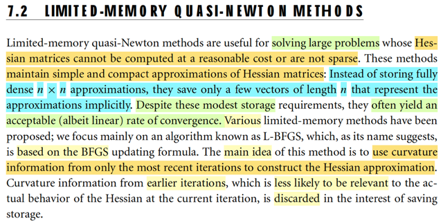
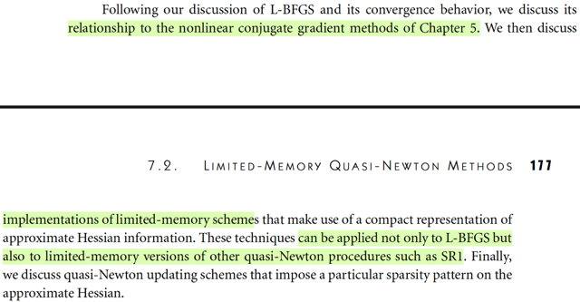
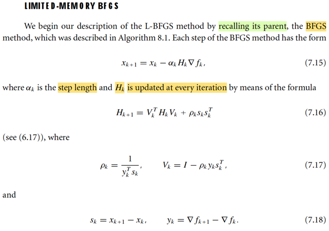
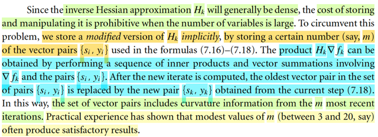
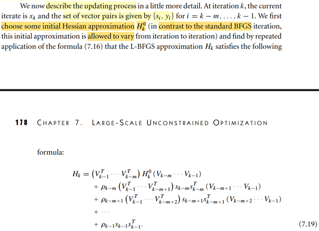

# 7.2 Limited-Memory Quasi-Newton Methods

📊 **Progress:** `5` Notes | `5` Screenshots

---

<kbd></kbd>

> [!NOTE]
> Đại khái là nói về việc phần này sẽ xét những thuật toán hữu ích khi gặp
> những  bài toán tính Hessian quá tốn kém. Khi đó ý tưởng là, ta sẽ chỉ
> lưu trữ một phiên bản xấp xỉ của Hessian nhưng chỉ bằng cách lưu trữ vài
> vector thôi.
>
> Có nhiều biến thể, nhưng cái ta sẽ bàn là L-BFGS, là biến thể được dựa
> trên cách làm của BFGS. Mà ý tưởng là ta sẽ chỉ dùng các thông tin về
> độ cong của các iteration gần nhất, bỏ đi thông tin của các iteration xa hơn.
> Từ đó tiết kiệm chi phí lưu trữ.

 

<kbd></kbd>

 

<kbd></kbd>

> [!NOTE]
> Đầu tiên là ôn lại chút về BFGS.
>
> Thì mình còn nhớ đại ý là vầy:
>
> Ý tưởng chính, đó ta muốn dùng Newton step để làm hướng đi
>
> Ý là, trong quá trình tạo chuỗi điểm {xi} thì ta muốn dùng Newton step pkN để đi
> từ xk đến xk+1. Dĩ nhiên với Newton step, ta không cần phải tính step-size.
>
> xk+1 = xk + pkN
>
> Mà pkN thì biết rồi, = -(∇^2fk)inv ∇fk, công thức này xuất xứ từ việc: tại iteration
> k ta xấp xỉ hàm f bởi quadratic approximation của nó mk(p) = fk + ∇fkTp +
> (1/2)pT∇^2fkp và từ đó, giải bài toán minimize hàm mk(p), dùng điều kiện cần
> bậc nhất:
>
> ∇mk(p) = 0 ⇔ ∇^2fk p + ∇fk = 0
>
> ⇔ p = - (∇^2fk) ∇fk, chính là công thức Newton step.
>
> Nói chung cái mô tuýp này (dùng hàm mk(p) là xấp xỉ bậc hai của hàm f tại xk)
> để tìm hướng đi tại iteration k, là giống nhau ở cả Line Search, Trust Region, ...
>
> Ví dụ như với Line Search, thì tại mỗi iteration, ta cũng minimize mk(p), thì ta có
> thể dùng steepest descent direction, hoặc dùng luôn Newton step, nhưng kể cả
> khi dùng Newton step, ta lại line search để tìm step size chứ không dùng full
> step.
>
> Còn với Trust Region, thì cũng minimize mk(p), nhưng có điều có thêm
> constraint ||p|| ≤ Δk.
>
> BFGS, mình hiểu nó sẽ là thuật toán nhằm mục đích là làm giả
> Newton step để dùng, phục vụ cho bước di chuyển xk → xk+1. Hay mình hiểu
> đơn giản hơn, nó chính là Newton method nhưng làm giả Hessian step để tính
>  thay vì dùng Hessian thật. 
>
> Cái này khác với inexact Newton: Trong đó, ta cố tình tìm Newton step nhưng
> dùng thuật toán lặp (CG).
>
> Có nghĩa là tất cả các thuật toán đều cơ bản là đi từng bước nhưng khác nhau
> ở chỗ chọn step size thế nào (Line Search vs Trust Region) và nếu dùng Newton
> direction thì tính Newton step thế nào (quasi Newton và inexact Newton)

> [!NOTE]
> Thế thì ôn lại cái BFGS, là một quasi-Newton, ý tưởng chính của nó là
> vầy:  Để tính pkN = -(∇^2fk)inv ∇fk, thì thay vì dùng Hessian thật ta sẽ
> dùng một  matrix Bk xấp xỉ của Hessian.
>
> Và ý tưởng cốt lõi để có Bk: Ta sẽ cập nhật nó từ từ, liên tục sau mỗi vòng
> lặp bởi thông tin curvature của vòng lặp trước đó.
>
> Và câu chuyện sẽ là như sau:
>
> Giả sử mình đã đi từ xk → xk+1. Thì mình sẽ dùng thông tin độ cong có
> được để cập nhật Bk, (nói cách khác là tính lại Bk+1). Dùng thế nào, hay
> cập nhật thế nào: Đó là ta sẽ đặt điều kiện cho Bk+1 sao cho mk+1(p)
> (xấp xỉ bậc hai của f tại xk+1: fk+1 + ∇fk+1Tp + (1/2)pT Bk+1 p) phải tính
> được  chính xác độ dốc hàm f tại xk. Thì hành động này, hay điều kiện
> này cũng chính là ép Bk+1 phải chứa thông tin curvature của hàm số khi
> đi từ xk đến xk+1. Và từ đó ta sẽ có cái gọi là secant equation.
>
> Rồi, sau đó, đại khái là từ đó nó sẽ đẻ ra thêm một ý là, để tồn tại nghiệm
> của secant equation, thì ta cần đảm bảo điều kiện skTyk > 0, gọi là
> curvature condition. Và có thể chứng minh với step-size thỏa Wolfe
> condition thì cái này sẽ thỏa, giúp đảm bảo secant equation sẽ có nghiệm.
>
> Tuy nhiên, ta cần áp thêm điều kiện nữa, vì secant equation có thể có vô
> số nghiệm Bk thỏa. Và điều kiện đó chính là, Bk nên giống với Bk-1 nhất.
> Và vì vài nguyên nhân, người ta dùng một loại weighted norm nào đó, để
> dùng trong tiêu chí "gần nhất" này.
>
> từ đó ta có điều kiện hoàn chỉnh của Bk:
>
> minimize_B ||B - Bk|| s.t B thỏa secant equation, và B đối xứng. với norm
> là  ||.||W với W đặc biệt nào đó được chọn để giúp mang lại tính scale
> invariance.
>
> Và giải bài toán này ta sẽ derive ra công thức cập nhật Bk+1 từ Bk.
>
> Nói chung đó cơ bản là ý tưởng chính của BFGS, nhưng sau đó có thêm
> vài bước cải tiến: Đó là thay vì tạo ra công thức để cập nhật Bk, ta sẽ
> dùng một công thức biến đổi, để tạo ra công thức giúp cập nhật (Bk)inv,
> gọi là Hk, vì chung quy lại mục đích chính là tính Newton step. Từ đó ta
> có thuật toán BFGS hoàn chỉnh.

 

<kbd></kbd>

> [!NOTE]
> Đại ý là đoạn này mô tả ý tưởng chính của L-BFGS, ta sẽ không thể lưu trữ
> Hk, khi quy mô bài toán quá lớn. Do đó, ý tưởng sẽ là, ta chỉ lưu trữ các cặp
> vector {yi, si}. Và dùng một cách thức để tính toán ra Hk ∇fk thông qua việc
> tính toán từ các cặp {yi, si} và ∇fk.
>
> Nói cách khác, thay vì tại mỗi vòng, thay vì dùng Hk đang lưu ở vòng trước
> để tính Hk mới (update lại nó) thì ta sẽ dùng bộ các cặp {yi, si} để tính.
>
> Và cách làm này còn hay ở chỗ, sau mỗi vòng, ta sẽ chủ động bỏ bớt một
> cặp {yi, si} "ở xa", để chỉ duy trì m cặp từ m vòng lặp gần nhất. Mang ý nghĩa
> là ta chỉ giữ và dùng curvature info gần nhất thôi.
>
> Nói thêm, vì sao lại là các cặp {yi, si}. Là vì như đã vừa nói ở note trước,
> chênh lệch vị trí (sk = xk+1 - xk) và độ dốc (yk = ∇fk+1 - ∇fk) sẽ mang trong
> mình thông tin curvature từ xk → xk+1, mà việc đặt điều kiện Bk+1 phải
> thỏa secant equation chính là để cho giá trị của nó phản ánh được, chứa
> đựng được thông tin curvature này

 

<kbd></kbd>

> [!NOTE]
> Rồi, đại khái ý tưởng để là cái vụ tạo một quy trình để tính ra cái
> (Hk)∇fk từ set các cặp {si, yi} và ∇fk là vầy:
>
> Đầu tiên, hãy nhìn công thức update Hk mà nguồn cơn của nó từ
> đâu thì mình vừa ôn lại rồi.
>
> Hk+1 = VkTHkVk + ρkskskT, Vk = I - ρkykskT
>
> Để cho đỡ dài dòng minh cứ dùng k = 7 đi.
>
> H8 = V7TH7V7 + ρ7s7s7T
>
> Thay H7 = V6TH6V6 + ρ6s6s6T
>
> ⇨ H8 = V7T(V6TH6V6 + ρ6s6s6T)V7 + ρ7s7s7T
>
> = V7TV6TH6V6V7 + V7Tρ6s6s6TV7 + ρ7s7s7T
>
> lại thay H6 = V5TH5V5 + ρ5s5s5T
>
> ⇨ H8 = V7TV6T[V5TH5V5 + ρ5s5s5T]V6V7 + V7Tρ6s6s6TV7 + ρ7s7s7T
>
> = V7TV6TV5TH5V5V6V7 + V7TV6Tρ5s5s5TV6V7 + V7Tρ6s6s6TV7 + ρ7s7s7T
>
> = V7TV6TV5TH5V5V6V7 + ρ5 V7TV6Ts5s5TV6V7 + ρ6 V7Ts6s6TV7 + ρ7s7s7T
>
> Và đây chính là công thức 7.19 với k=8, m=3 (Vk-m = V5)
>
> Có nghĩa là, nếu ta giữ các bộ {(s5, y5), (s6, y6), (s7, y7)} và bắt đầu từ initial matrix là H5
>
> Thì bằng việc tính V5,V6,V7, rồi tính cái nùi trên, ta sẽ có H8.
>
> Tuy nhiên, cái ta cần tính là Hk ∇fk, ở đây sẽ là:
>
> H8 ∇f8
>
> = [V7TV6TV5TH5V5V6V7 + ρ5 V7TV6Ts5s5TV6V7 + ρ6 V7Ts6s6TV7 + ρ7s7s7T] ∇f8
>
> = [V7TV6TV5TH5V5V6V7 + ρ5 V7TV6Ts5s5TV6V7 + ρ6 V7Ts6s6TV7∇f8 + ρ7s7s7T∇f8
>
> Nếu tính tay và để cho tiết kiệm phép tính, ta sẽ tính như sau
>
> Bước 1: Tính s7T∇f8 → ra scalar, nhân thêm ρ7, đặt là α7: α7 = ρ7s7T∇f8
>
> V7∇f8 = (I - ρ7y7s7T)∇f8 = ∇f8 - ρ7y7s7T∇f8 = ∇f8 - y7α7

 

