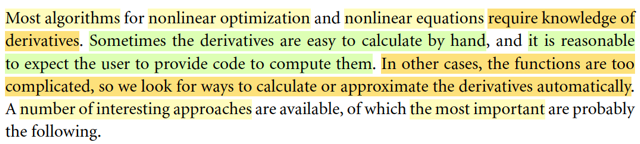
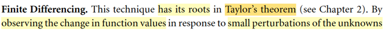
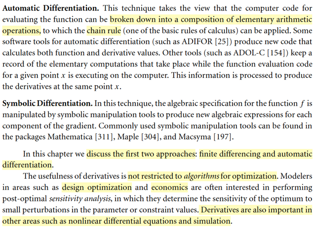
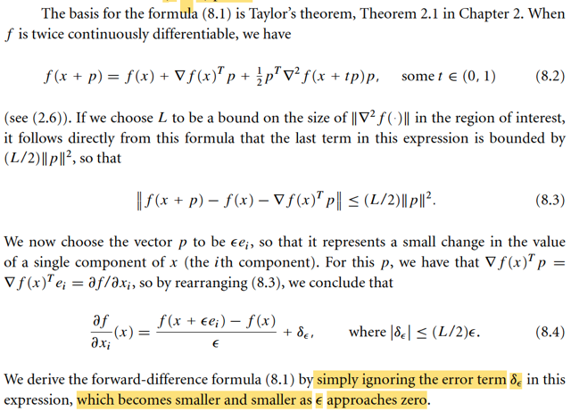

# 8.1 Finite-Difference Derivative Approx

📊 **Progress:** `7` Notes | `7` Screenshots

---

<kbd></kbd>

> [!NOTE]
> Mở đầu tác giả nói về mục đích của chapter này là để giới thiệu các phương
> pháp tính đạo hàm của các hàm phức tạp. Vì việc tính đạo hàm là điều rất
> thường xuyên trong bài toán tối ưu hóa. Thế thì với các hàm đơn giản, ta có
> thể tính tay để ra công thức, và từ đó viết code tính đạo hàm. Nhưng với các
> hàm phức tạp thì việc viết ra công thức rất khó. Và chap này sẽ nói về các
> cách tiếp cận có thể giúp ta giải quyết vấn đề này

 

<kbd></kbd>

<kbd></kbd>

> [!NOTE]
> Nói sơ về các cách tiếp cận quan trọng nhất, thì cách đầu tiên là Finite
> Differencing.
>
> Cái này thì mình đã gặp nhiều lần, ở các lớp của A.Ng, cs231n, cs224n, và
> đặc biệt là trong MIT 18s.096.
>
> Gốc rễ của nó, như gs Nocedal nói, là từ Taylor's theorem đã học trong chap 2:
>
> **f(x + p) = f(x) + ∇f(x + tp)Tp** for some t ∈ [0,1] 
>
> Tiếp, nếu f twice differentiable, thì:
>
> **∇f(x + p) = ∇f(x) + ∫0:1 ∇^2f(x + tp)pdt**
>
> **f(x + p) = f(x) + ∇f(x)Tp + (1/2)pT ∇^2f(x + tp) p** for some t in [0,1]
>
> Và đại khái là cái này chính là cái cho ta finite differentiation:
>
> Áp dụng với p = ε*ei:
>
> f(x + εei) = f(x) + ∇f(x)T ε*ei + (1/2)(εei)T ∇f(x + tεei)εei
>
> ⇔ f(x + εei) = f(x) + ε∇f(x)Tei + (1/2)ε^2(ei)T ∇f(x + tεei)ei
>
> Tới đây có thể nói như sau: nếu ε rất nhỏ, thì t*ε càng nhỏ, và x + tεei là
> điểm rất gần x, nên Hessian tại đó coi như xấp xỉ Hessian tại x:
>
> ⇔ f(x + εei) ≈ f(x) + ε∇f(x)Tei + (1/2)ε^2(ei)T ∇f(x)ei
>
> Tương tự:
>
> f(x - εei) ≈ f(x) - ε∇f(x)Tei + (1/2)ε^2(ei)T ∇f(x)ei
>
> Trừ vế theo vế:
>
> f(x + εei) - f(x - εei) ≈ ε∇f(x)ei + ε ∇f(x)ei
>
> ⇔ f(x + εei) - f(x - εei) ≈ 2ε∇f(x)ei
>
> ∇f(x)Tei chính là lấy ra phần tử thứ i của ∇f(x): ∂/∂xi f(x), hay ∂f(x)/∂xi
>
> ..⇔ f(x + εei) - f(x - εei) ≈ 2ε∂f(x)/∂xi
>
> ⇔ **∂f(x)/∂xi ≈ [f(x + εei) - f(x - εei)]/2ε 
>
> Đây chính là công thức finite differencing: central difference**

> [!NOTE]
> Thử chứng minh lại định lý Taylor cho vui
>
> Cái đầu tiên:
>
> Với hàm đơn biến, f(x), ta còn nhớ Mean Value Theorem học ở MIT 1802:
>
> Nó nói rằng, đi từ a → b thì sẽ có một điểm c nào đó giữa a, b sẽ có độ dốc là
> bằng độ dốc trung bình của hàm số trên đoạn [a, b]:
>
> f'(c) = [f(b) - f(a)] / (b - a)
>
> Bây giờ xét hàm đa biến R^n → R: f(x)
>
> thì xét hàm đơn biến g(t) = f(x + tp) (hàm f(x) restrict to direction p):
>
> Áp dụng cái trên tại điểm a = 0, b = 1
>
> g'(t) = [g(1) - g(0)] / (1 - 0) for some t ∈ [0,1]
>
> ⇔ d/dt g(t) = f(x + p) - f(x)
>
> ⇔ d/d(x + tp) f(x + tt) . d/dt (x + tp) = f(x + p) - f(x)
>
> ⇔ ∇f(x + tp) . p = f(x + p) - f(x)
>
> ⇔ ∇f(x + tp)Tp = f(x + p) - f(x)
>
> ⇔ **f(x + p) = f(x) + ∇f(x + tp)Tp** for some t ∈ [0,1] 
>
> Đây chính là ý đầu tiên của Theorem 2.1
>
> \-----
>
> Tiếp, nếu f twice differentiable, thì:
>
> ∇f(x + p) = ∇f(x) + ∫0:1 ∇^2f(x + tp)pdt
>
> Chứng minh:
>
> Xét hàm g(t) = ∇f(x + tp), (là R → R^n function)
>
> g'(t) = d/dt g(t) = d/dt ∇f(x + tp) = d/d(x + tp) ∇f(x + tp) . d/dt (x + tp)
>
> = ∇^2f(x + tp) p
>
> FTC 2 nói rằng: Nếu G là nguyên hàm của f thì ∫a:bf(t)dt = G(b) - G(a)
>
> Áp dụng vào: ∫0:1g'(t)dt = g(1) - g(0)
>
> ⇔ ∫0:1 ∇^2f(x + tp) p dt = ∇f(x + p) - ∇f(x)
>
> ⇔ ∇f(x + p) = ∇f(x) + ∫0:1 ∇^2f(x + tp) p dt. Chứng minh xong
>
> \------
>
> Và ý thứ ba: f(x + p) = f(x) + ∇f(x)Tp + (1/2)pT ∇^2f(x + tp) p for some t in [0,1]
>
> Chứng minh (xem lại) Chap 2

 

<kbd></kbd>

> [!NOTE]
> Nói sơ về khái niệm Automatic Differentiation, và Symbolic Differentiation
> cũng như là vai trò đạo hàm không chỉ trong thuật toán tối ưu mà còn
> trong nhiều lĩnh vực khác

 

<kbd></kbd>

> [!NOTE]
> Như đã hiểu công thức finite differencing, cơ bản là ta sẽ dùng nó để tính
> xấp xỉ  đạo hàm, (gọi là tính đạo hàm gần đúng).
>
> Như đã học trong mit 1801, bản chất của đạo hàm là "rate of change": tỉ số
> giữa [khoảng thay đổi của hàm f] / [khoảng thay đổi của biến số x]: Δf/Δx Tất
> nhiên ta xét tỉ lệ này ở limit: f'(x) lim Δx→0 f(x+δx) - f(x) / δx. Đây chính là
> định nghĩa của đạo hàm theo Newton.
>
> Còn định nghĩa của đạo hàm theo Leibniz: df = f'(x)dx mang ý nghĩa: khi x
> thay đổi một khoảng vô cùng nhỏ (vi phân) dx, khiến hàm f thay đổi một
> khoảng vi phân df, thì liên hệ giữa chúng, chính là đạo hàm f'(x). Dĩ nhiên hai
> ông mô tả cùng một bản chất, chẳng qua thể hiện hai kiểu khác nhau.
>
> Vậy thì, với định nghĩa của đạo hàm theo Newton, nếu ta dùng δx rất nhỏ
> thay vì vô cùng nhỏ, thì ta sẽ bỏ lim và thay bằng dấu xấp xỉ:
>
> f'(x) ≈ [f(x + δx) - f(x)] / δx. Thì cũng có thể hiểu về công thức finite
> differencing như vậy (dĩ nhiên cái này cũng là dựa trên cơ sở Taylor
> theorem mà mình vừa chứng minh hồi nãy)
>
> Nhưng viết ở đây để thấy một cách tiếp cận khác dễ nhớ hơn là phải derive
> từ Taylor theorem.
>
> Nói chung, kĩ thuật chỉ là: để tính f'(x), ta sẽ tính f(x), tính f(x + ε), tính f(x - ε)
> rồi tính [f(x + ε) - f(x - ε)] / 2ε, đây gọi là central-differencing.
>
> Cũng có thể tính đạo hàm xấp xỉ bằng forward-differencing hoặc backward
> differencing (dễ rồi ko nói làm gì)

 

<kbd></kbd>

> [!NOTE]
> Rồi, để tính xấp xỉ gradient, như vừa nói xong, ta có thể tính xấp xỉ các partial 
> derivative và tạo thành vector gradient. (ở đây gs dùnd forward difference,
> nhưng dĩ nhiên có thể dùng central / backward difference đều được)
>
> Cũng dễ hiểu khi phải tính hàm f n + 1 lần: 1 lần tính f(x), n lần tính f(x + εei)

 

<kbd></kbd>

> [!NOTE]
> Đoạn này chính là gs Nocedal chứng minh công thức finite differencing
> (forward). Bản chất vẫn là vậy, dùng Taylor theorem, và với ε nhỏ cho
> phép bỏ đi phần dư là term bậc cao của ε và chuyển thành dấu xấp xỉ.
> Nhưng phần chứng minh của gs chặt chẽ tuyệt đối, để giúp làm rõ về
> mặt toán học sao hồi nãy có mình có thể nói khi x' trong phạm vi gần x thì
> Hessian tại x bằng x'.
>
> Đại khái là vầy:
>
> Bắt đầu với Taylor's theorem:
>
> f(x + p) = f(x) + ∇f(x)Tp + (1/2)pT ∇^2f(x + tp)p for some t ∈ (0,1)
>
> ⇔ f(x + p) - f(x) - ∇f(x)Tp = (1/2)pT ∇^2f(x + tp)p
>
> Gọi L là upper bound nào đó của norm Hessian: ||∇^2f(x)|| ≤ L. Ta có thể nói
> vậy là vì **hàm số không thể cong vô cực** (do điều kiện twice continously
> differentiable)
>
> Xét |(1/2)pT ∇^2f(x + tp)p|
>
> Áp dụng |uTv| ≤ ||u|| ||v||, vì |uTv| = | ||u||||v|| cos θ(u,v) | ≤ ||u|| ||v||
>
> ⇨ |(1/2)pT ∇^2f(x + tp)p| ≤ (1/2) ||p|| ||∇^2f(x + tp)p||
>
> Tiếp, áp dụng ||Ax|| ≤ ||A|| ||x||
>
> Vì ||A|| define là sup_x ||Ax|| / ||x|| ⇨ ||A|| ≥ ||Ax|| / ||x|| ∀x ⇨ ||A||||x|| ≥ ||Ax||
>
> ⇨ (1/2) ||p|| ||∇^2f(x + tp)p|| ≤ (1/2) ||p|| ||∇^2f(x + tp)|| ||p|| 
>
> = (1/2) ||p||^2 ||∇^2f(x + tp)|| 
>
> Vậy |(1/2)pT ∇^2f(x + tp)p| ≤ (1/2) ||p||^2 ||∇^2f(x + tp)|| 
>
> Và đã nói L là upper bound của Hessian trong phạm vi đang xét
>
> Nên ||∇^2f(x + tp)|| ≤ L
>
> ⇨ |(1/2)pT ∇^2f(x + tp)p| ≤ (1/2) ||p||^2 ||∇^2f(x + tp)|| ||p|| ≤ (1/2) L ||p||^2 
>
> Vậy |f(x + p) - f(x) - ∇f(x)Tp| ≤ (L/2) ||p||^2 
>
> Áp dụng điều này với p = εei
>
> |f(x + εei) - f(x) - ∇f(x)T εei| ≤ (L/2) ||εei||^2 
>
> ⇔ |f(x + εei) - f(x) - ε ∇f(x)Tei| ≤ (L/2) ε^2 ||ei||^2 
>
> ⇔ |[f(x + εei) - f(x) - ε ∇f(x)Tei]/ε| ≤ (L/2) * ε * 1  (||ei|| = 1)
>
> ⇔ |[f(x + εei) - f(x)] / ε - ∇f(x)Tei| ≤ (L/2) ε 
>
> ⇔ |[f(x + εei) - f(x)] / ε - ∂f(x)/∂xi| ≤ (L/2) ε  
>
> Và đây chính là nói rằng**SAI KHÁC GIỮA GIÁ TRỊ ĐẠO HÀM CHÍNH XÁC
> VÀ ĐẠO HÀM XẤP XỈ TÍNH BỞI FORWARD DIFF chỉ có ĐỘ LỚN
> BỊ CHẶN BỞI (L/2)ε** 
>
> Đồng nghĩa, **NẾU ε CÀNG NHỎ** → 0 THÌ **SAI SỐ SẼ NHỎ THEO MỘT
> CÁCH TUYẾN TÍNH** (vì upper bound của nó nhỏ theo tuyến tính)
>
> Do đó [f(x + εei) - f(x)] / ε ≈ ∂f(x)/∂xi

 

