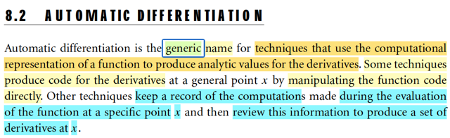
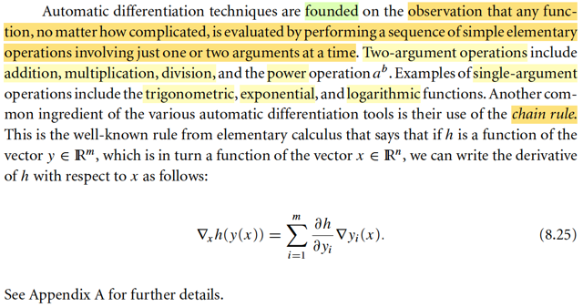
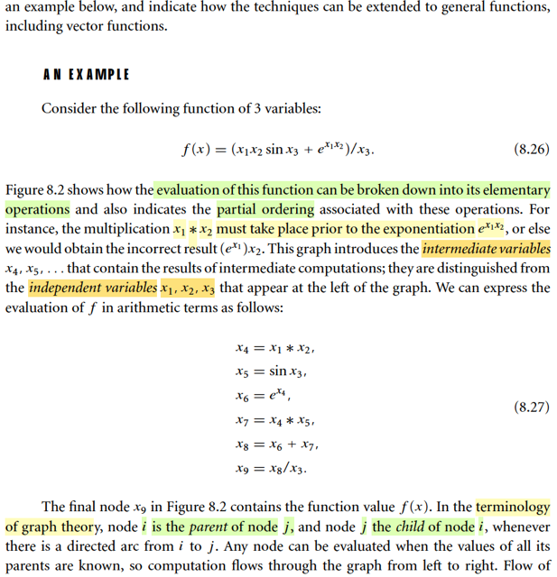
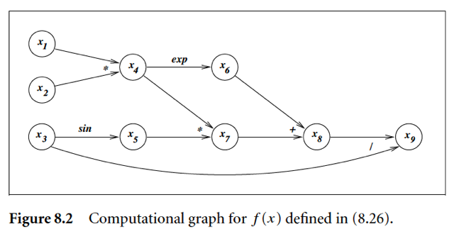
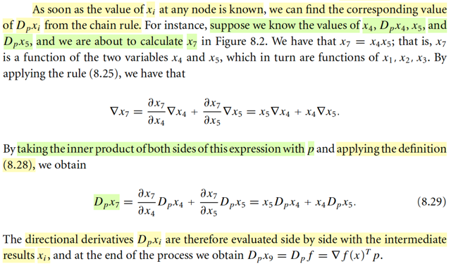
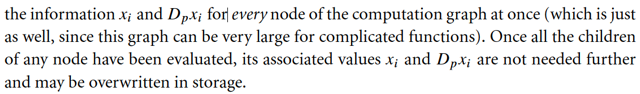
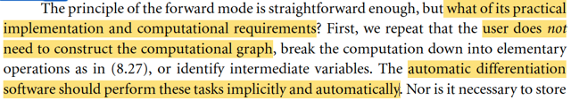
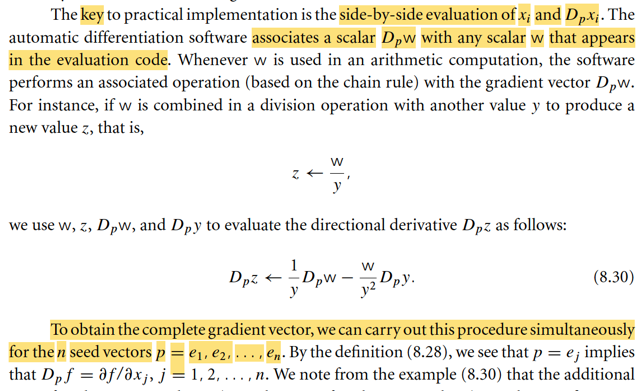
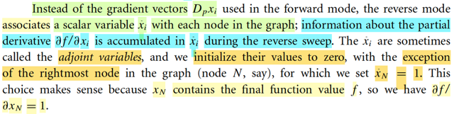

# 8.2 Automatic Differentiation (*extremely Important For Ai)

📊 **Progress:** `10` Notes | `16` Screenshots

---

<kbd></kbd>

> [!NOTE]
> gs nói sơ rằng Auto Diff là tên gọi chung cho những kĩ thuật mà trong đó
> người ta dùng một "computational representation" của một function để tính ra
> giá trị analytic của đạo hàm.
>
> Mình hiểu: analytic ý là giá trị chính xác, khác với numerical hay
> approximation là giá trị tính gần đúng của đạo hàm. Nhớ lại trong cs231n
> hay cs224n, cũng đã nghe cụm từ này. Trong đó ta dùng cách tính đạo hàm
> xấp xỉ để kiểm tra (debug, xem trong quá trình xây dựng mô hình có sai sót
> gì không).
>
> Ông nói, có kĩ thuật thì làm theo lối, tạo ra code để tính đạo hàm. còn có
> cách khác thì làm theo cách đại ý giữ giá trị của các biến trung gian khi tính
> function, và quay lại dùng lại cái này để tính đạo hàm.
>
> Mình nhận ra, đây chính là BACK-PROPAGATION huyền thoại: Giữ giá trị
> các bước trung gian trong forward mode và dùng nó để tính đạo hàm trong
> backward dựa theo chain-rule.
>
> Kiến thức này luôn được nói đến trong các lớp AI, và cả MIT 18s096, nhưng
> đây là lúc mình gặp lại nó ở mức độ sâu nhất.

 

<kbd></kbd>

> [!NOTE]
> Khúc đầu đại ý gs nói rằng ý tưởng của Auto Diff xuất phát từ việc người ta nhận thấy
> là dù cái hàm f có phức tạp cỡ nào thì bản chất có thể chẻ nó ra thành các phép toán
> nhỏ cơ bản. Bao gồm có các phép toán nhận hai giá trị đầu vào và làm gì đó: như
> cộng , trừ, nhân , chia, lũy thừa. Và các phép toán nhận một gía trị đầu vào và làm gì
> đó: lấy log, e^, ...
>
> Sau đó, một công cụ nữa sẽ dùng, là chain-rule trong calculus, nói rằng nếu hàm h là
> hàm theo vector y, mà y lại là hàm theo vector x thì ta sẽ có: ∇_x h(y(x)) = blah blah...
>
> Là sao?
>
> Đầu tiên, h(y) là vector → scalar function, nhận vector y, trả ra scalar h(y)
>
> y(x) lại là vector → vector function: nhận vector x, trả ra vector y(x).
>
> Nên h(y(x)) sẽ là vector → scalar function: nhận vector x, trả ra scalar h(y(x)) do đó,
> đạo hàm của h wrt x là gradient vector: ∇h(x)
>
> Ghi như trong sách để làm rõ là coi cái nào là biến thôi: ∇_x h(y(x)) vì nếu coi y là biến,
> tức tính đạo hàm của h theo y ta sẽ ghi là ∇_y h(y)
>
> Cái này thì cũng chỉ là: d/dx h(y(x)) , đạo hàm của h đối với x
>
> Theo chain rule:
>
> d/dx h(y(x)) = d/d(y) h(y) . d/dx y(x)
>
> d/d(y) h(y) chính là ∇h(y)
>
> d/dx y(x), là đạo hàm của y wrt x, vì y(x) là vector → vector nên cái này là Jacobian
> matrix J(x)
>
> Vậy ta có một operation giữa vector gradient ∇h(y) và matrix J(x), và kết quả phải cho
> ra vector (∇h(x)) nên phải thể hiện nó là: matrix J(x)T nhân vector ∇h(y) (thì mới ra
> column vector được)
>
> Phải transpose vì J có shape là (m,n), (J)T có shape (n,m) thì nhân với gradient ∇h(y)
> có shape (m,1) thì mới khớp.
>
> ⇨ ∇x_h(y(x)) = J(x)T ∇h(y)
>
> Rồi, quay lại xét ∇h(y), viết rõ ra, nó là vector các đạo hàm riêng:
>
> [∂h(y)/∂y1,...∂h(y)/∂ym]
>
> Còn J(x), là Jacobian của y wrt x, ta biết, mỗi hàng của nó, ví dụ hàng 2 là vector  đạo
> hàm riêng của y2 đối với x: [∂y2/∂x1, ∂y2/∂x2,...,∂y2/∂xn], và nó cũng là gradient của y2
> wrt x: ∇y2(x)
>
> Để rồi khi transpose, để có J(x)T, thì cột thứ 2 chính là ∇y2(x). Cột thứ i chính là ∇yi(x)
>
> Và J(x)T ∇h(y), theo MIT 1806 góc nhìn nhân matrix với vector thứ hai đã biết: Ax là
> linear combination các cột của A với hệ số là các phần tử của x.
>
> Vậy J(x)T ∇h(y) = linear combination các cột J(x)T với hệ số là components của ∇h(y):
>
> J(x)T ∇h(y) = **Σi=1:m ∂h(y)/∂yi ∇yi(x)**. Đây chính là công thức 8.25

 

<kbd></kbd>

<kbd></kbd>

<kbd></kbd>

> [!NOTE]
> gs lấy một ví dụ, ta sẽ xét hàm f(x) = x1x2sin(x3) + e^(x1x2)/x3.
>
> việc tính toán bên trong hàm số này có thể được bẻ ra thành các bước nhỏ,
> có thứ tự. Đặt các biến trung gian, và thể hiện quá trình tính toán các bước
> này như một đồ thị, nơi các phép tính sẽ biểu diễn bởi  các node.
>
> Cái này gọi là computational graph.
>
> Và việc tính toán từ trái sang phải (đi từ x1,x2,x3 → x9) gọi là FORWARD
> SWEEP
>
> gs có lưu ý ta là, các phần mềm auto diff sẽ tự làm bước bẻ nhỏ hàm f
> thành các bước nhỏ này

 

<kbd></kbd>

 

<kbd></kbd>

> [!NOTE]
> Đại khái là, trong forward mode của auto diff, ta sẽ tính và mang theo một giá
> trị đạo hàm theo hướng p cho mội biến trung gian xi. Và ta làm việc này cùng
> lúc với việc evaluation xi.
>
> Lí do, hay mục đích của việc này thì chưa rõ lắm có thể tí nữa sẽ biết. Còn
> giờ cứ tạm hiểu vậy.
>
> Directional derivative của hàm f wrt hướng d, mình còn nhớ là như sau: Ý
> nghĩa của nó là độ dốc hàm f theo hướng d tại x
>
> Xét hàm R^n → R f(x), Xét hàm scalar → scalar g(α) = f(x + αd), thì g' (α)|α=0
> cũng là độ dốc của hàm f(x) theo hướng d tại x, chính là định nghĩa của
> directinal derivative của f(x) wrt d:
>
> lim ε → 0 [f(x + εd) - f(x)] / ε
>
> Ta sẽ xem vì sao nó là ∇f(x)Td:
>
> g'(α) = d/dα g(α) = d/dα f(x + αd)
>
> = d/d(x + αd) f(x + αd) . d/dα (x + αd) (chain rule)
>
> = ∇f(x + αd) . d
>
> (và vì g(α) là scalar → scalar, nên g'(α) phải là scalar, nên operation hợp trên
> chỉ có thể là dot product của hai vector)
>
> = ∇f(x + αd)Td.
>
> Và g'(α)|α=0 = ∇f(x)Td.
>
> \------
>
> Quay lại đây, đại khái là ta sẽ định nghĩa kí hiệu Dp_xi là directional
> derivative theo hướng p của xi
>
> Có nghĩa là sao:
>
> Tức là ta **cứ xem x1, ...x6 đều là function theo x1, x2, x3**.
>
> Ví dụ, x1, coi như là hàm x1(x1,x2,x3): Chữ x1 đầu tiên là tên hàm, x1, trong
> ngoại là argument / input. và cái hàm này = 1*x1 + 0*x2 + 0*x3.
>
> Thì như vậy, đây vẫn là hàm vector → scalar, với việc hiểu x là vector [x1, x2,
> x3], thì ta cũng ghi là x1(x) y như f(x) vậy.
>
> Rồi cũng có gradient vector ∇x1(x) (y như ∇f(x) vậy) là vector các partial
> derivative [∂x1(x)/∂x1, ∂x1(x)/∂x3, ∂x1(x)/∂x3], dĩ nhiên sẽ có giá trị là [1, 0, 0]
>
> Tương tự, x4 cứ coi như là hàm x4(x1,x2,x3) = x1*x2 + 0*x3.
>
> Và ∇x4(x) = [∂x4(x)/∂x1, ∂x4(x)/∂x3, ∂x4(x)/∂x3] 
>
> = [x2, x1, 0] (vì x4 = x1*x2 ⇨ ∂x4(x)/∂x1 = x2, ∂x4(x)/∂x2 = x1, và ∂x4(x)/∂x3 = 0)
>
> Tương tự với các ∇xi(x), i = 1,....9
>
> Và ta sẽ quan tâm đạo hàm theo hướng p của chúng
>
> Chỗ này hơi khó hiểu về kí hiệu, nhưng hãy nhìn thế này: Ta có hàm f(x), thì
> directional derivative của f wrt hướng d là ∇f(x)Td.
>
> Vậy giờ ta có hàm xi(x), ví dụ x4(x), thì directional derivative của x4 wrt p là:
>
> ∇x4(x)Tp
>
> Nên ∇x4(x)Tp = ∂x4(x)/∂x1 * p1 + ∂x4(x)/∂x3 * p2 + ∂x4(x)/∂x3 * p3
>
> = Σj=1,2,3 ∂x4(x)/∂xj * pj
>
> Tương tự, với mọi i = 1,...9
>
> ∇xi(x)Tp = Σi=1:3 ∂xi/∂xj * pj
>
> Từ đó có thể hiểu ∇x1(x)Tp = 1*p1 + 0*p2 + 0*p3  = p1
>
> tương tự ∇x2(x)Tp = p2, ∇x3(x)Tp = p3
>
> Nên ở đây mới nói "We note immediately that initial values Dpxi for the
> independent variables xi , i = 1, 2, 3" là vậy

 

<kbd></kbd>

> [!NOTE]
> Mấu chốt chỗ này là: Khi có x4, Dpx4, x5, thì vì x7 = x4 + x5 nên ta có thể **tính x7
> và Dpx7 (tức ∇x7(x)Tp) cùng lúc**.
>
> Là sao:
>
> Biết x4, x5 thì tính được x7 thì đương nhiên rồi: x7 = x4 + x5.
>
> Nhưng làm sao có Dpx7 (cũng là ∇x7(x)Tp)?
>
> → Dựa vào công thức 8.25: J(x)T ∇h(y) = Σi=1:m ∂h(y)/∂yi ∇yi(x).
>
> Đây nhé:
>
> Ở đây x7, trước tiên nó là hàm của x4, x5: x7(x4, x5) = x4 * x5
>
> Nên x7 là vai trò của h, [x4,x5] là trong vai y.
>
> Đạo hàm của h=x7 đối với y=[x4,x5] sẽ là gradient vector ∇h(y) = ∇x7(x4,x5)
>
> = [∂x7/∂x4, ∂x7/∂x5] = [x5, x4]
>
> Sau đó vì x4, x5 là hàm của x1, x2, x3: x4(x1,x2,x3), x5(x1,x2,x3) như note trước
> đã nói.
>
> Nên nếu xét y = [x4,x5] thì nó là R^3 → R^2 function y(x) = y(x1,x2,x3)
>
> = [x4(x1,x2,x3), x5(x1,x2,x3)]
>
> Và đạo hàm của y wrt x là Jacobian J(x).
>
> Có hàng 1 là ∇y1(x) = ∇x4(x)
>
> Và hàng 2 là ∇y2(x) = ∇x5(x)
>
> Vậy theo công thức trên:
>
> ∇x7 = ∂x7/∂x4 ∇x4 + ∂x7/∂x5 ∇x5 = x5 ∇x4 + x4 ∇x5
>
> Dot product hai vế với p:
>
> ∇x7Tp = (x5 ∇x4 + x4 ∇x5)Tp
>
> = x5 ∇x4Tp + x4 ∇x5Tp
>
> = x5 Dpx4 + x4 Dpx5
>
> =====
>
> Và cứ đi từ trái qua phải như vậy, mỗi lần ta sẽ tính cùng lúc một cặp (xi, Dpxi) và
> tại node cuối ta sẽ có (x9, Dpx9)
>
> Nhưng làm vậy để chi: Ta đang cần tính đạo hàm cơ mà:
>
> Thì cụ thể ở đây, với hàm f(x1,x2,x3) = (x1x2 sinx3 + e^(x1x2)) / x3 thì ∇f(x) chính
> là ∇x9(x), = [∂x9(x)/∂x1, ∂x9(x)/∂x2, ∂x9(x)/∂x3]
>
> Thế thì, giả sử ta có p = [1,0,0] thì khi tính xong cặp (x9, Dpx9) thì Dpx9 là cái gì:
> Nó là directional derivative của x9(x) wrt direction p, ∇x9(x)Tp. Khi p = e1 = [1,0,0],
> thì kết quả này chính là ∂x9(x)/∂x1, cũng chính là ∂f(x)/∂x1 là partial derivative của f
> wrt x1.
>
> Nên chỉ cần chạy thuật tóan này với lần lượt p = e1,e2,e3.
>
> Ta sẽ có ∂f(x)/∂x1, ∂f(x)/∂x2, ∂f(x)/∂x3 để có ∇f(x).
>
> (Dĩ nhiên, cũng cần input x = giá trị của x1,x2,x3 nào đó để có gradient tại điểm đó)
>
> Trong đoạn sau gs Nocedal sẽ nói về vụ này (dùng p - seed vector lần lượt là e1,..
> en để có được gradient)

 

<kbd></kbd>

<kbd></kbd>

> [!NOTE]
> gs làm rõ vài ý:
>
> Ta, user, ko cần phải tự xây dựng computational graph, mà các phần mềm
> auto-diff sẽ làm việc này một cách tự động.
>
> Và máy tính khi tính / chạy cái forward sweep này nó cũng ko cần phải lưu
> mọi giá trị biến trung gian. Ví dụ tính xong (x7, Dpx7) thì vứt (x5, Dpx5) khỏi
> bộ nhớ luôn. Rồi khi tới (x9, Dpx9) thì vứt hết các cặp trước đi

 

<kbd></kbd>

> [!NOTE]
> Và điểm mấu chốt của quá trình này, như đã nói lúc nãy: là tại **mỗi note,
> máy tính sẽ tính cùng lúc cặp giá trị (xi, Dpxi)**.
>
> Y như trong ví dụ vừa rồi, khi tính x7 = x4*x5, thì nó cũng tính:
>
> Dpx7 = x5 Dpx4 + x4 Dpx5.
>
> Và công thức để tính Dpx7 sẽ được hardcode, bởi quy tắc đạo hàm
> của môt tích: (uv)' = udv + vdu
>
> Gs lấy ví dụ khác, trong một node nào đó mà được tính từ hai node
> trước: z = w/y. Thì công thức quotient rule cho ta:
>
> (w/y)' = (w'y - w y')/y^2 = w'/y - wy'/y^2
>
> Nên trong phần mềm người ta sẽ hard code để tính: 
>
> Dpz = (1/y) Dpw - (w/y^2)Dpy.

 

<kbd></kbd>

> [!NOTE]
> Rồi, thế thì: Đại ý đoạn này đại khái là:
>
> Xét chi phí tính toán của quá trình Forward sweep đi qua cái node phép
> chia (tính z = w / y) này khi cần tính nguyên cái gradient.
>
> Như đã nói vừa rồi: Nếu ta dùng p = e1, thì tính z, Dpz xong thì Dpz chính
> là ∇z(x)Te1 = ∂z(x)/∂x1. 
>
> Rồi với p = e2, forward sweep sẽ cho ta ∂z(x)/∂e2.
>
> Và bằng cách stack e1,...en (giả sử input của hàm số là n chiều x = x1,..xn
> (giống như hồi nãy input là 3 chiều, x = [x1,x2,x3] vậy) lại thành matrix P = I
> thì forward sweep, sẽ cũng giống ta chạy p = e1, p = e2,..cùng lúc. Để kết
> quả ta có cùng lúc ∇z(x)T = [∂z(x)/∂x1, ...∂z(x)/∂xn]
>
> Thế thì nếu tính đơn lẻ một cái: Dpz = (1/y) Dpw - (w/y^2)Dpy
>
> ta sẽ tốn bao nhiêu phép tính: Lấy scalar (1/y) nhân scalar Dpw (Dpw, chỉ
> là ∇wTp, là directional derivative, NHỚ RẰNG, NÓ LUÔN LUÔN LÀ SCALAR)
>  rồi lấy (w/y^2) nhân Dpy, rồi lấy hai cái trừ nhau. → Tức là ta tốn 2 phép nhân
> scalar, và 1 phép trừ (hay gọi là phép cộng cũng được)
>
> Vậy nếu có n input x1,..xn, thì quá trình sẽ tốn 2n phép nhân và n phép cộng.
>
> Và đó là chi phí tính toán CỦA CHỈ MỘT NODE.
>
> Nên nếu như quá trình này áp dụng cho hàm số **có rất nhiều node thì chi
> phí sẽ rất lớn**.
>
> Ngoài ra giáo sư còn nói về việc ta còn phải tính đến chi phí LƯU TRỮ CŨNG
> SẼ TĂNG LÊN THEO NỮA.

 

<kbd></kbd>

 

<kbd></kbd>

<kbd></kbd>

> [!NOTE]
> Đây, đây chính là cái mà trong deep learning gọi là BACK-PROPAGATION
> đây.
>
> Nói ngắn gọn về FORWARD MODE: Ta sẽ đi từ node đầu đến node cuối,
> tại mỗi node, tính toán một cặp (xi, Dpxi) để rồi với p = e1, thì tại node cuối,
> ví dụ x9 thì Dpx9 chính là ∂x9(x)/∂x1 = ∂f(x)/∂x1. Và làm vậy cho n vector p
> = e1,..en ta sẽ có được gradient ∇x9(x) = ∇f(x). Và quá trình này gọi là
> FORWARD SWEEP
>
> Còn ở BACKWARD MODE, thì với cái này, ta sẽ không tính cùng lúc giá trị
> node và đạo hàm (tức xi và Dpxi) nữa. Thay vào đó ta sẽ evaluate hàm số
> trước, tức là tính toán các node từ trái sang phải trước, ví dụ như trong cái
> graph trong phần trước thì ta sẽ tính x4,x5,x6 → x9 (ko tính Dpx4, Dpx5 gì
> hết).
>
> Sau đó mới "quay lại" để tính ngược lại các ∂f(x)/∂x8, ∂f(x)/∂x7,....cho đến
> khi có ∂f(x)∂x1, ∂f(x)∂x2, ∂f(x)∂x3.
>
> và gom lại (assembled) ta sẽ có gradient ∇f(x). 
>
> Quá trình này gọi là REVERSE SWEEP
>
> Mình có thể nhận ra, đây chính là mô tả thứ mà trong Deep Learning
> ta FORWARD PROP (tính toán các layer từ input → loss function) sau đó
> BACKWARD PROP (tính toán các partial derivative của loss wrt các lớp
> trung gian (ý là các parameters) cho đến lớp đầu tiên. Và dùng các giá trị
>  gradient này để cập nhật mô hình. (dĩ nhiên trong bài toán đó, thứ mà ta
> cần là đạo hàm của hàm loss đối với các parameters của mô hình, chứ
> ko phải của input để làm gì, trừ vài bài toán đặc biệt như GAN, VAE)

 

<kbd></kbd>

> [!NOTE]
> Khác với FORWARD MODE, trong đó ta gắn với mỗi node xi một Dpxi. Thì  nay
> với BACKWARD MODE, ta sẽ gắn với mỗi node xi một xi^, sẽ chứa THÔNG
> TIN ∂f/∂xi, gọi là ADJOINT VARIABLE
>
> Biến này của mỗi node sẽ được khởi tạo bằng 0, trừ cái node cuối cùng. Lí do
> là vì cũng như trong cái graph trước, x9, chính là f. Nên x9^ = ∂f(x)/x9 cũng
> chính là ∂x9/∂x9 dĩ nhiên là luôn 1.
>
> Ở đây, gs nhắc đến chữ accumulated: Tích tụ, mình có thể hiểu vụ này:
> Như trong cs231n đã học: Khi backprop, đi qua mỗi node, upstream derivative
> sẽ nhân với local derivative để ra downstream derivative. Rồi khi đi ngược
> lại một node mà từ đó chẻ ra hai nhánh, đạo hàm đổ về từ hai nhánh sẽ cộng 
> lại.

 

