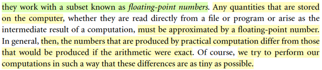
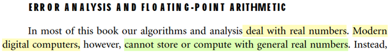
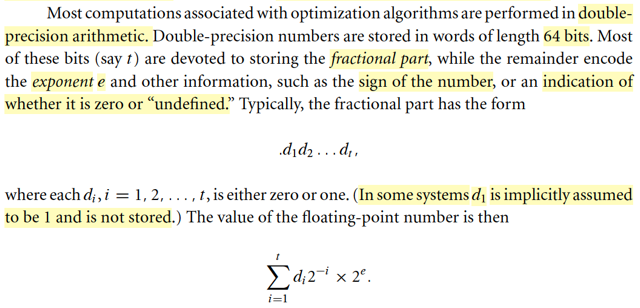

# A.1 Error Analysis & Floating-Point Arithmetic

📊 **Progress:** `4` Notes | `5` Screenshots

---

<kbd></kbd>

<kbd></kbd>

> [!NOTE]
> Đại ý các algorithm và analysis trong sách này hầu hết đều deal với số thực
> Tuy nhiên thực tế máy tính, nó không tính toán với số thực, mà thật ra tính 
> toán với một một tạp con của R gọi là floating-point numbers.
>
> Mọi con số lưu trữ trên máy tính đều được xấp xỉ bởi một floating point
> number.
>
> Và ta sẽ cố gắng thực hiện các phép tính sao cho sai số là nhỏ nhất.
>
> Nói về ý này, trong CS50 mình đã được học rằng, máy tính lưu trữ thông ở
> dạng nhị phân.
>
> Ví dụ với integer, máy tính assign 4 bytes, tương đương 4*8 = 32 bits.
>
> Nói một cách đơn giản nhất, với 8 bit, mỗi bit mang một trong hai giá trị
> binary: 0 hoặc 1 thì 1 byte = 8 bits ta có thể thể hiện tổng cộng là 256 chuỗi
> nhị phân khác nhau: ứng với các số thập phân từ 0 (=0*2^0 + 0*2^1 + .._0*2^7)
> tới 255 (=1*2^0 + 1*2^1 + ...1*2^7).
>
> Với 4 bytes thì con số này mở rộng lên lớn hơn. Nên đại ý là với số nguyên
> máy tính có thể lưu con số lớn nhất là 1*2^0 + 1*2^1 + ...+ 1*2^31.
>
> Còn với số thập phân, khi khai báo loại float hoặc double. Thì máy sẽ gán
> cho 8 bytes (32 bits) hoặc 16 bytes (64 bits)
>
> Thì loại này nó có cái kiểu là, ta sẽ dùng 1 bit để biểu hiện dấu (âm / dương)
> vài bit cho số mũ,...đại khái là vậy.

 

<kbd></kbd>

> [!NOTE]
> Đoạn này gs yêu cầu ta phân biệt giữa sai số tuyệt đối và tương đối. Nếu
> x, x^ là giá trị chính xác và giá trị xấp xỉ với x là scalar, vector hay matrix
> thì sai số tuyệt đối được định nghĩa là norm của x - x^: ||x - x^||
>
> Còn sai số tương đối là tỉ số của cái này với norm x:
>
> ||x - x^|| / ||x||
>
> Và khi sai số tương đổi nhỏ hơn 1 nhiều thì có thể thay mẫu số bởi ||x^||

 

<kbd></kbd>

> [!NOTE]
> Phần này đại khái là gs nhắc lại một kiến thức trong cs, là về cái gọi là double precision
> arithmetic.
>
> Double, hay double precision có cái tên như vậy là vì trong lịch sử, lúc đầu người ta nghĩ ra cơ
> chế floating point để lưu số thập phân. Và dùng 4 bytes tức 32 bits để lưu trữ. Sau đó, người
> ta tăng gấp đôi lên, dành 64 bits (8 bytes) để lưu. Và do đó trong C, java ta có thể khai báo
> float hay double để lưu số thập phân (int là cho interger, 4 bytes, long thì lưu số lớn hơn, được
> 8 bytes)
>
> Trong cs50 mình đã biết việc máy tính lưu thông tin ở dạng binary thế nào rồi, nãy đã ôn lại.
>
> Thế thì với số double, với 64 bits, đại khái quy trình lưu một số vào ram sẽ diễn ra như sau:
>
> Quy trình là cho một số thực thập phân, yêu cầu lưu vào máy tính 64 bit
>
> 1) Chuyển phần nguyên thành chuỗi binary: số mũ tăng từ 0 → lên dương khi đi từ phải qua
> trái
>
> 2) Chuyển phần thập phân thành chuỗi binary: số mũ từ -1 → âm khi đi từ trái qua phải.
>
> 3) Dời dấu phẩy:
>
> Theo chuẩn kĩ sư: Dời cho đến khi đứng trước dấu phẩy là số 1.
>
> Nếu đang có dạng 1.yyy thì khỏi dời.
>
> Nếu là 0.0100 thì dời qua phải thành 001.00, tính e = -2.
>
> Nếu đang là 100.001 thì dời qua trái thành 1.00001, tính e = 2
>
> Theo Nocedal: Dời cho đến hết số (như vậy, luôn luôn dời, nên nếu chuỗi binary phần nguyên
> có 10 số thì dời cả 10, để thành 0.xxxxyyyy)
>
> Như vậy ta sẽ có chuỗi binary .d1d2...dt
>
> Và dời bao nhiêu số thì đó là e (quả trái thì là dương, qua phải thì là âm)
>
> 4) Lưu trữ:
>
> 1 bit cho dấu: 0 là dương, 1 là âm
>
> Lưu chuỗi binary phần đã dời ở trên: d11 nguyên xi vào 52 bit của phần fractional
>
> Số e, đem cộng 1023 rồi chuyển thành binary, và lưu vào 11 bit của phần exponent
>
> Mục đích của việc này là để khỏi phải lưu dấu của exponent. Lí do đại khái là vì, phần
> exponent được cho 11 bits. Với 11 bits, thì nó có thể lưu được con số lớn nhất là 2^11-1 = 2,
> 047 (giống như  với 1 byte = 8 bits thì con số lớn nhất có thể lưu là 255 = 2^8-1),
>
> đồng nghĩa là với 11 bits, ta có thể biểu diễn 2^11 con số, gồm 0, 1, 2, ...2047.
>
> Nhưng phải chia làm đôi để cho số âm nữa, nên đại khái là ta sẽ dùng 11 bits này để biểu diễn
> 1023 con số âm và 1023 con số dương
>
> tức là được lngười ta sẽ làm như sau: Lấy 2048 / 2 - 1 = 1,023. Dùng nó làm cái mốc cứng.
>
> Để rồi với một số e đã tính, trước khi chuyển thành binary để lưu vào phần exponent, nó sẽ +
> cho 1023, khiến cho dù e có thể là âm (mà giá trị (âm) lớn nhất có thể có là -1023, thì sau khi
> cộng 1023 thì sẽ thành không âm:
>
> con số âm bé nhất: -1023 sẽ thành 0
>
> \-1022 sẽ thành 1
>
> \-1 sẽ thành 1022
>
> 0 sẽ thành 1023
>
> 1 sẽ thành 1024
>
> 1023 sẽ thành 2046
>
> Và như vậy máy tính sẽ lưu số e gốc (sau khi tính toán ở bước trên) như sau:
>
> e = -1022, chuyển thành 1, dịch sang binary, và lưu chuỗi 11 bit này: 0000..001
>
> e = 0, chuyển thành 1023, lưu chuỗi 11 bit ứng với số 1023
>
> e = 1023, chuyển thành 2046 và lưu chuỗi 11 bit ứng với 2046.
>
> Khi dịch lại, nó sẽ chuyển thành thập phân và trừ đi 1023 để có lại e.
>
> Nhưng như vậy sẽ còn thừa 2 vị trí (11 bits, như đã nói, có thể represent số từ 0 → 2047 cơ
> mà trong khi như trên chỉ mới xài các con số 1,2,..2046, chưa xài số 0, và 2047:
>
> Có nghĩa là ta còn một chuỗi 11 bits toàn 0: 00....0, một chuỗi 11 bits toàn 1: 11...11.
>
> Thì người ta dùng nó để biểu diễn số 0 tuyệt đối và số vô cực.
>
> Khi dịch lại:
>
> Theo chuẩn kĩ sư: (1 + Σidi*2^-i) * 2^e
>
> Theo nocedal: (Σidi*2^-i) * 2^e

 

<kbd></kbd>

> [!NOTE]
> Tiếp, ông nói 2^-t-1 chính là cái gọi là unit round off. kí hiệu là u.
>
> Vì sao?
>
> Là như vầy:
>
> Như vừa biết cái "quy trình" mà máy tính sẽ lưu con số thực nào đó vào 64 bits 
> của ram. 
>
> Chuyển phần nguyên, thập phân thành chuỗi binary. Dời dấu phẩy sang hết
> các chữ số, cũng chính là cho e = tổng số chữ số thập phân của chuỗi binary của
> phần nguyên. Lưu e vào 11 bits của phần exponent theo quy trình: +1023, chuyển
> thành binary. Lưu chuỗi binary của phần thập phân vào phần fractional (52 bits)
> Lưu dấu dương hay âm vào 1 bit còn lại.
>
> Vậy thì ta sẽ thấy thế này, với cái quy tắc khi chuyển phần nguyên và phần thập 
> phân thành chuỗi binary đã nói ở note trước đó là:
>
> Phần nguyên: Cho số mũ đi từ 0 → 1 → 2 ..khi dịch chuyển về bên trái. Ví dụ phần
> nguyên 10.xxx thì 10 sẽ là **1*2^3 + 0*2^2 + 1*2^1 + 0*2^0** (=10), kết quả sẽ là
> chuỗi 1010.
>
> Phần thập phân: Cho số mũ đi từ -1 → -2 →...khi dich dần sang phải. Ví dụ phần
> thập phân là .1234567 (số gốc là 10.1234567) thì cái chuỗi binary sẽ là d1d2...dt
> sao cho u1*2^**-1** + u2*2^**-2**+..+ut*2^**-k = 1234567** (k = t - 4 = 52 - 4)
>
> (Cách tìm chuỗi này thì có cách của nó)
>
> Nhưng cái chính ở đây là:
>
> Ta biết maximum ta chỉ có 52 bits để lưu cái chuỗi binary (của cả phần nguyên và
> phần thập phân sau khi dịch dấu phẩy đi, e = 4), tức là trong ví dụ này, ta sẽ lưu chuỗi
> d1d2...dt = 1010u1u2...uk vào 52 bits này.
>
> Và không khó để hiểu bằng cách đổi cái đổi cái bit cuối cùng (thứ t = 52) từ 0 sang 1,
> thì ta sẽ có được một mức tăng nhỏ nhất có thể mà máy tính lưu được.
>
> Ví dụ ta đang có số 10.1234567, giả sử chuỗi binary của fractional của nó là:
>
> 1010d5d6.....d52 với d52 = 0, 
>
> thì cái số gần nó nhất mà máy tính lưu được là cái số mà chuỗi binary fractional 
> của nó là:
>
> 1010d5d6.....d52 với d52 = 1, giả sử dịch ra thập phân là 10.1234568
>
> Còn bất kì cái số nào khác nằm giữa chúng để ko thể được thể hiện bởi máy tính,
> ví dụ 10.12345671,10.12345672,...10.12345679
>
> Do đó, khoảng cách nhỏ nhất giữa hai số sẽ chính là: cái khoảng tương ứng với
> việc chuyển dt từ 0 sang 1.
>
> Mà như khi làm vậy, thì dịch ra lại thập phân thì chúng sẽ khác nhau phần sau đây:
>
> { [1*2^-1 + 0*2^-2 + 1*2^-3 + 0*2^-4] + [d5*2^-5 + ..+ d47*2^-51 + **0***2^-52] } * 2^e (e = 4)
>
> và 
>
> { [1*2^-1 + 0*2^-2 + 1*2^-3 + 0*2^-4] + [d5*2^-5 + ..+ d47*2^-51 + **1***2^-52] } * 2^e
>
> → Chúng sẽ khác nhau 1 lượng bằng 1*2^-52 * 2^e
>
> Tức là 2^-t * 2^e
>
> Vậy thì sai số lớn nhất sẽ xảy ra khi máy tính cần thể hiện con số nào đó mà nó nằm
> ngay chính giữa hai số liền kề có thể lưu trên máy tính, vì đã nói bất kì con số nào
> nằm giữa đều ko thể thể hiện chính xác, cũng đồng nghĩa là phải làm tròn thành cái
> mốc gần nhất.
>
> Do đó, độ lệch giữa nó và kết quả làm tròn sẽ chính là "nửa quãng đường unit này":
>
> 2^-t * 2^e / 2 = 2^-t-1 * 2^e
>
> Và đây là sai số tuyệt đối, khi tính sai số tương đối, ta sẽ chia cho 2^e để có 2^-t-1
> là sai số tương đối lớn nhất. Gọi là unit roundoff

 

